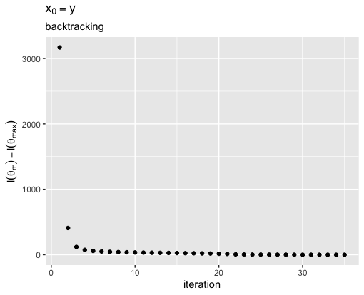

# 1
**Part 1.** We will work through some details on the Hodrick-Prescott (HP) filter for smoothing time series data. Let $\V{y} \in \Real^n$ denote the values of a signal sampled at $n$ time points. We assume the data has been generated from the model

$$
\V{y} = \V{\theta} + \V{e}
$$
where $\V{e} \in \Real^n$ is a noise vector of i.i.d. zero mean Gaussian random variable and $\V{\theta}$ is a smooth function, in the sense that its derivatives do not take on values that are "too big." The HP-filter seeks to recover a smooth $\V{\theta}$ by minimizing a penalized negative log-likelihood:

$$
\ell(\V{\theta}) = \frac{1}{2} \lVert \V{y} - \V{\theta} \rVert_2^2 + \frac{\lambda}{2} \lVert \Mn{D}{k}_n\V{\theta} \rVert_2^2,
$$
where $\lambda$ is a non-negative tuning parameter and $\Mn{D}{k}_n$ is the $k$th order differencing matrix for a signal of length $n$.

$$
	\Mn{D}{1}_n = \begin{pmatrix}
	-1 & 1 & 0 & \cdots & 0 & 0 \\
	0 & -1 & 1 & \cdots & 0 & 0 \\
	\vdots & & & & & \\
	0 & 0 & 0 & \cdots & -1 & 1 \\
	\end{pmatrix} \in \Real^{n-1 \times n},
$$
and $\Mn{D}{k}_n = \Mn{D}{1}_{n-k+1}\Mn{D}{k-1}_n.$

## 1

1. Write the gradient and Hessian of $\ell(\V{\theta})$.

Recall that for vectors $a$ and $b$ and matrix $A$

$$
\frac{  \partial a^T b }{\partial b  } = a, \ \frac{  \partial b^T A b}{ \partial b  } = (A + A^T)b
$$

\begin{align*}
\ell (\theta) & = \frac{1}{2} \lVert \V{y} - \V{\theta} \rVert_2^2 + \frac{\lambda}{2} \lVert \Mn{D}{k}_n\V{\theta} \rVert_2^2 \\
	  & = \frac{ 1 }{  2} (y-\theta)^T (y-\theta) - \frac{ \lambda }{  2}(\Mn{D}{k}_n \theta)^T(\Mn{D}{k}_n \theta)^T \\
	  & = \frac{ 1 }{  2} \Big[ y^T y - y^T \theta - \theta^T y - \theta^T \theta  \Big] + \frac{\lambda  }{2  } \theta^T (\Mn{D}{k}_n)^T \Mn{D}{k}_n \theta \\
	  & = \frac{ 1 }{  2} \Big[ y^T y - y^T \theta - y^T \theta - \theta^T \theta  \Big] + \frac{\lambda  }{2  } \theta^T (\Mn{D}{k}_n)^T \Mn{D}{k}_n \theta & y^T \theta \text{ is a scalar} \\ \\
\nabla \ell (\theta) & = \frac{ 1 }{  2}(0 - 2y + 2 \theta) + \frac{\lambda  }{2  } \Big[ (\Mn{D}{k}_n)^T \Mn{D}{k}_n + ((\Mn{D}{k}_n)^T \Mn{D}{k}_n)^T \Big] \theta \\
	 & = -y + \theta + \lambda (\Mn{D}{k}_n)^T \Mn{D}{k}_n \theta \\ \\
\nabla^2 \ell (\theta) & = 0 + I + \lambda ((\Mn{D}{k}_n)^T \Mn{D}{k}_n)^T \\
  & = I + \lambda (\Mn{D}{k}_n)^T \Mn{D}{k}_n
\end{align*}

## 2

2. What is the computational complexity for a calculating the gradient and Hessian of $\ell(\V{\theta})$? Be sure to take into account the sparsity in $\Mn{D}{k}_n$.

Recall that sparse matrix-vector multiplication scales with the number of nonzero elements in the each column of the sparse matrix. Similarly, sparse matrix-matrix multiplication scales in the number of rows times the number of nonzero elements of each column. 

Notice $\Mn{D}{k}_n \in \mathbb{R}^{(n-k)\times n}$ and have $k$ nonzero elements in each column.

Let's start with the Hessian.

$$
\nabla^2 \ell (\theta) = \underbrace{I + \overbrace{\lambda \underbrace{(\Mn{D}{k}_n)^T \Mn{D}{k}_n}_{\mathcal{O}(n k k)}}^{\mathcal{O}( n^2 )}}_{\mathcal{O}( n )}
$$
The sparse matrix-matrix multiplication scales in $\mathcal{O}( n k^2 )$ since there are $k$ nonzero elements per column in each sparse matrix, then you multiply it by a scalar which is $\mathcal{O}( n^2 )$ because there are $n^2$ elements, and then finally the matrix-matrix addition is $\mathcal{O}( n^2 )$. This gives us

$$
\mathcal{O}(n k^2 + n^2 + n^2  ) = \mathcal{O}( nk^2 )
$$

Notice that this assumes sparsity, that is $n >> k$. If we have $n \approx k$, we lose sparsity and our matrix mulitplication would go back to $O(n^3)$.

Now we can look the gradient. 

$$
\nabla \ell (\theta) = -y + \theta + \lambda \overbrace{(\Mn{D}{k}_n)^T \underbrace{(\Mn{D}{k}_n \cdot \theta)}_{O(nk)})}^{O(nk)}
$$

Notice that if we perform the sparse matrix-vector multiplication first gives us $\mathcal{O}(nk)$. The scalar multiplication and vector addition above are all $\mathcal{O}(n  )$ so we have

$$
\mathcal{O}(n + n + n + nk + nk  ) = \mathcal{O}( nk )
$$

## 3

3. Prove that $\ell(\V{\theta})$ is strongly convex.

We will use the condition

$$
\nabla^2 f(x) \succeq m I
$$

which means that $\nabla^2 f(x) - mI$ is positive semidefinite for $m > 0$. If we take $m = 1$ then

$$
\nabla^2 f(x) - mI = I - \lambda (\Mn{D}{k}_n)^T \Mn{D}{k}_n - I = \lambda (\Mn{D}{k}_n)^T \Mn{D}{k}_n.
$$

Notice that $\lambda > 0$ and since we have a matrix multiplied by its transpose, we know that this is always positive semidefinite. Thus, we have strong convexity.   

## 4

4. Prove that $\ell(\V{\theta})$ is $L$-Lipschitz differentiable with $L = 1 + \lambda\lVert \Mn{D}{k}_n \rVert_{\text{op}}^2$.

Recall that for matrices $||\cdot ||_{2} = ||\cdot ||_{op}$. Thus,

$$
||\nabla^2 \ell(\V{\theta}) ||_{2} = || \nabla^2 \ell(\V{\theta}) ||_{op} \leq L
$$

We can proceed with the triangle inequality.

\begin{align*}
	||\nabla^2 \ell(\V{\theta}) ||_{op} & = ||I + \lambda (\Mn{D}{k}_n)^T \Mn{D}{k}_n ||_{op} \\
	  & \leq ||I||_{op} + || \lambda (\Mn{D}{k}_n)^T \Mn{D}{k}_n|| & \text{Triangle Inequality} \\
	  & = 1 + \lambda || (\Mn{D}{k}_n)^T \Mn{D}{k}_n ||_{op} \\
	  & \leq 1 + \lambda ||(\Mn{D}{k}_n)^T||_{op} ||\Mn{D}{k}_n||_{op} & \text{Cauchy-Schwartz} \\
	  & 1 + \lambda || \Mn{D}{k}_n ||_{op} & ||A^T||_{op}= ||A||_{op}
\end{align*}

Thus, take $L = 1 + \lambda || \Mn{D}{k}_n ||_{op}$.


## 5

5. Prove that $\ell(\V{\theta})$ has a unique global minimizer for all $\lambda \geq 0$.

One condition to have a unique global minimizer is that a function is both strongly convex and coercive. From 3. we have strong convexity. Notice that all of the norms in $\ell(\V{\theta})$ are squared. This means that all of the terms will be positive. As $||\theta||$ increases, so will these norms will all go to infinity as $||\theta|| \rightarrow \infty$. Thus, we have coercivity. Thus we have the sufficient conditions to say that $\ell(\V{\theta})$ has a unique global minimizer.

\newpage


# 2
**Part 2.** Gradient Descent

You will next add an implementation of gradient descent to your R package. Your function will include using both a fixed step-size as well as one chosen by backtracking.

Please complete the following steps.

**Step 0:** Make an R package entitled "unityidST790".

**Step 1:** Write a function "gradient_step."

```{r, echo=TRUE}
# This can be found in my gradient_descent.R file

#' Gradient Step
#' 
#' @param gradf handle to function that returns gradient of objective function
#' @param x current parameter estimate
#' @param t step-size
#' @export
gradient_step <- function(gradf, x, t) {
  return(x - t * gradf)
}
```
Your function should return $\V{x}^+ = \V{x} - t \nabla f(\V{x})$.

**Step 2:** Write a function "gradient_descent_fixed." Your algorithm can stop iterating once the relative change in the objective function drops below `tol`.

```{r, echo=TRUE}
# This can be found in my gradient_descent.R file

#' Gradient Descent (Fixed Step-Size)
#'
#' @param fx handle to function that returns objective function values
#' @param gradf handle to function that returns gradient of objective function
#' @param x0 initial parameter estimate
#' @param t step-size
#' @param max_iter maximum number of iterations
#' @param tol convergence tolerance
#' @export
gradient_descent_fixed <- function(fx, gradf, x0, t, max_iter=1e2, tol=1e-3) {
  # Check that step size is positive
  if (t <= 0)
    stop("Step size must be positive")

  # create vectors
  objective_history = c()
  gradient_history = c()
  relative_objective_history = c()
  relative_iterate_history = c()

  # initialize variables
  current_iterate = x0
  gradient_history[1] = 0
  objective_history[1] = fx(current_iterate)
  relative_objective_history[1] = 0
  relative_iterate_history[1] = 0

  # perform gradient descent until either
  #   we have changed less than the tolerance
  #   we have done the maximum number of iterations
  for (i in 2:max_iter)
  {

    # Calculate gradient for current x
    gradient_value = gradf(current_iterate)
    gradient_history[i] = norm(gradient_value, '2')

    # Gradient step to get new objective iterate value
    new_iterate = gradient_step(gradient_value, current_iterate, t)

    objective_history[i] = fx(new_iterate)

    relative_objective_history[i] = abs((objective_history[i] - objective_history[i-1]))/(1 + abs(objective_history[i]))
    relative_iterate_history[i] = norm(new_iterate - current_iterate, '2') / (1 + norm(new_iterate, '2'))

    current_iterate = new_iterate

    # break if change less than tolerated amount
    if (relative_objective_history[i] <= tol)
      break

  } # end for

  return_list = list(
    "final_iterate" = current_iterate,
    "objective_history" = objective_history,
    "gradient_history" = gradient_history,
    "relative_objective_history" = relative_objective_history,
    "relative_iterate_history" = relative_iterate_history
  )

  return(return_list)
}
```
Your function should return

- The final iterate value
- The objective function values
- The 2-norm of the gradient values
- The relative change in the function values
- The relative change in the iterate values

**Step 3:** Write a function "backtrack."

```{r, echo=TRUE}
# This can be found in my gradient_descent.R file

#' Backtracking
#' 
#' @param fx handle to function that returns objective function values
#' @param x current parameter estimate
#' @param t current step-size
#' @param df the value of the gradient of objective function evaluated at the current x
#' @param alpha the backtracking parameter
#' @param beta the decrementing multiplier
#' @export
backtrack <- function(fx, x, t, df, alpha=0.5, beta=0.9) {
    while( (fx(x - t * df ) >= fx(x) - t * alpha * norm(df, "2")^2)  & (t > 1e-10))
      t <- t * beta

  return(t)
}
```
Your function should return the selected step-size.

**Step 4:** Write a function "gradient_descent_backtrack" that performs gradient descent using backtracking. Your algorithm can stop iterating once the relative change in the objective function drops below `tol`.

```{r, echo=TRUE}
# This can be found in my gradient_descent.R file

#' Gradient Descent (Backtracking Step-Size)
#' 
#' @param fx handle to function that returns objective function values
#' @param gradf handle to function that returns gradient of objective function
#' @param x0 initial parameter estimate
#' @param max_iter maximum number of iterations
#' @param tol convergence tolerance
#' @export
gradient_descent_backtrack <- function(fx, gradf, x0, max_iter=1e2, tol=1e-3)
{
  # create vectors
  objective_history = c()
  gradient_history = c()
  relative_objective_history = c()
  relative_iterate_history = c()

  # guess at step size
  default_step_size = 1

  # initialize variables
  current_iterate = x0
  gradient_history[1] = 0
  objective_history[1] = fx(current_iterate)
  relative_objective_history[1] = 0
  relative_iterate_history[1] = 0

  # perform gradient descent until either
  #   we have changed less than the tolerance
  #   we have done the maximum number of iterations
  for (i in 2:max_iter)
  {

    # Calculate gradient for current x
    gradient_value = gradf(current_iterate)
    gradient_history[i] = norm(gradient_value, '2')

    # Calculate step size using backtracking
    step_size = backtrack(fx = fx, x = current_iterate, t = default_step_size, df = gradient_value, alpha = 0.5, beta = 0.9)

    # Gradient step to get new objective iterate value
    new_iterate = gradient_step(gradient_value, current_iterate, step_size)

    objective_history[i] = fx(new_iterate)

    relative_objective_history[i] = abs((objective_history[i] - objective_history[i-1]))/(1 + abs(objective_history[i]))
    relative_iterate_history[i] = norm(new_iterate - current_iterate, '2') / (1 + norm(new_iterate, '2'))

    current_iterate = new_iterate

    # break if change less than tolerated amount
    if (relative_objective_history[i] <= tol)
      break

  } # end for

  return_list = list(
    "final_iterate" = current_iterate,
    "objective_history" = objective_history,
    "gradient_history" = gradient_history,
    "relative_objective_history" = relative_objective_history,
    "relative_iterate_history" = relative_iterate_history
  )

  return(return_list)
}
```
Your function should return

- The final iterate value
- The objective function values
- The 2-norm of the gradient values
- The relative change in the function values
- The relative change in the iterate values

**Step 5:** Write a function "gradient_descent" that is a wrapper function for "gradient_descent_fixed" and "gradient_descent_backtrack." The default should be to use the backtracking.

```{r, echo=TRUE}
# This can be found in my gradient_descent.R file


#' Gradient Descent
#' 
#' @param fx handle to function that returns objective function values
#' @param gradf handle to function that returns gradient of objective function
#' @param x0 initial parameter estimate
#' @param t step-size
#' @param max_iter maximum number of iterations
#' @param tol convergence tolerance
#' @export
gradient_descent <- function(fx, gradf, x0, t=NULL, max_iter=1e2, tol=1e-3) {
  
  if(is.null(t))
    return(gradient_descent_backtrack(fx = fx, gradf = gradf, x0 = x0, max_iter = max_iter, tol = tol))
  else
    return(gradient_descent_fixed(fx = fx, gradf = gradf, x0 = x0, t = t, max_iter = max_iter, tol = tol))
}
```
Your function should return

- The final iterate value
- The objective function values
- The 2-norm of the gradient values
- The relative change in the function values
- The relative change in the iterate values

\newpage

**Step 6:** Write a function to compute the $k$th order differencing matrix $\Mn{D}{k}_n$. Use the Matrix package by adding it to the dependency list in the DESCRIPTION file. Among other things, the Matrix package provides efficient storage and mulitplication for sparse matrices.

```{r, echo=TRUE}
# This can be found in my differencing_function.R file

#' Compute kth order differencing matrix
#' 
#' @param k order of the differencing matrix
#' @param n Number of time points
#' @export
myGetDkn <- function(k, n)
{
  library(Matrix)
  # create D1n
  if (k==1)
  {
    D1 = matrix(nrow = n-1, ncol = n)
    zeros_matrix = rep(0, n)

    for(i in 1:n-1)
    {
      D1[i,] = zeros_matrix
      D1[i,i] = -1
      D1[i, i+1] = 1
    } # for
    return(Matrix(D1, sparse = TRUE))
  } # endif

  return(myGetDkn(k=1, n=n - k + 1) %*% myGetDkn(k=k-1, n=n))
}
```


**Step 7:** Write functions 'fx_hp' and 'gradf_hp' to perform HP-filtering.

```{r, echo=TRUE}
# These can be found in my hodrick_prescott.R file


#' Objective Function for HP-filtering
#' 
#' @param y response
#' @param theta regression coefficient vector
#' @param Dkn sparse differencing matrix
#' @param lambda regularization parameter
#' @export
fx_hp <- function(y, theta, Dkn, lambda=0) {
  return(0.5 * sum((y-theta)^2) + (lambda/2) * sum((as.vector(Dkn %*% theta))^2) )
}

#' Gradient for HP-filtering
#'
#' @param y response
#' @param theta regression coefficient vector
#' @param Dkn sparse differencing matrix
#' @param lambda regularization parameter
#' @export
gradf_hp <- function(y, theta, Dkn, lambda=0) {
  return(-y + theta + lambda * as.vector(crossprod(Dkn) %*% theta) )
}
```

**Step 8:** Perform HP-filtering (with $\lambda = 100$) on the following data example using the fixed step-size. Use your answers to Part 1 to choose an appropriate fixed step-size. Try using $\V{0}$ and $\V{y}$ as initial values for $\V{\theta}$. Plot the difference $\ell(\V{\theta}_m) - \ell(\V{\theta}_{1000})$ versus the iteration $m$. Comment on the shape of the plot given what you know about the iteration complexity of gradient descent with a fixed step size.

```{r, echo=TRUE}
set.seed(12345)
n <- 1e2
x <- seq(0, 5, length.out=n)
y <- sin(pi*x) + x + 0.5*rnorm(n)
```

- Also plot the noisy data, as points, and smoothed estimates, as a line.

**You can find my code for this and the following problems as well as helpful wrapper functions in `homework2/hp_filtering_driver.R`.**

My step size is $1 / L = 0.002494379$, where $L$ is the Lipschitz constant calculated from the formal in question 2. You can find this calculate in `hodrick-prescott.R`.

$$x_0  = 0$$

```{r, out.width='50%', fig.align='center', echo=FALSE}


```

$$x_0= y$$


```{r, out.width='50%', fig.align='center', echo=FALSE}


```

These are the shapes that we expect. As we descend closer and closer to the minimum, we will be making smaller relative changes (as the gradient gets smaller). Our smoothness lines look like they could fit the data better. Perhaps if we adjusted $\lambda$ and $k$ we would see better fit.


**Step 9:** Perform HP-filtering (with $\lambda = 100$) on the simulated data above using backtracking. Try using $\V{0}$ and $\V{y}$ as initial values for $\V{\theta}$. Plot the difference $\ell(\V{\theta}_m) - \ell(\V{\theta}_{1000})$ versus the iteration $m$. Comment on the shape of the plot given what you know about the iteration complexity of gradient descent with backtracking.

```{r, out.width='50%', fig.align='center', echo=FALSE}


```

With the backtracking we see a few inconsistent points at the beginning. This is where the algorithm is able to take advantage of larger step sizes. As we get closer to the minimum we see smaller changes. In these two examples the larger step sizes helped a lot, notice how much faster the backtracking converges.


**Step 10:** Use your code above to smooth some interesting time series data. For example, you might use the tseries R package on CRAN (see the function **get.hist.quote**) to download historical financial data for the daily closing prices of Apple stock over the past two years. Try at least 3 different $\lambda$ values - different enough to generate noticeably different smoothed estimates - and at least two differencing matrix orders, e.g. $\Mn{D}{2}$ and $\Mn{D}{3}$. For all six $\lambda$ and differencing matrices combinations, plot the noisy data, as points, and smoothed estimates, as a line.

This is AAPL stock data from 2018-01-01 to 2020-01-01 taking at closing each day.


```{r, out.width='50%', fig.align='center', echo=FALSE}


knitr::include_graphics('img/apple_5_15.png')
```

In both cases as we increase lambda the line gets smoother.
