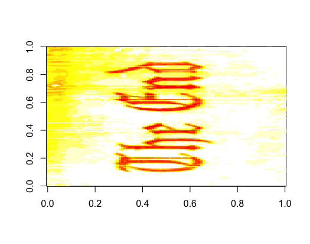
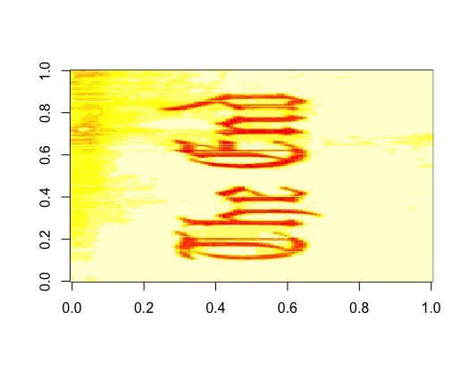
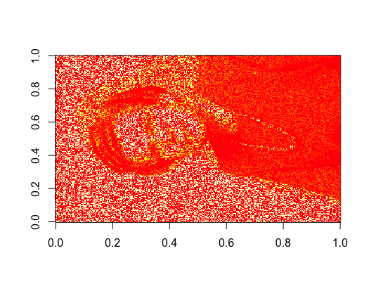
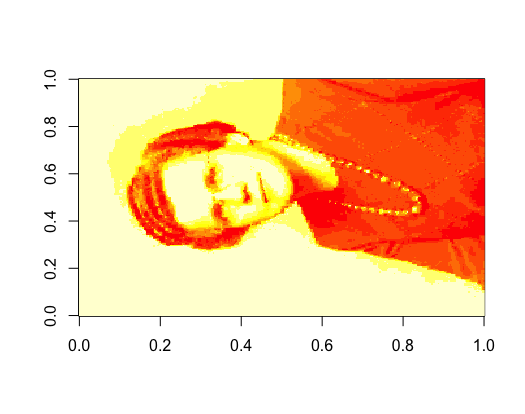
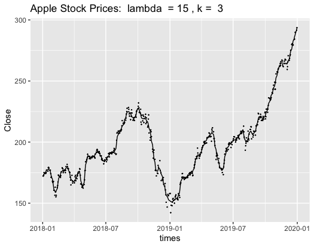

# 1

**Part 1.** In this homework, you will practice writing equivalent optimization problems.


## 1

**1.** Inpainting

In the inpainting problem we seek to fill in missing pixels in an image. Think reconstructing lost or deteriorated parts of a painting. Images tend to be smooth in the sense that a pixel's value tends to be similar to its neighboring pixel values. Thus, a natural strategy to filling in missing pixels is to perform interpolation. We can formalize an interpolation strategy as an LP. We will focus on square gray-scale images but rectangular color images can be delt with similarly. Let $\M{X} \in \{1,\ldots,255 \}^{m\times n}$ denote our estimate of an image with $mn$ pixels. Suppose we only get to observe a subset $\Omega \subset \{1, \ldots,m \} \times \{1, \ldots, n\}$ of the total number of pixels. Let $\V{x}$ denote vec$(\M{X})$, the $mn$ length vector obtained by stacking up all $n$ columns of $\M{X}$. Let $\V{y} \in \Real^{\lvert \Omega \rvert}$ denote the values of the image over the subset of observed pixels, and let $\M{D}_m$ denote the first-order differencing matrix:
$$
\M{D}_m = \begin{pmatrix}
1 & -1 & 0      &   & \\
0 & 1  & -1     & 0 & \\
  &    & \ddots & \ddots & \\
  &    &        & 1      & -1 \\
\end{pmatrix} \in \Real^{(m-1) \times m}.
$$
The matrix $\M{D}_m\M{X}$ is the $(m-1) \times n$ matrix obtained by differencing adjacent rows. The matrix $\M{X}\M{D}_n\Tra$ is the $m \times (n-1)$ matrix obtained by differencing adjacent columns. We can enforce smoothness in adjacent horizontal and vertical pixels by seeking an $\M{X}$ that minimizes the sum of the absolute values of the entries of the matrices $\M{D}_m\M{X}$ and $\M{D}_n\M{X}\Tra$, namely
$$
f(\M{X}) = \left [\sum_{j=1}^{n}\sum_{i=1}^{m-1} \lvert x_{i,j} - x_{i+1,j} \rvert \right ] + \left [\sum_{i=1}^{m}\sum_{j=1}^{n-1} \lvert x_{i,j} - x_{i,j+1} \rvert \right ]
$$

**(a)** Find the matrix $\Mhat{D}$ such that $f(\M{X}) = \lVert \Mhat{D}\V{x} \rVert_1$. Hint: Use the identity vec$(\M{A}\M{B}\M{C}) = [\M{C}\Tra \Kron \M{A}]$vec$(\M{B})$.

Inpainting can be solved by solving the following optimization problem.
$$
\begin{aligned}
&\text{minimize}\; \lVert \Mhat{D}\V{x} \rVert_1 \\
&\text{subject to}\; P_\Omega \V{x} = \V{y}, \V{x} \geq 0,
\end{aligned}
$$
where $P_\Omega \in \{0,1\}^{\lvert \Omega \rvert \times mn}$ is a matrix that maps $\V{x}$ to a smaller vector $P_\Omega \V{x}$ corresponding to the estimate $\V{x}$ at the observed indices.


\begin{align*}
	f(X) & = || vec(D_mX) ||_1 + ||vec(X D_n^T)||_1 \\
	 & = || vec(D_mX I_n) ||_1 + ||vec(I_m X D_n^T)||_1 \\
	 & = (I_n \otimes D_m)vec(X) + (D_n \otimes I_m) vec(X) \\
  & = \begin{bmatrix}
        	I_n \otimes D_m \\
        	D_n \otimes I_m
        \end{bmatrix} vec(X)
\end{align*}

$$
\widehat D = \begin{bmatrix}
         	I_n \otimes D_m \\
         	D_n \otimes I_m
         \end{bmatrix}
$$

**(b)** Formulate the above optimization problem as an LP.

Take $w = \widehat D x = w_+ - w_-$. Then $\widehat D x - w_+ + w_- = 0$. Then we get our constraints to be

\begin{align*}
 \underbrace{
 \begin{bmatrix}
 	-I & 0 & 0 \\
  	0 & -I & 0 \\
  	0 & 0 & -I 
 \end{bmatrix}
 }_{G}
 \underbrace{
 \begin{bmatrix}
 	x \\
 	w_+ \\
 	w_-
 \end{bmatrix}
 }_{x} & \leq \underbrace{0}_{h} \\
 \underbrace{
 \begin{bmatrix}
 	P_\Omega & 0 & 0 \\
 	\widehat  D & -I & I
 \end{bmatrix}
 }_{A}
 \underbrace{
 \begin{bmatrix}
 	x \\
 	w_+ \\
 	w_-
 \end{bmatrix}
 }_{x} & =
 \underbrace{
 \begin{bmatrix}
 	y \\
 	0
 \end{bmatrix}
 }_{b}
\end{align*}

And we are minimizing,

$$
\min_{x, w_+, w_-} \underbrace{
\begin{bmatrix}
	0 & 1 & 1
\end{bmatrix}}_{c^T}
 \underbrace{
 \begin{bmatrix}
 	x \\
 	w_+ \\
 	w_-
 \end{bmatrix}
 }_{x}.
$$

\newpage

## 2

**2.** $\ell_1$-Trend Filtering

Let $\V{y} \in \Real^n$ be a noisy time series signal that we wish to smooth. Let $\M{D}^{(1)}_n$ denote the $(n-1)\times n$ first-order differencing matrix. Note that the second-order differencing matrix $\M{D}^{(2)}_{n-1}$ can be written as the product of two first-order differencing matrices: $\Mn{D}{2}_{n-1} = \Mn{D}{1}_{n-1}\Mn{D}{1}_{n}$. More generally, the $k$th order differencing matrix $\Mn{D}{k}_{n-k+1}$ can be writen as the product of a first-order differencing matrix and a $k-1$th order differencing matrix: $\Mn{D}{k}_{n-k+1} = \Mn{D}{1}_{n-k+1}\Mn{D}{k-1}_{n-k+2}$. In $\ell_1$ trend filtering, we obtain a smoothed estimate $\V{\theta}$ of $\V{y}$ by solving the following quadratic program
$$
\underset{\V{\theta} \in \Real^n}{\text{minimize}}\; \frac{1}{2}\lVert \V{y} - \V{\theta} \rVert_2^2 + 
\lambda \lVert \Mn{D}{k}_{n-k+1} \V{\theta} \rVert_1,
$$
where $\lambda \geq 0$ is a regularization parameter that trades off data fit with smoothness.

**(a)** Formulate the $\ell_1$ trend filtering problem as a quadratic program.

Take $\Delta = D^{(k)}_{n-k+1} \theta = \Delta_+ - \Delta_-$. Then we get the following constraints.

\begin{align*}
\underbrace{
\begin{bmatrix}
	0 & -I & 0 \\
	0 & 0 & -I \\
\end{bmatrix}
}_{G}
\underbrace{
\begin{bmatrix}
  \theta \\
  \Delta_+ \\
  \Delta_-
\end{bmatrix}
}_{x}
& \leq
\underbrace{
\begin{bmatrix}
  0 \\
  0
\end{bmatrix}
}_{h} \\
\underbrace{
\begin{bmatrix}
	D^{(k)}_{n-k+1} & -I & I
\end{bmatrix}
}_{A}
\underbrace{
\begin{bmatrix}
  \theta \\
  \Delta_+ \\
  \Delta_-
\end{bmatrix}
}_{x} & = 
\underbrace{0}_{b}
\end{align*}


Now we can expand our objective function to

$$
	\frac{1}{2}\lVert \V{y} - \V{\theta} \rVert_2^2 + 
\lambda \lVert \Mn{D}{k}_{n-k+1} \V{\theta} \rVert_1 = \frac{ 1 }{ 2 }||y||_2^2 - y^t + \frac{ 1 }{ 2 } \theta^T \theta + \lambda 1^T \Delta_+ + \lambda 1^T \Delta_- \\
$$

$$
\underbrace{\frac{ 1 }{ 2 } ||y||^2_2}_{r} + \underbrace{
\begin{bmatrix}
-y^T & \lambda 1^T & \lambda 1^T	
\end{bmatrix}}_{q^T} 
\underbrace{\begin{bmatrix}
	\theta \\
	\Delta_+ \\
	\Delta_-
\end{bmatrix}}_{x}+ 
\underbrace{\begin{bmatrix}
	\theta & 	\Delta_+ & 	\Delta_-
\end{bmatrix}}_{x^T}
\underbrace{
\begin{bmatrix}
	\frac{ 1 }{ 2 } I & 0 & 0 \\
	0 & 0 & 0\\
	0 & 0 & 0
\end{bmatrix}
}_{P}
\underbrace{\begin{bmatrix}
	\theta \\
	\Delta_+ \\
	\Delta_-
\end{bmatrix}}_{x}
$$

\newpage


# You can find my code for part inpainting in `inpainting.R`. You can find the driver code in `/homework4/inpainting_driver.R`. I have pasted the code below, but used my driver to actually run it.

\newpage

# 2

**Part 2.** Use R Gurobi to solve the convex programs you formulated in Part 1.

**1.** Inpainting:

Write a function "myGetTV2d" that computes the matrix $\Mhat{D}$ from question 1 in Part 1.

**Note that I adapted my Dkn code from homework 2 to fit this problem and to avoid having a repeated function name in my package.**

```{r, echo=TRUE}
#' Compute kth order differencing matrix
#'
#' @param k order of the differencing matrix
#' @param n Number of time points
#' @param negative Flip signs, row one will look lie 1 -1 0 ... 0 (default: FALSE)
#' @return kth order differencing matrix
myGetDkn <- function(k, n, negative=FALSE)
{
  library(Matrix)
  neg = negative

  ii = 1 + (!negative) * (-2)
  iiplusone = -ii

   # create D1n
  if (k==1)
  {
    D1 = matrix(nrow = n-1, ncol = n)
    zeros_matrix = rep(0, n)

    for(i in 1:n-1)
    {
      D1[i,] = zeros_matrix
      D1[i,i] = ii
      D1[i, i+1] = iiplusone
    } # for
    return(Matrix(D1, sparse = TRUE))
  } # endif

  return(myGetDkn(k=1, n=n - k + 1, neg) %*% myGetDkn(k=k-1, n=n, neg))

}
```

```{r, echo=TRUE}
#' Compute the inpainting differencing matrix
#' 
#' @param m number of rows
#' @param n number of columns
#' @export
myGetTV2d <- function(m,n) {

 In = sparseDiag(n, 1)
 Im = sparseDiag(m, 1)

 return( rbind(kronecker(In, myGetDkn(1, m, negative=TRUE)),
               kronecker(myGetDkn(1, n, negative=TRUE),Im)))
}
```
Your function should return a **sparse** matrix (Please use the Matrix package). It is most convenient to use matrix Kronecker products to do this.

**Step 2:** Write a function "myInpaint" to compute a reconstructed image (matrix) $X$, from the available data matrix $Y$, by solving the standard form LP obtained in question 1 in Part 1 using gurobi. The input matrix $Y$ should be the same size as the "smooth" matrix $X$ that you are aiming to recover. The missing entries of $Y$ should be expected to be non-numeric, e.g. NA or NaN, so the function is.numeric should be useful.

```{r, echo=TRUE}
#' Create an n x n sparse diagonal matrix
#'
#' @param n size of matrix
#' @param diag number on diag
#' @export
sparseDiag = function(n, diag)
{
 return(bandSparse(n, n, 0, as.matrix(rep(diag,n))))
}

#' Remove missing data to calculate y and P_Omega
#'
#' @param inMatrix input data matrix
#' @export
removeMissing = function(inMatrix)
{
 in_vec = c(inMatrix)
 mn = length(in_vec)

 not_na_indices = which(!is.na(inMatrix) & in_vec != -1 )
 num_not_na = length(not_na_indices)

 y = in_vec[not_na_indices]
 P_Omega = sparseMatrix(i = 1:num_not_na, j = not_na_indices, x = 1, dims=c(num_not_na, mn))

 out_list = list(
                 "p_omega" = P_Omega,
                 "y" = y
              )

 return(out_list)
}


#' Compute the inpainting completion
#'
#' @param Y data matrix
#' @export
myInpaint <- function(Y) {
 # x vector = (x, w+, w-)

 library(gurobi)

 m = nrow(Y)
 n = ncol(Y)
 mn = m * n


 Dhat = myGetTV2d(m, n)
 Dhat_nrow = nrow(Dhat)

 no_missing = removeMissing(Y)
 p_omega = no_missing$p_omega
 y = no_missing$y

 neg_Imn = sparseDiag(mn, -1)

 neg_Idrow = sparseDiag(Dhat_nrow, -1)
 zero_drow = sparseDiag(Dhat_nrow, 0)
 one_vec_drow =  rep(1, Dhat_nrow)


 zero_p_drow = Matrix(0, nrow=nrow(p_omega), ncol = Dhat_nrow, sparse=TRUE)
 zero_mn_drow = Matrix(0, nrow=mn, ncol = Dhat_nrow, sparse=TRUE)
 zero_drow_mn =  Matrix(0, nrow=Dhat_nrow, ncol = mn, sparse=TRUE)
 zero_drow_drow = Matrix(0, nrow=Dhat_nrow, ncol = Dhat_nrow, sparse=TRUE)


 zero_vec_mn = rep(0, mn)
 zero_vec_drow = rep(0, Dhat_nrow)

 equality_constraints = rbind(
                           cbind(no_missing$p_omega, zero_p_drow, zero_p_drow),
                           cbind(Dhat, neg_Idrow, -1 * neg_Idrow)
                          )


 inequality_constraints = rbind(
                           cbind(neg_Imn, zero_mn_drow, zero_mn_drow),
                           cbind(zero_drow_mn, neg_Idrow, zero_drow_drow),
                           cbind(zero_drow_mn, zero_drow_drow, neg_Idrow)
                           )

 gurobi_model = list()

 gurobi_model$A = rbind(equality_constraints, inequality_constraints)
 gurobi_model$obj = c(zero_vec_mn, one_vec_drow, one_vec_drow)
 gurobi_model$modelsense = 'min'
 gurobi_model$rhs = c(y, zero_vec_drow,
                      zero_vec_mn, zero_vec_drow, zero_vec_drow)
 gurobi_model$sense = c(
                        rep('=', length(y)),
                        rep('=', length(zero_vec_drow)),
                        rep('<=', length(zero_vec_mn)),
                        rep('<=', length(zero_vec_drow)),
                        rep('<=', length(zero_vec_drow)))

 params <- list(OutputFlag=0)

 result <- gurobi(gurobi_model, params)

 return(result)
}
```

Your function should return a regular R matrix that is the restored image. Make sure that you use sparse matrices to construct the LP coefficient matrix. Your code will be painfully slow if you do not use sparse matrices.

**Step 3:** Use your inpainting function to "restore" Ed Ruscha's painting. Include a before and after image.


```{r, out.width='50%', fig.align='center', echo=FALSE}


```


**Step 4:** Use your inpainting function to "restore" the photo of Gertrude Cox. Include a before and after image.

```{r, out.width='50%', fig.align='center', echo=FALSE}


```

\newpage

# You can find my code for part inpainting in `l1_trend_filtering.R`. You can find the driver code in `/homework4/trend_filtering_driver.R`. I have pasted the code below, but used my driver to actually run it.

\newpage

**2.** $\ell_1$-Trend Filtering:

**Step 1:** Write a function "myGetDkn" to compute the $k$th order differencing matrix $D^{(k)}_n$

**Note that I adapted my Dkn code from homework 2 to fit this problem and to avoid having a repeated function name in my package.**


```{r, echo=TRUE}
#' Compute kth order differencing matrix
#'
#' @param k order of the differencing matrix
#' @param n Number of time points
#' @param negative Flip signs, row one will look lie 1 -1 0 ... 0 (default: FALSE)
#' @return kth order differencing matrix
myGetDkn <- function(k, n, negative=FALSE)
{
  library(Matrix)
  neg = negative

  ii = 1 + (!negative) * (-2)
  iiplusone = -ii

   # create D1n
  if (k==1)
  {
    D1 = matrix(nrow = n-1, ncol = n)
    zeros_matrix = rep(0, n)

    for(i in 1:n-1)
    {
      D1[i,] = zeros_matrix
      D1[i,i] = ii
      D1[i, i+1] = iiplusone
    } # for
    return(Matrix(D1, sparse = TRUE))
  } # endif

  return(myGetDkn(k=1, n=n - k + 1, neg) %*% myGetDkn(k=k-1, n=n, neg))

}
```
where the output matrix should be a **sparse** matrix.

**Step 2:** Write a function "myTrendFilter" to compute a smoothed estimate $\theta$ of noisy time series data $y$ by solving the QP obtained in question 2 in Part 1.

```{r, echo=TRUE}
#' Compute the kth order trend filtering estimator
#'
#' @param y noisy signal
#' @param k order of differencing operator
#' @param lambda regularization parameter
#' @export
myTrendFilter <- function(y, k, lambda) {
 library(gurobi)

 n = length(y)

 Dk = myGetDkn(k = k, n = n)

 nrow_d = nrow(Dk)

 neg_id_d = -1 * Diagonal(nrow_d)
 pos_id_d = Diagonal(nrow_d)
 half_id_n = 0.5 * Diagonal(n)

 zero_d_n = Matrix(0, nrow=nrow_d, ncol = n, sparse=TRUE)
 zero_d_d = Matrix(0, nrow=nrow_d, ncol = nrow_d, sparse=TRUE)
 zero_n_d = Matrix(0, nrow=n, ncol = nrow_d, sparse=TRUE)
 zero_n_n = Matrix(0, nrow=n, ncol = n, sparse=TRUE)

 lambda_d = rep(lambda, nrow_d)

 linear = c(-1 * t(y), lambda_d, lambda_d)

 quadratic = rbind(
                   cbind(half_id_n, zero_n_d, zero_n_d),
                   cbind(zero_d_n, zero_d_d, zero_d_d),
                   cbind(zero_d_n, zero_d_d, zero_d_d)
                  )

 equality_constraints = cbind(Dk, neg_id_d, pos_id_d)
 inequality_constraints = rbind(
                               cbind(zero_d_n, neg_id_d, zero_d_d),
                               cbind(zero_d_n, zero_d_d, neg_id_d)
                               )

 model = list()


 model$A = rbind(equality_constraints, inequality_constraints)
 model$Q = quadratic
 model$obj = linear
 model$rhs = c(
               rep(0, nrow_d),
               rep(0, nrow_d),
               rep(0, nrow_d)
              )
 model$sense = c(
                 rep("=", nrow_d),
                 rep("<=", nrow_d),
                 rep("<=", nrow_d)
                )

 cat(dim( model$A))
 cat(" ")
 cat(dim( model$Q))

 result = gurobi(model)

 return(result)

}
```

**Step 3:** Use your trend filtering function to smooth some interesting time series data. For example, you might use the tseries R package on CRAN (see the function **get.hist.quote**) to download historical financial data for the daily closing prices of Apple stock over the past two years. Try several $\lambda$ values - different enough to generate noticably different smoothed estimates - and at least two differencing matrix orders, e.g. $\Mn{D}{2}_n$ and $\Mn{D}{3}_n$. Provide plots of the noisy and smoothed estimates generated by your code.

```{r, out.width='50%', fig.align='center', echo=FALSE}





```
