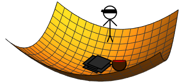

# What is Gradient Descent?

## Exposition
Imagine for a moment this very realistic scenario. You are a secret agent returning from a mission abroad retrieving some stolen hard drives containing many national secrets and one particularly good chili recipe that nobody remembered to save to the cloud. You are on your way to the airport in an UberPool (the government isn't made of money, you know) when all of a sudden your car takes a sudden left turn and the passenger next to you knocks you out. You awake on the side of a hill surrounding a valley. You get a brief glimpse of a truck at the bottom of the valley and people unloading what look like bags of tomatoes and onions; but then you are abruptly blindfolded and spun around, losing your sense of direction. How do you get to the bottom to retrieve the drives, beat the bad guys, and enjoy a well-earned hearty meal?



This is an optimization problem. In general, you have a function and you want to find the optimal value, which can be either a maximum or a minimum value. In our example, the function would be the mountain that you need to traverse to get there and the optimal point would be the bottom. This is the minimum value of the function.

Gradient descent is an algorithm to find optimal values of a function. It works by finding the direction of the gradient (the direction in which the function increases the most) at a given point and then taking a step in the opposite direction. This process is performed repeatedly until an optimal value is found. 

So, your goal is to find the minimum (bottom) of the function (mountain). After remembering reading this handy blog post, you decide to employ gradient descent to get you there. You step around and find the direction that is going the most _uphill_. Then you take a step in the opposite direction of that. Then you repeat until you have reached the bottom of the valley where you can complete your mission. 

## Formulating the Problem
Let's be a bit more mathematically rigorous. Call the function we are optimizing over $f(x)$ and the point that we started at $\theta_0$. At our next point $\theta_1$, we want to take a step away from the gradient of our original point $\theta_0$. 

$$
\theta_1 = \theta_0 - \alpha \nabla f(\theta_0)
$$

Here $\alpha$ is the step size. This is a positive multiplier that determines how much of the gradient will be used in updating $\theta$. The choice in step size can play a large role in finding your minimum; we will cover this more later. We then repeat this process and continue to update $\theta_k$. In general,

$$
\theta_{k+1} = \theta_k - \alpha \nabla f(\theta_i)
$$

We want to continue this process until we find the minimum point, $\theta^*$. We will know that we have found this point when our gradient vanishes, as there is no slope at a minimum.

$$
\nabla f(\theta^*) = 0
$$

A nice property of gradient descent is that once we find a minimum, our function will stay there. If $\theta_n = \theta^*$,

$$
\theta_{n+1} = \theta_n + \nabla f(\theta_n) = \theta_n + 0 = \theta_n =\theta^*.
$$

## Derivation
### Taylor's Theorem

Gradient Descent comes from Taylor's theorem. Let's approximate $\theta$ close to $\widetilde \theta$. Again, $\alpha$ will be our step size.

$$
f(\theta | \widetilde \theta) \approx f(\widetilde \theta) + \nabla f(\widetilde \theta)^T (\theta - \widetilde \theta) + \frac{ 1 }{ 2\alpha } \norm{\theta - \widetilde  \theta}^2
$$


Since we are looking for the $\theta$ that optimizes $f$, we will take the derivative of this with respect to $\theta$ and set it equal to 0.

\begin{align*}
	\frac{ d f }{  d\theta} & \approx 0 + \nabla f(\widetilde \theta)^T \theta + 0 + \frac{  1}{ 2 \alpha }\cdot 2 \cdot (  \theta - \widetilde \theta) \\ \\
	0 & = \nabla f(\widetilde \theta)^T \theta + \frac{  1}{ \alpha }  (  \theta - \widetilde \theta)
\end{align*}

$$
\theta= \widetilde \theta - \alpha \nabla f(\widetilde \theta)
$$

This is the same update rule that we formulated above.

### Step Size
#### Effect of Step Size
Let's look at the effect of choosing a step size with an example. We will use the familiar function $f(x) = x^2$ as our objective. Thus, its gradient is $\nabla f(x) = 2 x$. We will also choose a starting point, say $x = 2.5$. This gives $f(2.5) = 6.25$ as our starting value. Looking at the picture and through calculus, we know that the optimal point is at $x=0$ where $f(x)$ achieves its minimum value of 0.

``` {r, echo=TRUE, warning=FALSE}
library(ggplot2)

# look at x in [-5, 5]
x = seq(-5,5,0.01)

# initial x value
x0 = 2.5

# square objective function
square = function(x)
{
 return(x^2)
}

# Data frame of x^2 function
fx = data.frame(x = x, xsq = square(x))

# Data frame of the initial point (x0, f(x0))
initial_point = data.frame( x = x0, xsq = square(x0))

plot = ggplot() +
 geom_line(data = fx, aes(x, xsq)) +
 geom_point(data = initial_point, aes(x, xsq, fill="initial"),
            size = 6) +
  scale_fill_manual(name = '', 
         values =c('initial'='#000000'), 
         labels = c('initial')) + 
 ylab('x^2') +
 xlab('x')

plot
```

Now, let's try taking a gradient step with two different step sizes. Take $\alpha_1 = 1.03$ and $\alpha_2 = 0.1$. Let's work out what we would expect the next iterate to be with each step size.

\begin{align*}
	x_{1,1} & = x_0 - \alpha_1 \nabla f(x_0) \\
	 & = 2.5  - 1.03 \cdot 2 \cdot 2.5 \\
	 & = -2.65	\\
f(-2.65) & = 7.0225 \\ \\
 x_{1,2} & = x_0 - \alpha_2 \nabla f(x_0) \\
	 & = 2.5  - 0.1 \cdot 2 \cdot 2.5 \\
	 & = 2 \\
f(2) = 4
\end{align*}

We can repeat this process for 10 iterations and view the results.

``` {r, echo=TRUE, warning=FALSE, message=FALSE}
library(plotly)

# 2x is our gradient of x^2
gradient = function(x)
{
 return(2*x)
}

# Find new iterate via gradient descent
new_iterate = function(iterate, gradient_function, step_size)
{
 return( iterate - step_size * gradient_function(iterate) )
}

# Initialize step sizes
alpha1 = 1.03
alpha2 = 0.1

# Prepare data frames with initial observation
x1_data = x2_data = data.frame(x = x0, xsq = square(x0), nsteps = 0)

# Perform max_iter iterations of gradient descent
max_iter = 10
for(i in 1:max_iter)
{
 x1_update = new_iterate(tail(x1_data$x,1), gradient, alpha1)
 fx1_update = square(x1_update)
 x1_data = rbind(x1_data, c(x1_update, fx1_update, i))
 
 x2_update = new_iterate(tail(x2_data$x,1), gradient, alpha2)
 fx2_update = square(x2_update)
 x2_data = rbind(x2_data, c(x2_update, fx2_update, i))
}

plot = plot + 
  geom_point(data = x1_data, aes(x, xsq, frame=nsteps, fill="alpha = 1.03"), 
            size = 3) + 
 geom_point(data = x2_data, aes(x, xsq, frame = nsteps, fill="alpha = 0.10"),
            size = 3) +
 scale_fill_manual(name = '', 
         values =c('initial'='#0000FF',
                   'alpha = 1.03'='#FF0000',
                   'alpha = 0.10'='#00FFFF'), 
         labels = c('initial', 
                    'alpha = 1.03', 
                    'alpha = 0.10'))


fig = ggplotly(plot)  %>%
  animation_opts( frame = 2000, transition = 1000, redraw = FALSE ) 

fig
```


You can try your own step size below and starting point below. We will talk about the consequences of choosing a starting point later.

``` {r, echo=FALSE, warning=FALSE}
library(ggplot2)
library(plotly)


numericInput(
  "step_size", label = "Step Size:",
  0.4
)


sliderInput(
  "x0", label = "Starting x:",
  min = -5, max = 5, value = 2.5, step = 0.1
)


renderPlotly({
 # look at x in [-5, 5]
 x = seq(-5,5,0.01)
 
 # initial x value
 x0 = input$x0
 
 # square objective function
 square = function(x)
 {
  return(x^2)
 }
 
 # Data frame of x^2 function
 fx = data.frame(x = x, xsq = square(x))
 
 # Data frame of the initial point (x0, f(x0))
 initial_point = data.frame( x = x0, xsq = square(x0))
 
 plot = ggplot() +
  geom_line(data = fx, aes(x, xsq)) +
  ylab('x^2') +
  xlab('x')

 # 2x is our gradient of x^2
 gradient = function(x)
 {
  return(2*x)
 }
 
 # Find new iterate via gradient descent
 new_iterate = function(iterate, gradient_function, step_size)
 {
  return( iterate - step_size * gradient_function(iterate) )
 }

# Initialize step sizes
alpha1 = input$step_size


# Prepare data frames with initial observation
x1_data = data.frame(x = x0, xsq = square(x0), nsteps = 0)

# Perform max_iter iterations of gradient descent
max_iter = 10
for(i in 1:max_iter)
{
 x1_update = new_iterate(tail(x1_data$x,1), gradient, alpha1)
 fx1_update = square(x1_update)
 x1_data = rbind(x1_data, c(x1_update, fx1_update, i))
}


plot = plot + 
  geom_point(data = x1_data, aes(x, xsq, frame=nsteps), fill="#FF0000",
            size = 3) 


fig = ggplotly(plot)  %>%
  animation_opts( frame = 2000, transition = 1000, redraw = FALSE ) 

fig
})
```


We can see that the choice of step size had a major effect on our gradient descent algorithm. With too large a step size, $\alpha_1$, we actually got further away from the minimum with each step. While the smaller step size $\alpha_2$ moved closer to the minimum each iteration. So, how can you choose a good step size?


#### Choosing a Step Size
##### Lipschitz Constant
For Lipschitz differentiable functions, we can use the Lipschitz constant to find a step size. Let's unpack that statement step by step.

--------

_Definition:_

A function $g: \mathbb{R}^m \rightarrow \mathbb{R}^n$ is **Lipschitz continuous** with parameter $L$ if for all $x, y \in \mathbb{R}^m$,

$$
\norm{g(y)-g(x)}_2 \leq L \norm{y-x}_2.
$$

--------

_Definition:_

A function $f$ is $L$ **Lipschitz differentiable** is $\nabla f$ is Lipschitz continuous with parameter $L$.

--------

_Proposition (1):_

Let $f: \mathbb{R}^n \rightarrow \mathbb{R}$ be $L$-Lipschitz differentiable. Then, for all $x, y \in \mathbb{R}^n$,

$$
f(y) \leq f(x) + \nabla f(x)^T (y-x) + \frac{ L }{ 2 } \norm{y-x}_2^2
$$

_Proof:_

Take $g(t) = f(x + t(y-x))$ to be a line restriction. Notice that

\begin{align*}
	g(0) & = f(x) \\
	g(1) & = f(y) \\
	g'(t) & = \nabla f(x+t(y-x))^T (y-x).
\end{align*}

Then, by the Fundamental Theorem of Calculus,

\begin{align*} 
g(t) & = g(0) + \int_{0}^{1} g'(t) dt \\
f(y) & = f(x) + \int_0^1 \nabla f(x+t(y-x))^T (y-x) dt.
\end{align*}

We will then add and subtract the same term (effectively adding 0) in different forms.

\begin{align*}
	f(y) & = f(x) + \int_0^1 \nabla f(x+t(y-x))^T (y-x) dt \\
		 & = f(x) + \int_0^1 \nabla f(x+t(y-x))^T (y-x) dt \\
		 & + \nabla f(x)^T (y-x) - \int_{0}^1 \nabla f(x)^T (y-x) dt \\
		 & = f(x) + \nabla f(x)^T (y-x) + \int_0^1 [\nabla f(x+t(y-x)) - \nabla f(x)]^T (y-x) dt \\
\end{align*}

We can then apply the Cauchy-Schwartz inequality to the integral term.

$$
		 \int_0^1 [\nabla f(x+t(y-x)) - \nabla f(x)]^T (y-x) dt \leq \int_{0}^{1} \norm{\nabla f(x+t(y-x)) - \nabla f(x)}_2 \norm{y-x}_2 dt.
$$

Then, since $\nabla f$ is Lipschitz continuous,

\begin{align*}
		 \int_0^1 [\nabla f(x+t(y-x)) - \nabla f(x)]^T (y-x) dt		 & \leq \norm{y-x}_2 \int_{0}^1 L \norm{x+ t(y-x) -x }_2 dt \\
		 & = \norm{y-x}_2 \int_{0}^1 L t \norm{y-x}_2 dt \\
		 & = L \norm{y-x}_2^2 \int_0^1 t dt \\
		 & = L \norm{y-x}_2^2 \Big(\frac{ t^2 }{ 2 }\Big) \Big\vert_{0}^1 \\
		 & = \frac{ L }{ 2 } \norm{y-x}_2^2
\end{align*}

Thus,

$$
f(y) \leq f(x) + \nabla f(x)^T (y-x) + \frac{ L }{ 2 } \norm{y-x}_2^2.
$$

<div style="text-align: right"> 🐙 </div>


Now we can apply this to gradient descent. Define

$$
g(\theta_ |\theta_{k}) := f( \theta_k) + \nabla f(\theta_k)^T (\theta - \theta_k) + \frac{ 1 }{ 2\alpha } \norm{\theta - \theta_k}^2.
$$

Then the gradient update is the solution to 

$$
\theta_{k+1} = \arg \min_{\theta} g(\theta | \theta_k).
$$

There few things to notice here.


1. $f( \theta_k) = g(\theta_k | \theta_k)$ 

2. $f( \theta ) \leq g(\theta | \theta_k)$ if $\alpha \leq \frac{ 1 }{ L }$

These facts build the following inequality.

$$
f(\theta_k) = g(\theta_k | \theta_k) \geq g(\theta_{k+1} | \theta_k) \geq f (\theta_{k+1}).
$$

This inequality says that the function value at our new point cannot be larger than the function value at the previous point. So, given a step size of  $\alpha \leq \frac{ 1 }{ L }$, our gradient step if *guaranteed* to not move further from the optimal value. This is a very powerful result for Lipschitz continuous functions. We will use this and go through a full example.


However, this only solves our problem if we know the Lipschitz constant. If we do not know it or do not want to calculate it, there is an iterative procedure for finding an appropriate step size.


##### Backtracking Line Search
The backtracking line search algorithm iteratively tries different step sizes until the following inequality is satisfied.

$$
f(x - a_k \nabla f(x)) < f(x) - \gamma a_k \norm{\nabla f(x)}_2^2
$$


This inequality comes from the $L$-Lipschitz differentiability of $f$ and a combination of the Wolfe conditions and the Armijo rule. Here $f$ is our objective function, $\alpha_k$ is our $k$th step size and $\gamma$ is a constant that we will set to $\frac{ 1 }{ 2 }$. Our update rule is $a_{k+1} = \beta \alpha_k$ for $\beta \in (0,1)$ and $a_0 > 0$. 

Let's walk through what the start of this algorithm would look like.

1. We start by initialize $\alpha_0$, $\beta$, and $\gamma$.
2. We plug our $\alpha_0$ into the left side of the inequality.
* Notice that this is the function evaluated at the next iterate with step size $\alpha_0$.
3. We plug in our $\alpha_0$ the right hand side.
4. Compare the left hand side and the right hand side. If the right hand side is bigger we stop, otherwise continue.
5. Update the step size. $\alpha_1 = \beta \alpha_0$

If $f$ is $L$-Lipschitz differentiable, then $\alpha_k \geq \alpha_{\min} = \min\{\alpha_0, \beta / L\}$.

Note that you would run this algorithm every iteration of gradient descent to find an appropriate step size.

In code, the backtracking line search is a simple function which we will see in our first example.


### When To Stop

While we may converge to our optimal point with gradient descent, we may never *exactly* achieve it. If we do not reach the exact point where the gradient vanishes, our function will continue to iterate. We want to avoid this. If our function stops changing drastically each iteration, then we can assume that we have found the optimal point and stop the computation. Here are a few heuristics that we can check.


We can track the relative change in objective function. We will stop the computation if the change in our $f(x)$ values is very small (less than some set tolerance) between iterations.

$$
\frac{ f(b_k) - f(b_{k+1}) }{ 1 + |f(b_k)| } \leq \text{tolerance}
$$


We can similarly track the relative change relative change in iterate value.

$$
\frac{ \norm{b_k-b_{k+1}} }{ 1 + \norm{b_k} } \leq \text{tolerance}
$$

If we stricter stopping conditions, we can check the Duality gap and the KKT conditions of our objective function.

These can save us a lot of time, stopping the computation when it has effectively found the minimum.

## Convergence of Gradient Descent

### Strong Convexity and Coercivity
We will show that with certain objective functions, our fixed step size gradient descent algorithm is guaranteed to converge to a single global minimum. However, we will need a few definitions first.

--------

_Definition:_

A function $f$ is _strongly convex_ with parameter $m > 0$ if

$$
f(x) - \frac{ m }{ 2 } \norm{x}_2^2 \text{ is convex}.
$$

--------

We can check this with a few different conditions.

1. Jensen's Inequality

$$
f(\alpha x + (1 - \alpha) y) \leq \alpha f(x) + (1-\alpha) f(y) - \frac{ m }{ 2 } \alpha (1-\alpha) \norm{x-y}_2^2
$$

2. First-order condition
$$
f(y) \geq f(x) + \nabla f(x)^T (y-x) + \frac{ m }{ 2 } \norm{x-y}_2^2
$$
* This means that $f$ can under-bound with a quadratic under-estimator ( not just a linear under-estimator)

3. Second-order condition
$$
\nabla^2 f(x) \succeq m I
$$


--------

_Definition:_

A continuous function $f(x)$ on $\mathbb{R}^n$ is coercive if

$$
\lim_{\norm{x} \rightarrow \infty} f(x) = + \infty
$$

--------

This can be restated as: for any constant $M>0$, there exists a constant $R_M > 0$ such that $f(x) > M$ whenever $\norm{x} > R_M$.

Notice that the sublevel set of a coercive function must be compact; then, if a function that is both strongly convex and coercive must achieve its single global minimum by the Weierstrass Extreme Value Theorem.

### Zangwill-Meyer Theorem

We will use the Zangwill-Meyer theorem to prove convergence.

--------

_Theorem:_

Let $f$ be a continuous function on a domain $\mathcal D$, and let $\psi$ be a continuous iterative map from $\mathcal D$ into $\mathcal D$ such that $f(\psi(x)) < f(x)$ for all $x \in \mathcal D$ with $\psi(x) \neq x$. Suppose there is an $x_0$ such that the set $\mathcal L _f(x_0) = \{x \in \mathcal D : f(x) \leq f(x_0) \}$ is compact. Define $x_{k+1} = \psi(x_k)$ for $k = 0 , 1 , \dots$. Then,

1. the sequence of iterates $\{x_k\}$ has at least one limit point and all its limit points are fixed points of $\psi$,

2. the distance between successive iterates converges to $0$, i.e. $\norm{x_{k+1}-x_{k}} \rightarrow 0$.

--------

These boil down to 4 easy conditions that we can check.

1. $f$ is continuous
2. $\psi$ is continuous
3. $f(\psi(x)) < f(x)$ for $x \neq \psi(x)$
4. $\mathcal L(x_0)$ is compact


Now let's apply it to gradient descent with a fixed step size. We will make a few assumptions on our function. 

_Assumptions:_

Take $f: \mathbb{R}^n \rightarrow \mathbb{R}$ such that

1. $f$ is convex and differentiable with $\text{dom} f = \mathbb{R}^n$
2. $\nabla f(x)$ is $L$-Lipschitz continuous
3. $f$ attains its minimum value $f^*$ at $x^*$
4. $f$ is coercive

_Claim:_
If we minimize $f$ using gradient descent using a fixed step size $\alpha \in (0, \frac{ 1 }{ L }]$. Our update is $\psi(x) = x - \alpha \nabla f(x)$ and $x_{n+1} = \psi(x_n)$. Then $x_n \rightarrow x^*$.


_Proof:_

We can check our conditions.

**1. $f$ is convex and differentiable with $\text{dom} f = \mathbb{R}^n$**

By definition $f$ is differentiable and continuous.

**2. $\psi$ is continuous**

By definition $\psi$ is continuous.

**3. $f$ attains its minimum value $f^*$ at $x^*$**

By Lipschitz differentiability

$$
\begin{align}
f(\psi(x)) & \leq f(x) + \langle \nabla f(x) , \psi(x) - x \rangle + \frac{ L }{ 2 } \norm{\psi(x) - x}_2^2 \\
 & =  f(x) + \langle \nabla f(x) , x - \alpha \nabla f(x) - x \rangle + \frac{ L }{ 2 } \norm{x - \alpha \nabla f(x) - x}_2^2 \\
  & =  f(x) - \alpha \langle \nabla f(x) , \nabla f(x)  \rangle + \frac{ L }{ 2 } \norm{- \alpha \nabla f(x)}_2^2 \\
  & = f(x) - \alpha \norm{\nabla f(x)} - \frac{ \alpha L }{ 2 } \norm{\nabla f(x)}_2^2 \\
 & \leq f(x) - \frac{ \alpha }{ 2 } \norm{\nabla f(x)}_2^2 \\
 & < f(x)
\end{align}
$$

**4. $\mathcal L(x_0)$ is compact**

Since $f$ is coercive, $\mathcal L_f(x_0) \equiv \{x \in \mathcal D : f(x) \leq f(x_0) \}$ is compact for $x_0$.


By Meyer's convergence theorem, the limit points of $x_n$ are fixed points of $\psi$. And fixed points of $\psi$ are also stationary points of $f$. Therefore, the limit points $x_n$ are stationary points of $f$. Since we assumed that $f$ is convex and has a unique global minimizer, it has exactly one stationary point. So, $x_n$ has exactly one limit point. Thus, $x_n \rightarrow x^*$.
<div style="text-align: right"> 🐙 </div>


We will see later in Issues with Gradient Descent examples of functions that are not strongly convex and coercive and the consequences of running gradient descent on them.

## Computational Efficiency
Gradient descent is a first order algorithm, meaning that we only need to find the gradient of our objective function at each step. This can generally be done in linear time. Then the only remaining operations are a scalar-vector multiplication and a vector-vector subtraction. Both of these take linear time. If $p$ is the length of $\theta$,

$$
\theta_{k+1} = \underbrace{\theta_k - \overbrace{\alpha \cdot\underbrace{\nabla f(\theta_k)}_{\mathcal{O}( p )}}^{\mathcal{O}( p )}}_{\mathcal{O}( p )}.
$$

Thus, we get an overall complexity of $\mathcal{O}( p )$.


Comparatively, a second order algorithm, such as Newton's Method, which looks similar to gradient descent can be much more expensive. Newton's Method requires the gradient, as well as the Hessian. It also needs to invert the Hessian, which is a very expensive operation that can take cubic time if no special structure is identified.


# Examples

## Nonnegative Least Squares

Let's start with a quick, familiar problem before hopping into a more thorough example. We will look at the nonnegative least squares problem. Our objective function is

$$
\min_{b \in \mathbb{R}^p_+} f(b) = \frac{ 1 }{ 2 } \norm{y - Xb}_2^2 .
$$

For simplicity, let's assume that $X$ has full column rank with positive entries. Then $f$ is strongly convex.

Recall that for vectors $a$ and $b$ and matrix $A$

$$
\frac{  \partial a^T b }{\partial b  } = a, \ \frac{  \partial b^T A b}{ \partial b  } = (A + A^T)b.
$$


\begin{align*}
f(b) & = \frac{ 1 }{ 2 } \norm{y - Xb}_2^2 \\
 & = \frac{ 1 }{ 2 }(y-Xb)^T (y-Xb) \\
 & = \frac{ 1 }{ 2 } \Big( y^T y - y^T X b + b^T X^T y + b^T X^T b X \Big) \\
 & = \frac{ 1 }{ 2 } \Big( y^T y - 2 y^T X b + b^T X^T b X \Big) & \text{scalar} \\ \\
 \nabla f(b) & = -X^T y + \frac{ 1 }{ 2 }(X^T X + (X^T X)^T)b \\
  & = -X^T y + X^T X b \\ \\
\nabla ^2 f(b) & = X^T X
\end{align*}


Take $m = 1$, then

$$
\nabla^2 f(x) - m I = X^T X - I \succeq 0
$$

Then $f(b)$ is strongly convex by the second order condition.

Notice that the $b$ term of our objective is in an norm squared. Thus, as the iterates grow, so will the objective function.

$$
\lim_{b\rightarrow \infty} f(b) = + \infty
$$


Thus, $f$ is also coercive. Since it is coercive and strongly convex, it has a unique global minimizer that it attains. 

Now let's code the problem up! We will practice using backtracking to find our step size.

Let's generate some data around the line $y = 4.6 x$


``` {r, echo=TRUE, warning=FALSE}
#' Gradient Descent (Backtracking Step-Size)
#'
#' @param fx handle to function that returns objective function values
#' @param gradf handle to function that returns gradient of objective function
#' @param x0 initial parameter estimate
#' @param max_iter maximum number of iterations
#' @param tol convergence tolerance
#' @export
gradient_descent_backtrack <- function(fx, gradf, x0, max_iter=1e2, tol=1e-3)
{
  # create vectors
  objective_history = c()
  gradient_history = c()
  relative_objective_history = c()
  relative_iterate_history = c()

  # guess at step size
  default_step_size = 1

  # initialize variables
  current_iterate = x0
  gradient_history[1] = 0
  objective_history[1] = fx(current_iterate)
  relative_objective_history[1] = 0
  relative_iterate_history[1] = 0

  # perform gradient descent until either
  #   we have changed less than the tolerance
  #   we have done the maximum number of iterations
  for (i in 2:max_iter)
  {

    # Calculate gradient for current x
    gradient_value = gradf(current_iterate)
    gradient_history[i] = norm(gradient_value, '2')

    # Calculate step size using backtracking
    step_size = backtrack(fx = fx, x = current_iterate, t = default_step_size, df = gradient_value, alpha = 0.5, beta = 0.9)

    # Gradient step to get new objective iterate value
    new_iterate = gradient_step(gradient_value, current_iterate, step_size)

    objective_history[i] = fx(new_iterate)

    relative_objective_history[i] = abs((objective_history[i] - objective_history[i-1]))/(1 + abs(objective_history[i]))
    relative_iterate_history[i] = norm(new_iterate - current_iterate, '2') / (1 + norm(new_iterate, '2'))

    current_iterate = new_iterate

    # break if change less than tolerated amount
    if (relative_objective_history[i] <= tol)
      break

  } # end for

  return_list = list(
    "final_iterate" = current_iterate,
    "objective_history" = objective_history,
    "gradient_history" = gradient_history,
    "relative_objective_history" = relative_objective_history,
    "relative_iterate_history" = relative_iterate_history
  )

  return(return_list)
}
```


## Smoothing Time Series Data
With this problem we will draw on all the knowledge we have learned so far. We will start with a function, show that it is strongly convex and Lipschitz continuous. We will choose an appropriate step size and calculate the computational complexity of our algorithm. We can then perform gradient descent on it.

We will work with the Hodrick-Prescott (HP) filter. We will assume that our data follow 

$$
y = \theta + e.
$$

Here $y \in \mathbb{R}^n$ is our time series data taken at $n$ sequential time points. $\theta$ is a smooth function (its derivatives won't get "too big") and $e \in \mathbb{R}^n$ is a noise vector of i.i.d. Gaussian variables with zero mean. Our objective function to minimize is the following penalized negative log-likelihood.

$$
\ell(\theta) = \frac{ 1 }{ 2 } \norm{y-\theta}_2^2 + \frac{ \lambda }{ 2 } \norm{\Dkn{k}{n} \theta}^2_2
$$

Here $\lambda$ is a non-negative tuning parameter and $D_n^{(k)}$ is the $k$th order differencing matrix for a signal of length $n$. It is defined recursively as

\begin{align*}
\Dkn{k}{n} & = \Dkn{k}{n-k+1}\Dkn{k-1}{n}\\ \\
\Dkn{k}{1} & = 
\begin{bmatrix}
	-1 & 1 & 0 & \dots & 0 & 0 \\
	0 & -1 & 1 & \dots & 0 & 0 \\
	\vdots \\
	0 & 0 & 0 & \dots & -1 & 1 \\
\end{bmatrix} \in \mathbb{R}^{n-1 \times n}.
\end{align*}

We want to show that $\ell$ is strongly convex, coercive, and find its Lipschitz constant. We will start by finding its gradient and Hessian.


\begin{align*}
\ell (\theta) & = \frac{1}{2} \lVert y - \theta \rVert_2^2 + \frac{\lambda}{2} \lVert \Dkn{k}{n} \theta \rVert_2^2 \\
	  & = \frac{ 1 }{  2} (y-\theta)^T (y-\theta) - \frac{ \lambda }{  2}(\Dkn{k}{n} \theta)^T(\Dkn{k}{n} \theta)^T \\
	  & = \frac{ 1 }{  2} \Big[ y^T y - y^T \theta - \theta^T y - \theta^T \theta  \Big] + \frac{\lambda  }{2  } \theta^T (\Dkn{k}{n})^T \Dkn{k}{n} \theta \\
	  & = \frac{ 1 }{  2} \Big[ y^T y - y^T \theta - y^T \theta - \theta^T \theta  \Big] + \frac{\lambda  }{2  } \theta^T (\Dkn{k}{n})^T \Dkn{k}{n} \theta & y^T \theta \text{ is a scalar} \\ \\
\nabla \ell (\theta) & = \frac{ 1 }{  2}(0 - 2y + 2 \theta) + \frac{\lambda  }{2  } \Big[ (\Dkn{k}{n})^T \Dkn{k}{n} + ((\Dkn{k}{n})^T \Dkn{k}{n})^T \Big] \theta \\
	 & = -y + \theta + \lambda (\Dkn{k}{n})^T \Dkn{k}{n} \theta \\ \\
\nabla^2 \ell (\theta) & = 0 + I + \lambda ((\Dkn{k}{n})^T \Dkn{k}{n})^T \\
  & = I + \lambda (\Dkn{k}{n})^T \Dkn{k}{n}
\end{align*}


Now that we have the gradient and Hessian, let's show that $\ell$ is strongly convex.

We will use the condition

$$
\nabla^2 f(x) \succeq m I
$$

which means that $\nabla^2 f(x) - mI$ is positive semidefinite for $m > 0$. If we take $m = 1$ then

$$
\nabla^2 f(x) - mI = I - \lambda (\Dkn{k}{n})^T \Dkn{k}{n} - I = \lambda (\Dkn{k}{n})^T \Dkn{k}{n}.
$$

Notice that $\lambda > 0$ and since we have a matrix multiplied by its transpose, we know that this is always positive semidefinite. Thus, we have strong convexity.

Now that we have strong convexity, let's check for coercivity.

Notice that all of the norms in $\ell(=\theta)$ are squared and $\lambda$ is nonnegative. This means that all of the terms will be positive. As $||\theta||$ increases, so will these norms will all go to infinity as $||\theta|| \rightarrow \infty$. 

Thus, we have coercivity. Thus we have the sufficient conditions to say that $\ell(\V{\theta})$ has a unique global minimizer. When our gradient descent converges, it will converge to the global minimum.

Now we will find the Lipschitz constant for $\ell$.

Recall that for matrices $||\cdot ||_{2} = ||\cdot ||_{op}$. Thus,

$$
||\nabla^2 \ell(\theta) ||_{2} = || \nabla^2 \ell(\theta) ||_{op} \leq L
$$

We can proceed with the triangle inequality.

\begin{align*}
	||\nabla^2 \ell(\theta) ||_{op} & = ||I + \lambda (\Dkn{k}{n})^T \Dkn{k}{n} ||_{op} \\
	  & \leq ||I||_{op} + || \lambda (\Dkn{k}{n})^T \Dkn{k}{n}|| & \text{Triangle Inequality} \\
	  & = 1 + \lambda || (\Dkn{k}{n})^T \Dkn{k}{n} ||_{op} \\
	  & \leq 1 + \lambda ||(\Dkn{k}{n})^T||_{op} ||\Dkn{k}{n}||_{op} & \text{Cauchy-Schwartz} \\
	  & 1 + \lambda || \Dkn{k}{n} ||_{op}^2 & ||A^T||_{op}= ||A||_{op}
\end{align*}

Thus, take $L = 1 + \lambda || \Dkn{k}{n} ||_{op}$.


Now we have all the pieces we need to implement the algorithm. However, we should first check the complexity of each calculation. This could help us find bugs in our code later.

Notice that $\Dkn{k}{n}$ is a sparse matrix for $n >> k$. This will speed up some of our computations.

Recall that sparse matrix-vector multiplication scales with the number of nonzero elements in the each column of the sparse matrix. Similarly, sparse matrix-matrix multiplication scales in the number of rows times the number of nonzero elements of each column. 

Notice $\Dkn{k}{n} \in \mathbb{R}^{(n-k)\times n}$ and have $k$ nonzero elements in each column.

Let's start with the Hessian.

$$
\nabla^2 \ell (\theta) = \underbrace{I + \overbrace{\lambda \underbrace{(\Dkn{k}{n})^T \Dkn{k}{n}}_{\mathcal{O}(n k k)}}^{\mathcal{O}( n^2 )}}_{\mathcal{O}( n )}
$$
The sparse matrix-matrix multiplication scales in $\mathcal{O}( n k^2 )$ since there are $k$ nonzero elements per column in each sparse matrix, then you multiply it by a scalar which is $\mathcal{O}( n^2 )$ because there are $n^2$ elements, and then finally the matrix-matrix addition is $\mathcal{O}( n^2 )$. This gives us

$$
\mathcal{O}(n k^2 + n^2 + n^2  ) = \mathcal{O}( nk^2 )
$$

Notice that this assumes sparsity, that is $n >> k$. If we have $n \approx k$, we lose sparsity and our matrix mulitplication would go back to $O(n^3)$.

Now we can look the gradient. 

$$
\nabla \ell (\theta) = -y + \theta + \lambda \overbrace{(\Dkn{k}{n})^T \underbrace{(\Dkn{k}{n} \cdot \theta)}_{O(nk)}}^{O(nk)}
$$

Notice that if we perform the sparse matrix-vector multiplication first gives us $\mathcal{O}(nk)$. The scalar multiplication and vector addition above are all $\mathcal{O}(n  )$ so we have

$$
\mathcal{O}(n + n + n + nk + nk  ) = \mathcal{O}( nk )
$$


For gradient descent we need only to calculate the gradient each step; however, when examining a problem formulation it is good to look at both as some other methods use the Hessian as well. Knowing the complexity to compute it will help you choose which algorithm will work best in practice.

Putting all of these pieces together gives a gradient step of

$$
\theta_{k+1} = \theta_k - \frac{ 1 }{ 1 + \lambda \norm{\Dkn{k}{n}}_{op}^2 } \cdot (-y + \theta_k + \lambda (\Dkn{k}{n})^T \Dkn{k}{n} \theta_k).
$$


Now we need a stopping rule. We will stop if the relative change in objective falls below a set tolerance. We will also track the relative change in iterate if you want to try another stopping rule.

We have examined our problem and pieced together our algorithm, now we can code it! Each function has Roxygen2 style documentation so that you can look them up later.


``` {r, echo=TRUE, warning=FALSE}
#' Hodrick-Prescott filtering objective function
#'
#' @param y response
#' @param theta regression coefficient vector
#' @param Dkn sparse differencing matrix
#' @param lambda regularization parameter
#' @export
fx_hp <- function(y, theta, Dkn, lambda = 0)
{
  return(0.5 * sum((y-theta)^2) + (lambda/2) * sum((as.vector(Dkn %*% theta))^2) )
}


#' Hodrick-Prescott filtering objective gradient
#'
#' @param y response
#' @param theta regression coefficient vector
#' @param Dkn sparse differencing matrix
#' @param lambda regularization parameter
#' @export
gradf_hp <- function(y, theta, Dkn, lambda = 0)
{
  return(-y + theta + lambda * as.vector(crossprod(Dkn) %*% theta) )
}


#' Get Lipschitz constant for Hodrick-Prescott filtering
#'
#' @param lambda regularization parameter
#' @param Dkn sparse differencing matrix
hp_lipschitz_constant <- function(lambda, Dkn)
{
  Dkn_operator_norm = max(svd(Dkn)$d)^2
  L = 1 + lambda *Dkn_operator_norm

  return(L)
}


#' Compute kth order differencing matrix
#'
#' @param k order of the differencing matrix
#' @param n Number of time points
#' @param negative Flip signs (default: FALSE)
#'  TRUE:   row one of D^1_n will look like 1 -1 0 ... 0
#'  FALSE:  row one of D^1_n will look like -1 1 0 ... 0
#' @return kth order differencing matrix
myGetDkn <- function(k, n, negative=FALSE)
{
  library(Matrix)
  neg = negative

  ii = 1 + (!neg) * (-2)
  iiplusone = -ii

   # create D1n
  if (k==1)
  {
    D1 = matrix(nrow = n-1, ncol = n)
    zeros_matrix = rep(0, n)

    for(i in 1:n-1)
    {
      D1[i,] = zeros_matrix
      D1[i,i] = ii
      D1[i, i+1] = iiplusone
    } # for
    return(Matrix(D1, sparse = TRUE))
  } # endif

  return(myGetDkn(k=1, n=n - k + 1, neg) %*% myGetDkn(k=k-1, n=n, neg))

}


#' Gradient Step
#'
#' @param gradf handle to function that returns gradient of objective function
#' @param x current parameter estimate
#' @param t step-size
#' @export
gradient_step <- function(gradf, x, t) {
  return(x - t * gradf)
}


#' Gradient Descent (Fixed Step-Size)
#'
#' @param fx handle to function that returns objective function values
#' @param gradf handle to function that returns gradient of objective function
#' @param x0 initial parameter estimate
#' @param t step-size
#' @param max_iter maximum number of iterations
#' @param tol convergence tolerance
#' @return A list with letters and numbers.
#' \itemize{
#'   \item{final_iterate}{The final iterate}
#'   \item{objective_history}{A vector of objective function value from each iteration.}
#'   \item{gradient_history}{A vector of the 2-norm of the gradient value from each iteration.}
#'   \item{relative_objective_history}{A vector of relative change in object value between iterations.}
#'   \item{relative_iterate_history}{A vector of relative change in iterate value between iterations.}
#' }
#' @export
gradient_descent_fixed <- function(fx, gradf, x0, t, max_iter=1e2, tol=1e-3) {

  # Check that step size is positive
  if (t <= 0)
    stop("Step size must be positive")

  # create vectors
  objective_history = c()
  gradient_history = c()
  relative_objective_history = c()
  relative_iterate_history = c()

  # initialize variables
  current_iterate = x0
  gradient_history[1] = 0
  objective_history[1] = fx(current_iterate)
  relative_objective_history[1] = 0
  relative_iterate_history[1] = 0

  # perform gradient descent until either
  #   we have changed less than the tolerance
  #   we have done the maximum number of iterations
  for (i in 2:max_iter)
  {

    # Calculate gradient for current x
    gradient_value = gradf(current_iterate)
    gradient_history[i] = norm(gradient_value, '2')

    # Gradient step to get new objective iterate value
    new_iterate = gradient_step(gradient_value, current_iterate, t)

    objective_history[i] = fx(new_iterate)

    relative_objective_history[i] = abs((objective_history[i] - objective_history[i-1]))/(1 + abs(objective_history[i]))
    relative_iterate_history[i] = norm(new_iterate - current_iterate, '2') / (1 + norm(new_iterate, '2'))

    current_iterate = new_iterate

    # break if change less than tolerated amount
    if (relative_objective_history[i] <= tol)
      break

  } # end for

  return_list = list(
    "final_iterate" = current_iterate,
    "objective_history" = objective_history,
    "gradient_history" = gradient_history,
    "relative_objective_history" = relative_objective_history,
    "relative_iterate_history" = relative_iterate_history
  )

  return(return_list)
}

#' Gradient Descent Wrapper
#'
#' @param fx handle to function that returns objective function values
#' @param gradf handle to function that returns gradient of objective function
#' @param x0 initial parameter estimate
#' @param t step-size
#' @param max_iter maximum number of iterations
#' @param tol convergence tolerance
#' @export
gradient_descent <- function(fx, gradf, x0, t=NULL, max_iter=1e2, tol=1e-3) {

  if(is.null(t))
    return(gradient_descent_backtrack(fx = fx, gradf = gradf, x0 = x0, max_iter = max_iter, tol = tol))
  else
    return(gradient_descent_fixed(fx = fx, gradf = gradf, x0 = x0, t = t, max_iter = max_iter, tol = tol))
}
```


Now that we have our functions set up, let's try it out on some time series data! We will look at Apple stock prices at closing from January 1st 2018 to January 1st 2020. The data looks like this.


``` {r, echo=TRUE, warning=FALSE}
library(tseries)

# Read in time series data
apple_data = get.hist.quote( instrument = "AAPL",
                             start = "2018-01-01",
                             end = "2020-01-01",
                             quote="Close")

times = time(apple_data)
time_stock = cbind(times, as.data.frame(apple_data))

# This will set up our problem for different inputs
setup = function(y, k, n, lambda)
{
  Dkn = myGetDkn(k, n)
  L = hp_lipschitz_constant(lambda = lambda, Dkn = Dkn)
  lipschitz_step_size = 1/L

  hp_objective_wrapper = function(x)
    fx_hp(y = y, theta = x, Dkn = Dkn, lambda = lambda)

  hp_gradient_wrapper = function(x)
    gradf_hp(y = y, theta = x, Dkn = Dkn, lambda = lambda)

  output_list = list(
    "Dkn" = Dkn,
    "step_size" = lipschitz_step_size,
    "hp_fx" = hp_objective_wrapper,
    "hp_grad" = hp_gradient_wrapper
  )

  return(output_list)
}

# This function will set up our data, run the gradient descent, and plot the results.
# We can call it with different k and lambda to look at effect of different inputs.
apple_plots = function(k, lambda)
{
  n = nrow(time_stock)

  y=time_stock[,2]
  aapl_setup = setup(y=y, k=k, n=n, lambda = lambda)


  Dkn = aapl_setup$Dkn
  lipschitz_step_size = aapl_setup$step_size
  hp_objective_wrapper = aapl_setup$hp_fx
  hp_gradient_wrapper = aapl_setup$hp_grad

  aapl_no_backtracking = gradient_descent( fx = hp_objective_wrapper,
                                           gradf = hp_gradient_wrapper,
                                           x0 = y,
                                           t = lipschitz_step_size,
                                           max_iter = 1e3,
                                           tol = 1e-3
  )

  aapl_1_df = data.frame(cbind(time_stock, aapl_no_backtracking$final_iterate))
  ggplot(data = aapl_1_df, aes(x = times)) +
    geom_point(aes(y = Close), size = 0.1) +
    geom_line(aes(y = aapl_no_backtracking.final_iterate)) +
    ggtitle(paste("Apple Stock Prices: ", expression(lambda), " =", lambda , ", k = ", k ))
}


apple_plots(k = 3, lambda = 0.005)
# apple_plots(k = 3, lambda = 0.5)
# apple_plots(k = 3, lambda = 15)
# 
# 
# apple_plots(k = 5, lambda = 0.005)
# apple_plots(k = 5, lambda = 0.5)
# apple_plots(k = 5, lambda = 15)
# 
# 
# apple_plots(k = 2, lambda = 100)
# apple_plots(k = 3, lambda = 100)
```


Here you can try your own! You can try different stocks, different $k$'s the change the order of the differencing matrix, and different $\lambda$'s to change the penalty.

``` {r, echo=FALSE, warning=FALSE}
numericInput(
  "lambda", label = "Lambda:",
  0.5, min=0
)


sliderInput(
  "k", label = "k:",
  min = 1, max = 50, value = 1, step = 1
)


selectInput(
  "stock_symbol", label = "Stock Symbol:",
  selected = "AAPL",
  choices =  c("A", "AA", "AAC", "AAN", "AAP", "AAT", "AB", "ABB", "ABBV", "ABC", "ABEV", "ABG", "ABM", "ABR", "ABR-A", "ABR-B", "ABR-C", "ABT", "AC", "ACA", "ACB", "ACC", "ACCO", "ACH", "ACM", "ACN", "ACP", "ACRE", "ACV", "ADC", "ADM", "ADNT", "ADS", "ADSW", "ADT", "ADX", "AEB", "AED", "AEE", "AEG", "AEH", "AEL", "AEM", "AEO", "AEP", "AEP-B", "AER", "AES", "AFB", "AFC", "AFG", "AFGB", "AFGE", "AFGH", "AFI", "AFL", "AFT", "AG", "AGCO", "AGD", "AGI", "AGM", "AGM-A", "AGM-B", "AGM-C", "AGM.A", "AGN", "AGO", "AGO-B", "AGO-E", "AGO-F", "AGR", "AGRO", "AGS", "AGX", "AHC", "AHH", "AHL-C", "AHL-D", "AHT", "AHT-D", "AHT-F", "AHT-G", "AHT-H", "AHT-I", "AI", "AI-B", "AI-C", "AIC", "AIF", "AIG", "AIG-A", "AIG.W", "AIN", "AIR", "AIT", "AIV", "AIV-A", "AIW", "AIY", "AIZ", "AIZP", "AJG", "AJRD", "AJX", "AJXA", "AKO.A", "AKO.B", "AKP", "AKR", "AKS", "AL", "AL-A", "ALB", "ALC", "ALE", "ALEX", "ALG", "ALK", "ALL", "ALL-A", "ALL-B", "ALL-D", "ALL-E", "ALL-F", "ALL-G", "ALL-Y", "ALLE", "ALLY", "ALP-Q", "ALSN", "ALV", "ALX", "AM", "AMBR", "AMC", "AME", "AMG", "AMH", "AMH-D", "AMH-E", "AMH-F", "AMH-G", "AMH-H", "AMID", "AMN", "AMOV", "AMP", "AMRC", "AMRX", "AMT", "AMX", "AN", "ANDX", "ANET", "ANF", "ANFI", "ANH", "ANH-A", "ANH-B", "ANH-C", "ANTM", "AOD", "AON", "AOS", "AP", "APA", "APAM", "APC", "APD", "APF", "APH", "APHA", "APLE", "APO", "APO-A", "APO-B", "APRN", "APTS", "APTV", "APU", "APY", "AQ", "AQN", "AQNA", "AQUA", "AR", "ARA", "ARC", "ARCH", "ARCO", "ARD", "ARDC", "ARE", "ARE-A", "ARE-D", "ARES", "ARGD", "ARGO", "ARI", "ARI-C", "ARL", "ARLO", "ARMK", "ARNC", "AROC", "ARR", "ARR-A", "ARR-B", "ARW", "ASA", "ASB", "ASB-C", "ASB-D", "ASB-E", "ASC", "ASG", "ASGN", "ASH", "ASIX", "ASPN", "ASR", "ASX", "AT", "ATEN", "ATGE", "ATH", "ATHM", "ATI", "ATKR", "ATO", "ATR", "ATTO", "ATU", "ATUS", "ATV", "AU", "AUO", "AUY", "AVA", "AVAL", "AVB", "AVD", "AVH", "AVK", "AVLR", "AVNS", "AVP", "AVX", "AVY", "AVYA", "AWF", "AWI", "AWK", "AWP", "AWR", "AX", "AXE", "AXL", "AXO", "AXP", "AXR", "AXS", "AXS-D", "AXS-E", "AXTA", "AYI", "AYR", "AYX", "AZN", "AZO", "AZRE", "AZUL", "AZZ", "B", "BA", "BABA", "BAC", "BAC-A", "BAC-B", "BAC-C", "BAC-E", "BAC-K", "BAC-L", "BAC-W", "BAC-Y", "BAF", "BAH", "BAK", "BAM", "BAN-D", "BAN-E", "BANC", "BAP", "BAS", "BAX", "BB", "BBD", "BBDC", "BBDO", "BBF", "BBK", "BBL", "BBN", "BBT", "BBT-D", "BBT-E", "BBT-F", "BBT-G", "BBT-H", "BBU", "BBVA", "BBW", "BBX", "BBY", "BC", "BC-A", "BC-B", "BC-C", "BCC", "BCE", "BCEI", "BCH", "BCO", "BCRH", "BCS", "BCSF", "BCX", "BDC", "BDC-B", "BDJ", "BDN", "BDX", "BDXA", "BE", "BEDU", "BEL", "BEN", "BEP", "BERY", "BEST", "BF.A", "BF.B", "BFAM", "BFK", "BFO", "BFR", "BFS", "BFS-C", "BFS-D", "BFY", "BFZ", "BG", "BGB", "BGG", "BGH", "BGIO", "BGR", "BGS", "BGT", "BGX", "BGY", "BH", "BH.A", "BHC", "BHE", "BHGE", "BHK", "BHLB", "BHP", "BHR", "BHR-B", "BHR-D", "BHV", "BHVN", "BID", "BIF", "BIG", "BIO", "BIO.B", "BIP", "BIT", "BITA", "BJ", "BK", "BK-C", "BKD", "BKE", "BKH", "BKI", "BKK", "BKN", "BKS", "BKT", "BKU", "BLD", "BLE", "BLK", "BLL", "BLW", "BLX", "BMA", "BME", "BMI", "BML-G", "BML-H", "BML-J", "BML-L", "BMO", "BMS", "BMY", "BNED", "BNS", "BNY", "BOE", "BOH", "BOOT", "BORN", "BOX", "BP", "BPI", "BPL", "BPMP", "BPT", "BQH", "BR", "BRC", "BRFS", "BRK.A", "BRK.B", "BRO", "BRS", "BRSS", "BRT", "BRX", "BSA", "BSAC", "BSBR", "BSD", "BSE", "BSIG", "BSL", "BSM", "BSMX", "BST", "BSX", "BT", "BTA", "BTE", "BTI", "BTO", "BTT", "BTU", "BTZ", "BUD", "BUI", "BURL", "BV", "BVN", "BW", "BWA", "BWG", "BWXT", "BX", "BXC", "BXG", "BXMT", "BXMX", "BXP", "BXP-B", "BXS", "BY", "BYD", "BYM", "BZH", "BZM", "C", "C-J", "C-K", "C-N", "C-S", "CAAP", "CABO", "CACI", "CADE", "CAE", "CAF", "CAG", "CAH", "CAI", "CAI-A", "CAI-B", "CAJ", "CAL", "CALX", "CANG", "CAPL", "CARS", "CAT", "CATO", "CB", "CBB", "CBB-B", "CBD", "CBH", "CBK", "CBL", "CBL-D", "CBL-E", "CBM", "CBPX", "CBRE", "CBS", "CBS.A", "CBT", "CBU", "CBZ", "CC", "CCC", "CCC.U", "CCC.W", "CCEP", "CCH", "CCH.U", "CCH.W", "CCI", "CCI-A", "CCJ", "CCK", "CCL", "CCM", "CCO", "CCR", "CCS", "CCU", "CCZ", "CDAY", "CDE", "CDR", "CDR-B", "CDR-C", "CE", "CEA", "CEE", "CEIX", "CEL", "CELP", "CEM", "CEN", "CEO", "CEPU", "CEQP", "CF", "CFG", "CFG-D", "CFR", "CFR-A", "CFX", "CFXA", "CGA", "CGC", "CHA", "CHAP", "CHCT", "CHD", "CHE", "CHGG", "CHH", "CHK", "CHK-D", "CHKR", "CHL", "CHM-A", "CHM-B", "CHMI", "CHN", "CHRA", "CHS", "CHSP", "CHT", "CHU", "CI", "CIA", "CIB", "CIC", "CIC.U", "CIC.W", "CIEN", "CIF", "CIG", "CIG.C", "CII", "CIM", "CIM-A", "CIM-B", "CIM-C", "CIM-D", "CINR", "CIO", "CIO-A", "CIR", "CISN", "CIT", "CJ", "CKH", "CL", "CLB", "CLD", "CLDR", "CLDT", "CLF", "CLGX", "CLH", "CLI", "CLN-B", "CLN-E", "CLN-G", "CLN-H", "CLN-I", "CLN-J", "CLNC", "CLNY", "CLPR", "CLR", "CLS", "CLW", "CLX", "CM", "CMA", "CMC", "CMCM", "CMD", "CMG", "CMI", "CMO", "CMO-E", "CMP", "CMR-B", "CMR-C", "CMR-D", "CMR-E", "CMRE", "CMS", "CMS-B", "CMSA", "CMSC", "CMSD", "CMU", "CNA", "CNC", "CNDT", "CNF", "CNHI", "CNI", "CNK", "CNNE", "CNO", "CNP", "CNP-B", "CNQ", "CNS", "CNX", "CNXM", "CO", "COD-A", "COD-B", "CODI", "COE", "COF", "COF-C", "COF-D", "COF-F", "COF-G", "COF-H", "COF-P", "COG", "COLD", "COO", "COP", "COR", "COR-Z", "CORR", "COT", "COTY", "CP", "CPA", "CPAC", "CPB", "CPE", "CPE-A", "CPF", "CPG", "CPK", "CPL", "CPLG", "CPRI", "CPS", "CPT", "CR", "CRC", "CRCM", "CRD.A", "CRD.B", "CRH", "CRI", "CRK", "CRL", "CRM", "CRR", "CRS", "CRT", "CRY", "CS", "CSL", "CSLT", "CSS", "CSTM", "CSU", "CSV", "CTAA", "CTB", "CTBB", "CTDD", "CTK", "CTL", "CTLT", "CTR", "CTRA", "CTS", "CTST", "CTT", "CTV", "CTY", "CTZ", "CUB", "CUB-C", "CUB-D", "CUB-E", "CUB-F", "CUBE", "CUBI", "CUK", "CULP", "CURO", "CUZ", "CVA", "CVE", "CVEO", "CVI", "CVIA", "CVNA", "CVS", "CVX", "CW", "CWE.A", "CWEN", "CWH", "CWK", "CWT", "CX", "CXE", "CXH", "CXO", "CXP", "CXW", "CYD", "CYH", "CZZ", "D", "DAC", "DAL", "DAN", "DAR", "DATA", "DAVA", "DB", "DBD", "DBI", "DBL", "DCF", "DCI", "DCO", "DCP", "DCP-B", "DCP-C", "DCUD", "DD-A", "DD-B", "DDD", "DDE", "DDF", "DDS", "DDT", "DE", "DEA", "DECK", "DEI", "DELL", "DEO", "DESP", "DEX", "DF", "DFIN", "DFP", "DFS", "DG", "DGX", "DHF", "DHI", "DHR", "DHR-A", "DHT", "DHX", "DIAX", "DIN", "DIS", "DK", "DKL", "DKS", "DKT", "DL", "DLB", "DLN-A", "DLN-B", "DLNG", "DLPH", "DLR", "DLR-C", "DLR-G", "DLR-H", "DLR-I", "DLR-J", "DLR-K", "DLX", "DMB", "DMO", "DNI", "DNOW", "DNP", "DNR", "DO", "DOC", "DOOR", "DOV", "DOW", "DPG", "DPLO", "DPZ", "DQ", "DRD", "DRE", "DRH", "DRI", "DRQ", "DRUA", "DS", "DS-B", "DS-C", "DS-D", "DSE", "DSL", "DSM", "DSSI", "DSU", "DSW", "DSX", "DSX-B", "DTE", "DTF", "DTJ", "DTL.P", "DTQ", "DTV", "DTW", "DTY", "DUC", "DUK", "DUK-A", "DUKB", "DUKH", "DVA", "DVD", "DVN", "DWDP", "DX", "DX-A", "DX-B", "DXB", "DXC", "DY", "DYNC", "E", "EAB", "EAE", "EAF", "EAI", "EARN", "EAT", "EB", "EBF", "EBR", "EBR.B", "EBS", "EC", "ECA", "ECC", "ECCA", "ECCB", "ECCX", "ECCY", "ECL", "ECOM", "ECT", "ED", "EDD", "EDF", "EDI", "EDN", "EDU", "EE", "EEA", "EEX", "EFC", "EFF", "EFL", "EFR", "EFT", "EFX", "EGF", "EGHT", "EGIF", "EGO", "EGP", "EGY", "EHC", "EHI", "EHIC", "EHT", "EIG", "EIX", "EL", "ELAN", "ELC", "ELF", "ELJ", "ELLI", "ELP", "ELS", "ELU", "ELVT", "ELY", "EMD", "EME", "EMES", "EMF", "EMN", "EMO", "EMP", "EMR", "ENB", "ENBA", "ENBL", "ENIA", "ENIC", "ENJ", "ENLC", "ENO", "ENR", "ENR-A", "ENS", "ENV", "ENVA", "ENZ", "EOD", "EOG", "EOI", "EOS", "EOT", "EP-C", "EPAM", "EPC", "EPD", "EPE", "EPR", "EPR-C", "EPR-E", "EPR-G", "EPRT", "EQC", "EQC-D", "EQH", "EQM", "EQNR", "EQR", "EQS", "EQT", "ERA", "ERF", "ERJ", "EROS", "ES", "ESE", "ESI", "ESNT", "ESRT", "ESS", "ESTC", "ESTE", "ESV", "ET", "ETB", "ETG", "ETH", "ETJ", "ETM", "ETN", "ETO", "ETP-C", "ETP-D", "ETR", "ETRN", "ETV", "ETW", "ETX", "ETY", "EURN", "EV", "EVA", "EVC", "EVF", "EVG", "EVH", "EVN", "EVR", "EVRG", "EVRI", "EVT", "EVTC", "EW", "EXC", "EXD", "EXG", "EXK", "EXP", "EXPR", "EXR", "EXTN", "EZT", "F", "FAF", "FAM", "FBC", "FBHS", "FBK", "FBM", "FBP", "FC", "FCAU", "FCF", "FCN", "FCPT", "FCT", "FCX", "FDC", "FDEU", "FDP", "FDS", "FDX", "FE", "FEDU", "FEI", "FELP", "FENG", "FEO", "FET", "FF", "FFA", "FFC", "FFG", "FG", "FG.W", "FGB", "FGP", "FHN", "FHN-A", "FI", "FICO", "FIF", "FII", "FIS", "FIT", "FIV", "FIX", "FL", "FLC", "FLO", "FLOW", "FLR", "FLS", "FLT", "FLY", "FMC", "FMN", "FMO", "FMS", "FMX", "FMY", "FN", "FNB", "FNB-E", "FND", "FNF", "FNV", "FOE", "FOF", "FOR", "FPA.U", "FPA.W", "FPAC", "FPF", "FPH", "FPI", "FPI-B", "FPL", "FR", "FRA", "FRAC", "FRC", "FRC-D", "FRC-F", "FRC-G", "FRC-H", "FRC-I", "FRO", "FRT", "FRT-C", "FSB", "FSD", "FSK", "FSM", "FSS", "FT", "FTAI", "FTCH", "FTI", "FTK", "FTS", "FTSI", "FTV", "FTV-A", "FUL", "FUN", "G", "GAB", "GAB-D", "GAB-G", "GAB-H", "GAB-J", "GAM", "GAM-B", "GATX", "GBAB", "GBL", "GBX", "GCAP", "GCI", "GCO", "GCP", "GCV", "GCV-B", "GD", "GDDY", "GDI", "GDL", "GDL-C", "GDO", "GDOT", "GDV", "GDV-A", "GDV-D", "GDV-G", "GE", "GEF", "GEF.B", "GEL", "GEN", "GEO", "GER", "GES", "GF", "GFF", "GFI", "GFY", "GG", "GGB", "GGG", "GGM", "GGT", "GGT-B", "GGT-E", "GGZ", "GGZ-A", "GHC", "GHG", "GHL", "GHM", "GHY", "GIB", "GIG", "GIG.P", "GIG.U", "GIG.W", "GIL", "GIM", "GIS", "GJH", "GJO", "GJP", "GJR", "GJS", "GJT", "GJV", "GKOS", "GLO-A", "GLO-B", "GLO-C", "GLO-G", "GLOB", "GLOG", "GLOP", "GLP", "GLP-A", "GLT", "GLW", "GM", "GM.B", "GME", "GMED", "GMR-A", "GMRE", "GMS", "GMTA", "GMZ", "GNC", "GNE", "GNE-A", "GNK", "GNL", "GNL-A", "GNRC", "GNT", "GNT-A", "GNW", "GOF", "GOL", "GOLD", "GOLF", "GOOS", "GPC", "GPI", "GPJA", "GPK", "GPM", "GPMT", "GPN", "GPRK", "GPS", "GPX", "GRA", "GRA.U", "GRA.W", "GRAF", "GRAM", "GRC", "GRP.U", "GRUB", "GRX", "GRX-A", "GRX-B", "GS", "GS-A", "GS-B", "GS-C", "GS-D", "GS-J", "GS-K", "GS-N", "GSA.U", "GSA.W", "GSAH", "GSBD", "GSH", "GSK", "GSL", "GSL-B", "GTES", "GTN", "GTN.A", "GTS", "GTT", "GTX", "GTY", "GUT", "GUT-A", "GUT-C", "GVA", "GWB", "GWR", "GWRE", "GWW", "GYB", "GYC", "H", "HAE", "HAL", "HASI", "HBB", "HBI", "HBM", "HCA", "HCC", "HCFT", "HCHC", "HCI", "HCLP", "HCP", "HCXY", "HCXZ", "HD", "HDB", "HE", "HE-U", "HEI", "HEI.A", "HEP", "HEQ", "HES", "HESM", "HF", "HFC", "HFRO", "HGH", "HGLB", "HGV", "HHC", "HHS", "HI", "HIE", "HIFR", "HIG", "HIG-G", "HIG.W", "HII", "HIL", "HIO", "HIVE", "HIW", "HIX", "HJV", "HK", "HK.W", "HL", "HL-B", "HLF", "HLI", "HLT", "HLX", "HMC", "HMI", "HML-A", "HMLP", "HMN", "HMY", "HNGR", "HNI", "HNP", "HOG", "HOME", "HON", "HOS", "HOV", "HP", "HPE", "HPF", "HPI", "HPP", "HPQ", "HPR", "HPS", "HQH", "HQL", "HR", "HRB", "HRC", "HRI", "HRL", "HRS", "HRTG", "HSB-A", "HSBC", "HSC", "HST", "HSY", "HT", "HT-C", "HT-D", "HT-E", "HTA", "HTD", "HTFA", "HTGC", "HTH", "HTY", "HTZ", "HUBB", "HUBS", "HUD", "HUM", "HUN", "HUYA", "HVT", "HVT.A", "HXL", "HY", "HYB", "HYI", "HYT", "HZN", "HZO", "I", "IAE", "IAG", "IBA", "IBM", "IBN", "IBP", "ICD", "ICE", "ICL", "IDA", "IDE", "IDT", "IEX", "IFF", "IFFT", "IFN", "IGA", "IGD", "IGI", "IGR", "IGT", "IHC", "IHD", "IHG", "IHIT", "IHTA", "IID", "IIF", "IIM", "IIP-A", "IIPR", "IMAX", "INB", "INF", "INFY", "ING", "INGR", "INN", "INN-D", "INN-E", "INS-A", "INSI", "INSP", "INST", "INSW", "INT", "INVH", "INXN", "IO", "IP", "IPG", "IPHI", "IPI", "IPO.U", "IPO.W", "IPOA", "IQI", "IQV", "IR", "IRE-C", "IRET", "IRL", "IRM", "IRR", "IRS", "IRT", "ISD", "ISF", "ISG", "IT", "ITCB", "ITGR", "ITT", "ITUB", "ITW", "IVC", "IVH", "IVR", "IVR-A", "IVR-B", "IVR-C", "IVZ", "IX", "JAG", "JAX", "JBGS", "JBK", "JBL", "JBN", "JBR", "JBT", "JCA-B", "JCAP", "JCE", "JCI", "JCO", "JCP", "JDD", "JE", "JE-A", "JEC", "JEF", "JELD", "JEMD", "JEQ", "JFR", "JGH", "JHAA", "JHB", "JHD", "JHG", "JHI", "JHS", "JHX", "JHY", "JILL", "JKS", "JLL", "JLS", "JMEI", "JMF", "JMIA", "JMLP", "JMM", "JMP", "JMPB", "JMPD", "JMT", "JNJ", "JNPR", "JOE", "JOF", "JP", "JPC", "JPI", "JPM", "JPM-A", "JPM-C", "JPM-D", "JPM-E", "JPM-F", "JPM-G", "JPM-H", "JPS", "JPT", "JQC", "JRI", "JRO", "JRS", "JSD", "JT", "JTA", "JTD", "JW.A", "JW.B", "JWN", "K", "KAI", "KAMN", "KAR", "KB", "KBH", "KBR", "KDMN", "KDP", "KEG", "KEM", "KEN", "KEP", "KEX", "KEY", "KEY-I", "KEY-J", "KEYS", "KF", "KFS", "KFY", "KGC", "KIM", "KIM-I", "KIM-J", "KIM-K", "KIM-L", "KIM-M", "KIO", "KKR", "KKR-A", "KKR-B", "KL", "KMB", "KMF", "KMI", "KMPA", "KMPR", "KMT", "KMX", "KN", "KNL", "KNOP", "KNX", "KO", "KODK", "KOF", "KOP", "KOS", "KR", "KRA", "KRC", "KREF", "KRG", "KRO", "KRP", "KSM", "KSS", "KSU", "KSU.P", "KT", "KTF", "KTH", "KTN", "KTP", "KW", "KWR", "KYN", "KYN-F", "L", "LAC", "LAD", "LADR", "LAIX", "LAZ", "LB", "LBRT", "LC", "LCI", "LCII", "LDL", "LDOS", "LDP", "LEA", "LEAF", "LEE", "LEG", "LEJU", "LEN", "LEN.B", "LEO", "LEVI", "LFC", "LGC", "LGC.U", "LGC.W", "LGF.A", "LGF.B", "LGI", "LH", "LHC", "LHC.U", "LHC.W", "LII", "LIN", "LITB", "LKSD", "LL", "LLL", "LLY", "LM", "LMHA", "LMHB", "LMT", "LN", "LNC", "LNC.W", "LND", "LNN", "LOMA", "LOR", "LOW", "LPG", "LPI", "LPL", "LPT", "LPX", "LRN", "LSI", "LTC", "LTHM", "LTM", "LUB", "LUV", "LVS", "LW", "LXFR", "LXFT", "LXP", "LXP-C", "LXU", "LYB", "LYG", "LYV", "LZB", "M", "MA", "MAA", "MAA-I", "MAC", "MAIN", "MAN", "MANU", "MAS", "MATX", "MAV", "MAXR", "MBI", "MBT", "MC", "MCA", "MCB", "MCC", "MCD", "MCI", "MCK", "MCN", "MCO", "MCR", "MCRN", "MCS", "MCV", "MCX", "MCY", "MD", "MDC", "MDLQ", "MDLX", "MDLY", "MDP", "MDR", "MDT", "MDU", "MED", "MEI", "MEN", "MER-K", "MET", "MET-A", "MET-E", "MFA", "MFA-B", "MFA.U", "MFA.W", "MFAC", "MFC", "MFCB", "MFD", "MFG", "MFGP", "MFL", "MFM", "MFO", "MFT", "MFV", "MG", "MGA", "MGF", "MGM", "MGP", "MGR", "MGU", "MGY", "MGY.W", "MH-A", "MH-C", "MH-D", "MHD", "MHE", "MHF", "MHI", "MHK", "MHLA", "MHN", "MHNC", "MHO", "MIC", "MIE", "MIN", "MIT-A", "MIT-B", "MITT", "MIXT", "MIY", "MKC", "MKC.V", "MKL", "MLI", "MLM", "MLP", "MLR", "MMC", "MMD", "MMI", "MMM", "MMP", "MMS", "MMT", "MMU", "MN", "MNE", "MNK", "MNP", "MNR", "MNR-C", "MO", "MOD", "MODN", "MOG.A", "MOG.B", "MOGU", "MOH", "MOS", "MOS.U", "MOS.W", "MOSC", "MOV", "MPA", "MPC", "MPLX", "MPO", "MPV", "MPW", "MPX", "MQT", "MQY", "MR", "MRC", "MRK", "MRO", "MRT", "MS", "MS-A", "MS-E", "MS-F", "MS-G", "MS-I", "MS-K", "MSA", "MSB", "MSC", "MSCI", "MSD", "MSG", "MSGN", "MSI", "MSL", "MSM", "MT", "MTB", "MTB-C", "MTB.P", "MTD", "MTDR", "MTG", "MTH", "MTL", "MTL.P", "MTN", "MTOR", "MTR", "MTRN", "MTT", "MTW", "MTX", "MTZ", "MUA", "MUC", "MUE", "MUFG", "MUH", "MUI", "MUJ", "MUR", "MUS", "MUSA", "MUX", "MVC", "MVCD", "MVF", "MVO", "MVT", "MWA", "MX", "MXE", "MXF", "MXL", "MYC", "MYD", "MYE", "MYF", "MYI", "MYJ", "MYN", "MYOV", "MZA", "NAC", "NAD", "NAN", "NAO", "NAT", "NAV", "NAV-D", "NAZ", "NBB", "NBHC", "NBL", "NBLX", "NBR", "NBR-A", "NC", "NCA", "NCB", "NCI", "NCLH", "NCR", "NCS", "NCV", "NCV-A", "NCZ", "NCZ-A", "NDP", "NE", "NEA", "NEE", "NEE-I", "NEE-J", "NEE-K", "NEE-N", "NEE-R", "NEM", "NEP", "NETS", "NEU", "NEV", "NEW", "NEWM", "NEWR", "NEXA", "NFC", "NFC.U", "NFC.W", "NFG", "NFJ", "NGG", "NGL", "NGL-A", "NGL-B", "NGL-C", "NGS", "NGVC", "NGVT", "NHA", "NHF", "NHI", "NI", "NI-B", "NID", "NIE", "NIM", "NINE", "NIO", "NIQ", "NJR", "NJV", "NKE", "NKG", "NKX", "NL", "NLS", "NLSN", "NLY", "NLY-C", "NLY-D", "NLY-F", "NLY-G", "NLY-H", "NM", "NM-G", "NM-H", "NMFC", "NMFX", "NMI", "NMK-B", "NMK-C", "NMM", "NMR", "NMS", "NMT", "NMY", "NMZ", "NNA", "NNC", "NNI", "NNN", "NNN-E", "NNN-F", "NNY", "NOA", "NOAH", "NOC", "NOK", "NOM", "NOMD", "NOV", "NOW", "NP", "NPK", "NPN", "NPO", "NPTN", "NPV", "NQP", "NR", "NRE", "NRG", "NRGX", "NRK", "NRP", "NRT", "NRZ", "NS", "NS-A", "NS-B", "NS-C", "NSA", "NSA-A", "NSC", "NSL", "NSP", "NSS", "NTB", "NTC", "NTG", "NTP", "NTR", "NTX", "NTZ", "NUE", "NUM", "NUO", "NUS", "NUV", "NUW", "NVG", "NVGS", "NVO", "NVR", "NVRO", "NVS", "NVT", "NVTA", "NWE", "NWHM", "NWN", "NX", "NXC", "NXJ", "NXN", "NXP", "NXQ", "NXR", "NXRT", "NYC-A", "NYC-U", "NYCB", "NYT", "NYV", "NZF", "O", "OAK", "OAK-A", "OAK-B", "OAS", "OBE", "OC", "OCN", "ODC", "OEC", "OFC", "OFG", "OFG-A", "OFG-B", "OFG-D", "OGE", "OGS", "OHI", "OI", "OIA", "OIB.C", "OII", "OIS", "OKE", "OLN", "OLP", "OMA.U", "OMA.W", "OMAD", "OMC", "OMF", "OMI", "OMN", "OMP", "ONDK", "ONE", "OOMA", "OPP", "OPY", "OR", "ORA", "ORAN", "ORC", "ORCL", "ORI", "ORN", "OSB", "OSG", "OSK", "OSLE", "OUT", "OXM", "OXY", "OZM", "PAA", "PAC", "PACD", "PAG", "PAGP", "PAGS", "PAI", "PAM", "PANW", "PAR", "PARR", "PAYC", "PB", "PBA", "PBB", "PBC", "PBF", "PBFX", "PBH", "PBI", "PBI-B", "PBR", "PBR.A", "PBT", "PBY", "PCF", "PCG", "PCI", "PCK", "PCM", "PCN", "PCQ", "PD", "PDI", "PDM", "PDS", "PDT", "PE", "PEB", "PEB-C", "PEB-D", "PEB-E", "PEB-F", "PEG", "PEI", "PEI-B", "PEI-C", "PEI-D", "PEN", "PEO", "PER", "PES", "PFD", "PFE", "PFGC", "PFH", "PFL", "PFN", "PFO", "PFS", "PFSI", "PG", "PGP", "PGR", "PGRE", "PGTI", "PGZ", "PH", "PHD", "PHG", "PHI", "PHK", "PHM", "PHT", "PHX", "PII", "PIM", "PIR", "PIY", "PJC", "PJH", "PJT", "PK", "PKD", "PKE", "PKG", "PKI", "PKO", "PKX", "PLAN", "PLD", "PLNT", "PLOW", "PLT", "PM", "PMF", "PML", "PMM", "PMO", "PMT", "PMT-A", "PMT-B", "PMX", "PNC", "PNC-P", "PNC-Q", "PNF", "PNI", "PNM", "PNR", "PNW", "POL", "POR", "POST", "PPDF", "PPG", "PPL", "PPR", "PPT", "PPX", "PQG", "PRA", "PRE-F", "PRE-G", "PRE-H", "PRE-I", "PRGO", "PRH", "PRI", "PRI-A", "PRI-B", "PRI-C", "PRLB", "PRO", "PRS", "PRSP", "PRT", "PRTY", "PRU", "PSA", "PSA-A", "PSA-B", "PSA-C", "PSA-D", "PSA-E", "PSA-F", "PSA-G", "PSA-H", "PSA-U", "PSA-V", "PSA-W", "PSA-X", "PSA-Y", "PSA-Z", "PSB", "PSB-U", "PSB-V", "PSB-W", "PSB-X", "PSB-Y", "PSF", "PSO", "PSTG", "PSX", "PSXP", "PTR", "PTY", "PUK", "PUK-A", "PUK.P", "PUMP", "PVG", "PVH", "PVL", "PVT", "PVT.U", "PVT.W", "PVTL", "PWR", "PXD", "PYN", "PYS", "PYT", "PYX", "PZC", "PZN", "QD", "QEP", "QES", "QGEN", "QHC", "QSR", "QTS", "QTS-A", "QTS-B", "QTWO", "QUAD", "QUOT", "QVCD", "R", "RA", "RACE", "RAD", "RAMP", "RBA", "RBC", "RBS", "RC", "RCA", "RCI", "RCL", "RCP", "RCS", "RCUS", "RDC", "RDN", "RDS.A", "RDS.B", "RDY", "RE", "RELX", "RENN", "RES", "RESI", "REV", "REVG", "REX", "REX-A", "REX-B", "REXR", "REZI", "RF", "RF-A", "RF-B", "RFI", "RFP", "RGA", "RGR", "RGS", "RGT", "RH", "RHI", "RHP", "RHT", "RIG", "RIO", "RIV", "RJF", "RL", "RLGY", "RLH", "RLI", "RLJ", "RLJ-A", "RM", "RMAX", "RMD", "RMED", "RMG", "RMG.U", "RMG.W", "RMI", "RMP.P", "RMT", "RNG", "RNGR", "RNP", "RNR", "RNR-C", "RNR-E", "RNR-F", "ROAN", "ROG", "ROK", "ROL", "ROP", "ROYT", "RPAI", "RPL.U", "RPM", "RPT", "RPT-D", "RQI", "RRC", "RRD", "RRTS", "RS", "RSG", "RST", "RTEC", "RTN", "RTW", "RUBI", "RVI", "RVT", "RWG.U", "RWG.W", "RWGE", "RWT", "RXN", "RXN-A", "RY", "RY-T", "RYA-A", "RYAM", "RYB", "RYI", "RYN", "RZA", "RZB", "S", "SA", "SAB", "SAF", "SAFE", "SAH", "SAIC", "SAIL", "SALT", "SAM", "SAN", "SAN-B", "SAP", "SAR", "SAVE", "SB", "SB-C", "SB-D", "SBGL", "SBH", "SBI", "SBNA", "SBOW", "SBR", "SBS", "SC", "SCA", "SCCO", "SCD", "SCE-G", "SCE-H", "SCE-J", "SCE-K", "SCE-L", "SCH-C", "SCH-D", "SCHW", "SCI", "SCL", "SCM", "SCS", "SCX", "SD", "SDLP", "SDR", "SDRL", "SDT", "SE", "SEAS", "SEE", "SEM", "SEMG", "SERV", "SF", "SF-A", "SF-B", "SFB", "SFE", "SFL", "SFS", "SFUN", "SGU", "SGZA", "SHAK", "SHG", "SHI", "SHL.U", "SHLX", "SHO", "SHO-E", "SHO-F", "SHOP", "SHW", "SID", "SIG", "SIT-A", "SIT-J", "SIT-K", "SITC", "SITE", "SIX", "SJI", "SJIU", "SJM", "SJR", "SJT", "SJW", "SKM", "SKT", "SKX", "SKY", "SLB", "SLCA", "SLF", "SLG", "SLG-I", "SLTB", "SM", "SMAR", "SMFG", "SMG", "SMHI", "SMI", "SMLP", "SMM", "SMP", "SMTA", "SNA", "SNAP", "SNDR", "SNE", "SNN", "SNP", "SNR", "SNV", "SNV-D", "SNX", "SO", "SOGO", "SOI", "SOJA", "SOJB", "SOJC", "SOL", "SON", "SOR", "SPA.U", "SPA.W", "SPAQ", "SPB", "SPE", "SPE-B", "SPG", "SPG-J", "SPGI", "SPH", "SPL-A", "SPLP", "SPN", "SPOT", "SPR", "SPXC", "SPXX", "SQ", "SQM", "SQNS", "SR", "SRC", "SRC-A", "SRE", "SRE-A", "SRE-B", "SRF", "SRG", "SRG-A", "SRI", "SRLP", "SRT", "SRV", "SSD", "SSI", "SSL", "SSTK", "SSW", "SSW-D", "SSW-E", "SSW-G", "SSW-H", "SSW-I", "SSWA", "SSWN", "ST", "STA-C", "STA-D", "STA-G", "STA-I", "STAG", "STAR", "STC", "STE", "STG", "STI", "STI-A", "STK", "STL", "STL-A", "STM", "STN", "STNG", "STON", "STOR", "STT", "STT-C", "STT-D", "STT-E", "STT-G", "STWD", "STZ", "STZ.B", "SU", "SUI", "SUM", "SUN", "SUP", "SUPV", "SUZ", "SWCH", "SWI", "SWJ", "SWK", "SWM", "SWN", "SWP", "SWX", "SWZ", "SXC", "SXCP", "SXI", "SXT", "SYF", "SYK", "SYX", "SYY", "SZC", "T", "TAC", "TAK", "TAL", "TALO", "TAP", "TAP.A", "TARO", "TBB", "TBC", "TBI", "TCF", "TCF-D", "TCI", "TCO", "TCO-J", "TCO-K", "TCP", "TCRW", "TCRZ", "TCS", "TD", "TDA", "TDC", "TDE", "TDF", "TDG", "TDI", "TDJ", "TDOC", "TDS", "TDW", "TDW.A", "TDW.B", "TDY", "TEAF", "TECK", "TEF", "TEI", "TEL", "TEN", "TEO", "TEVA", "TEX", "TFX", "TG", "TGE", "TGH", "TGI", "TGNA", "TGP", "TGP-A", "TGP-B", "TGS", "TGT", "THC", "THG", "THGA", "THO", "THQ", "THR", "THS", "THW", "TI", "TI.A", "TIER", "TIF", "TISI", "TJX", "TK", "TKC", "TKR", "TLI", "TLK", "TLRA", "TLRD", "TLYS", "TM", "TME", "TMHC", "TMK", "TMK-C", "TMO", "TMST", "TNC", "TNET", "TNK", "TNP", "TNP-B", "TNP-C", "TNP-D", "TNP-E", "TNP-F", "TOL", "TOO", "TOO-A", "TOO-B", "TOO-E", "TOT", "TOWR", "TPB", "TPC", "TPG.H", "TPG.I", "TPGH", "TPH", "TPL", "TPR", "TPRE", "TPVG", "TPVY", "TPX", "TPZ", "TR", "TRC", "TRCO", "TREC", "TREX", "TRGP", "TRI", "TRK", "TRN", "TRN.U", "TRNO", "TROX", "TRP", "TRQ", "TRT-A", "TRTN", "TRTX", "TRU", "TRV", "TRWH", "TS", "TSE", "TSI", "TSLF", "TSLX", "TSM", "TSN", "TSQ", "TSS", "TSU", "TTC", "TTI", "TTM", "TTP", "TU", "TUFN", "TUP", "TV", "TVC", "TVE", "TVPT", "TWI", "TWLO", "TWN", "TWO", "TWO-A", "TWO-B", "TWO-C", "TWO-D", "TWO-E", "TWTR", "TX", "TXT", "TY", "TY.P", "TYG", "TYL", "UA", "UAA", "UAN", "UBA", "UBP", "UBP-G", "UBP-H", "UBS", "UDR", "UE", "UFI", "UFS", "UGI", "UGP", "UHS", "UHT", "UIS", "UL", "UMC", "UMH", "UMH-B", "UMH-C", "UMH-D", "UN", "UNF", "UNFI", "UNH", "UNM", "UNMA", "UNP", "UNT", "UNVR", "UPS", "URI", "USA", "USAC", "USB", "USB-A", "USB-H", "USB-M", "USB-O", "USB-P", "USDP", "USFD", "USG", "USM", "USNA", "USPH", "USX", "UTF", "UTI", "UTL", "UTX", "UVE", "UVV", "UZA", "UZB", "UZC", "V", "VAC", "VALE", "VAM", "VAPO", "VAR", "VBF", "VCRA", "VCV", "VEC", "VEDL", "VEEV", "VER", "VER-F", "VET", "VFC", "VG", "VGI", "VGM", "VGR", "VHI", "VICI", "VIPS", "VIV", "VJET", "VKQ", "VLO", "VLRS", "VLT", "VMC", "VMI", "VMO", "VMW", "VNCE", "VNE", "VNO", "VNO-K", "VNO-L", "VNO-M", "VNTR", "VOC", "VOYA", "VPG", "VPV", "VRS", "VRTV", "VSH", "VSI", "VSLR", "VSM", "VST", "VST.A", "VSTO", "VTA", "VTN", "VTR", "VVI", "VVR", "VVV", "VZ", "W", "WAAS", "WAB", "WAGE", "WAIR", "WAL", "WALA", "WAT", "WBAI", "WBC", "WBK", "WBS", "WBS-F", "WBT", "WCC", "WCG", "WCN", "WD", "WDR", "WEA", "WEC", "WEI", "WELL", "WES", "WEX", "WF", "WFC", "WFC-L", "WFC-N", "WFC-O", "WFC-P", "WFC-Q", "WFC-R", "WFC-T", "WFC-V", "WFC-W", "WFC-X", "WFC-Y", "WFE-A", "WFT", "WGO", "WH", "WHD", "WHG", "WHR", "WIA", "WIT", "WIW", "WK", "WLH", "WLK", "WLKP", "WLL", "WM", "WMB", "WMC", "WMK", "WMS", "WMT", "WNC", "WNS", "WOR", "WOW", "WP", "WPC", "WPG", "WPG-H", "WPG-I", "WPM", "WPP", "WPX", "WRB", "WRB-B", "WRB-C", "WRB-D", "WRB-E", "WRE", "WRI", "WRK", "WSM", "WSO", "WSO.B", "WSR", "WST", "WTI", "WTM", "WTR", "WTS", "WTTR", "WU", "WUBA", "WWE", "WWW", "WY", "WYND", "X", "XAN", "XAN-C", "XEC", "XFLT", "XHR", "XIN", "XOM", "XPO", "XRF", "XRX", "XYF", "XYL", "Y", "YELP", "YETI", "YEXT", "YPF", "YRD", "YUM", "YUMC", "ZAYO", "ZB-A", "ZB-G", "ZB-H", "ZBH", "ZBK", "ZEN", "ZF", "ZNH", "ZTO", "ZTR", "ZTS", "ZUO", "ZYME")
)

renderPlotly({
 library(tseries)

 stock_symbol = input$stock_symbol

 # Read in time series data
 stock_data = get.hist.quote( instrument = stock_symbol,
                              start = "2018-01-01",
                              end = "2020-01-01",
                              quote="Close")
 
 times = time(stock_data)
 time_stock = cbind(times, as.data.frame(stock_data))
 
 # This will set up our problem for different inputs
 setup = function(y, k, n, lambda)
 {
   Dkn = myGetDkn(k, n)
   L = hp_lipschitz_constant(lambda = lambda, Dkn = Dkn)
   lipschitz_step_size = 1/L
 
   hp_objective_wrapper = function(x)
     fx_hp(y = y, theta = x, Dkn = Dkn, lambda = lambda)
 
   hp_gradient_wrapper = function(x)
     gradf_hp(y = y, theta = x, Dkn = Dkn, lambda = lambda)
 
   output_list = list(
     "Dkn" = Dkn,
     "step_size" = lipschitz_step_size,
     "hp_fx" = hp_objective_wrapper,
     "hp_grad" = hp_gradient_wrapper
   )
 
   return(output_list)
 }
 
 # This function will set up our data, run the gradient descent, and plot the results.
 # We can call it with different k and lambda to look at effect of different inputs.
 make_plots = function(k, lambda)
 {
   n = nrow(time_stock)
 
   y=time_stock[,2]
   data_setup = setup(y=y, k=k, n=n, lambda = lambda)
 
 
   Dkn = data_setup$Dkn
   lipschitz_step_size = data_setup$step_size
   hp_objective_wrapper = data_setup$hp_fx
   hp_gradient_wrapper = data_setup$hp_grad
 
   no_backtracking = gradient_descent( fx = hp_objective_wrapper,
                                            gradf = hp_gradient_wrapper,
                                            x0 = y,
                                            t = lipschitz_step_size,
                                            max_iter = 1e3,
                                            tol = 1e-3
   )
 
   stock_1_df = data.frame(cbind(time_stock, no_backtracking$final_iterate))
   ggplot(data = stock_1_df, aes(x = times)) +
     geom_point(aes(y = Close), size = 0.5, fill="#FF0000") +
     geom_line(aes(y = no_backtracking.final_iterate)) +
     ggtitle(paste(stock_symbol, " Stock Prices: ", expression(lambda), " =", lambda , ", k = ", k ))
 }
 
 
 ggplotly(make_plots(k = input$k, lambda = input$lambda))
})
```


# Issues with Gradient Descent

Gradient descent has some notable drawbacks that you should be aware when deciding if it is the right algorithm for your problem.

True to its name, gradient descent requires the objective function to have a gradient. This rules out using it for non-differentiable functions.

We saw how the role step size can play in our gradient descent algorithm. Choosing too big a step size for $f(x)=x^2$ made each step actually move further from the optimal point. Choosing a smaller step size could fix this, but choosing too small a step size will greatly increase the number of iterations and thus the computational time. This is to say, gradient descent can be very sensitive to step size parameter, particularly when it is fixed and not based on an already known Lipschitz constant.

When considering convex and strongly convex objective functions, the choice of starting iterate $x_0$ may seem arbitrary and unimportant, but for others functions this can be very important.

For example, let's look at $f(x) = x^3 e^x$. 

``` {r, echo=FALSE, warning=FALSE}
library(ggplot2)
x = seq(-7.5,1,0.01)

objective = function(x)
{
 return(x^3 * exp(x))
}

fx = data.frame(x = x, obj = objective(x))


 # Data frame of the zero point (x0, f(x0))
 zeros = c(0, -3)
 zero_points = data.frame( x = zeros, obj = objective(zeros))
 
 plot = ggplot() +
  geom_line(data = fx, aes(x, obj)) +
  geom_point(data = zero_points, aes(x, obj),
             size = 2) + 
  ylab('x^3 e^x') +
  xlab('x')
 
 plot
```


Here we can see that there are two critical values, a saddle point at $x=0$ a minimum at $x=-3$. Since the gradient is 0 at both of these points, whichever is found first will be returned as the optimal value. If our starting point is to the left of $0$, we will find the minimum as desired, but if our starting point is greater than $0$, we will get stuck at the saddle point.

``` {r, echo=FALSE, warning=FALSE}
 library(plotly)
 
 gradient = function(x)
 {
  return(3 * exp(x) * x^2 + exp(x) * x^3 )
 }

 # Find new iterate via gradient descent
 new_iterate = function(iterate, gradient_function, step_size)
 {
  return( iterate - step_size * gradient_function(iterate) )
 }
 
 # Initialize step sizes
 x01 = 0.5
 x02 = -0.5
 alpha = 0.1
 
 # Prepare data frames with initial observation
 x1_data = data.frame(x = x01, obj = objective(x01), nsteps = 0)
 x2_data = data.frame(x = x02, obj = objective(x02), nsteps = 0)
 
 # Perform max_iter iterations of gradient descent
 max_iter = 10
 for(i in 1:max_iter)
 {
  x1_update = new_iterate(tail(x1_data$x,1), gradient, alpha)
  fx1_update = objective(x1_update)
  x1_data = rbind(x1_data, c(x1_update, fx1_update, i))
  
  x2_update = new_iterate(tail(x2_data$x,1), gradient, alpha)
  fx2_update = objective(x2_update)
  x2_data = rbind(x2_data, c(x2_update, fx2_update, i))
 }
 
 plot = plot + 
  geom_point(data = x1_data, aes(x, obj, frame=nsteps, fill="x0 = 0.5"), 
             size = 3) + 
  geom_point(data = x2_data, aes(x, obj, frame = nsteps, fill="x0 = -0.5"),
             size = 3) +
  scale_fill_manual(name = '', 
                    values =c(
                              'x0 = 0.5'='#FF0000',
                              'x0 = -0.5'='#00FFFF'), 
                    labels = c(
                               'x0 = 0.5', 
                               'x0 = -0.5'))
 
 
 fig = ggplotly(plot)  %>%
  animation_opts( frame = 2000, transition = 1000, redraw = FALSE ) 
 
 fig
```


A similar problem we may encounter is reaching a global minimum. For example, take $f(x) = x^2 e^x + x^3 e^x$. Since this function is fairly simple, we can compute the zeros before checking them with gradient descent. We notice there is a local minimum at $x=0$, a local maximum at $x = -2 + \sqrt{2 }$ and a global minimum at $x = -2 - \sqrt{ 2 }$. 

Assuming we are choosing a starting position $x_0$ randomly, gradient descent we will not get stuck on the maximum unless we choose $x_0 = -2 + \sqrt{ 2 }$, which will happen with probability $0$. However, our starting point will determine which of the minimum values we converge towards. If we are anywhere to the right of $-2 + \sqrt{ 2 }$, we will converge to the local minimum at $x=0$ and if we are to the left of $-2 + \sqrt{ 2 }$ we will converge to the global minimum at $-2 - \sqrt{ 2 }$.

``` {r, echo=FALSE, warning=FALSE}
 x = seq(-7.5,1,0.01)
 
 objective = function(x)
 {
  return(x^3 * exp(x) + x^2 * exp(x))
 }
 
 fx = data.frame(x = x, obj = objective(x))


 # Data frame of the zero point (x0, f(x0))
 zeros = c(0, -2 - sqrt(2))
 zero_points = data.frame( x = zeros, obj = objective(zeros))
 
 plot = ggplot() +
   geom_vline(xintercept=-2+sqrt(2)) +
  geom_line(data = fx, aes(x, obj)) +
  geom_point(data = zero_points, aes(x, obj),
             size = 2) + 
  ylab('x^3 e^x + x^2 e^x') +
  xlab('x')
 
 gradient = function(x)
 {
  return(2*x*exp(x) + 4*exp(x)*x^2 + exp(x)*x^3 )
 }
 
 # Find new iterate via gradient descent
 new_iterate = function(iterate, gradient_function, step_size)
 {
  return( iterate - step_size * gradient_function(iterate) )
 }
 
 # Initialize step sizes
 x01 = -0.5
 x02 = -1
 alpha = 0.2
 
 # Prepare data frames with initial observation
 x1_data = data.frame(x = x01, obj = objective(x01), nsteps = 0)
 x2_data = data.frame(x = x02, obj = objective(x02), nsteps = 0)
 
 # Perform max_iter iterations of gradient descent
 max_iter = 10
 for(i in 1:max_iter)
 {
  x1_update = new_iterate(tail(x1_data$x,1), gradient, alpha)
  fx1_update = objective(x1_update)
  x1_data = rbind(x1_data, c(x1_update, fx1_update, i))
  
  x2_update = new_iterate(tail(x2_data$x,1), gradient, alpha)
  fx2_update = objective(x2_update)
  x2_data = rbind(x2_data, c(x2_update, fx2_update, i))
 }
 
 plot = plot + 
  geom_point(data = x1_data, aes(x, obj, frame=nsteps, fill="x0 = -0.5"), 
             size = 3) + 
  geom_point(data = x2_data, aes(x, obj, frame = nsteps, fill="x0 = 1"),
             size = 3) +
  scale_fill_manual(name = '', 
                    values =c(
                              'x0 = -0.5'='#FF0000',
                              'x0 = 1'='#00FFFF'), 
                    labels = c(
                               'x0 = -0.5', 
                               'x0 = 1')) +
  ylim(-1,2)
 
 
 fig = ggplotly(plot)  %>%
  animation_opts( frame = 2000, transition = 1000, redraw = FALSE ) 
 
 fig
```


# Applications, Extensions, and Alternatives

## Stochastic Gradient Descent

One problem with gradient descent is scaling it to larger datasets. The algorithm uses whole data when calculating the gradient update every step. This can take a long time depending on how much data you have.

Stochastic gradient descent (SGD) addresses this by using a small, random subset of the data at each step instead of the whole data set. As a result, each step will run much faster but, you may not make forward progress at each step. In fact, depending on the data that you pull for your update, you may take a step away from the minimum. However, over the long run you will move closer to the minimum.  

[Here's a quick (less than three minutes long) video explaining](https://www.youtube.com/watch?v=hMLUgM6kTp8) and visualizing the difference between gradient descent and SGD.


## Neural networks

Gradient descent is used in the learning process of neural networks. After making a prediction, the loss function will be evaluated. Gradient descent is used to backpropagate changes in weights and neuron parameters through the network to decrease loss.

The YouTube channel 3Blue1Brown has videos with examples using the MNIST data set.

* [Gradient descent, how neural networks learn | Deep learning, chapter 2](https://www.youtube.com/watch?v=IHZwWFHWa-w&list=PLZHQObOWTQDNU6R1_67000Dx_ZCJB-3pi&index=3&t=0s)
* [What is backpropagation really doing? | Deep learning, chapter 3](https://www.youtube.com/watch?v=Ilg3gGewQ5U)

## Proximal Gradient Descent
Gradient descent as described above is actually a special case of proximal gradient descent. This algorithm seeks to optimize a larger class of problems. The objective function looks like

$$
f(x) = g(x) + h(x).
$$

With the conditions that $g$ is convex and differentiable and $h$ is closed and convex (but not necessarily differentiable). We would want to use this algorithm on an objective function in this form if the [proximal map](https://en.wikipedia.org/wiki/Proximal_operator) of $h(x)$ is easy to calculate (because we will use it in every update). The update rule for proximal gradient descent looks familiar.

$$
x_k = \text{prox}_{t_k h}(x_{k-1} - t_k \nabla g(x_{k-1}))
$$

If we restrict $h(x)=0$, this problem reduces to regular gradient descent.

## Newton / Quasi-Newton Methods
We previously mentioned that gradient descent is a first order method, meaning that we only need to calculate the gradient to update out iterate. Newton's method is a second order method. We need the gradient of our objective function to calculate the update.

$$
x_k = x_{k-1}- [\nabla^2 f(x_{k-1})]^{-1} \nabla f(x_{k-1})
$$

We saw in the Smoothing Time Series Data example that calculating the Hessian can be expensive, and inverting it can be more expensive yet. However, if there is special structure in the Hessian, perhaps it can quick to invert and it might make more sense to use Newton's method. It is important to fully assess the problem that you are investigating before committing to an algorithm.

# References
 
This post came from class notes, handouts, and homework assignments for [Dr. Eric Chi](http://www.ericchi.com/)'s ST 790: Advanced Statistical Computing from Spring 2020.
