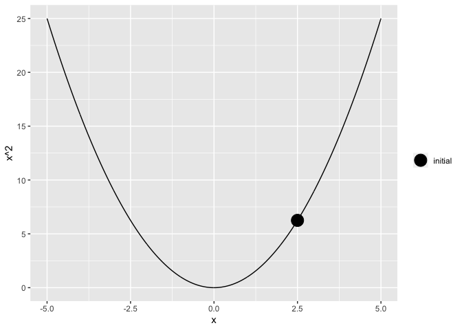
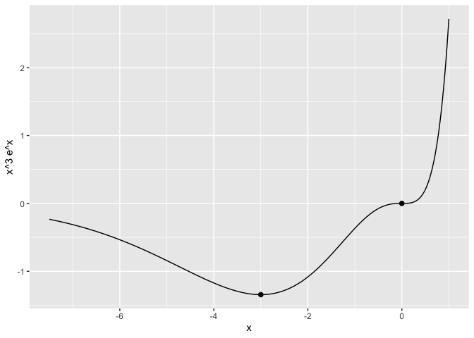

# What is Gradient Descent?

## Exposition
Imagine for a moment this very realistic scenario. You are a secret agent returning from a mission abroad retrieving some stolen hard drives containing many national secrets and one particularly good chili recipe that nobody remembered to save to the cloud. You are on your way to the airport in an UberPool (the government isn't made of money, you know) when all of a sudden your car takes a sudden left turn and the passenger next to you knocks you out. You awake on the side of a hill surrounding a valley. You get a brief glimpse of a truck at the bottom of the valley and people unloading what look like bags of tomatoes and onions; but then you are abruptly blindfolded and spun around, losing your sense of direction. How do you get to the bottom to retrieve the drives, beat the bad guys, and enjoy a well-earned hearty meal?


This is an optimization problem. In general, you have a function and you want to find the optimal value, which can be either a maximum or a minimum value. In our example, the function would be the mountain that you need to traverse to get there and the optimal point would be the bottom. This is the minimum value of the function.

Gradient descent is an algorithm to find optimal values of a function. It works by finding the direction of the gradient (the direction in which the function increases the most) at a given point and then taking a step in the opposite direction. This process is performed repeatedly until an optimal value is found. 

So, your goal is to find the minimum (bottom) of the function (mountain). After remembering reading this handy blog post, you decide to employ gradient descent to get you there. You step around and find the direction that is going the most _uphill_. Then you take a step in the opposite direction of that. Then you repeat until you have reached the bottom of the valley where you can complete your mission. 

## Formulating the Problem
Let's be a bit more mathematically rigorous. Call the function we are optimizing over $f(x)$ and the point that we started at $\theta_0$. At our next point $\theta_1$, we want to take a step away from the gradient of our original point $\theta_0$. 

$$
\theta_1 = \theta_0 - \alpha \nabla f(\theta_0)
$$

Here $\alpha$ is the step size. This is a positive multiplier that determines how much of the gradient will be used in updating $\theta$. The choice in step size can play a large role in finding your minimum; we will cover this more later. We then repeat this process and continue to update $\theta_k$. In general,

$$
\theta_{k+1} = \theta_k - \alpha \nabla f(\theta_i)
$$

We want to continue this process until we find the minimum point, $\theta^*$. We will know that we have found this point when our gradient vanishes, as there is no slope at a minimum.

$$
\nabla f(\theta^*) = 0
$$

A nice property of gradient descent is that once we find a minimum, our function will stay there. If $\theta_n = \theta^*$,

$$
\theta_{n+1} = \theta_n + \nabla f(\theta_n) = \theta_n + 0 = \theta_n =\theta^*.
$$

## Derivation
### Taylor's Theorem

Gradient Descent comes from Taylor's theorem. Let's approximate $\theta$ close to $\widetilde \theta$. Again, $\alpha$ will be our step size.

$$
f(\theta | \widetilde \theta) \approx f(\widetilde \theta) + \nabla f(\widetilde \theta)^T (\theta - \widetilde \theta) + \frac{ 1 }{ 2\alpha } \norm{\theta - \widetilde  \theta}^2
$$


Since we are looking for the $\theta$ that optimizes $f$, we will take the derivative of this with respect to $\theta$ and set it equal to 0.

\begin{align*}
	\frac{ d f }{  d\theta} & \approx 0 + \nabla f(\widetilde \theta)^T \theta + 0 + \frac{  1}{ 2 \alpha }\cdot 2 \cdot (  \theta - \widetilde \theta) \\ \\
	0 & = \nabla f(\widetilde \theta)^T \theta + \frac{  1}{ \alpha }  (  \theta - \widetilde \theta)
\end{align*}

$$
\theta= \widetilde \theta - \alpha \nabla f(\widetilde \theta)
$$

This is the same update rule that we formulated above.

### Step Size
#### Effect of Step Size
Let's look at the effect of choosing a step size with an example. We will use the familiar function $f(x) = x^2$ as our objective. Thus, its gradient is $\nabla f(x) = 2 x$. We will also choose a starting point, say $x = 2.5$. This gives $f(2.5) = 6.25$ as our starting value. Looking at the picture and through calculus, we know that the optimal point is at $x=0$ where $f(x)$ achieves its minimum value of 0.


```r
library(ggplot2)

# look at x in [-5, 5]
x = seq(-5,5,0.01)

# initial x value
x0 = 2.5

# square objective function
square = function(x)
{
 return(x^2)
}

# Data frame of x^2 function
fx = data.frame(x = x, xsq = square(x))

# Data frame of the initial point (x0, f(x0))
initial_point = data.frame( x = x0, xsq = square(x0))

plot = ggplot() +
 geom_line(data = fx, aes(x, xsq)) +
 geom_point(data = initial_point, aes(x, xsq, fill="initial"),
            size = 6) +
  scale_fill_manual(name = '', 
         values =c('initial'='#000000'), 
         labels = c('initial')) + 
 ylab('x^2') +
 xlab('x')

plot
```

<!-- -->

Now, let's try taking a gradient step with two different step sizes. Take $\alpha_1 = 1.03$ and $\alpha_2 = 0.1$. Let's work out what we would expect the next iterate to be with each step size.

\begin{align*}
	x_{1,1} & = x_0 - \alpha_1 \nabla f(x_0) \\
	 & = 2.5  - 1.03 \cdot 2 \cdot 2.5 \\
	 & = -2.65	\\
f(-2.65) & = 7.0225 \\ \\
 x_{1,2} & = x_0 - \alpha_2 \nabla f(x_0) \\
	 & = 2.5  - 0.1 \cdot 2 \cdot 2.5 \\
	 & = 2 \\
f(2) = 4
\end{align*}

We can repeat this process for 10 iterations and view the results.


```r
library(plotly)

# 2x is our gradient of x^2
gradient = function(x)
{
 return(2*x)
}

# Find new iterate via gradient descent
new_iterate = function(iterate, gradient_function, step_size)
{
 return( iterate - step_size * gradient_function(iterate) )
}

# Initialize step sizes
alpha1 = 1.03
alpha2 = 0.1

# Prepare data frames with initial observation
x1_data = x2_data = data.frame(x = x0, xsq = square(x0), nsteps = 0)

# Perform max_iter iterations of gradient descent
max_iter = 10
for(i in 1:max_iter)
{
 x1_update = new_iterate(tail(x1_data$x,1), gradient, alpha1)
 fx1_update = square(x1_update)
 x1_data = rbind(x1_data, c(x1_update, fx1_update, i))
 
 x2_update = new_iterate(tail(x2_data$x,1), gradient, alpha2)
 fx2_update = square(x2_update)
 x2_data = rbind(x2_data, c(x2_update, fx2_update, i))
}

plot = plot + 
  geom_point(data = x1_data, aes(x, xsq, frame=nsteps, fill="alpha = 1.03"), 
            size = 3) + 
 geom_point(data = x2_data, aes(x, xsq, frame = nsteps, fill="alpha = 0.10"),
            size = 3) +
 scale_fill_manual(name = '', 
         values =c('initial'='#0000FF',
                   'alpha = 1.03'='#FF0000',
                   'alpha = 0.10'='#00FFFF'), 
         labels = c('initial', 
                    'alpha = 1.03', 
                    'alpha = 0.10'))


fig = ggplotly(plot)  %>%
  animation_opts( frame = 2000, transition = 1000, redraw = FALSE ) 

fig
```

<!--html_preserve--><div id="htmlwidget-38522adbc6e4bc4242e8" style="width:672px;height:480px;" class="plotly html-widget"></div>
<script type="application/json" data-for="htmlwidget-38522adbc6e4bc4242e8">{"x":{"data":[{"x":[-5,-4.99,-4.98,-4.97,-4.96,-4.95,-4.94,-4.93,-4.92,-4.91,-4.9,-4.89,-4.88,-4.87,-4.86,-4.85,-4.84,-4.83,-4.82,-4.81,-4.8,-4.79,-4.78,-4.77,-4.76,-4.75,-4.74,-4.73,-4.72,-4.71,-4.7,-4.69,-4.68,-4.67,-4.66,-4.65,-4.64,-4.63,-4.62,-4.61,-4.6,-4.59,-4.58,-4.57,-4.56,-4.55,-4.54,-4.53,-4.52,-4.51,-4.5,-4.49,-4.48,-4.47,-4.46,-4.45,-4.44,-4.43,-4.42,-4.41,-4.4,-4.39,-4.38,-4.37,-4.36,-4.35,-4.34,-4.33,-4.32,-4.31,-4.3,-4.29,-4.28,-4.27,-4.26,-4.25,-4.24,-4.23,-4.22,-4.21,-4.2,-4.19,-4.18,-4.17,-4.16,-4.15,-4.14,-4.13,-4.12,-4.11,-4.1,-4.09,-4.08,-4.07,-4.06,-4.05,-4.04,-4.03,-4.02,-4.01,-4,-3.99,-3.98,-3.97,-3.96,-3.95,-3.94,-3.93,-3.92,-3.91,-3.9,-3.89,-3.88,-3.87,-3.86,-3.85,-3.84,-3.83,-3.82,-3.81,-3.8,-3.79,-3.78,-3.77,-3.76,-3.75,-3.74,-3.73,-3.72,-3.71,-3.7,-3.69,-3.68,-3.67,-3.66,-3.65,-3.64,-3.63,-3.62,-3.61,-3.6,-3.59,-3.58,-3.57,-3.56,-3.55,-3.54,-3.53,-3.52,-3.51,-3.5,-3.49,-3.48,-3.47,-3.46,-3.45,-3.44,-3.43,-3.42,-3.41,-3.4,-3.39,-3.38,-3.37,-3.36,-3.35,-3.34,-3.33,-3.32,-3.31,-3.3,-3.29,-3.28,-3.27,-3.26,-3.25,-3.24,-3.23,-3.22,-3.21,-3.2,-3.19,-3.18,-3.17,-3.16,-3.15,-3.14,-3.13,-3.12,-3.11,-3.1,-3.09,-3.08,-3.07,-3.06,-3.05,-3.04,-3.03,-3.02,-3.01,-3,-2.99,-2.98,-2.97,-2.96,-2.95,-2.94,-2.93,-2.92,-2.91,-2.9,-2.89,-2.88,-2.87,-2.86,-2.85,-2.84,-2.83,-2.82,-2.81,-2.8,-2.79,-2.78,-2.77,-2.76,-2.75,-2.74,-2.73,-2.72,-2.71,-2.7,-2.69,-2.68,-2.67,-2.66,-2.65,-2.64,-2.63,-2.62,-2.61,-2.6,-2.59,-2.58,-2.57,-2.56,-2.55,-2.54,-2.53,-2.52,-2.51,-2.5,-2.49,-2.48,-2.47,-2.46,-2.45,-2.44,-2.43,-2.42,-2.41,-2.4,-2.39,-2.38,-2.37,-2.36,-2.35,-2.34,-2.33,-2.32,-2.31,-2.3,-2.29,-2.28,-2.27,-2.26,-2.25,-2.24,-2.23,-2.22,-2.21,-2.2,-2.19,-2.18,-2.17,-2.16,-2.15,-2.14,-2.13,-2.12,-2.11,-2.1,-2.09,-2.08,-2.07,-2.06,-2.05,-2.04,-2.03,-2.02,-2.01,-2,-1.99,-1.98,-1.97,-1.96,-1.95,-1.94,-1.93,-1.92,-1.91,-1.9,-1.89,-1.88,-1.87,-1.86,-1.85,-1.84,-1.83,-1.82,-1.81,-1.8,-1.79,-1.78,-1.77,-1.76,-1.75,-1.74,-1.73,-1.72,-1.71,-1.7,-1.69,-1.68,-1.67,-1.66,-1.65,-1.64,-1.63,-1.62,-1.61,-1.6,-1.59,-1.58,-1.57,-1.56,-1.55,-1.54,-1.53,-1.52,-1.51,-1.5,-1.49,-1.48,-1.47,-1.46,-1.45,-1.44,-1.43,-1.42,-1.41,-1.4,-1.39,-1.38,-1.37,-1.36,-1.35,-1.34,-1.33,-1.32,-1.31,-1.3,-1.29,-1.28,-1.27,-1.26,-1.25,-1.24,-1.23,-1.22,-1.21,-1.2,-1.19,-1.18,-1.17,-1.16,-1.15,-1.14,-1.13,-1.12,-1.11,-1.1,-1.09,-1.08,-1.07,-1.06,-1.05,-1.04,-1.03,-1.02,-1.01,-1,-0.99,-0.98,-0.97,-0.96,-0.95,-0.94,-0.93,-0.92,-0.91,-0.9,-0.89,-0.88,-0.87,-0.86,-0.85,-0.84,-0.83,-0.82,-0.81,-0.8,-0.79,-0.78,-0.77,-0.76,-0.75,-0.74,-0.73,-0.72,-0.71,-0.7,-0.69,-0.68,-0.67,-0.66,-0.649999999999999,-0.64,-0.63,-0.62,-0.61,-0.6,-0.59,-0.58,-0.57,-0.56,-0.55,-0.54,-0.53,-0.52,-0.51,-0.5,-0.49,-0.48,-0.47,-0.46,-0.45,-0.44,-0.43,-0.42,-0.41,-0.399999999999999,-0.39,-0.38,-0.37,-0.36,-0.35,-0.34,-0.33,-0.32,-0.31,-0.3,-0.29,-0.28,-0.27,-0.26,-0.25,-0.24,-0.23,-0.22,-0.21,-0.2,-0.19,-0.18,-0.17,-0.16,-0.149999999999999,-0.14,-0.13,-0.12,-0.11,-0.0999999999999996,-0.0899999999999999,-0.0800000000000001,-0.0700000000000003,-0.0599999999999996,-0.0499999999999998,-0.04,-0.0300000000000002,-0.0199999999999996,-0.00999999999999979,0,0.00999999999999979,0.0200000000000005,0.0300000000000002,0.04,0.0499999999999998,0.0600000000000005,0.0700000000000003,0.0800000000000001,0.0899999999999999,0.100000000000001,0.11,0.12,0.13,0.14,0.15,0.16,0.17,0.18,0.19,0.2,0.21,0.22,0.23,0.24,0.25,0.26,0.27,0.28,0.29,0.3,0.31,0.32,0.33,0.34,0.350000000000001,0.36,0.37,0.38,0.39,0.4,0.41,0.42,0.43,0.44,0.45,0.46,0.47,0.48,0.49,0.5,0.51,0.52,0.53,0.54,0.55,0.56,0.57,0.58,0.59,0.600000000000001,0.61,0.62,0.63,0.64,0.65,0.66,0.67,0.68,0.69,0.7,0.71,0.72,0.73,0.74,0.75,0.76,0.77,0.78,0.79,0.8,0.81,0.82,0.83,0.84,0.850000000000001,0.86,0.87,0.88,0.89,0.9,0.91,0.92,0.93,0.94,0.95,0.96,0.97,0.98,0.99,1,1.01,1.02,1.03,1.04,1.05,1.06,1.07,1.08,1.09,1.1,1.11,1.12,1.13,1.14,1.15,1.16,1.17,1.18,1.19,1.2,1.21,1.22,1.23,1.24,1.25,1.26,1.27,1.28,1.29,1.3,1.31,1.32,1.33,1.34,1.35,1.36,1.37,1.38,1.39,1.4,1.41,1.42,1.43,1.44,1.45,1.46,1.47,1.48,1.49,1.5,1.51,1.52,1.53,1.54,1.55,1.56,1.57,1.58,1.59,1.6,1.61,1.62,1.63,1.64,1.65,1.66,1.67,1.68,1.69,1.7,1.71,1.72,1.73,1.74,1.75,1.76,1.77,1.78,1.79,1.8,1.81,1.82,1.83,1.84,1.85,1.86,1.87,1.88,1.89,1.9,1.91,1.92,1.93,1.94,1.95,1.96,1.97,1.98,1.99,2,2.01,2.02,2.03,2.04,2.05,2.06,2.07,2.08,2.09,2.1,2.11,2.12,2.13,2.14,2.15,2.16,2.17,2.18,2.19,2.2,2.21,2.22,2.23,2.24,2.25,2.26,2.27,2.28,2.29,2.3,2.31,2.32,2.33,2.34,2.35,2.36,2.37,2.38,2.39,2.4,2.41,2.42,2.43,2.44,2.45,2.46,2.47,2.48,2.49,2.5,2.51,2.52,2.53,2.54,2.55,2.56,2.57,2.58,2.59,2.6,2.61,2.62,2.63,2.64,2.65,2.66,2.67,2.68,2.69,2.7,2.71,2.72,2.73,2.74,2.75,2.76,2.77,2.78,2.79,2.8,2.81,2.82,2.83,2.84,2.85,2.86,2.87,2.88,2.89,2.9,2.91,2.92,2.93,2.94,2.95,2.96,2.97,2.98,2.99,3,3.01,3.02,3.03,3.04,3.05,3.06,3.07,3.08,3.09,3.1,3.11,3.12,3.13,3.14,3.15,3.16,3.17,3.18,3.19,3.2,3.21,3.22,3.23,3.24,3.25,3.26,3.27,3.28,3.29,3.3,3.31,3.32,3.33,3.34,3.35,3.36,3.37,3.38,3.39,3.4,3.41,3.42,3.43,3.44,3.45,3.46,3.47,3.48,3.49,3.5,3.51,3.52,3.53,3.54,3.55,3.56,3.57,3.58,3.59,3.6,3.61,3.62,3.63,3.64,3.65,3.66,3.67,3.68,3.69,3.7,3.71,3.72,3.73,3.74,3.75,3.76,3.77,3.78,3.79,3.8,3.81,3.82,3.83,3.84,3.85,3.86,3.87,3.88,3.89,3.9,3.91,3.92,3.93,3.94,3.95,3.96,3.97,3.98,3.99,4,4.01,4.02,4.03,4.04,4.05,4.06,4.07,4.08,4.09,4.1,4.11,4.12,4.13,4.14,4.15,4.16,4.17,4.18,4.19,4.2,4.21,4.22,4.23,4.24,4.25,4.26,4.27,4.28,4.29,4.3,4.31,4.32,4.33,4.34,4.35,4.36,4.37,4.38,4.39,4.4,4.41,4.42,4.43,4.44,4.45,4.46,4.47,4.48,4.49,4.5,4.51,4.52,4.53,4.54,4.55,4.56,4.57,4.58,4.59,4.6,4.61,4.62,4.63,4.64,4.65,4.66,4.67,4.68,4.69,4.7,4.71,4.72,4.73,4.74,4.75,4.76,4.77,4.78,4.79,4.8,4.81,4.82,4.83,4.84,4.85,4.86,4.87,4.88,4.89,4.9,4.91,4.92,4.93,4.94,4.95,4.96,4.97,4.98,4.99,5],"y":[25,24.9001,24.8004,24.7009,24.6016,24.5025,24.4036,24.3049,24.2064,24.1081,24.01,23.9121,23.8144,23.7169,23.6196,23.5225,23.4256,23.3289,23.2324,23.1361,23.04,22.9441,22.8484,22.7529,22.6576,22.5625,22.4676,22.3729,22.2784,22.1841,22.09,21.9961,21.9024,21.8089,21.7156,21.6225,21.5296,21.4369,21.3444,21.2521,21.16,21.0681,20.9764,20.8849,20.7936,20.7025,20.6116,20.5209,20.4304,20.3401,20.25,20.1601,20.0704,19.9809,19.8916,19.8025,19.7136,19.6249,19.5364,19.4481,19.36,19.2721,19.1844,19.0969,19.0096,18.9225,18.8356,18.7489,18.6624,18.5761,18.49,18.4041,18.3184,18.2329,18.1476,18.0625,17.9776,17.8929,17.8084,17.7241,17.64,17.5561,17.4724,17.3889,17.3056,17.2225,17.1396,17.0569,16.9744,16.8921,16.81,16.7281,16.6464,16.5649,16.4836,16.4025,16.3216,16.2409,16.1604,16.0801,16,15.9201,15.8404,15.7609,15.6816,15.6025,15.5236,15.4449,15.3664,15.2881,15.21,15.1321,15.0544,14.9769,14.8996,14.8225,14.7456,14.6689,14.5924,14.5161,14.44,14.3641,14.2884,14.2129,14.1376,14.0625,13.9876,13.9129,13.8384,13.7641,13.69,13.6161,13.5424,13.4689,13.3956,13.3225,13.2496,13.1769,13.1044,13.0321,12.96,12.8881,12.8164,12.7449,12.6736,12.6025,12.5316,12.4609,12.3904,12.3201,12.25,12.1801,12.1104,12.0409,11.9716,11.9025,11.8336,11.7649,11.6964,11.6281,11.56,11.4921,11.4244,11.3569,11.2896,11.2225,11.1556,11.0889,11.0224,10.9561,10.89,10.8241,10.7584,10.6929,10.6276,10.5625,10.4976,10.4329,10.3684,10.3041,10.24,10.1761,10.1124,10.0489,9.9856,9.9225,9.8596,9.7969,9.7344,9.6721,9.61,9.5481,9.4864,9.4249,9.3636,9.3025,9.2416,9.1809,9.1204,9.0601,9,8.9401,8.8804,8.8209,8.7616,8.7025,8.6436,8.5849,8.5264,8.4681,8.41,8.3521,8.2944,8.2369,8.1796,8.1225,8.0656,8.0089,7.9524,7.8961,7.84,7.7841,7.7284,7.6729,7.6176,7.5625,7.5076,7.4529,7.3984,7.3441,7.29,7.2361,7.1824,7.1289,7.0756,7.0225,6.9696,6.9169,6.8644,6.8121,6.76,6.7081,6.6564,6.6049,6.5536,6.5025,6.4516,6.4009,6.3504,6.3001,6.25,6.2001,6.1504,6.1009,6.0516,6.0025,5.9536,5.9049,5.8564,5.8081,5.76,5.7121,5.6644,5.6169,5.5696,5.5225,5.4756,5.4289,5.3824,5.3361,5.29,5.2441,5.1984,5.1529,5.1076,5.0625,5.0176,4.9729,4.9284,4.8841,4.84,4.7961,4.7524,4.7089,4.6656,4.6225,4.5796,4.5369,4.4944,4.4521,4.41,4.3681,4.3264,4.2849,4.2436,4.2025,4.1616,4.1209,4.0804,4.0401,4,3.9601,3.9204,3.8809,3.8416,3.8025,3.7636,3.7249,3.6864,3.6481,3.61,3.5721,3.5344,3.4969,3.4596,3.4225,3.3856,3.3489,3.3124,3.2761,3.24,3.2041,3.1684,3.1329,3.0976,3.0625,3.0276,2.9929,2.9584,2.9241,2.89,2.8561,2.8224,2.7889,2.7556,2.7225,2.6896,2.6569,2.6244,2.5921,2.56,2.5281,2.4964,2.4649,2.4336,2.4025,2.3716,2.3409,2.3104,2.2801,2.25,2.2201,2.1904,2.1609,2.1316,2.1025,2.0736,2.0449,2.0164,1.9881,1.96,1.9321,1.9044,1.8769,1.8496,1.8225,1.7956,1.7689,1.7424,1.7161,1.69,1.6641,1.6384,1.6129,1.5876,1.5625,1.5376,1.5129,1.4884,1.4641,1.44,1.4161,1.3924,1.3689,1.3456,1.3225,1.2996,1.2769,1.2544,1.2321,1.21,1.1881,1.1664,1.1449,1.1236,1.1025,1.0816,1.0609,1.0404,1.0201,1,0.9801,0.960399999999999,0.9409,0.9216,0.9025,0.883599999999999,0.864899999999999,0.8464,0.8281,0.810000000000001,0.792099999999999,0.7744,0.7569,0.739600000000001,0.722499999999999,0.7056,0.6889,0.6724,0.656099999999999,0.64,0.6241,0.6084,0.592899999999999,0.5776,0.5625,0.5476,0.532899999999999,0.5184,0.5041,0.49,0.476099999999999,0.4624,0.4489,0.4356,0.422499999999999,0.4096,0.3969,0.3844,0.3721,0.36,0.3481,0.3364,0.3249,0.3136,0.3025,0.2916,0.2809,0.2704,0.2601,0.25,0.2401,0.2304,0.2209,0.2116,0.2025,0.1936,0.1849,0.1764,0.1681,0.16,0.1521,0.1444,0.1369,0.1296,0.1225,0.1156,0.1089,0.1024,0.0960999999999998,0.0899999999999999,0.0841,0.0784000000000001,0.0728999999999998,0.0675999999999999,0.0625,0.0576000000000001,0.0528999999999998,0.0483999999999999,0.0441,0.0400000000000001,0.0360999999999998,0.0323999999999999,0.0289,0.0256,0.0224999999999998,0.0195999999999999,0.0169,0.0144,0.0121000000000001,0.00999999999999993,0.00809999999999998,0.00640000000000001,0.00490000000000004,0.00359999999999995,0.00249999999999998,0.0016,0.000900000000000015,0.000399999999999983,9.99999999999957e-05,0,9.99999999999957e-05,0.000400000000000018,0.000900000000000015,0.0016,0.00249999999999998,0.00360000000000006,0.00490000000000004,0.00640000000000001,0.00809999999999998,0.0100000000000001,0.0121000000000001,0.0144,0.0169,0.0195999999999999,0.0225000000000001,0.0256,0.0289,0.0323999999999999,0.0361000000000001,0.0400000000000001,0.0441,0.0483999999999999,0.0529000000000002,0.0576000000000001,0.0625,0.0675999999999999,0.0729000000000003,0.0784000000000001,0.0841,0.0899999999999999,0.0961000000000003,0.1024,0.1089,0.1156,0.1225,0.1296,0.1369,0.1444,0.1521,0.16,0.1681,0.1764,0.1849,0.1936,0.2025,0.2116,0.2209,0.2304,0.2401,0.25,0.2601,0.2704,0.2809,0.2916,0.3025,0.313600000000001,0.3249,0.3364,0.3481,0.360000000000001,0.3721,0.3844,0.3969,0.4096,0.4225,0.4356,0.4489,0.4624,0.476100000000001,0.49,0.5041,0.5184,0.532900000000001,0.5476,0.5625,0.5776,0.592900000000001,0.6084,0.6241,0.64,0.656100000000001,0.6724,0.6889,0.7056,0.722500000000001,0.739600000000001,0.7569,0.7744,0.792099999999999,0.810000000000001,0.8281,0.8464,0.864899999999999,0.883600000000001,0.9025,0.9216,0.9409,0.960400000000001,0.9801,1,1.0201,1.0404,1.0609,1.0816,1.1025,1.1236,1.1449,1.1664,1.1881,1.21,1.2321,1.2544,1.2769,1.2996,1.3225,1.3456,1.3689,1.3924,1.4161,1.44,1.4641,1.4884,1.5129,1.5376,1.5625,1.5876,1.6129,1.6384,1.6641,1.69,1.7161,1.7424,1.7689,1.7956,1.8225,1.8496,1.8769,1.9044,1.9321,1.96,1.9881,2.0164,2.0449,2.0736,2.1025,2.1316,2.1609,2.1904,2.2201,2.25,2.2801,2.3104,2.3409,2.3716,2.4025,2.4336,2.4649,2.4964,2.5281,2.56,2.5921,2.6244,2.6569,2.6896,2.7225,2.7556,2.7889,2.8224,2.8561,2.89,2.9241,2.9584,2.9929,3.0276,3.0625,3.0976,3.1329,3.1684,3.2041,3.24,3.2761,3.3124,3.3489,3.3856,3.4225,3.4596,3.4969,3.5344,3.5721,3.61,3.6481,3.6864,3.7249,3.7636,3.8025,3.8416,3.8809,3.9204,3.9601,4,4.0401,4.0804,4.1209,4.1616,4.2025,4.2436,4.2849,4.3264,4.3681,4.41,4.4521,4.4944,4.5369,4.5796,4.6225,4.6656,4.7089,4.7524,4.7961,4.84,4.8841,4.9284,4.9729,5.0176,5.0625,5.1076,5.1529,5.1984,5.2441,5.29,5.3361,5.3824,5.4289,5.4756,5.5225,5.5696,5.6169,5.6644,5.7121,5.76,5.8081,5.8564,5.9049,5.9536,6.0025,6.0516,6.1009,6.1504,6.2001,6.25,6.3001,6.3504,6.4009,6.4516,6.5025,6.5536,6.6049,6.6564,6.7081,6.76,6.8121,6.8644,6.9169,6.9696,7.0225,7.0756,7.1289,7.1824,7.2361,7.29,7.3441,7.3984,7.4529,7.5076,7.5625,7.6176,7.6729,7.7284,7.7841,7.84,7.8961,7.9524,8.0089,8.0656,8.1225,8.1796,8.2369,8.2944,8.3521,8.41,8.4681,8.5264,8.5849,8.6436,8.7025,8.7616,8.8209,8.8804,8.9401,9,9.0601,9.1204,9.1809,9.24160000000001,9.3025,9.3636,9.4249,9.4864,9.5481,9.61,9.6721,9.73440000000001,9.7969,9.8596,9.9225,9.9856,10.0489,10.1124,10.1761,10.24,10.3041,10.3684,10.4329,10.4976,10.5625,10.6276,10.6929,10.7584,10.8241,10.89,10.9561,11.0224,11.0889,11.1556,11.2225,11.2896,11.3569,11.4244,11.4921,11.56,11.6281,11.6964,11.7649,11.8336,11.9025,11.9716,12.0409,12.1104,12.1801,12.25,12.3201,12.3904,12.4609,12.5316,12.6025,12.6736,12.7449,12.8164,12.8881,12.96,13.0321,13.1044,13.1769,13.2496,13.3225,13.3956,13.4689,13.5424,13.6161,13.69,13.7641,13.8384,13.9129,13.9876,14.0625,14.1376,14.2129,14.2884,14.3641,14.44,14.5161,14.5924,14.6689,14.7456,14.8225,14.8996,14.9769,15.0544,15.1321,15.21,15.2881,15.3664,15.4449,15.5236,15.6025,15.6816,15.7609,15.8404,15.9201,16,16.0801,16.1604,16.2409,16.3216,16.4025,16.4836,16.5649,16.6464,16.7281,16.81,16.8921,16.9744,17.0569,17.1396,17.2225,17.3056,17.3889,17.4724,17.5561,17.64,17.7241,17.8084,17.8929,17.9776,18.0625,18.1476,18.2329,18.3184,18.4041,18.49,18.5761,18.6624,18.7489,18.8356,18.9225,19.0096,19.0969,19.1844,19.2721,19.36,19.4481,19.5364,19.6249,19.7136,19.8025,19.8916,19.9809,20.0704,20.1601,20.25,20.3401,20.4304,20.5209,20.6116,20.7025,20.7936,20.8849,20.9764,21.0681,21.16,21.2521,21.3444,21.4369,21.5296,21.6225,21.7156,21.8089,21.9024,21.9961,22.09,22.1841,22.2784,22.3729,22.4676,22.5625,22.6576,22.7529,22.8484,22.9441,23.04,23.1361,23.2324,23.3289,23.4256,23.5225,23.6196,23.7169,23.8144,23.9121,24.01,24.1081,24.2064,24.3049,24.4036,24.5025,24.6016,24.7009,24.8004,24.9001,25],"text":["x: -5.00<br />xsq: 25.0000","x: -4.99<br />xsq: 24.9001","x: -4.98<br />xsq: 24.8004","x: -4.97<br />xsq: 24.7009","x: -4.96<br />xsq: 24.6016","x: -4.95<br />xsq: 24.5025","x: -4.94<br />xsq: 24.4036","x: -4.93<br />xsq: 24.3049","x: -4.92<br />xsq: 24.2064","x: -4.91<br />xsq: 24.1081","x: -4.90<br />xsq: 24.0100","x: -4.89<br />xsq: 23.9121","x: -4.88<br />xsq: 23.8144","x: -4.87<br />xsq: 23.7169","x: -4.86<br />xsq: 23.6196","x: -4.85<br />xsq: 23.5225","x: -4.84<br />xsq: 23.4256","x: -4.83<br />xsq: 23.3289","x: -4.82<br />xsq: 23.2324","x: -4.81<br />xsq: 23.1361","x: -4.80<br />xsq: 23.0400","x: -4.79<br />xsq: 22.9441","x: -4.78<br />xsq: 22.8484","x: -4.77<br />xsq: 22.7529","x: -4.76<br />xsq: 22.6576","x: -4.75<br />xsq: 22.5625","x: -4.74<br />xsq: 22.4676","x: -4.73<br />xsq: 22.3729","x: -4.72<br />xsq: 22.2784","x: -4.71<br />xsq: 22.1841","x: -4.70<br />xsq: 22.0900","x: -4.69<br />xsq: 21.9961","x: -4.68<br />xsq: 21.9024","x: -4.67<br />xsq: 21.8089","x: -4.66<br />xsq: 21.7156","x: -4.65<br />xsq: 21.6225","x: -4.64<br />xsq: 21.5296","x: -4.63<br />xsq: 21.4369","x: -4.62<br />xsq: 21.3444","x: -4.61<br />xsq: 21.2521","x: -4.60<br />xsq: 21.1600","x: -4.59<br />xsq: 21.0681","x: -4.58<br />xsq: 20.9764","x: -4.57<br />xsq: 20.8849","x: -4.56<br />xsq: 20.7936","x: -4.55<br />xsq: 20.7025","x: -4.54<br />xsq: 20.6116","x: -4.53<br />xsq: 20.5209","x: -4.52<br />xsq: 20.4304","x: -4.51<br />xsq: 20.3401","x: -4.50<br />xsq: 20.2500","x: -4.49<br />xsq: 20.1601","x: -4.48<br />xsq: 20.0704","x: -4.47<br />xsq: 19.9809","x: -4.46<br />xsq: 19.8916","x: -4.45<br />xsq: 19.8025","x: -4.44<br />xsq: 19.7136","x: -4.43<br />xsq: 19.6249","x: -4.42<br />xsq: 19.5364","x: -4.41<br />xsq: 19.4481","x: -4.40<br />xsq: 19.3600","x: -4.39<br />xsq: 19.2721","x: -4.38<br />xsq: 19.1844","x: -4.37<br />xsq: 19.0969","x: -4.36<br />xsq: 19.0096","x: -4.35<br />xsq: 18.9225","x: -4.34<br />xsq: 18.8356","x: -4.33<br />xsq: 18.7489","x: -4.32<br />xsq: 18.6624","x: -4.31<br />xsq: 18.5761","x: -4.30<br />xsq: 18.4900","x: -4.29<br />xsq: 18.4041","x: -4.28<br />xsq: 18.3184","x: -4.27<br />xsq: 18.2329","x: -4.26<br />xsq: 18.1476","x: -4.25<br />xsq: 18.0625","x: -4.24<br />xsq: 17.9776","x: -4.23<br />xsq: 17.8929","x: -4.22<br />xsq: 17.8084","x: -4.21<br />xsq: 17.7241","x: -4.20<br />xsq: 17.6400","x: -4.19<br />xsq: 17.5561","x: -4.18<br />xsq: 17.4724","x: -4.17<br />xsq: 17.3889","x: -4.16<br />xsq: 17.3056","x: -4.15<br />xsq: 17.2225","x: -4.14<br />xsq: 17.1396","x: -4.13<br />xsq: 17.0569","x: -4.12<br />xsq: 16.9744","x: -4.11<br />xsq: 16.8921","x: -4.10<br />xsq: 16.8100","x: -4.09<br />xsq: 16.7281","x: -4.08<br />xsq: 16.6464","x: -4.07<br />xsq: 16.5649","x: -4.06<br />xsq: 16.4836","x: -4.05<br />xsq: 16.4025","x: -4.04<br />xsq: 16.3216","x: -4.03<br />xsq: 16.2409","x: -4.02<br />xsq: 16.1604","x: -4.01<br />xsq: 16.0801","x: -4.00<br />xsq: 16.0000","x: -3.99<br />xsq: 15.9201","x: -3.98<br />xsq: 15.8404","x: -3.97<br />xsq: 15.7609","x: -3.96<br />xsq: 15.6816","x: -3.95<br />xsq: 15.6025","x: -3.94<br />xsq: 15.5236","x: -3.93<br />xsq: 15.4449","x: -3.92<br />xsq: 15.3664","x: -3.91<br />xsq: 15.2881","x: -3.90<br />xsq: 15.2100","x: -3.89<br />xsq: 15.1321","x: -3.88<br />xsq: 15.0544","x: -3.87<br />xsq: 14.9769","x: -3.86<br />xsq: 14.8996","x: -3.85<br />xsq: 14.8225","x: -3.84<br />xsq: 14.7456","x: -3.83<br />xsq: 14.6689","x: -3.82<br />xsq: 14.5924","x: -3.81<br />xsq: 14.5161","x: -3.80<br />xsq: 14.4400","x: -3.79<br />xsq: 14.3641","x: -3.78<br />xsq: 14.2884","x: -3.77<br />xsq: 14.2129","x: -3.76<br />xsq: 14.1376","x: -3.75<br />xsq: 14.0625","x: -3.74<br />xsq: 13.9876","x: -3.73<br />xsq: 13.9129","x: -3.72<br />xsq: 13.8384","x: -3.71<br />xsq: 13.7641","x: -3.70<br />xsq: 13.6900","x: -3.69<br />xsq: 13.6161","x: -3.68<br />xsq: 13.5424","x: -3.67<br />xsq: 13.4689","x: -3.66<br />xsq: 13.3956","x: -3.65<br />xsq: 13.3225","x: -3.64<br />xsq: 13.2496","x: -3.63<br />xsq: 13.1769","x: -3.62<br />xsq: 13.1044","x: -3.61<br />xsq: 13.0321","x: -3.60<br />xsq: 12.9600","x: -3.59<br />xsq: 12.8881","x: -3.58<br />xsq: 12.8164","x: -3.57<br />xsq: 12.7449","x: -3.56<br />xsq: 12.6736","x: -3.55<br />xsq: 12.6025","x: -3.54<br />xsq: 12.5316","x: -3.53<br />xsq: 12.4609","x: -3.52<br />xsq: 12.3904","x: -3.51<br />xsq: 12.3201","x: -3.50<br />xsq: 12.2500","x: -3.49<br />xsq: 12.1801","x: -3.48<br />xsq: 12.1104","x: -3.47<br />xsq: 12.0409","x: -3.46<br />xsq: 11.9716","x: -3.45<br />xsq: 11.9025","x: -3.44<br />xsq: 11.8336","x: -3.43<br />xsq: 11.7649","x: -3.42<br />xsq: 11.6964","x: -3.41<br />xsq: 11.6281","x: -3.40<br />xsq: 11.5600","x: -3.39<br />xsq: 11.4921","x: -3.38<br />xsq: 11.4244","x: -3.37<br />xsq: 11.3569","x: -3.36<br />xsq: 11.2896","x: -3.35<br />xsq: 11.2225","x: -3.34<br />xsq: 11.1556","x: -3.33<br />xsq: 11.0889","x: -3.32<br />xsq: 11.0224","x: -3.31<br />xsq: 10.9561","x: -3.30<br />xsq: 10.8900","x: -3.29<br />xsq: 10.8241","x: -3.28<br />xsq: 10.7584","x: -3.27<br />xsq: 10.6929","x: -3.26<br />xsq: 10.6276","x: -3.25<br />xsq: 10.5625","x: -3.24<br />xsq: 10.4976","x: -3.23<br />xsq: 10.4329","x: -3.22<br />xsq: 10.3684","x: -3.21<br />xsq: 10.3041","x: -3.20<br />xsq: 10.2400","x: -3.19<br />xsq: 10.1761","x: -3.18<br />xsq: 10.1124","x: -3.17<br />xsq: 10.0489","x: -3.16<br />xsq:  9.9856","x: -3.15<br />xsq:  9.9225","x: -3.14<br />xsq:  9.8596","x: -3.13<br />xsq:  9.7969","x: -3.12<br />xsq:  9.7344","x: -3.11<br />xsq:  9.6721","x: -3.10<br />xsq:  9.6100","x: -3.09<br />xsq:  9.5481","x: -3.08<br />xsq:  9.4864","x: -3.07<br />xsq:  9.4249","x: -3.06<br />xsq:  9.3636","x: -3.05<br />xsq:  9.3025","x: -3.04<br />xsq:  9.2416","x: -3.03<br />xsq:  9.1809","x: -3.02<br />xsq:  9.1204","x: -3.01<br />xsq:  9.0601","x: -3.00<br />xsq:  9.0000","x: -2.99<br />xsq:  8.9401","x: -2.98<br />xsq:  8.8804","x: -2.97<br />xsq:  8.8209","x: -2.96<br />xsq:  8.7616","x: -2.95<br />xsq:  8.7025","x: -2.94<br />xsq:  8.6436","x: -2.93<br />xsq:  8.5849","x: -2.92<br />xsq:  8.5264","x: -2.91<br />xsq:  8.4681","x: -2.90<br />xsq:  8.4100","x: -2.89<br />xsq:  8.3521","x: -2.88<br />xsq:  8.2944","x: -2.87<br />xsq:  8.2369","x: -2.86<br />xsq:  8.1796","x: -2.85<br />xsq:  8.1225","x: -2.84<br />xsq:  8.0656","x: -2.83<br />xsq:  8.0089","x: -2.82<br />xsq:  7.9524","x: -2.81<br />xsq:  7.8961","x: -2.80<br />xsq:  7.8400","x: -2.79<br />xsq:  7.7841","x: -2.78<br />xsq:  7.7284","x: -2.77<br />xsq:  7.6729","x: -2.76<br />xsq:  7.6176","x: -2.75<br />xsq:  7.5625","x: -2.74<br />xsq:  7.5076","x: -2.73<br />xsq:  7.4529","x: -2.72<br />xsq:  7.3984","x: -2.71<br />xsq:  7.3441","x: -2.70<br />xsq:  7.2900","x: -2.69<br />xsq:  7.2361","x: -2.68<br />xsq:  7.1824","x: -2.67<br />xsq:  7.1289","x: -2.66<br />xsq:  7.0756","x: -2.65<br />xsq:  7.0225","x: -2.64<br />xsq:  6.9696","x: -2.63<br />xsq:  6.9169","x: -2.62<br />xsq:  6.8644","x: -2.61<br />xsq:  6.8121","x: -2.60<br />xsq:  6.7600","x: -2.59<br />xsq:  6.7081","x: -2.58<br />xsq:  6.6564","x: -2.57<br />xsq:  6.6049","x: -2.56<br />xsq:  6.5536","x: -2.55<br />xsq:  6.5025","x: -2.54<br />xsq:  6.4516","x: -2.53<br />xsq:  6.4009","x: -2.52<br />xsq:  6.3504","x: -2.51<br />xsq:  6.3001","x: -2.50<br />xsq:  6.2500","x: -2.49<br />xsq:  6.2001","x: -2.48<br />xsq:  6.1504","x: -2.47<br />xsq:  6.1009","x: -2.46<br />xsq:  6.0516","x: -2.45<br />xsq:  6.0025","x: -2.44<br />xsq:  5.9536","x: -2.43<br />xsq:  5.9049","x: -2.42<br />xsq:  5.8564","x: -2.41<br />xsq:  5.8081","x: -2.40<br />xsq:  5.7600","x: -2.39<br />xsq:  5.7121","x: -2.38<br />xsq:  5.6644","x: -2.37<br />xsq:  5.6169","x: -2.36<br />xsq:  5.5696","x: -2.35<br />xsq:  5.5225","x: -2.34<br />xsq:  5.4756","x: -2.33<br />xsq:  5.4289","x: -2.32<br />xsq:  5.3824","x: -2.31<br />xsq:  5.3361","x: -2.30<br />xsq:  5.2900","x: -2.29<br />xsq:  5.2441","x: -2.28<br />xsq:  5.1984","x: -2.27<br />xsq:  5.1529","x: -2.26<br />xsq:  5.1076","x: -2.25<br />xsq:  5.0625","x: -2.24<br />xsq:  5.0176","x: -2.23<br />xsq:  4.9729","x: -2.22<br />xsq:  4.9284","x: -2.21<br />xsq:  4.8841","x: -2.20<br />xsq:  4.8400","x: -2.19<br />xsq:  4.7961","x: -2.18<br />xsq:  4.7524","x: -2.17<br />xsq:  4.7089","x: -2.16<br />xsq:  4.6656","x: -2.15<br />xsq:  4.6225","x: -2.14<br />xsq:  4.5796","x: -2.13<br />xsq:  4.5369","x: -2.12<br />xsq:  4.4944","x: -2.11<br />xsq:  4.4521","x: -2.10<br />xsq:  4.4100","x: -2.09<br />xsq:  4.3681","x: -2.08<br />xsq:  4.3264","x: -2.07<br />xsq:  4.2849","x: -2.06<br />xsq:  4.2436","x: -2.05<br />xsq:  4.2025","x: -2.04<br />xsq:  4.1616","x: -2.03<br />xsq:  4.1209","x: -2.02<br />xsq:  4.0804","x: -2.01<br />xsq:  4.0401","x: -2.00<br />xsq:  4.0000","x: -1.99<br />xsq:  3.9601","x: -1.98<br />xsq:  3.9204","x: -1.97<br />xsq:  3.8809","x: -1.96<br />xsq:  3.8416","x: -1.95<br />xsq:  3.8025","x: -1.94<br />xsq:  3.7636","x: -1.93<br />xsq:  3.7249","x: -1.92<br />xsq:  3.6864","x: -1.91<br />xsq:  3.6481","x: -1.90<br />xsq:  3.6100","x: -1.89<br />xsq:  3.5721","x: -1.88<br />xsq:  3.5344","x: -1.87<br />xsq:  3.4969","x: -1.86<br />xsq:  3.4596","x: -1.85<br />xsq:  3.4225","x: -1.84<br />xsq:  3.3856","x: -1.83<br />xsq:  3.3489","x: -1.82<br />xsq:  3.3124","x: -1.81<br />xsq:  3.2761","x: -1.80<br />xsq:  3.2400","x: -1.79<br />xsq:  3.2041","x: -1.78<br />xsq:  3.1684","x: -1.77<br />xsq:  3.1329","x: -1.76<br />xsq:  3.0976","x: -1.75<br />xsq:  3.0625","x: -1.74<br />xsq:  3.0276","x: -1.73<br />xsq:  2.9929","x: -1.72<br />xsq:  2.9584","x: -1.71<br />xsq:  2.9241","x: -1.70<br />xsq:  2.8900","x: -1.69<br />xsq:  2.8561","x: -1.68<br />xsq:  2.8224","x: -1.67<br />xsq:  2.7889","x: -1.66<br />xsq:  2.7556","x: -1.65<br />xsq:  2.7225","x: -1.64<br />xsq:  2.6896","x: -1.63<br />xsq:  2.6569","x: -1.62<br />xsq:  2.6244","x: -1.61<br />xsq:  2.5921","x: -1.60<br />xsq:  2.5600","x: -1.59<br />xsq:  2.5281","x: -1.58<br />xsq:  2.4964","x: -1.57<br />xsq:  2.4649","x: -1.56<br />xsq:  2.4336","x: -1.55<br />xsq:  2.4025","x: -1.54<br />xsq:  2.3716","x: -1.53<br />xsq:  2.3409","x: -1.52<br />xsq:  2.3104","x: -1.51<br />xsq:  2.2801","x: -1.50<br />xsq:  2.2500","x: -1.49<br />xsq:  2.2201","x: -1.48<br />xsq:  2.1904","x: -1.47<br />xsq:  2.1609","x: -1.46<br />xsq:  2.1316","x: -1.45<br />xsq:  2.1025","x: -1.44<br />xsq:  2.0736","x: -1.43<br />xsq:  2.0449","x: -1.42<br />xsq:  2.0164","x: -1.41<br />xsq:  1.9881","x: -1.40<br />xsq:  1.9600","x: -1.39<br />xsq:  1.9321","x: -1.38<br />xsq:  1.9044","x: -1.37<br />xsq:  1.8769","x: -1.36<br />xsq:  1.8496","x: -1.35<br />xsq:  1.8225","x: -1.34<br />xsq:  1.7956","x: -1.33<br />xsq:  1.7689","x: -1.32<br />xsq:  1.7424","x: -1.31<br />xsq:  1.7161","x: -1.30<br />xsq:  1.6900","x: -1.29<br />xsq:  1.6641","x: -1.28<br />xsq:  1.6384","x: -1.27<br />xsq:  1.6129","x: -1.26<br />xsq:  1.5876","x: -1.25<br />xsq:  1.5625","x: -1.24<br />xsq:  1.5376","x: -1.23<br />xsq:  1.5129","x: -1.22<br />xsq:  1.4884","x: -1.21<br />xsq:  1.4641","x: -1.20<br />xsq:  1.4400","x: -1.19<br />xsq:  1.4161","x: -1.18<br />xsq:  1.3924","x: -1.17<br />xsq:  1.3689","x: -1.16<br />xsq:  1.3456","x: -1.15<br />xsq:  1.3225","x: -1.14<br />xsq:  1.2996","x: -1.13<br />xsq:  1.2769","x: -1.12<br />xsq:  1.2544","x: -1.11<br />xsq:  1.2321","x: -1.10<br />xsq:  1.2100","x: -1.09<br />xsq:  1.1881","x: -1.08<br />xsq:  1.1664","x: -1.07<br />xsq:  1.1449","x: -1.06<br />xsq:  1.1236","x: -1.05<br />xsq:  1.1025","x: -1.04<br />xsq:  1.0816","x: -1.03<br />xsq:  1.0609","x: -1.02<br />xsq:  1.0404","x: -1.01<br />xsq:  1.0201","x: -1.00<br />xsq:  1.0000","x: -0.99<br />xsq:  0.9801","x: -0.98<br />xsq:  0.9604","x: -0.97<br />xsq:  0.9409","x: -0.96<br />xsq:  0.9216","x: -0.95<br />xsq:  0.9025","x: -0.94<br />xsq:  0.8836","x: -0.93<br />xsq:  0.8649","x: -0.92<br />xsq:  0.8464","x: -0.91<br />xsq:  0.8281","x: -0.90<br />xsq:  0.8100","x: -0.89<br />xsq:  0.7921","x: -0.88<br />xsq:  0.7744","x: -0.87<br />xsq:  0.7569","x: -0.86<br />xsq:  0.7396","x: -0.85<br />xsq:  0.7225","x: -0.84<br />xsq:  0.7056","x: -0.83<br />xsq:  0.6889","x: -0.82<br />xsq:  0.6724","x: -0.81<br />xsq:  0.6561","x: -0.80<br />xsq:  0.6400","x: -0.79<br />xsq:  0.6241","x: -0.78<br />xsq:  0.6084","x: -0.77<br />xsq:  0.5929","x: -0.76<br />xsq:  0.5776","x: -0.75<br />xsq:  0.5625","x: -0.74<br />xsq:  0.5476","x: -0.73<br />xsq:  0.5329","x: -0.72<br />xsq:  0.5184","x: -0.71<br />xsq:  0.5041","x: -0.70<br />xsq:  0.4900","x: -0.69<br />xsq:  0.4761","x: -0.68<br />xsq:  0.4624","x: -0.67<br />xsq:  0.4489","x: -0.66<br />xsq:  0.4356","x: -0.65<br />xsq:  0.4225","x: -0.64<br />xsq:  0.4096","x: -0.63<br />xsq:  0.3969","x: -0.62<br />xsq:  0.3844","x: -0.61<br />xsq:  0.3721","x: -0.60<br />xsq:  0.3600","x: -0.59<br />xsq:  0.3481","x: -0.58<br />xsq:  0.3364","x: -0.57<br />xsq:  0.3249","x: -0.56<br />xsq:  0.3136","x: -0.55<br />xsq:  0.3025","x: -0.54<br />xsq:  0.2916","x: -0.53<br />xsq:  0.2809","x: -0.52<br />xsq:  0.2704","x: -0.51<br />xsq:  0.2601","x: -0.50<br />xsq:  0.2500","x: -0.49<br />xsq:  0.2401","x: -0.48<br />xsq:  0.2304","x: -0.47<br />xsq:  0.2209","x: -0.46<br />xsq:  0.2116","x: -0.45<br />xsq:  0.2025","x: -0.44<br />xsq:  0.1936","x: -0.43<br />xsq:  0.1849","x: -0.42<br />xsq:  0.1764","x: -0.41<br />xsq:  0.1681","x: -0.40<br />xsq:  0.1600","x: -0.39<br />xsq:  0.1521","x: -0.38<br />xsq:  0.1444","x: -0.37<br />xsq:  0.1369","x: -0.36<br />xsq:  0.1296","x: -0.35<br />xsq:  0.1225","x: -0.34<br />xsq:  0.1156","x: -0.33<br />xsq:  0.1089","x: -0.32<br />xsq:  0.1024","x: -0.31<br />xsq:  0.0961","x: -0.30<br />xsq:  0.0900","x: -0.29<br />xsq:  0.0841","x: -0.28<br />xsq:  0.0784","x: -0.27<br />xsq:  0.0729","x: -0.26<br />xsq:  0.0676","x: -0.25<br />xsq:  0.0625","x: -0.24<br />xsq:  0.0576","x: -0.23<br />xsq:  0.0529","x: -0.22<br />xsq:  0.0484","x: -0.21<br />xsq:  0.0441","x: -0.20<br />xsq:  0.0400","x: -0.19<br />xsq:  0.0361","x: -0.18<br />xsq:  0.0324","x: -0.17<br />xsq:  0.0289","x: -0.16<br />xsq:  0.0256","x: -0.15<br />xsq:  0.0225","x: -0.14<br />xsq:  0.0196","x: -0.13<br />xsq:  0.0169","x: -0.12<br />xsq:  0.0144","x: -0.11<br />xsq:  0.0121","x: -0.10<br />xsq:  0.0100","x: -0.09<br />xsq:  0.0081","x: -0.08<br />xsq:  0.0064","x: -0.07<br />xsq:  0.0049","x: -0.06<br />xsq:  0.0036","x: -0.05<br />xsq:  0.0025","x: -0.04<br />xsq:  0.0016","x: -0.03<br />xsq:  0.0009","x: -0.02<br />xsq:  0.0004","x: -0.01<br />xsq:  0.0001","x:  0.00<br />xsq:  0.0000","x:  0.01<br />xsq:  0.0001","x:  0.02<br />xsq:  0.0004","x:  0.03<br />xsq:  0.0009","x:  0.04<br />xsq:  0.0016","x:  0.05<br />xsq:  0.0025","x:  0.06<br />xsq:  0.0036","x:  0.07<br />xsq:  0.0049","x:  0.08<br />xsq:  0.0064","x:  0.09<br />xsq:  0.0081","x:  0.10<br />xsq:  0.0100","x:  0.11<br />xsq:  0.0121","x:  0.12<br />xsq:  0.0144","x:  0.13<br />xsq:  0.0169","x:  0.14<br />xsq:  0.0196","x:  0.15<br />xsq:  0.0225","x:  0.16<br />xsq:  0.0256","x:  0.17<br />xsq:  0.0289","x:  0.18<br />xsq:  0.0324","x:  0.19<br />xsq:  0.0361","x:  0.20<br />xsq:  0.0400","x:  0.21<br />xsq:  0.0441","x:  0.22<br />xsq:  0.0484","x:  0.23<br />xsq:  0.0529","x:  0.24<br />xsq:  0.0576","x:  0.25<br />xsq:  0.0625","x:  0.26<br />xsq:  0.0676","x:  0.27<br />xsq:  0.0729","x:  0.28<br />xsq:  0.0784","x:  0.29<br />xsq:  0.0841","x:  0.30<br />xsq:  0.0900","x:  0.31<br />xsq:  0.0961","x:  0.32<br />xsq:  0.1024","x:  0.33<br />xsq:  0.1089","x:  0.34<br />xsq:  0.1156","x:  0.35<br />xsq:  0.1225","x:  0.36<br />xsq:  0.1296","x:  0.37<br />xsq:  0.1369","x:  0.38<br />xsq:  0.1444","x:  0.39<br />xsq:  0.1521","x:  0.40<br />xsq:  0.1600","x:  0.41<br />xsq:  0.1681","x:  0.42<br />xsq:  0.1764","x:  0.43<br />xsq:  0.1849","x:  0.44<br />xsq:  0.1936","x:  0.45<br />xsq:  0.2025","x:  0.46<br />xsq:  0.2116","x:  0.47<br />xsq:  0.2209","x:  0.48<br />xsq:  0.2304","x:  0.49<br />xsq:  0.2401","x:  0.50<br />xsq:  0.2500","x:  0.51<br />xsq:  0.2601","x:  0.52<br />xsq:  0.2704","x:  0.53<br />xsq:  0.2809","x:  0.54<br />xsq:  0.2916","x:  0.55<br />xsq:  0.3025","x:  0.56<br />xsq:  0.3136","x:  0.57<br />xsq:  0.3249","x:  0.58<br />xsq:  0.3364","x:  0.59<br />xsq:  0.3481","x:  0.60<br />xsq:  0.3600","x:  0.61<br />xsq:  0.3721","x:  0.62<br />xsq:  0.3844","x:  0.63<br />xsq:  0.3969","x:  0.64<br />xsq:  0.4096","x:  0.65<br />xsq:  0.4225","x:  0.66<br />xsq:  0.4356","x:  0.67<br />xsq:  0.4489","x:  0.68<br />xsq:  0.4624","x:  0.69<br />xsq:  0.4761","x:  0.70<br />xsq:  0.4900","x:  0.71<br />xsq:  0.5041","x:  0.72<br />xsq:  0.5184","x:  0.73<br />xsq:  0.5329","x:  0.74<br />xsq:  0.5476","x:  0.75<br />xsq:  0.5625","x:  0.76<br />xsq:  0.5776","x:  0.77<br />xsq:  0.5929","x:  0.78<br />xsq:  0.6084","x:  0.79<br />xsq:  0.6241","x:  0.80<br />xsq:  0.6400","x:  0.81<br />xsq:  0.6561","x:  0.82<br />xsq:  0.6724","x:  0.83<br />xsq:  0.6889","x:  0.84<br />xsq:  0.7056","x:  0.85<br />xsq:  0.7225","x:  0.86<br />xsq:  0.7396","x:  0.87<br />xsq:  0.7569","x:  0.88<br />xsq:  0.7744","x:  0.89<br />xsq:  0.7921","x:  0.90<br />xsq:  0.8100","x:  0.91<br />xsq:  0.8281","x:  0.92<br />xsq:  0.8464","x:  0.93<br />xsq:  0.8649","x:  0.94<br />xsq:  0.8836","x:  0.95<br />xsq:  0.9025","x:  0.96<br />xsq:  0.9216","x:  0.97<br />xsq:  0.9409","x:  0.98<br />xsq:  0.9604","x:  0.99<br />xsq:  0.9801","x:  1.00<br />xsq:  1.0000","x:  1.01<br />xsq:  1.0201","x:  1.02<br />xsq:  1.0404","x:  1.03<br />xsq:  1.0609","x:  1.04<br />xsq:  1.0816","x:  1.05<br />xsq:  1.1025","x:  1.06<br />xsq:  1.1236","x:  1.07<br />xsq:  1.1449","x:  1.08<br />xsq:  1.1664","x:  1.09<br />xsq:  1.1881","x:  1.10<br />xsq:  1.2100","x:  1.11<br />xsq:  1.2321","x:  1.12<br />xsq:  1.2544","x:  1.13<br />xsq:  1.2769","x:  1.14<br />xsq:  1.2996","x:  1.15<br />xsq:  1.3225","x:  1.16<br />xsq:  1.3456","x:  1.17<br />xsq:  1.3689","x:  1.18<br />xsq:  1.3924","x:  1.19<br />xsq:  1.4161","x:  1.20<br />xsq:  1.4400","x:  1.21<br />xsq:  1.4641","x:  1.22<br />xsq:  1.4884","x:  1.23<br />xsq:  1.5129","x:  1.24<br />xsq:  1.5376","x:  1.25<br />xsq:  1.5625","x:  1.26<br />xsq:  1.5876","x:  1.27<br />xsq:  1.6129","x:  1.28<br />xsq:  1.6384","x:  1.29<br />xsq:  1.6641","x:  1.30<br />xsq:  1.6900","x:  1.31<br />xsq:  1.7161","x:  1.32<br />xsq:  1.7424","x:  1.33<br />xsq:  1.7689","x:  1.34<br />xsq:  1.7956","x:  1.35<br />xsq:  1.8225","x:  1.36<br />xsq:  1.8496","x:  1.37<br />xsq:  1.8769","x:  1.38<br />xsq:  1.9044","x:  1.39<br />xsq:  1.9321","x:  1.40<br />xsq:  1.9600","x:  1.41<br />xsq:  1.9881","x:  1.42<br />xsq:  2.0164","x:  1.43<br />xsq:  2.0449","x:  1.44<br />xsq:  2.0736","x:  1.45<br />xsq:  2.1025","x:  1.46<br />xsq:  2.1316","x:  1.47<br />xsq:  2.1609","x:  1.48<br />xsq:  2.1904","x:  1.49<br />xsq:  2.2201","x:  1.50<br />xsq:  2.2500","x:  1.51<br />xsq:  2.2801","x:  1.52<br />xsq:  2.3104","x:  1.53<br />xsq:  2.3409","x:  1.54<br />xsq:  2.3716","x:  1.55<br />xsq:  2.4025","x:  1.56<br />xsq:  2.4336","x:  1.57<br />xsq:  2.4649","x:  1.58<br />xsq:  2.4964","x:  1.59<br />xsq:  2.5281","x:  1.60<br />xsq:  2.5600","x:  1.61<br />xsq:  2.5921","x:  1.62<br />xsq:  2.6244","x:  1.63<br />xsq:  2.6569","x:  1.64<br />xsq:  2.6896","x:  1.65<br />xsq:  2.7225","x:  1.66<br />xsq:  2.7556","x:  1.67<br />xsq:  2.7889","x:  1.68<br />xsq:  2.8224","x:  1.69<br />xsq:  2.8561","x:  1.70<br />xsq:  2.8900","x:  1.71<br />xsq:  2.9241","x:  1.72<br />xsq:  2.9584","x:  1.73<br />xsq:  2.9929","x:  1.74<br />xsq:  3.0276","x:  1.75<br />xsq:  3.0625","x:  1.76<br />xsq:  3.0976","x:  1.77<br />xsq:  3.1329","x:  1.78<br />xsq:  3.1684","x:  1.79<br />xsq:  3.2041","x:  1.80<br />xsq:  3.2400","x:  1.81<br />xsq:  3.2761","x:  1.82<br />xsq:  3.3124","x:  1.83<br />xsq:  3.3489","x:  1.84<br />xsq:  3.3856","x:  1.85<br />xsq:  3.4225","x:  1.86<br />xsq:  3.4596","x:  1.87<br />xsq:  3.4969","x:  1.88<br />xsq:  3.5344","x:  1.89<br />xsq:  3.5721","x:  1.90<br />xsq:  3.6100","x:  1.91<br />xsq:  3.6481","x:  1.92<br />xsq:  3.6864","x:  1.93<br />xsq:  3.7249","x:  1.94<br />xsq:  3.7636","x:  1.95<br />xsq:  3.8025","x:  1.96<br />xsq:  3.8416","x:  1.97<br />xsq:  3.8809","x:  1.98<br />xsq:  3.9204","x:  1.99<br />xsq:  3.9601","x:  2.00<br />xsq:  4.0000","x:  2.01<br />xsq:  4.0401","x:  2.02<br />xsq:  4.0804","x:  2.03<br />xsq:  4.1209","x:  2.04<br />xsq:  4.1616","x:  2.05<br />xsq:  4.2025","x:  2.06<br />xsq:  4.2436","x:  2.07<br />xsq:  4.2849","x:  2.08<br />xsq:  4.3264","x:  2.09<br />xsq:  4.3681","x:  2.10<br />xsq:  4.4100","x:  2.11<br />xsq:  4.4521","x:  2.12<br />xsq:  4.4944","x:  2.13<br />xsq:  4.5369","x:  2.14<br />xsq:  4.5796","x:  2.15<br />xsq:  4.6225","x:  2.16<br />xsq:  4.6656","x:  2.17<br />xsq:  4.7089","x:  2.18<br />xsq:  4.7524","x:  2.19<br />xsq:  4.7961","x:  2.20<br />xsq:  4.8400","x:  2.21<br />xsq:  4.8841","x:  2.22<br />xsq:  4.9284","x:  2.23<br />xsq:  4.9729","x:  2.24<br />xsq:  5.0176","x:  2.25<br />xsq:  5.0625","x:  2.26<br />xsq:  5.1076","x:  2.27<br />xsq:  5.1529","x:  2.28<br />xsq:  5.1984","x:  2.29<br />xsq:  5.2441","x:  2.30<br />xsq:  5.2900","x:  2.31<br />xsq:  5.3361","x:  2.32<br />xsq:  5.3824","x:  2.33<br />xsq:  5.4289","x:  2.34<br />xsq:  5.4756","x:  2.35<br />xsq:  5.5225","x:  2.36<br />xsq:  5.5696","x:  2.37<br />xsq:  5.6169","x:  2.38<br />xsq:  5.6644","x:  2.39<br />xsq:  5.7121","x:  2.40<br />xsq:  5.7600","x:  2.41<br />xsq:  5.8081","x:  2.42<br />xsq:  5.8564","x:  2.43<br />xsq:  5.9049","x:  2.44<br />xsq:  5.9536","x:  2.45<br />xsq:  6.0025","x:  2.46<br />xsq:  6.0516","x:  2.47<br />xsq:  6.1009","x:  2.48<br />xsq:  6.1504","x:  2.49<br />xsq:  6.2001","x:  2.50<br />xsq:  6.2500","x:  2.51<br />xsq:  6.3001","x:  2.52<br />xsq:  6.3504","x:  2.53<br />xsq:  6.4009","x:  2.54<br />xsq:  6.4516","x:  2.55<br />xsq:  6.5025","x:  2.56<br />xsq:  6.5536","x:  2.57<br />xsq:  6.6049","x:  2.58<br />xsq:  6.6564","x:  2.59<br />xsq:  6.7081","x:  2.60<br />xsq:  6.7600","x:  2.61<br />xsq:  6.8121","x:  2.62<br />xsq:  6.8644","x:  2.63<br />xsq:  6.9169","x:  2.64<br />xsq:  6.9696","x:  2.65<br />xsq:  7.0225","x:  2.66<br />xsq:  7.0756","x:  2.67<br />xsq:  7.1289","x:  2.68<br />xsq:  7.1824","x:  2.69<br />xsq:  7.2361","x:  2.70<br />xsq:  7.2900","x:  2.71<br />xsq:  7.3441","x:  2.72<br />xsq:  7.3984","x:  2.73<br />xsq:  7.4529","x:  2.74<br />xsq:  7.5076","x:  2.75<br />xsq:  7.5625","x:  2.76<br />xsq:  7.6176","x:  2.77<br />xsq:  7.6729","x:  2.78<br />xsq:  7.7284","x:  2.79<br />xsq:  7.7841","x:  2.80<br />xsq:  7.8400","x:  2.81<br />xsq:  7.8961","x:  2.82<br />xsq:  7.9524","x:  2.83<br />xsq:  8.0089","x:  2.84<br />xsq:  8.0656","x:  2.85<br />xsq:  8.1225","x:  2.86<br />xsq:  8.1796","x:  2.87<br />xsq:  8.2369","x:  2.88<br />xsq:  8.2944","x:  2.89<br />xsq:  8.3521","x:  2.90<br />xsq:  8.4100","x:  2.91<br />xsq:  8.4681","x:  2.92<br />xsq:  8.5264","x:  2.93<br />xsq:  8.5849","x:  2.94<br />xsq:  8.6436","x:  2.95<br />xsq:  8.7025","x:  2.96<br />xsq:  8.7616","x:  2.97<br />xsq:  8.8209","x:  2.98<br />xsq:  8.8804","x:  2.99<br />xsq:  8.9401","x:  3.00<br />xsq:  9.0000","x:  3.01<br />xsq:  9.0601","x:  3.02<br />xsq:  9.1204","x:  3.03<br />xsq:  9.1809","x:  3.04<br />xsq:  9.2416","x:  3.05<br />xsq:  9.3025","x:  3.06<br />xsq:  9.3636","x:  3.07<br />xsq:  9.4249","x:  3.08<br />xsq:  9.4864","x:  3.09<br />xsq:  9.5481","x:  3.10<br />xsq:  9.6100","x:  3.11<br />xsq:  9.6721","x:  3.12<br />xsq:  9.7344","x:  3.13<br />xsq:  9.7969","x:  3.14<br />xsq:  9.8596","x:  3.15<br />xsq:  9.9225","x:  3.16<br />xsq:  9.9856","x:  3.17<br />xsq: 10.0489","x:  3.18<br />xsq: 10.1124","x:  3.19<br />xsq: 10.1761","x:  3.20<br />xsq: 10.2400","x:  3.21<br />xsq: 10.3041","x:  3.22<br />xsq: 10.3684","x:  3.23<br />xsq: 10.4329","x:  3.24<br />xsq: 10.4976","x:  3.25<br />xsq: 10.5625","x:  3.26<br />xsq: 10.6276","x:  3.27<br />xsq: 10.6929","x:  3.28<br />xsq: 10.7584","x:  3.29<br />xsq: 10.8241","x:  3.30<br />xsq: 10.8900","x:  3.31<br />xsq: 10.9561","x:  3.32<br />xsq: 11.0224","x:  3.33<br />xsq: 11.0889","x:  3.34<br />xsq: 11.1556","x:  3.35<br />xsq: 11.2225","x:  3.36<br />xsq: 11.2896","x:  3.37<br />xsq: 11.3569","x:  3.38<br />xsq: 11.4244","x:  3.39<br />xsq: 11.4921","x:  3.40<br />xsq: 11.5600","x:  3.41<br />xsq: 11.6281","x:  3.42<br />xsq: 11.6964","x:  3.43<br />xsq: 11.7649","x:  3.44<br />xsq: 11.8336","x:  3.45<br />xsq: 11.9025","x:  3.46<br />xsq: 11.9716","x:  3.47<br />xsq: 12.0409","x:  3.48<br />xsq: 12.1104","x:  3.49<br />xsq: 12.1801","x:  3.50<br />xsq: 12.2500","x:  3.51<br />xsq: 12.3201","x:  3.52<br />xsq: 12.3904","x:  3.53<br />xsq: 12.4609","x:  3.54<br />xsq: 12.5316","x:  3.55<br />xsq: 12.6025","x:  3.56<br />xsq: 12.6736","x:  3.57<br />xsq: 12.7449","x:  3.58<br />xsq: 12.8164","x:  3.59<br />xsq: 12.8881","x:  3.60<br />xsq: 12.9600","x:  3.61<br />xsq: 13.0321","x:  3.62<br />xsq: 13.1044","x:  3.63<br />xsq: 13.1769","x:  3.64<br />xsq: 13.2496","x:  3.65<br />xsq: 13.3225","x:  3.66<br />xsq: 13.3956","x:  3.67<br />xsq: 13.4689","x:  3.68<br />xsq: 13.5424","x:  3.69<br />xsq: 13.6161","x:  3.70<br />xsq: 13.6900","x:  3.71<br />xsq: 13.7641","x:  3.72<br />xsq: 13.8384","x:  3.73<br />xsq: 13.9129","x:  3.74<br />xsq: 13.9876","x:  3.75<br />xsq: 14.0625","x:  3.76<br />xsq: 14.1376","x:  3.77<br />xsq: 14.2129","x:  3.78<br />xsq: 14.2884","x:  3.79<br />xsq: 14.3641","x:  3.80<br />xsq: 14.4400","x:  3.81<br />xsq: 14.5161","x:  3.82<br />xsq: 14.5924","x:  3.83<br />xsq: 14.6689","x:  3.84<br />xsq: 14.7456","x:  3.85<br />xsq: 14.8225","x:  3.86<br />xsq: 14.8996","x:  3.87<br />xsq: 14.9769","x:  3.88<br />xsq: 15.0544","x:  3.89<br />xsq: 15.1321","x:  3.90<br />xsq: 15.2100","x:  3.91<br />xsq: 15.2881","x:  3.92<br />xsq: 15.3664","x:  3.93<br />xsq: 15.4449","x:  3.94<br />xsq: 15.5236","x:  3.95<br />xsq: 15.6025","x:  3.96<br />xsq: 15.6816","x:  3.97<br />xsq: 15.7609","x:  3.98<br />xsq: 15.8404","x:  3.99<br />xsq: 15.9201","x:  4.00<br />xsq: 16.0000","x:  4.01<br />xsq: 16.0801","x:  4.02<br />xsq: 16.1604","x:  4.03<br />xsq: 16.2409","x:  4.04<br />xsq: 16.3216","x:  4.05<br />xsq: 16.4025","x:  4.06<br />xsq: 16.4836","x:  4.07<br />xsq: 16.5649","x:  4.08<br />xsq: 16.6464","x:  4.09<br />xsq: 16.7281","x:  4.10<br />xsq: 16.8100","x:  4.11<br />xsq: 16.8921","x:  4.12<br />xsq: 16.9744","x:  4.13<br />xsq: 17.0569","x:  4.14<br />xsq: 17.1396","x:  4.15<br />xsq: 17.2225","x:  4.16<br />xsq: 17.3056","x:  4.17<br />xsq: 17.3889","x:  4.18<br />xsq: 17.4724","x:  4.19<br />xsq: 17.5561","x:  4.20<br />xsq: 17.6400","x:  4.21<br />xsq: 17.7241","x:  4.22<br />xsq: 17.8084","x:  4.23<br />xsq: 17.8929","x:  4.24<br />xsq: 17.9776","x:  4.25<br />xsq: 18.0625","x:  4.26<br />xsq: 18.1476","x:  4.27<br />xsq: 18.2329","x:  4.28<br />xsq: 18.3184","x:  4.29<br />xsq: 18.4041","x:  4.30<br />xsq: 18.4900","x:  4.31<br />xsq: 18.5761","x:  4.32<br />xsq: 18.6624","x:  4.33<br />xsq: 18.7489","x:  4.34<br />xsq: 18.8356","x:  4.35<br />xsq: 18.9225","x:  4.36<br />xsq: 19.0096","x:  4.37<br />xsq: 19.0969","x:  4.38<br />xsq: 19.1844","x:  4.39<br />xsq: 19.2721","x:  4.40<br />xsq: 19.3600","x:  4.41<br />xsq: 19.4481","x:  4.42<br />xsq: 19.5364","x:  4.43<br />xsq: 19.6249","x:  4.44<br />xsq: 19.7136","x:  4.45<br />xsq: 19.8025","x:  4.46<br />xsq: 19.8916","x:  4.47<br />xsq: 19.9809","x:  4.48<br />xsq: 20.0704","x:  4.49<br />xsq: 20.1601","x:  4.50<br />xsq: 20.2500","x:  4.51<br />xsq: 20.3401","x:  4.52<br />xsq: 20.4304","x:  4.53<br />xsq: 20.5209","x:  4.54<br />xsq: 20.6116","x:  4.55<br />xsq: 20.7025","x:  4.56<br />xsq: 20.7936","x:  4.57<br />xsq: 20.8849","x:  4.58<br />xsq: 20.9764","x:  4.59<br />xsq: 21.0681","x:  4.60<br />xsq: 21.1600","x:  4.61<br />xsq: 21.2521","x:  4.62<br />xsq: 21.3444","x:  4.63<br />xsq: 21.4369","x:  4.64<br />xsq: 21.5296","x:  4.65<br />xsq: 21.6225","x:  4.66<br />xsq: 21.7156","x:  4.67<br />xsq: 21.8089","x:  4.68<br />xsq: 21.9024","x:  4.69<br />xsq: 21.9961","x:  4.70<br />xsq: 22.0900","x:  4.71<br />xsq: 22.1841","x:  4.72<br />xsq: 22.2784","x:  4.73<br />xsq: 22.3729","x:  4.74<br />xsq: 22.4676","x:  4.75<br />xsq: 22.5625","x:  4.76<br />xsq: 22.6576","x:  4.77<br />xsq: 22.7529","x:  4.78<br />xsq: 22.8484","x:  4.79<br />xsq: 22.9441","x:  4.80<br />xsq: 23.0400","x:  4.81<br />xsq: 23.1361","x:  4.82<br />xsq: 23.2324","x:  4.83<br />xsq: 23.3289","x:  4.84<br />xsq: 23.4256","x:  4.85<br />xsq: 23.5225","x:  4.86<br />xsq: 23.6196","x:  4.87<br />xsq: 23.7169","x:  4.88<br />xsq: 23.8144","x:  4.89<br />xsq: 23.9121","x:  4.90<br />xsq: 24.0100","x:  4.91<br />xsq: 24.1081","x:  4.92<br />xsq: 24.2064","x:  4.93<br />xsq: 24.3049","x:  4.94<br />xsq: 24.4036","x:  4.95<br />xsq: 24.5025","x:  4.96<br />xsq: 24.6016","x:  4.97<br />xsq: 24.7009","x:  4.98<br />xsq: 24.8004","x:  4.99<br />xsq: 24.9001","x:  5.00<br />xsq: 25.0000"],"type":"scatter","mode":"lines","line":{"width":1.88976377952756,"color":"rgba(0,0,0,1)","dash":"solid"},"hoveron":"points","showlegend":false,"xaxis":"x","yaxis":"y","hoverinfo":"text","frame":null},{"x":[2.5],"y":[6.25],"text":"x: 2.5<br />xsq: 6.25<br />fill: initial","type":"scatter","mode":"markers","marker":{"autocolorscale":false,"color":"rgba(0,0,255,1)","opacity":1,"size":22.6771653543307,"symbol":"circle","line":{"width":1.88976377952756,"color":"rgba(0,0,0,1)"}},"hoveron":"points","name":"initial","legendgroup":"initial","showlegend":true,"xaxis":"x","yaxis":"y","hoverinfo":"text","frame":null},{"x":[2.5],"y":[6.25],"text":"x:  2.500000<br />xsq:  6.250000<br />nsteps:  0<br />fill: alpha = 1.03","frame":"0","type":"scatter","mode":"markers","marker":{"autocolorscale":false,"color":"rgba(255,0,0,1)","opacity":1,"size":11.3385826771654,"symbol":"circle","line":{"width":1.88976377952756,"color":"rgba(0,0,0,1)"}},"hoveron":"points","name":"alpha = 1.03","legendgroup":"alpha = 1.03","showlegend":true,"xaxis":"x","yaxis":"y","hoverinfo":"text","visible":true},{"x":[2.5],"y":[6.25],"text":"x: 2.5000000<br />xsq: 6.25000000<br />nsteps:  0<br />fill: alpha = 0.10","frame":"0","type":"scatter","mode":"markers","marker":{"autocolorscale":false,"color":"rgba(0,255,255,1)","opacity":1,"size":11.3385826771654,"symbol":"circle","line":{"width":1.88976377952756,"color":"rgba(0,0,0,1)"}},"hoveron":"points","name":"alpha = 0.10","legendgroup":"alpha = 0.10","showlegend":true,"xaxis":"x","yaxis":"y","hoverinfo":"text","visible":true}],"layout":{"margin":{"t":26.2283105022831,"r":7.30593607305936,"b":40.1826484018265,"l":37.2602739726027},"plot_bgcolor":"rgba(235,235,235,1)","paper_bgcolor":"rgba(255,255,255,1)","font":{"color":"rgba(0,0,0,1)","family":"","size":14.6118721461187},"xaxis":{"domain":[0,1],"automargin":true,"type":"linear","autorange":false,"range":[-5.5,5.5],"tickmode":"array","ticktext":["-5.0","-2.5","0.0","2.5","5.0"],"tickvals":[-5,-2.5,0,2.5,5],"categoryorder":"array","categoryarray":["-5.0","-2.5","0.0","2.5","5.0"],"nticks":null,"ticks":"outside","tickcolor":"rgba(51,51,51,1)","ticklen":3.65296803652968,"tickwidth":0.66417600664176,"showticklabels":true,"tickfont":{"color":"rgba(77,77,77,1)","family":"","size":11.689497716895},"tickangle":-0,"showline":false,"linecolor":null,"linewidth":0,"showgrid":true,"gridcolor":"rgba(255,255,255,1)","gridwidth":0.66417600664176,"zeroline":false,"anchor":"y","title":{"text":"x","font":{"color":"rgba(0,0,0,1)","family":"","size":14.6118721461187}},"hoverformat":".2f"},"yaxis":{"domain":[0,1],"automargin":true,"type":"linear","autorange":false,"range":[-1.25,26.25],"tickmode":"array","ticktext":["0","5","10","15","20","25"],"tickvals":[0,5,10,15,20,25],"categoryorder":"array","categoryarray":["0","5","10","15","20","25"],"nticks":null,"ticks":"outside","tickcolor":"rgba(51,51,51,1)","ticklen":3.65296803652968,"tickwidth":0.66417600664176,"showticklabels":true,"tickfont":{"color":"rgba(77,77,77,1)","family":"","size":11.689497716895},"tickangle":-0,"showline":false,"linecolor":null,"linewidth":0,"showgrid":true,"gridcolor":"rgba(255,255,255,1)","gridwidth":0.66417600664176,"zeroline":false,"anchor":"x","title":{"text":"x^2","font":{"color":"rgba(0,0,0,1)","family":"","size":14.6118721461187}},"hoverformat":".2f"},"shapes":[{"type":"rect","fillcolor":null,"line":{"color":null,"width":0,"linetype":[]},"yref":"paper","xref":"paper","x0":0,"x1":1,"y0":0,"y1":1}],"showlegend":true,"legend":{"bgcolor":"rgba(255,255,255,1)","bordercolor":"transparent","borderwidth":1.88976377952756,"font":{"color":"rgba(0,0,0,1)","family":"","size":11.689497716895},"y":0.913385826771654},"hovermode":"closest","barmode":"relative","sliders":[{"currentvalue":{"prefix":"~nsteps: ","xanchor":"right","font":{"size":16,"color":"rgba(204,204,204,1)"}},"steps":[{"method":"animate","args":[["0"],{"transition":{"duration":1000,"easing":"linear"},"frame":{"duration":2000,"redraw":false},"mode":"immediate"}],"label":"0","value":"0"},{"method":"animate","args":[["1"],{"transition":{"duration":1000,"easing":"linear"},"frame":{"duration":2000,"redraw":false},"mode":"immediate"}],"label":"1","value":"1"},{"method":"animate","args":[["2"],{"transition":{"duration":1000,"easing":"linear"},"frame":{"duration":2000,"redraw":false},"mode":"immediate"}],"label":"2","value":"2"},{"method":"animate","args":[["3"],{"transition":{"duration":1000,"easing":"linear"},"frame":{"duration":2000,"redraw":false},"mode":"immediate"}],"label":"3","value":"3"},{"method":"animate","args":[["4"],{"transition":{"duration":1000,"easing":"linear"},"frame":{"duration":2000,"redraw":false},"mode":"immediate"}],"label":"4","value":"4"},{"method":"animate","args":[["5"],{"transition":{"duration":1000,"easing":"linear"},"frame":{"duration":2000,"redraw":false},"mode":"immediate"}],"label":"5","value":"5"},{"method":"animate","args":[["6"],{"transition":{"duration":1000,"easing":"linear"},"frame":{"duration":2000,"redraw":false},"mode":"immediate"}],"label":"6","value":"6"},{"method":"animate","args":[["7"],{"transition":{"duration":1000,"easing":"linear"},"frame":{"duration":2000,"redraw":false},"mode":"immediate"}],"label":"7","value":"7"},{"method":"animate","args":[["8"],{"transition":{"duration":1000,"easing":"linear"},"frame":{"duration":2000,"redraw":false},"mode":"immediate"}],"label":"8","value":"8"},{"method":"animate","args":[["9"],{"transition":{"duration":1000,"easing":"linear"},"frame":{"duration":2000,"redraw":false},"mode":"immediate"}],"label":"9","value":"9"},{"method":"animate","args":[["10"],{"transition":{"duration":1000,"easing":"linear"},"frame":{"duration":2000,"redraw":false},"mode":"immediate"}],"label":"10","value":"10"}],"visible":true,"pad":{"t":40}}],"updatemenus":[{"type":"buttons","direction":"right","showactive":false,"y":0,"x":0,"yanchor":"top","xanchor":"right","pad":{"t":60,"r":5},"buttons":[{"label":"Play","method":"animate","args":[null,{"fromcurrent":true,"mode":"immediate","transition":{"duration":1000,"easing":"linear"},"frame":{"duration":2000,"redraw":false}}]}]}]},"config":{"doubleClick":"reset","showSendToCloud":false},"source":"A","attrs":{"c6991c06c9b9":{"x":{},"y":{},"type":"scatter"},"c6991a59f0f":{"x":{},"y":{},"fill":{}},"c699206d92a1":{"x":{},"y":{},"frame":{},"fill":{}},"c69979b598a8":{"x":{},"y":{},"frame":{},"fill":{}}},"cur_data":"c6991c06c9b9","visdat":{"c6991c06c9b9":["function (y) ","x"],"c6991a59f0f":["function (y) ","x"],"c699206d92a1":["function (y) ","x"],"c69979b598a8":["function (y) ","x"]},"highlight":{"on":"plotly_click","persistent":false,"dynamic":false,"selectize":false,"opacityDim":0.2,"selected":{"opacity":1},"debounce":0},"frames":[{"name":"0","data":[{"x":[2.5],"y":[6.25],"text":"x:  2.500000<br />xsq:  6.250000<br />nsteps:  0<br />fill: alpha = 1.03","frame":"0","type":"scatter","mode":"markers","marker":{"autocolorscale":false,"color":"rgba(255,0,0,1)","opacity":1,"size":11.3385826771654,"symbol":"circle","line":{"width":1.88976377952756,"color":"rgba(0,0,0,1)"}},"hoveron":"points","name":"alpha = 1.03","legendgroup":"alpha = 1.03","showlegend":true,"xaxis":"x","yaxis":"y","hoverinfo":"text","visible":true},{"x":[2.5],"y":[6.25],"text":"x: 2.5000000<br />xsq: 6.25000000<br />nsteps:  0<br />fill: alpha = 0.10","frame":"0","type":"scatter","mode":"markers","marker":{"autocolorscale":false,"color":"rgba(0,255,255,1)","opacity":1,"size":11.3385826771654,"symbol":"circle","line":{"width":1.88976377952756,"color":"rgba(0,0,0,1)"}},"hoveron":"points","name":"alpha = 0.10","legendgroup":"alpha = 0.10","showlegend":true,"xaxis":"x","yaxis":"y","hoverinfo":"text","visible":true}],"traces":[2,3]},{"name":"1","data":[{"x":[-2.65],"y":[7.0225],"text":"x: -2.650000<br />xsq:  7.022500<br />nsteps:  1<br />fill: alpha = 1.03","frame":"1","type":"scatter","mode":"markers","marker":{"autocolorscale":false,"color":"rgba(255,0,0,1)","opacity":1,"size":11.3385826771654,"symbol":"circle","line":{"width":1.88976377952756,"color":"rgba(0,0,0,1)"}},"hoveron":"points","name":"alpha = 1.03","legendgroup":"alpha = 1.03","showlegend":true,"xaxis":"x","yaxis":"y","hoverinfo":"text","visible":true},{"x":[2],"y":[4],"text":"x: 2.0000000<br />xsq: 4.00000000<br />nsteps:  1<br />fill: alpha = 0.10","frame":"1","type":"scatter","mode":"markers","marker":{"autocolorscale":false,"color":"rgba(0,255,255,1)","opacity":1,"size":11.3385826771654,"symbol":"circle","line":{"width":1.88976377952756,"color":"rgba(0,0,0,1)"}},"hoveron":"points","name":"alpha = 0.10","legendgroup":"alpha = 0.10","showlegend":true,"xaxis":"x","yaxis":"y","hoverinfo":"text","visible":true}],"traces":[2,3]},{"name":"2","data":[{"x":[2.809],"y":[7.890481],"text":"x:  2.809000<br />xsq:  7.890481<br />nsteps:  2<br />fill: alpha = 1.03","frame":"2","type":"scatter","mode":"markers","marker":{"autocolorscale":false,"color":"rgba(255,0,0,1)","opacity":1,"size":11.3385826771654,"symbol":"circle","line":{"width":1.88976377952756,"color":"rgba(0,0,0,1)"}},"hoveron":"points","name":"alpha = 1.03","legendgroup":"alpha = 1.03","showlegend":true,"xaxis":"x","yaxis":"y","hoverinfo":"text","visible":true},{"x":[1.6],"y":[2.56],"text":"x: 1.6000000<br />xsq: 2.56000000<br />nsteps:  2<br />fill: alpha = 0.10","frame":"2","type":"scatter","mode":"markers","marker":{"autocolorscale":false,"color":"rgba(0,255,255,1)","opacity":1,"size":11.3385826771654,"symbol":"circle","line":{"width":1.88976377952756,"color":"rgba(0,0,0,1)"}},"hoveron":"points","name":"alpha = 0.10","legendgroup":"alpha = 0.10","showlegend":true,"xaxis":"x","yaxis":"y","hoverinfo":"text","visible":true}],"traces":[2,3]},{"name":"3","data":[{"x":[-2.97754],"y":[8.8657444516],"text":"x: -2.977540<br />xsq:  8.865744<br />nsteps:  3<br />fill: alpha = 1.03","frame":"3","type":"scatter","mode":"markers","marker":{"autocolorscale":false,"color":"rgba(255,0,0,1)","opacity":1,"size":11.3385826771654,"symbol":"circle","line":{"width":1.88976377952756,"color":"rgba(0,0,0,1)"}},"hoveron":"points","name":"alpha = 1.03","legendgroup":"alpha = 1.03","showlegend":true,"xaxis":"x","yaxis":"y","hoverinfo":"text","visible":true},{"x":[1.28],"y":[1.6384],"text":"x: 1.2800000<br />xsq: 1.63840000<br />nsteps:  3<br />fill: alpha = 0.10","frame":"3","type":"scatter","mode":"markers","marker":{"autocolorscale":false,"color":"rgba(0,255,255,1)","opacity":1,"size":11.3385826771654,"symbol":"circle","line":{"width":1.88976377952756,"color":"rgba(0,0,0,1)"}},"hoveron":"points","name":"alpha = 0.10","legendgroup":"alpha = 0.10","showlegend":true,"xaxis":"x","yaxis":"y","hoverinfo":"text","visible":true}],"traces":[2,3]},{"name":"4","data":[{"x":[3.1561924],"y":[9.96155046581776],"text":"x:  3.156192<br />xsq:  9.961550<br />nsteps:  4<br />fill: alpha = 1.03","frame":"4","type":"scatter","mode":"markers","marker":{"autocolorscale":false,"color":"rgba(255,0,0,1)","opacity":1,"size":11.3385826771654,"symbol":"circle","line":{"width":1.88976377952756,"color":"rgba(0,0,0,1)"}},"hoveron":"points","name":"alpha = 1.03","legendgroup":"alpha = 1.03","showlegend":true,"xaxis":"x","yaxis":"y","hoverinfo":"text","visible":true},{"x":[1.024],"y":[1.048576],"text":"x: 1.0240000<br />xsq: 1.04857600<br />nsteps:  4<br />fill: alpha = 0.10","frame":"4","type":"scatter","mode":"markers","marker":{"autocolorscale":false,"color":"rgba(0,255,255,1)","opacity":1,"size":11.3385826771654,"symbol":"circle","line":{"width":1.88976377952756,"color":"rgba(0,0,0,1)"}},"hoveron":"points","name":"alpha = 0.10","legendgroup":"alpha = 0.10","showlegend":true,"xaxis":"x","yaxis":"y","hoverinfo":"text","visible":true}],"traces":[2,3]},{"name":"5","data":[{"x":[-3.345563944],"y":[11.1927981033928],"text":"x: -3.345564<br />xsq: 11.192798<br />nsteps:  5<br />fill: alpha = 1.03","frame":"5","type":"scatter","mode":"markers","marker":{"autocolorscale":false,"color":"rgba(255,0,0,1)","opacity":1,"size":11.3385826771654,"symbol":"circle","line":{"width":1.88976377952756,"color":"rgba(0,0,0,1)"}},"hoveron":"points","name":"alpha = 1.03","legendgroup":"alpha = 1.03","showlegend":true,"xaxis":"x","yaxis":"y","hoverinfo":"text","visible":true},{"x":[0.8192],"y":[0.67108864],"text":"x: 0.8192000<br />xsq: 0.67108864<br />nsteps:  5<br />fill: alpha = 0.10","frame":"5","type":"scatter","mode":"markers","marker":{"autocolorscale":false,"color":"rgba(0,255,255,1)","opacity":1,"size":11.3385826771654,"symbol":"circle","line":{"width":1.88976377952756,"color":"rgba(0,0,0,1)"}},"hoveron":"points","name":"alpha = 0.10","legendgroup":"alpha = 0.10","showlegend":true,"xaxis":"x","yaxis":"y","hoverinfo":"text","visible":true}],"traces":[2,3]},{"name":"6","data":[{"x":[3.54629778064],"y":[12.5762279489722],"text":"x:  3.546298<br />xsq: 12.576228<br />nsteps:  6<br />fill: alpha = 1.03","frame":"6","type":"scatter","mode":"markers","marker":{"autocolorscale":false,"color":"rgba(255,0,0,1)","opacity":1,"size":11.3385826771654,"symbol":"circle","line":{"width":1.88976377952756,"color":"rgba(0,0,0,1)"}},"hoveron":"points","name":"alpha = 1.03","legendgroup":"alpha = 1.03","showlegend":true,"xaxis":"x","yaxis":"y","hoverinfo":"text","visible":true},{"x":[0.65536],"y":[0.4294967296],"text":"x: 0.6553600<br />xsq: 0.42949673<br />nsteps:  6<br />fill: alpha = 0.10","frame":"6","type":"scatter","mode":"markers","marker":{"autocolorscale":false,"color":"rgba(0,255,255,1)","opacity":1,"size":11.3385826771654,"symbol":"circle","line":{"width":1.88976377952756,"color":"rgba(0,0,0,1)"}},"hoveron":"points","name":"alpha = 0.10","legendgroup":"alpha = 0.10","showlegend":true,"xaxis":"x","yaxis":"y","hoverinfo":"text","visible":true}],"traces":[2,3]},{"name":"7","data":[{"x":[-3.7590756474784],"y":[14.1306497234652],"text":"x: -3.759076<br />xsq: 14.130650<br />nsteps:  7<br />fill: alpha = 1.03","frame":"7","type":"scatter","mode":"markers","marker":{"autocolorscale":false,"color":"rgba(255,0,0,1)","opacity":1,"size":11.3385826771654,"symbol":"circle","line":{"width":1.88976377952756,"color":"rgba(0,0,0,1)"}},"hoveron":"points","name":"alpha = 1.03","legendgroup":"alpha = 1.03","showlegend":true,"xaxis":"x","yaxis":"y","hoverinfo":"text","visible":true},{"x":[0.524288],"y":[0.274877906944],"text":"x: 0.5242880<br />xsq: 0.27487791<br />nsteps:  7<br />fill: alpha = 0.10","frame":"7","type":"scatter","mode":"markers","marker":{"autocolorscale":false,"color":"rgba(0,255,255,1)","opacity":1,"size":11.3385826771654,"symbol":"circle","line":{"width":1.88976377952756,"color":"rgba(0,0,0,1)"}},"hoveron":"points","name":"alpha = 0.10","legendgroup":"alpha = 0.10","showlegend":true,"xaxis":"x","yaxis":"y","hoverinfo":"text","visible":true}],"traces":[2,3]},{"name":"8","data":[{"x":[3.98462018632711],"y":[15.8771980292855],"text":"x:  3.984620<br />xsq: 15.877198<br />nsteps:  8<br />fill: alpha = 1.03","frame":"8","type":"scatter","mode":"markers","marker":{"autocolorscale":false,"color":"rgba(255,0,0,1)","opacity":1,"size":11.3385826771654,"symbol":"circle","line":{"width":1.88976377952756,"color":"rgba(0,0,0,1)"}},"hoveron":"points","name":"alpha = 1.03","legendgroup":"alpha = 1.03","showlegend":true,"xaxis":"x","yaxis":"y","hoverinfo":"text","visible":true},{"x":[0.4194304],"y":[0.17592186044416],"text":"x: 0.4194304<br />xsq: 0.17592186<br />nsteps:  8<br />fill: alpha = 0.10","frame":"8","type":"scatter","mode":"markers","marker":{"autocolorscale":false,"color":"rgba(0,255,255,1)","opacity":1,"size":11.3385826771654,"symbol":"circle","line":{"width":1.88976377952756,"color":"rgba(0,0,0,1)"}},"hoveron":"points","name":"alpha = 0.10","legendgroup":"alpha = 0.10","showlegend":true,"xaxis":"x","yaxis":"y","hoverinfo":"text","visible":true}],"traces":[2,3]},{"name":"9","data":[{"x":[-4.22369739750673],"y":[17.8396197057051],"text":"x: -4.223697<br />xsq: 17.839620<br />nsteps:  9<br />fill: alpha = 1.03","frame":"9","type":"scatter","mode":"markers","marker":{"autocolorscale":false,"color":"rgba(255,0,0,1)","opacity":1,"size":11.3385826771654,"symbol":"circle","line":{"width":1.88976377952756,"color":"rgba(0,0,0,1)"}},"hoveron":"points","name":"alpha = 1.03","legendgroup":"alpha = 1.03","showlegend":true,"xaxis":"x","yaxis":"y","hoverinfo":"text","visible":true},{"x":[0.33554432],"y":[0.112589990684262],"text":"x: 0.3355443<br />xsq: 0.11258999<br />nsteps:  9<br />fill: alpha = 0.10","frame":"9","type":"scatter","mode":"markers","marker":{"autocolorscale":false,"color":"rgba(0,255,255,1)","opacity":1,"size":11.3385826771654,"symbol":"circle","line":{"width":1.88976377952756,"color":"rgba(0,0,0,1)"}},"hoveron":"points","name":"alpha = 0.10","legendgroup":"alpha = 0.10","showlegend":true,"xaxis":"x","yaxis":"y","hoverinfo":"text","visible":true}],"traces":[2,3]},{"name":"10","data":[{"x":[4.47711924135714],"y":[20.0445967013303],"text":"x:  4.477119<br />xsq: 20.044597<br />nsteps: 10<br />fill: alpha = 1.03","frame":"10","type":"scatter","mode":"markers","marker":{"autocolorscale":false,"color":"rgba(255,0,0,1)","opacity":1,"size":11.3385826771654,"symbol":"circle","line":{"width":1.88976377952756,"color":"rgba(0,0,0,1)"}},"hoveron":"points","name":"alpha = 1.03","legendgroup":"alpha = 1.03","showlegend":true,"xaxis":"x","yaxis":"y","hoverinfo":"text","visible":true},{"x":[0.268435456],"y":[0.072057594037928],"text":"x: 0.2684355<br />xsq: 0.07205759<br />nsteps: 10<br />fill: alpha = 0.10","frame":"10","type":"scatter","mode":"markers","marker":{"autocolorscale":false,"color":"rgba(0,255,255,1)","opacity":1,"size":11.3385826771654,"symbol":"circle","line":{"width":1.88976377952756,"color":"rgba(0,0,0,1)"}},"hoveron":"points","name":"alpha = 0.10","legendgroup":"alpha = 0.10","showlegend":true,"xaxis":"x","yaxis":"y","hoverinfo":"text","visible":true}],"traces":[2,3]}],"shinyEvents":["plotly_hover","plotly_click","plotly_selected","plotly_relayout","plotly_brushed","plotly_brushing","plotly_clickannotation","plotly_doubleclick","plotly_deselect","plotly_afterplot","plotly_sunburstclick"],"base_url":"https://plot.ly"},"evals":[],"jsHooks":[]}</script><!--/html_preserve-->

We can see that the choice of step size had a major effect on our gradient descent algorithm. With too large a step size, $\alpha_1$, we actually got further away from the minimum with each step. While the smaller step size $\alpha_2$ moved closer to the minimum each iteration. So, how can you choose a good step size?


#### Choosing a Step Size
##### Lipschitz Constant
For Lipschitz differentiable functions, we can use the Lipschitz constant to find a step size. Let's unpack that statement step by step.

--------

_Definition:_

A function $g: \mathbb{R}^m \rightarrow \mathbb{R}^n$ is **Lipschitz continuous** with parameter $L$ if for all $x, y \in \mathbb{R}^m$,

$$
\norm{g(y)-g(x)}_2 \leq L \norm{y-x}_2.
$$

--------

_Definition:_

A function $f$ is $L$ **Lipschitz differentiable** is $\nabla f$ is Lipschitz continuous with parameter $L$.

--------

_Proposition (1):_

Let $f: \mathbb{R}^n \rightarrow \mathbb{R}$ be $L$-Lipschitz differentiable. Then, for all $x, y \in \mathbb{R}^n$,

$$
f(y) \leq f(x) + \nabla f(x)^T (y-x) + \frac{ L }{ 2 } \norm{y-x}_2^2
$$

_Proof:_

Take $g(t) = f(x + t(y-x))$ to be a line restriction. Notice that

\begin{align*}
	g(0) & = f(x) \\
	g(1) & = f(y) \\
	g'(t) & = \nabla f(x+t(y-x))^T (y-x).
\end{align*}

Then, by the Fundamental Theorem of Calculus,

\begin{align*} 
g(t) & = g(0) + \int_{0}^{1} g'(t) dt \\
f(y) & = f(x) + \int_0^1 \nabla f(x+t(y-x))^T (y-x) dt.
\end{align*}

We will then add and subtract the same term (effectively adding 0) in different forms.

\begin{align*}
	f(y) & = f(x) + \int_0^1 \nabla f(x+t(y-x))^T (y-x) dt \\
		 & = f(x) + \int_0^1 \nabla f(x+t(y-x))^T (y-x) dt \\
		 & + \nabla f(x)^T (y-x) - \int_{0}^1 \nabla f(x)^T (y-x) dt \\
		 & = f(x) + \nabla f(x)^T (y-x) + \int_0^1 [\nabla f(x+t(y-x)) - \nabla f(x)]^T (y-x) dt \\
\end{align*}

We can then apply the Cauchy-Schwartz inequality to the integral term.

$$
		 \int_0^1 [\nabla f(x+t(y-x)) - \nabla f(x)]^T (y-x) dt \leq \int_{0}^{1} \norm{\nabla f(x+t(y-x)) - \nabla f(x)}_2 \norm{y-x}_2 dt.
$$

Then, since $\nabla f$ is Lipschitz continuous,

\begin{align*}
		 \int_0^1 [\nabla f(x+t(y-x)) - \nabla f(x)]^T (y-x) dt		 & \leq \norm{y-x}_2 \int_{0}^1 L \norm{x+ t(y-x) -x }_2 dt \\
		 & = \norm{y-x}_2 \int_{0}^1 L t \norm{y-x}_2 dt \\
		 & = L \norm{y-x}_2^2 \int_0^1 t dt \\
		 & = L \norm{y-x}_2^2 \Big(\frac{ t^2 }{ 2 }\Big) \Big\vert_{0}^1 \\
		 & = \frac{ L }{ 2 } \norm{y-x}_2^2
\end{align*}

Thus,

$$
f(y) \leq f(x) + \nabla f(x)^T (y-x) + \frac{ L }{ 2 } \norm{y-x}_2^2.
$$

<div style="text-align: right"> 🐙 </div>


Now we can apply this to gradient descent. Define

$$
g(\theta_ |\theta_{k}) := f( \theta_k) + \nabla f(\theta_k)^T (\theta - \theta_k) + \frac{ 1 }{ 2\alpha } \norm{\theta - \theta_k}^2.
$$

Then the gradient update is the solution to 

$$
\theta_{k+1} = \arg \min_{\theta} g(\theta | \theta_k).
$$

There few things to notice here.


1. $f( \theta_k) = g(\theta_k | \theta_k)$ 

2. $f( \theta ) \leq g(\theta | \theta_k)$ if $\alpha \leq \frac{ 1 }{ L }$

These facts build the following inequality.

$$
f(\theta_k) = g(\theta_k | \theta_k) \geq g(\theta_{k+1} | \theta_k) \geq f (\theta_{k+1}).
$$

This inequality says that the function value at our new point cannot be larger than the function value at the previous point. So, given a step size of  $\alpha \leq \frac{ 1 }{ L }$, our gradient step if *guaranteed* to not move further from the optimal value. This is a very powerful result for Lipschitz continuous functions. We will use this and go through a full example.


However, this only solves our problem if we know the Lipschitz constant. If we do not know it or do not want to calculate it, there is an iterative procedure for finding an appropriate step size.


##### Backtracking Line Search
The backtracking line search algorithm iteratively tries different step sizes until the following inequality is satisfied.

$$
f(x - a_k \nabla f(x)) < f(x) - \gamma a_k \norm{\nabla f(x)}_2^2
$$


This inequality comes from the $L$-Lipschitz differentiability of $f$ and a combination of the Wolfe conditions and the Armijo rule. Here $f$ is our objective function, $\alpha_k$ is our $k$th step size and $\gamma$ is a constant that we will set to $\frac{ 1 }{ 2 }$. Our update rule is $a_{k+1} = \beta \alpha_k$ for $\beta \in (0,1)$ and $a_0 > 0$. 

Let's walk through what the start of this algorithm would look like.

1. We start by initialize $\alpha_0$, $\beta$, and $\gamma$.
2. We plug our $\alpha_0$ into the left side of the inequality.
* Notice that this is the function evaluated at the next iterate with step size $\alpha_0$.
3. We plug in our $\alpha_0$ the right hand side.
4. Compare the left hand side and the right hand side. If the right hand side is bigger we stop, otherwise continue.
5. Update the step size. $\alpha_1 = \beta \alpha_0$

Note that you would run this algorithm every iteration of gradient descent to find an appropriate step size.

In code, the backtracking line search is a simple function.


```r
#' Backtracking
#'
#' @param fx handle to function that returns objective function values
#' @param df the value of the gradient of objective function evaluated at the current x
#' @param x current parameter estimate
#' @param alpha current step-size
#' @param gamma the backtracking parameter
#' @param beta the decrementing multiplier
#' @export
backtrack <- function(fx, x, alpha, df, gamma=0.5, beta=0.9) {
  while( (fx(x - alpha * df ) >= fx(x) - alpha * gamma * norm(df, "2")^2)  & (t > 1e-10))
      alpha <- alpha * beta

  return(alpha)
}
```

If $f$ is $L$-Lipschitz differentiable, then $\alpha_k \geq \alpha_{\min} = \min\{\alpha_0, \beta / L\}$.


### When To Stop

While we may converge to our optimal point with gradient descent, we may never *exactly* achieve it. If we do not reach the exact point where the gradient vanishes, our function will continue to iterate. We want to avoid this. If our function stops changing drastically each iteration, then we can assume that we have found the optimal point and stop the computation. Here are a few heuristics that we can check.


We can track the relative change in objective function. We will stop the computation if the change in our $f(x)$ values is very small (less than some set tolerance) between iterations.

$$
\frac{ f(b_k) - f(b_{k+1}) }{ 1 + |f(b_k)| } \leq \text{tolerance}
$$


We can similarly track the relative change relative change in iterate value.

$$
\frac{ \norm{b_k-b_{k+1}} }{ 1 + \norm{b_k} } \leq \text{tolerance}
$$

If we stricter stopping conditions, we can check the Duality gap and the KKT conditions of our objective function.

These can save us a lot of time, stopping the computation when it has effectively found the minimum.

## Computational Efficiency
Gradient descent is a first order algorithm, meaning that we only need to find the gradient of our objective function at each step. This can generally be done in linear time. Then the only remaining operations are a scalar-vector multiplication and a vector-vector subtraction. Both of these take linear time. If $p$ is the length of $\theta$,

$$
\theta_{k+1} = \underbrace{\theta_k - \overbrace{\alpha \cdot\underbrace{\nabla f(\theta_k)}_{\mathcal{O}( p )}}^{\mathcal{O}( p )}}_{\mathcal{O}( p )}.
$$

Thus, we get an overall complexity of $\mathcal{O}( p )$.


Comparatively, a second order algorithm, such as Newton's Method, which looks similar to gradient descent can be much more expensive. Newton's Method requires the gradient, as well as the Hessian. It also needs to invert the Hessian, which is a very expensive operation that can take cubic time if no special structure is identified.


# Examples + Code


## Quick example from homework


## Apply to Strongly Convex function

5 - 17

"Maybe some numerical experiments illustrating the convergence properties of applying gradient descent on a strongly convex function."


# Issues with Gradient Descent

Gradient descent has some notable drawbacks that you should be aware when deciding if it is the right algorithm for your problem.

True to its name, gradient descent requires the objective function to have a gradient. This rules out using it for non-differentiable functions.

We saw how the role step size can play in our gradient descent algorithm. Choosing too big a step size for $f(x)=x^2$ made each step actually move further from the optimal point. Choosing a smaller step size could fix this, but choosing too small a step size will greatly increase the number of iterations and thus the computational time. This is to say, gradient descent can be very sensitive to step size parameter, particularly when it is fixed and not based on an already known Lipschitz constant.

When considering convex and strongly convex objective functions, the choice of starting iterate $x_0$ may seem arbitrary and unimportant, but for others functions this can be very important.

For example, let's look at $f(x) = x^3 e^x$. 

<!-- -->


Here we can see that there are two critical values, a saddle point at $x=0$ a minimum at $x=-3$. Since the gradient is 0 at both of these points, whichever is found first will be returned as the optimal value. If our starting point is to the left of $0$, we will find the minimum as desired, but if our starting point is greater than $0$, we will get stuck at the saddle point.

<!--html_preserve--><div id="htmlwidget-7cc47d84573ea3514444" style="width:672px;height:480px;" class="plotly html-widget"></div>
<script type="application/json" data-for="htmlwidget-7cc47d84573ea3514444">{"x":{"data":[{"x":[-7.5,-7.49,-7.48,-7.47,-7.46,-7.45,-7.44,-7.43,-7.42,-7.41,-7.4,-7.39,-7.38,-7.37,-7.36,-7.35,-7.34,-7.33,-7.32,-7.31,-7.3,-7.29,-7.28,-7.27,-7.26,-7.25,-7.24,-7.23,-7.22,-7.21,-7.2,-7.19,-7.18,-7.17,-7.16,-7.15,-7.14,-7.13,-7.12,-7.11,-7.1,-7.09,-7.08,-7.07,-7.06,-7.05,-7.04,-7.03,-7.02,-7.01,-7,-6.99,-6.98,-6.97,-6.96,-6.95,-6.94,-6.93,-6.92,-6.91,-6.9,-6.89,-6.88,-6.87,-6.86,-6.85,-6.84,-6.83,-6.82,-6.81,-6.8,-6.79,-6.78,-6.77,-6.76,-6.75,-6.74,-6.73,-6.72,-6.71,-6.7,-6.69,-6.68,-6.67,-6.66,-6.65,-6.64,-6.63,-6.62,-6.61,-6.6,-6.59,-6.58,-6.57,-6.56,-6.55,-6.54,-6.53,-6.52,-6.51,-6.5,-6.49,-6.48,-6.47,-6.46,-6.45,-6.44,-6.43,-6.42,-6.41,-6.4,-6.39,-6.38,-6.37,-6.36,-6.35,-6.34,-6.33,-6.32,-6.31,-6.3,-6.29,-6.28,-6.27,-6.26,-6.25,-6.24,-6.23,-6.22,-6.21,-6.2,-6.19,-6.18,-6.17,-6.16,-6.15,-6.14,-6.13,-6.12,-6.11,-6.1,-6.09,-6.08,-6.07,-6.06,-6.05,-6.04,-6.03,-6.02,-6.01,-6,-5.99,-5.98,-5.97,-5.96,-5.95,-5.94,-5.93,-5.92,-5.91,-5.9,-5.89,-5.88,-5.87,-5.86,-5.85,-5.84,-5.83,-5.82,-5.81,-5.8,-5.79,-5.78,-5.77,-5.76,-5.75,-5.74,-5.73,-5.72,-5.71,-5.7,-5.69,-5.68,-5.67,-5.66,-5.65,-5.64,-5.63,-5.62,-5.61,-5.6,-5.59,-5.58,-5.57,-5.56,-5.55,-5.54,-5.53,-5.52,-5.51,-5.5,-5.49,-5.48,-5.47,-5.46,-5.45,-5.44,-5.43,-5.42,-5.41,-5.4,-5.39,-5.38,-5.37,-5.36,-5.35,-5.34,-5.33,-5.32,-5.31,-5.3,-5.29,-5.28,-5.27,-5.26,-5.25,-5.24,-5.23,-5.22,-5.21,-5.2,-5.19,-5.18,-5.17,-5.16,-5.15,-5.14,-5.13,-5.12,-5.11,-5.1,-5.09,-5.08,-5.07,-5.06,-5.05,-5.04,-5.03,-5.02,-5.01,-5,-4.99,-4.98,-4.97,-4.96,-4.95,-4.94,-4.93,-4.92,-4.91,-4.9,-4.89,-4.88,-4.87,-4.86,-4.85,-4.84,-4.83,-4.82,-4.81,-4.8,-4.79,-4.78,-4.77,-4.76,-4.75,-4.74,-4.73,-4.72,-4.71,-4.7,-4.69,-4.68,-4.67,-4.66,-4.65,-4.64,-4.63,-4.62,-4.61,-4.6,-4.59,-4.58,-4.57,-4.56,-4.55,-4.54,-4.53,-4.52,-4.51,-4.5,-4.49,-4.48,-4.47,-4.46,-4.45,-4.44,-4.43,-4.42,-4.41,-4.4,-4.39,-4.38,-4.37,-4.36,-4.35,-4.34,-4.33,-4.32,-4.31,-4.3,-4.29,-4.28,-4.27,-4.26,-4.25,-4.24,-4.23,-4.22,-4.21,-4.2,-4.19,-4.18,-4.17,-4.16,-4.15,-4.14,-4.13,-4.12,-4.11,-4.1,-4.09,-4.08,-4.07,-4.06,-4.05,-4.04,-4.03,-4.02,-4.01,-4,-3.99,-3.98,-3.97,-3.96,-3.95,-3.94,-3.93,-3.92,-3.91,-3.9,-3.89,-3.88,-3.87,-3.86,-3.85,-3.84,-3.83,-3.82,-3.81,-3.8,-3.79,-3.78,-3.77,-3.76,-3.75,-3.74,-3.73,-3.72,-3.71,-3.7,-3.69,-3.68,-3.67,-3.66,-3.65,-3.64,-3.63,-3.62,-3.61,-3.6,-3.59,-3.58,-3.57,-3.56,-3.55,-3.54,-3.53,-3.52,-3.51,-3.5,-3.49,-3.48,-3.47,-3.46,-3.45,-3.44,-3.43,-3.42,-3.41,-3.4,-3.39,-3.38,-3.37,-3.36,-3.35,-3.34,-3.33,-3.32,-3.31,-3.3,-3.29,-3.28,-3.27,-3.26,-3.25,-3.24,-3.23,-3.22,-3.21,-3.2,-3.19,-3.18,-3.17,-3.16,-3.15,-3.14,-3.13,-3.12,-3.11,-3.1,-3.09,-3.08,-3.07,-3.06,-3.05,-3.04,-3.03,-3.02,-3.01,-3,-2.99,-2.98,-2.97,-2.96,-2.95,-2.94,-2.93,-2.92,-2.91,-2.9,-2.89,-2.88,-2.87,-2.86,-2.85,-2.84,-2.83,-2.82,-2.81,-2.8,-2.79,-2.78,-2.77,-2.76,-2.75,-2.74,-2.73,-2.72,-2.71,-2.7,-2.69,-2.68,-2.67,-2.66,-2.65,-2.64,-2.63,-2.62,-2.61,-2.6,-2.59,-2.58,-2.57,-2.56,-2.55,-2.54,-2.53,-2.52,-2.51,-2.5,-2.49,-2.48,-2.47,-2.46,-2.45,-2.44,-2.43,-2.42,-2.41,-2.4,-2.39,-2.38,-2.37,-2.36,-2.35,-2.34,-2.33,-2.32,-2.31,-2.3,-2.29,-2.28,-2.27,-2.26,-2.25,-2.24,-2.23,-2.22,-2.21,-2.2,-2.19,-2.18,-2.17,-2.16,-2.15,-2.14,-2.13,-2.12,-2.11,-2.1,-2.09,-2.08,-2.07,-2.06,-2.05,-2.04,-2.03,-2.02,-2.01,-2,-1.99,-1.98,-1.97,-1.96,-1.95,-1.94,-1.93,-1.92,-1.91,-1.9,-1.89,-1.88,-1.87,-1.86,-1.85,-1.84,-1.83,-1.82,-1.81,-1.8,-1.79,-1.78,-1.77,-1.76,-1.75,-1.74,-1.73,-1.72,-1.71,-1.7,-1.69,-1.68,-1.67,-1.66,-1.65,-1.64,-1.63,-1.62,-1.61,-1.6,-1.59,-1.58,-1.57,-1.56,-1.55,-1.54,-1.53,-1.52,-1.51,-1.5,-1.49,-1.48,-1.47,-1.46,-1.45,-1.44,-1.43,-1.42,-1.41,-1.4,-1.39,-1.38,-1.37,-1.36,-1.35,-1.34,-1.33,-1.32,-1.31,-1.3,-1.29,-1.28,-1.27,-1.26,-1.25,-1.24,-1.23,-1.22,-1.21,-1.2,-1.19,-1.18,-1.17,-1.16,-1.15,-1.14,-1.13,-1.12,-1.11,-1.1,-1.09,-1.08,-1.07,-1.06,-1.05,-1.04,-1.03,-1.02,-1.01,-1,-0.99,-0.98,-0.97,-0.96,-0.95,-0.94,-0.93,-0.92,-0.91,-0.899999999999999,-0.89,-0.88,-0.87,-0.859999999999999,-0.85,-0.84,-0.83,-0.82,-0.81,-0.8,-0.79,-0.78,-0.77,-0.76,-0.75,-0.74,-0.73,-0.72,-0.71,-0.7,-0.69,-0.68,-0.67,-0.66,-0.649999999999999,-0.64,-0.63,-0.62,-0.609999999999999,-0.6,-0.59,-0.58,-0.57,-0.56,-0.55,-0.54,-0.53,-0.52,-0.51,-0.5,-0.49,-0.48,-0.47,-0.46,-0.45,-0.44,-0.43,-0.42,-0.41,-0.399999999999999,-0.39,-0.38,-0.37,-0.359999999999999,-0.35,-0.34,-0.33,-0.32,-0.31,-0.3,-0.29,-0.28,-0.27,-0.26,-0.25,-0.24,-0.23,-0.22,-0.21,-0.2,-0.19,-0.18,-0.17,-0.16,-0.149999999999999,-0.14,-0.13,-0.12,-0.109999999999999,-0.0999999999999996,-0.0899999999999999,-0.0800000000000001,-0.0700000000000003,-0.0599999999999996,-0.0499999999999998,-0.04,-0.0300000000000002,-0.0199999999999996,-0.00999999999999979,0,0.00999999999999979,0.0200000000000005,0.0300000000000002,0.04,0.0499999999999998,0.0600000000000005,0.0700000000000003,0.0800000000000001,0.0899999999999999,0.100000000000001,0.11,0.12,0.13,0.140000000000001,0.15,0.16,0.17,0.18,0.19,0.2,0.21,0.22,0.23,0.24,0.25,0.26,0.27,0.28,0.29,0.3,0.31,0.32,0.33,0.34,0.350000000000001,0.36,0.37,0.38,0.390000000000001,0.4,0.41,0.42,0.430000000000001,0.44,0.45,0.46,0.47,0.48,0.49,0.5,0.51,0.52,0.529999999999999,0.540000000000001,0.550000000000001,0.56,0.57,0.58,0.59,0.6,0.609999999999999,0.620000000000001,0.630000000000001,0.640000000000001,0.65,0.66,0.67,0.68,0.69,0.699999999999999,0.710000000000001,0.720000000000001,0.73,0.74,0.75,0.76,0.77,0.779999999999999,0.790000000000001,0.800000000000001,0.81,0.82,0.83,0.84,0.85,0.859999999999999,0.870000000000001,0.880000000000001,0.890000000000001,0.9,0.91,0.92,0.93,0.94,0.949999999999999,0.960000000000001,0.970000000000001,0.98,0.99,1],"y":[-0.233332468656117,-0.234736045344482,-0.236146802219845,-0.237564763902268,-0.238989954968834,-0.24042239995184,-0.24186212333696,-0.243309149561394,-0.244763503011993,-0.246225208023367,-0.24769428887597,-0.249170769794163,-0.25065467494426,-0.252146028432548,-0.253644854303293,-0.255151176536715,-0.256665019046948,-0.258186405679979,-0.259715360211564,-0.261251906345117,-0.262796067709584,-0.264347867857293,-0.265907330261781,-0.267474478315597,-0.269049335328084,-0.270631924523139,-0.272222269036951,-0.27382039191571,-0.275426316113303,-0.277040064488975,-0.278661659804979,-0.28029112472419,-0.281928481807707,-0.283573753512421,-0.285226962188568,-0.286888130077249,-0.288557279307937,-0.290234431895945,-0.291919609739885,-0.293612834619091,-0.295314128191023,-0.297023511988643,-0.298741007417768,-0.3004666357544,-0.302200418142024,-0.303942375588887,-0.305692528965247,-0.307450899000603,-0.30921750628089,-0.310992371245653,-0.312775514185199,-0.314566955237713,-0.316366714386356,-0.318174811456336,-0.319991266111943,-0.321816097853573,-0.32364932601471,-0.325490969758892,-0.327341048076642,-0.32919957978238,-0.331066583511297,-0.332942077716214,-0.334826080664401,-0.33671861043438,-0.33861968491269,-0.340529321790633,-0.342447538560982,-0.344374352514673,-0.346309780737457,-0.34825384010653,-0.350206547287137,-0.352167918729138,-0.354137970663553,-0.356116719099081,-0.358104179818576,-0.360100368375511,-0.362105300090401,-0.364118990047203,-0.366141453089683,-0.368172703817753,-0.370212756583784,-0.372261625488886,-0.374319324379152,-0.376385866841885,-0.378461266201785,-0.380545535517107,-0.382638687575796,-0.384740734891581,-0.38685168970005,-0.388971563954684,-0.391100369322869,-0.393238117181872,-0.395384818614788,-0.397540484406459,-0.399705125039358,-0.401878750689443,-0.404061371221984,-0.406252996187352,-0.408453634816785,-0.410663296018113,-0.412881988371466,-0.415109720124933,-0.417346499190206,-0.419592333138183,-0.421847229194538,-0.424111194235273,-0.426384234782219,-0.428666356998521,-0.430957566684088,-0.433257869271002,-0.435567269818908,-0.437885773010366,-0.440213383146171,-0.442550104140642,-0.444895939516881,-0.447250892401995,-0.449614965522295,-0.451988161198452,-0.454370481340633,-0.456761927443594,-0.459162500581747,-0.461572201404197,-0.463991030129741,-0.46641898654184,-0.468856069983558,-0.471302279352468,-0.473757613095525,-0.476222069203913,-0.47869564520785,-0.481178338171376,-0.48367014468709,-0.486171060870875,-0.488681082356577,-0.49120020429066,-0.493728421326823,-0.496265727620595,-0.498812116823889,-0.501367582079528,-0.503932116015743,-0.506505710740635,-0.509088357836607,-0.511680048354768,-0.514280772809299,-0.516890521171798,-0.519509282865585,-0.52213704675998,-0.524773801164552,-0.527419533823332,-0.530074231909007,-0.532737882017066,-0.535410470159933,-0.538091981761062,-0.540782401648998,-0.54348171405142,-0.546189902589142,-0.548906950270093,-0.551632839483267,-0.554367551992634,-0.557111068931039,-0.559863370794057,-0.562624437433829,-0.565394248052864,-0.568172781197815,-0.57096001475323,-0.573755925935269,-0.576560491285398,-0.579373686664056,-0.582195487244291,-0.585025867505374,-0.587864801226384,-0.590712261479766,-0.593568220624863,-0.596432650301425,-0.599305521423093,-0.60218680417085,-0.605076467986455,-0.607974481565854,-0.610880812852557,-0.613795429031001,-0.616718296519884,-0.619649380965477,-0.622588647234915,-0.62553605940946,-0.62849158077775,-0.631455173829019,-0.634426800246298,-0.6374064208996,-0.640393995839072,-0.643389484288141,-0.646392844636632,-0.649404034433866,-0.652423010381746,-0.655449728327815,-0.658484143258305,-0.661526209291163,-0.664575879669063,-0.667633106752397,-0.670697842012255,-0.673770036023389,-0.676849638457157,-0.679936598074459,-0.683030862718655,-0.686132379308469,-0.689241093830888,-0.692356951334033,-0.695479895920039,-0.698609870737906,-0.70174681797635,-0.704890678856638,-0.708041393625424,-0.711198901547561,-0.71436314089892,-0.717534048959194,-0.720711562004696,-0.723895615301156,-0.727086143096504,-0.730283078613663,-0.733486354043322,-0.736695900536719,-0.739911648198415,-0.743133526079072,-0.746361462168225,-0.749595383387058,-0.752835215581181,-0.756080883513409,-0.759332310856544,-0.762589420186159,-0.765852132973389,-0.76912036957773,-0.772394049239835,-0.775673090074331,-0.778957409062632,-0.782246922045772,-0.78554154371724,-0.788841187615829,-0.792145766118504,-0.795455190433271,-0.798769370592069,-0.80208821544368,-0.805411632646647,-0.808739528662215,-0.812071808747291,-0.815408376947424,-0.818749136089803,-0.822093987776282,-0.825442832376425,-0.828795569020575,-0.832152095592957,-0.835512308724793,-0.838876103787463,-0.842243374885683,-0.845614014850719,-0.848987915233631,-0.852364966298558,-0.855745057016023,-0.859128075056293,-0.862513906782764,-0.865902437245387,-0.869293550174139,-0.872687127972535,-0.876083051711178,-0.879481201121361,-0.882881454588715,-0.886283689146899,-0.889687780471349,-0.893093602873067,-0.896501029292475,-0.899909931293317,-0.903320179056614,-0.906731641374686,-0.910144185645223,-0.913557677865429,-0.916971982626218,-0.920386963106481,-0.92380248106742,-0.927218396846944,-0.930634569354146,-0.934050856063841,-0.937467113011183,-0.94088319478636,-0.944298954529365,-0.947714243924841,-0.951128913197019,-0.95454281110473,-0.957955784936506,-0.961367680505773,-0.964778342146125,-0.968187612706697,-0.971595333547633,-0.97500134453564,-0.978405484039655,-0.981807588926601,-0.985207494557253,-0.988605034782204,-0.99200004193794,-0.995392346843028,-0.998781778794413,-1.00216816556383,-1.00555133339432,-1.0089311069969,-1.01230730954733,-1.01567976268298,-1.01904828649988,-1.02241269954984,-1.02577281883778,-1.02912845981909,-1.03247943639721,-1.03582556092132,-1.03916664418417,-1.04250249542006,-1.04583292230298,-1.04915773094486,-1.05247672589401,-1.05578971013372,-1.059096485081,-1.06239685058547,-1.06569060492844,-1.06897754482215,-1.07225746540921,-1.07553016026212,-1.07879542138306,-1.08205303920385,-1.08530280258606,-1.08854449882126,-1.09177791363163,-1.09500283117052,-1.09821903402344,-1.10142630320908,-1.10462441818061,-1.10781315682717,-1.11099229547555,-1.11416160889214,-1.11732087028501,-1.12046985130627,-1.12360832205463,-1.12673605107819,-1.12985280537746,-1.13295835040861,-1.13605245008695,-1.13913486679067,-1.14220536136479,-1.14526369312539,-1.14830961986407,-1.15134289785267,-1.15436328184827,-1.15737052509838,-1.16036437934651,-1.16334459483788,-1.16631092032553,-1.16926310307661,-1.17220088887899,-1.17512402204815,-1.17803224543438,-1.18092530043024,-1.18380292697833,-1.18666486357937,-1.18951084730057,-1.19234061378431,-1.19515389725717,-1.19795043053922,-1.20072994505367,-1.20349217083683,-1.20623683654843,-1.20896366948221,-1.21167239557694,-1.21436273942771,-1.21703442429757,-1.21968717212959,-1.2223207035592,-1.22493473792693,-1.22752899329152,-1.23010318644336,-1.23265703291837,-1.23519024701218,-1.23770254179478,-1.24019362912548,-1.24266321966831,-1.24511102290782,-1.24753674716522,-1.24994009961505,-1.2523207863021,-1.25467851215892,-1.25701298102358,-1.25932389565801,-1.26161095776665,-1.26387386801563,-1.26611232605232,-1.26832603052533,-1.27051467910506,-1.27267796850454,-1.27481559450088,-1.27692725195709,-1.2790126348444,-1.2810714362651,-1.28310334847577,-1.28510806291106,-1.28708527020794,-1.28903466023046,-1.29095592209496,-1.29284874419586,-1.29471281423191,-1.29654781923293,-1.29835344558718,-1.30012937906908,-1.30187530486765,-1.30359090761534,-1.30527587141746,-1.30692987988217,-1.30855261615097,-1.3101437629298,-1.31170300252066,-1.31323001685378,-1.31472448752045,-1.31618609580631,-1.31761452272527,-1.31900944905406,-1.32037055536728,-1.32169752207313,-1.32299002944966,-1.32424775768171,-1.32547038689836,-1.32665759721112,-1.32780906875258,-1.32892448171587,-1.33000351639456,-1.33104585322333,-1.33205117281925,-1.33301915602364,-1.33394948394464,-1.33484183800044,-1.3356958999631,-1.33651135200312,-1.33728787673458,-1.33802515726103,-1.33872287722203,-1.33938072084035,-1.33999837296986,-1.34057551914414,-1.34111184562573,-1.34160703945614,-1.34206078850648,-1.34247278152887,-1.34284270820852,-1.34317025921652,-1.34345512626337,-1.34369700215319,-1.34389558083873,-1.344050557477,-1.34416162848569,-1.34422849160037,-1.34425084593233,-1.34422839202723,-1.34416083192446,-1.34404786921727,-1.34388920911364,-1.34368455849789,-1.34343362599305,-1.34313612202402,-1.34279175888145,-1.34240025078638,-1.34196131395572,-1.34147466666834,-1.34094002933214,-1.3403571245517,-1.33972567719681,-1.33904541447174,-1.33831606598531,-1.33753736382167,-1.33670904261197,-1.33583083960667,-1.33490249474878,-1.33392375074775,-1.33289435315419,-1.33181405043541,-1.33068259405166,-1.32949973853325,-1.32826524155832,-1.32697886403151,-1.32564037016338,-1.3242495275505,-1.32280610725649,-1.32130988389373,-1.3197606357058,-1.31815814465082,-1.31650219648545,-1.3147925808497,-1.3130290913525,-1.31121152565801,-1.30933968557274,-1.30741337713332,-1.30543241069513,-1.30339660102163,-1.30130576737439,-1.29915973360391,-1.29695832824118,-1.29470138458987,-1.29238874081938,-1.29002024005845,-1.28759573048962,-1.28511506544427,-1.28257810349842,-1.27998470856919,-1.27733475001196,-1.27462810271814,-1.27186464721365,-1.26904426975806,-1.26616686244429,-1.26323232329903,-1.26024055638374,-1.25719147189622,-1.25408498627284,-1.2509210222913,-1.24769950917402,-1.24442038269201,-1.24108358526934,-1.23768906608813,-1.23423678119404,-1.23072669360227,-1.22715877340404,-1.22353299787355,-1.21984935157535,-1.21610782647221,-1.21230842203331,-1.20845114534297,-1.20453601120957,-1.20056304227499,-1.19653226912428,-1.19244373039572,-1.18829747289109,-1.18409355168629,-1.17983203024213,-1.17551298051542,-1.17113648307017,-1.16670262718902,-1.1622115109848,-1.15766324151218,-1.15305793487944,-1.14839571636026,-1.14367672050561,-1.1389010912555,-1.13406898205087,-1.12918055594523,-1.12423598571637,-1.1192354539778,-1.11417915329006,-1.10906728627188,-1.10390006571098,-1.09867771467468,-1.09340046662012,-1.08806856550417,-1.0826822658929,-1.07724183307057,-1.07174754314818,-1.06619968317143,-1.06059855122816,-1.05494445655505,-1.04923771964372,-1.04347867234608,-1.03766765797886,-1.03180503142731,-1.02589115924805,-1.01992641977092,-1.0139112031998,-1.00784591171249,-1.00173095955929,-0.995566773160522,-0.989353791202767,-0.983092464733765,-0.976783257255964,-0.970426644818603,-0.964023116108292,-0.957573172537996,-0.951077328334356,-0.944536110623291,-0.937950059513775,-0.931319728179729,-0.924645682939955,-0.917928503336005,-0.911168782207942,-0.904367125767853,-0.897524153671085,-0.890640499085076,-0.883716808755699,-0.876753743071034,-0.869751976122465,-0.862712195763005,-0.855635103662756,-0.84852141536139,-0.841371860317562,-0.834187181955133,-0.826968137706108,-0.819715499050171,-0.8124300515507,-0.805112594887157,-0.797763942883722,-0.790384923534063,-0.7829763790221,-0.775539165738663,-0.768074154293883,-0.760582229525219,-0.753064290500951,-0.745521250519031,-0.737954037101137,-0.730363591981787,-0.722750871092373,-0.715116844539954,-0.707462496580676,-0.699788825587643,-0.692096844013082,-0.684387578344661,-0.676662069055768,-0.668921370549596,-0.66116655109686,-0.653398692766972,-0.645618891352484,-0.637828256286635,-0.630027910553797,-0.622218990592634,-0.614402646191793,-0.606580040377907,-0.598752349295726,-0.590920762080157,-0.583086480720017,-0.575250719913263,-0.567414706913504,-0.559579681367559,-0.551746895143825,-0.543917612151247,-0.536093108148637,-0.528274670544091,-0.520463598184285,-0.512661201133383,-0.504868800441294,-0.497087727901037,-0.489319325794935,-0.481564946629367,-0.473825952857814,-0.466103716591899,-0.458399619300158,-0.450715051494221,-0.443051412402144,-0.435410109628537,-0.427792558801238,-0.420200183204165,-0.412634413396063,-0.405096686814801,-0.397588447366881,-0.390111145001843,-0.382666235271192,-0.37525517887152,-0.367879441171442,-0.360540491722,-0.353239803750146,-0.345978853634943,-0.338759120366077,-0.331582084984303,-0.324449230003422,-0.31736203881337,-0.310321995064018,-0.303330582029251,-0.296389281950896,-0.289499575362068,-0.282662940389471,-0.275880852034218,-0.269154781430698,-0.262486195083012,-0.255876554078509,-0.249327313277932,-0.242839920481664,-0.236415815571586,-0.230056429628017,-0.223763184021217,-0.217537489476917,-0.21138074511533,-0.205294337463102,-0.199279639437616,-0.193338009303096,-0.18747078959792,-0.181679306032547,-0.175964866357451,-0.170328759200454,-0.164772252872821,-0.159296594143497,-0.153903006980814,-0.148592691261026,-0.143366821442994,-0.138226545208341,-0.133172982066372,-0.128207221923064,-0.123330323613399,-0.11854331339631,-0.113847183411488,-0.109242890097309,-0.104731352569084,-0.100313450956873,-0.0959900247020534,-0.0917618708118179,-0.0876297420708046,-0.0835943452089929,-0.0796563390250258,-0.0758163324640792,-0.0720748826494024,-0.0684324928666246,-0.0648896104999148,-0.0614466249190621,-0.0581038653165342,-0.0548615984935461,-0.0517200265941666,-0.0486792847864579,-0.0457394388896453,-0.0429004829462808,-0.0401623367383565,-0.0375248432463004,-0.034987766049774,-0.0325507866691699,-0.0302135018466898,-0.0279754207658616,-0.0258359622083431,-0.0237944516468308,-0.0218501182728777,-0.0200020919584064,-0.0182494001496736,-0.0165909646924361,-0.0150255985870322,-0.0135520026720835,-0.0121687622354907,-0.0108743435513841,-0.00966709034165801,-0.00854522016070444,-0.0075068207019299,-0.00654984602462387,-0.00567211269971748,-0.00487129587295052,-0.00414492524393803,-0.00349038095960561,-0.00290488942043454,-0.00238551899793431,-0.00192917566173247,-0.00153259851464725,-0.00119235523407966,-0.00090483741803595,-0.000666255834062722,-0.000472635569349959,-0.000319811080227744,-0.000203421139254194,-0.000118903678062588,-6.14905241057489e-05,-2.62020294058104e-05,-7.84158938645354e-06,-9.90049833749105e-07,0,1.0100501670841e-06,8.16161072021461e-06,2.78222724167457e-05,6.6611889548313e-05,0.000131408887047002,0.000229356694053803,0.000367870306170201,0.00055464297864958,0.000797653052821094,0.00110517091807567,0.00148576611178077,0.00194831455952917,0.00250200595816419,0.00315635130406427,0.00392119056920798,0.00480670052758247,0.00582340273453695,0.00698217166172636,0.00829424299033114,0.00977122206528139,0.0114250925132594,0.0132682250272944,0.015313386320812,0.0175737482540432,0.020062897135746,0.0227948432032375,0.0257840302837826,0.0290453456404315,0.0325941300054532,0.036446187804552,0.0406177975751119,0.0451257225817608,0.0499872216326029,0.0552200600995114,0.0608425211459362,0.0668734171657274,0.0733321014365414,0.0802384799914347,0.0876130237123249,0.0954767806490416,0.103851388567763,0.112759087732673,0.122222733924754,0.13226581170167,0.142912447902792,0.154187425403423,0.166116197122406,0.178724900287317,0.192040370961531,0.206090158837516,0.220902542300766,0.23650654376886,0.252931945310203,0.270209304547078,0.288369970847689,0.307446101812001,0.327470680056168,0.348477530300508,0.370501336765996,0.393577660884349,0.417742959326853,0.443034602357158,0.469490892513313,0.497151083624519,0.526055400167942,0.556245056971247,0.587762279266427,0.620650323100683,0.65495349611015,0.690717178662371,0.72798784537352,0.766813087006412,0.807241632755566,0.849323372925465,0.893109382008472,0.93865194216881,0.986004567139187,1.0352220265367,1.08636037060481,1.13947695538815,1.19463046834733,1.25188095442057,1.31128984253944,1.37291997260606,1.43683562293905,1.50310253819573,1.5717879577783,1.64296064473155,1.71669091514018,1.79305066803342,1.87211341580533,1.95395431515872,2.03865019858116,2.1262796063616,2.21692281915592,2.31066189111048,2.40758068355214,2.50776489925404,2.61130211728602,2.71828182845905],"text":["x: -7.50<br />obj: -2.333325e-01","x: -7.49<br />obj: -2.347360e-01","x: -7.48<br />obj: -2.361468e-01","x: -7.47<br />obj: -2.375648e-01","x: -7.46<br />obj: -2.389900e-01","x: -7.45<br />obj: -2.404224e-01","x: -7.44<br />obj: -2.418621e-01","x: -7.43<br />obj: -2.433091e-01","x: -7.42<br />obj: -2.447635e-01","x: -7.41<br />obj: -2.462252e-01","x: -7.40<br />obj: -2.476943e-01","x: -7.39<br />obj: -2.491708e-01","x: -7.38<br />obj: -2.506547e-01","x: -7.37<br />obj: -2.521460e-01","x: -7.36<br />obj: -2.536449e-01","x: -7.35<br />obj: -2.551512e-01","x: -7.34<br />obj: -2.566650e-01","x: -7.33<br />obj: -2.581864e-01","x: -7.32<br />obj: -2.597154e-01","x: -7.31<br />obj: -2.612519e-01","x: -7.30<br />obj: -2.627961e-01","x: -7.29<br />obj: -2.643479e-01","x: -7.28<br />obj: -2.659073e-01","x: -7.27<br />obj: -2.674745e-01","x: -7.26<br />obj: -2.690493e-01","x: -7.25<br />obj: -2.706319e-01","x: -7.24<br />obj: -2.722223e-01","x: -7.23<br />obj: -2.738204e-01","x: -7.22<br />obj: -2.754263e-01","x: -7.21<br />obj: -2.770401e-01","x: -7.20<br />obj: -2.786617e-01","x: -7.19<br />obj: -2.802911e-01","x: -7.18<br />obj: -2.819285e-01","x: -7.17<br />obj: -2.835738e-01","x: -7.16<br />obj: -2.852270e-01","x: -7.15<br />obj: -2.868881e-01","x: -7.14<br />obj: -2.885573e-01","x: -7.13<br />obj: -2.902344e-01","x: -7.12<br />obj: -2.919196e-01","x: -7.11<br />obj: -2.936128e-01","x: -7.10<br />obj: -2.953141e-01","x: -7.09<br />obj: -2.970235e-01","x: -7.08<br />obj: -2.987410e-01","x: -7.07<br />obj: -3.004666e-01","x: -7.06<br />obj: -3.022004e-01","x: -7.05<br />obj: -3.039424e-01","x: -7.04<br />obj: -3.056925e-01","x: -7.03<br />obj: -3.074509e-01","x: -7.02<br />obj: -3.092175e-01","x: -7.01<br />obj: -3.109924e-01","x: -7.00<br />obj: -3.127755e-01","x: -6.99<br />obj: -3.145670e-01","x: -6.98<br />obj: -3.163667e-01","x: -6.97<br />obj: -3.181748e-01","x: -6.96<br />obj: -3.199913e-01","x: -6.95<br />obj: -3.218161e-01","x: -6.94<br />obj: -3.236493e-01","x: -6.93<br />obj: -3.254910e-01","x: -6.92<br />obj: -3.273410e-01","x: -6.91<br />obj: -3.291996e-01","x: -6.90<br />obj: -3.310666e-01","x: -6.89<br />obj: -3.329421e-01","x: -6.88<br />obj: -3.348261e-01","x: -6.87<br />obj: -3.367186e-01","x: -6.86<br />obj: -3.386197e-01","x: -6.85<br />obj: -3.405293e-01","x: -6.84<br />obj: -3.424475e-01","x: -6.83<br />obj: -3.443744e-01","x: -6.82<br />obj: -3.463098e-01","x: -6.81<br />obj: -3.482538e-01","x: -6.80<br />obj: -3.502065e-01","x: -6.79<br />obj: -3.521679e-01","x: -6.78<br />obj: -3.541380e-01","x: -6.77<br />obj: -3.561167e-01","x: -6.76<br />obj: -3.581042e-01","x: -6.75<br />obj: -3.601004e-01","x: -6.74<br />obj: -3.621053e-01","x: -6.73<br />obj: -3.641190e-01","x: -6.72<br />obj: -3.661415e-01","x: -6.71<br />obj: -3.681727e-01","x: -6.70<br />obj: -3.702128e-01","x: -6.69<br />obj: -3.722616e-01","x: -6.68<br />obj: -3.743193e-01","x: -6.67<br />obj: -3.763859e-01","x: -6.66<br />obj: -3.784613e-01","x: -6.65<br />obj: -3.805455e-01","x: -6.64<br />obj: -3.826387e-01","x: -6.63<br />obj: -3.847407e-01","x: -6.62<br />obj: -3.868517e-01","x: -6.61<br />obj: -3.889716e-01","x: -6.60<br />obj: -3.911004e-01","x: -6.59<br />obj: -3.932381e-01","x: -6.58<br />obj: -3.953848e-01","x: -6.57<br />obj: -3.975405e-01","x: -6.56<br />obj: -3.997051e-01","x: -6.55<br />obj: -4.018788e-01","x: -6.54<br />obj: -4.040614e-01","x: -6.53<br />obj: -4.062530e-01","x: -6.52<br />obj: -4.084536e-01","x: -6.51<br />obj: -4.106633e-01","x: -6.50<br />obj: -4.128820e-01","x: -6.49<br />obj: -4.151097e-01","x: -6.48<br />obj: -4.173465e-01","x: -6.47<br />obj: -4.195923e-01","x: -6.46<br />obj: -4.218472e-01","x: -6.45<br />obj: -4.241112e-01","x: -6.44<br />obj: -4.263842e-01","x: -6.43<br />obj: -4.286664e-01","x: -6.42<br />obj: -4.309576e-01","x: -6.41<br />obj: -4.332579e-01","x: -6.40<br />obj: -4.355673e-01","x: -6.39<br />obj: -4.378858e-01","x: -6.38<br />obj: -4.402134e-01","x: -6.37<br />obj: -4.425501e-01","x: -6.36<br />obj: -4.448959e-01","x: -6.35<br />obj: -4.472509e-01","x: -6.34<br />obj: -4.496150e-01","x: -6.33<br />obj: -4.519882e-01","x: -6.32<br />obj: -4.543705e-01","x: -6.31<br />obj: -4.567619e-01","x: -6.30<br />obj: -4.591625e-01","x: -6.29<br />obj: -4.615722e-01","x: -6.28<br />obj: -4.639910e-01","x: -6.27<br />obj: -4.664190e-01","x: -6.26<br />obj: -4.688561e-01","x: -6.25<br />obj: -4.713023e-01","x: -6.24<br />obj: -4.737576e-01","x: -6.23<br />obj: -4.762221e-01","x: -6.22<br />obj: -4.786956e-01","x: -6.21<br />obj: -4.811783e-01","x: -6.20<br />obj: -4.836701e-01","x: -6.19<br />obj: -4.861711e-01","x: -6.18<br />obj: -4.886811e-01","x: -6.17<br />obj: -4.912002e-01","x: -6.16<br />obj: -4.937284e-01","x: -6.15<br />obj: -4.962657e-01","x: -6.14<br />obj: -4.988121e-01","x: -6.13<br />obj: -5.013676e-01","x: -6.12<br />obj: -5.039321e-01","x: -6.11<br />obj: -5.065057e-01","x: -6.10<br />obj: -5.090884e-01","x: -6.09<br />obj: -5.116800e-01","x: -6.08<br />obj: -5.142808e-01","x: -6.07<br />obj: -5.168905e-01","x: -6.06<br />obj: -5.195093e-01","x: -6.05<br />obj: -5.221370e-01","x: -6.04<br />obj: -5.247738e-01","x: -6.03<br />obj: -5.274195e-01","x: -6.02<br />obj: -5.300742e-01","x: -6.01<br />obj: -5.327379e-01","x: -6.00<br />obj: -5.354105e-01","x: -5.99<br />obj: -5.380920e-01","x: -5.98<br />obj: -5.407824e-01","x: -5.97<br />obj: -5.434817e-01","x: -5.96<br />obj: -5.461899e-01","x: -5.95<br />obj: -5.489070e-01","x: -5.94<br />obj: -5.516328e-01","x: -5.93<br />obj: -5.543676e-01","x: -5.92<br />obj: -5.571111e-01","x: -5.91<br />obj: -5.598634e-01","x: -5.90<br />obj: -5.626244e-01","x: -5.89<br />obj: -5.653942e-01","x: -5.88<br />obj: -5.681728e-01","x: -5.87<br />obj: -5.709600e-01","x: -5.86<br />obj: -5.737559e-01","x: -5.85<br />obj: -5.765605e-01","x: -5.84<br />obj: -5.793737e-01","x: -5.83<br />obj: -5.821955e-01","x: -5.82<br />obj: -5.850259e-01","x: -5.81<br />obj: -5.878648e-01","x: -5.80<br />obj: -5.907123e-01","x: -5.79<br />obj: -5.935682e-01","x: -5.78<br />obj: -5.964327e-01","x: -5.77<br />obj: -5.993055e-01","x: -5.76<br />obj: -6.021868e-01","x: -5.75<br />obj: -6.050765e-01","x: -5.74<br />obj: -6.079745e-01","x: -5.73<br />obj: -6.108808e-01","x: -5.72<br />obj: -6.137954e-01","x: -5.71<br />obj: -6.167183e-01","x: -5.70<br />obj: -6.196494e-01","x: -5.69<br />obj: -6.225886e-01","x: -5.68<br />obj: -6.255361e-01","x: -5.67<br />obj: -6.284916e-01","x: -5.66<br />obj: -6.314552e-01","x: -5.65<br />obj: -6.344268e-01","x: -5.64<br />obj: -6.374064e-01","x: -5.63<br />obj: -6.403940e-01","x: -5.62<br />obj: -6.433895e-01","x: -5.61<br />obj: -6.463928e-01","x: -5.60<br />obj: -6.494040e-01","x: -5.59<br />obj: -6.524230e-01","x: -5.58<br />obj: -6.554497e-01","x: -5.57<br />obj: -6.584841e-01","x: -5.56<br />obj: -6.615262e-01","x: -5.55<br />obj: -6.645759e-01","x: -5.54<br />obj: -6.676331e-01","x: -5.53<br />obj: -6.706978e-01","x: -5.52<br />obj: -6.737700e-01","x: -5.51<br />obj: -6.768496e-01","x: -5.50<br />obj: -6.799366e-01","x: -5.49<br />obj: -6.830309e-01","x: -5.48<br />obj: -6.861324e-01","x: -5.47<br />obj: -6.892411e-01","x: -5.46<br />obj: -6.923570e-01","x: -5.45<br />obj: -6.954799e-01","x: -5.44<br />obj: -6.986099e-01","x: -5.43<br />obj: -7.017468e-01","x: -5.42<br />obj: -7.048907e-01","x: -5.41<br />obj: -7.080414e-01","x: -5.40<br />obj: -7.111989e-01","x: -5.39<br />obj: -7.143631e-01","x: -5.38<br />obj: -7.175340e-01","x: -5.37<br />obj: -7.207116e-01","x: -5.36<br />obj: -7.238956e-01","x: -5.35<br />obj: -7.270861e-01","x: -5.34<br />obj: -7.302831e-01","x: -5.33<br />obj: -7.334864e-01","x: -5.32<br />obj: -7.366959e-01","x: -5.31<br />obj: -7.399116e-01","x: -5.30<br />obj: -7.431335e-01","x: -5.29<br />obj: -7.463615e-01","x: -5.28<br />obj: -7.495954e-01","x: -5.27<br />obj: -7.528352e-01","x: -5.26<br />obj: -7.560809e-01","x: -5.25<br />obj: -7.593323e-01","x: -5.24<br />obj: -7.625894e-01","x: -5.23<br />obj: -7.658521e-01","x: -5.22<br />obj: -7.691204e-01","x: -5.21<br />obj: -7.723940e-01","x: -5.20<br />obj: -7.756731e-01","x: -5.19<br />obj: -7.789574e-01","x: -5.18<br />obj: -7.822469e-01","x: -5.17<br />obj: -7.855415e-01","x: -5.16<br />obj: -7.888412e-01","x: -5.15<br />obj: -7.921458e-01","x: -5.14<br />obj: -7.954552e-01","x: -5.13<br />obj: -7.987694e-01","x: -5.12<br />obj: -8.020882e-01","x: -5.11<br />obj: -8.054116e-01","x: -5.10<br />obj: -8.087395e-01","x: -5.09<br />obj: -8.120718e-01","x: -5.08<br />obj: -8.154084e-01","x: -5.07<br />obj: -8.187491e-01","x: -5.06<br />obj: -8.220940e-01","x: -5.05<br />obj: -8.254428e-01","x: -5.04<br />obj: -8.287956e-01","x: -5.03<br />obj: -8.321521e-01","x: -5.02<br />obj: -8.355123e-01","x: -5.01<br />obj: -8.388761e-01","x: -5.00<br />obj: -8.422434e-01","x: -4.99<br />obj: -8.456140e-01","x: -4.98<br />obj: -8.489879e-01","x: -4.97<br />obj: -8.523650e-01","x: -4.96<br />obj: -8.557451e-01","x: -4.95<br />obj: -8.591281e-01","x: -4.94<br />obj: -8.625139e-01","x: -4.93<br />obj: -8.659024e-01","x: -4.92<br />obj: -8.692936e-01","x: -4.91<br />obj: -8.726871e-01","x: -4.90<br />obj: -8.760831e-01","x: -4.89<br />obj: -8.794812e-01","x: -4.88<br />obj: -8.828815e-01","x: -4.87<br />obj: -8.862837e-01","x: -4.86<br />obj: -8.896878e-01","x: -4.85<br />obj: -8.930936e-01","x: -4.84<br />obj: -8.965010e-01","x: -4.83<br />obj: -8.999099e-01","x: -4.82<br />obj: -9.033202e-01","x: -4.81<br />obj: -9.067316e-01","x: -4.80<br />obj: -9.101442e-01","x: -4.79<br />obj: -9.135577e-01","x: -4.78<br />obj: -9.169720e-01","x: -4.77<br />obj: -9.203870e-01","x: -4.76<br />obj: -9.238025e-01","x: -4.75<br />obj: -9.272184e-01","x: -4.74<br />obj: -9.306346e-01","x: -4.73<br />obj: -9.340509e-01","x: -4.72<br />obj: -9.374671e-01","x: -4.71<br />obj: -9.408832e-01","x: -4.70<br />obj: -9.442990e-01","x: -4.69<br />obj: -9.477142e-01","x: -4.68<br />obj: -9.511289e-01","x: -4.67<br />obj: -9.545428e-01","x: -4.66<br />obj: -9.579558e-01","x: -4.65<br />obj: -9.613677e-01","x: -4.64<br />obj: -9.647783e-01","x: -4.63<br />obj: -9.681876e-01","x: -4.62<br />obj: -9.715953e-01","x: -4.61<br />obj: -9.750013e-01","x: -4.60<br />obj: -9.784055e-01","x: -4.59<br />obj: -9.818076e-01","x: -4.58<br />obj: -9.852075e-01","x: -4.57<br />obj: -9.886050e-01","x: -4.56<br />obj: -9.920000e-01","x: -4.55<br />obj: -9.953923e-01","x: -4.54<br />obj: -9.987818e-01","x: -4.53<br />obj: -1.002168e+00","x: -4.52<br />obj: -1.005551e+00","x: -4.51<br />obj: -1.008931e+00","x: -4.50<br />obj: -1.012307e+00","x: -4.49<br />obj: -1.015680e+00","x: -4.48<br />obj: -1.019048e+00","x: -4.47<br />obj: -1.022413e+00","x: -4.46<br />obj: -1.025773e+00","x: -4.45<br />obj: -1.029128e+00","x: -4.44<br />obj: -1.032479e+00","x: -4.43<br />obj: -1.035826e+00","x: -4.42<br />obj: -1.039167e+00","x: -4.41<br />obj: -1.042502e+00","x: -4.40<br />obj: -1.045833e+00","x: -4.39<br />obj: -1.049158e+00","x: -4.38<br />obj: -1.052477e+00","x: -4.37<br />obj: -1.055790e+00","x: -4.36<br />obj: -1.059096e+00","x: -4.35<br />obj: -1.062397e+00","x: -4.34<br />obj: -1.065691e+00","x: -4.33<br />obj: -1.068978e+00","x: -4.32<br />obj: -1.072257e+00","x: -4.31<br />obj: -1.075530e+00","x: -4.30<br />obj: -1.078795e+00","x: -4.29<br />obj: -1.082053e+00","x: -4.28<br />obj: -1.085303e+00","x: -4.27<br />obj: -1.088544e+00","x: -4.26<br />obj: -1.091778e+00","x: -4.25<br />obj: -1.095003e+00","x: -4.24<br />obj: -1.098219e+00","x: -4.23<br />obj: -1.101426e+00","x: -4.22<br />obj: -1.104624e+00","x: -4.21<br />obj: -1.107813e+00","x: -4.20<br />obj: -1.110992e+00","x: -4.19<br />obj: -1.114162e+00","x: -4.18<br />obj: -1.117321e+00","x: -4.17<br />obj: -1.120470e+00","x: -4.16<br />obj: -1.123608e+00","x: -4.15<br />obj: -1.126736e+00","x: -4.14<br />obj: -1.129853e+00","x: -4.13<br />obj: -1.132958e+00","x: -4.12<br />obj: -1.136052e+00","x: -4.11<br />obj: -1.139135e+00","x: -4.10<br />obj: -1.142205e+00","x: -4.09<br />obj: -1.145264e+00","x: -4.08<br />obj: -1.148310e+00","x: -4.07<br />obj: -1.151343e+00","x: -4.06<br />obj: -1.154363e+00","x: -4.05<br />obj: -1.157371e+00","x: -4.04<br />obj: -1.160364e+00","x: -4.03<br />obj: -1.163345e+00","x: -4.02<br />obj: -1.166311e+00","x: -4.01<br />obj: -1.169263e+00","x: -4.00<br />obj: -1.172201e+00","x: -3.99<br />obj: -1.175124e+00","x: -3.98<br />obj: -1.178032e+00","x: -3.97<br />obj: -1.180925e+00","x: -3.96<br />obj: -1.183803e+00","x: -3.95<br />obj: -1.186665e+00","x: -3.94<br />obj: -1.189511e+00","x: -3.93<br />obj: -1.192341e+00","x: -3.92<br />obj: -1.195154e+00","x: -3.91<br />obj: -1.197950e+00","x: -3.90<br />obj: -1.200730e+00","x: -3.89<br />obj: -1.203492e+00","x: -3.88<br />obj: -1.206237e+00","x: -3.87<br />obj: -1.208964e+00","x: -3.86<br />obj: -1.211672e+00","x: -3.85<br />obj: -1.214363e+00","x: -3.84<br />obj: -1.217034e+00","x: -3.83<br />obj: -1.219687e+00","x: -3.82<br />obj: -1.222321e+00","x: -3.81<br />obj: -1.224935e+00","x: -3.80<br />obj: -1.227529e+00","x: -3.79<br />obj: -1.230103e+00","x: -3.78<br />obj: -1.232657e+00","x: -3.77<br />obj: -1.235190e+00","x: -3.76<br />obj: -1.237703e+00","x: -3.75<br />obj: -1.240194e+00","x: -3.74<br />obj: -1.242663e+00","x: -3.73<br />obj: -1.245111e+00","x: -3.72<br />obj: -1.247537e+00","x: -3.71<br />obj: -1.249940e+00","x: -3.70<br />obj: -1.252321e+00","x: -3.69<br />obj: -1.254679e+00","x: -3.68<br />obj: -1.257013e+00","x: -3.67<br />obj: -1.259324e+00","x: -3.66<br />obj: -1.261611e+00","x: -3.65<br />obj: -1.263874e+00","x: -3.64<br />obj: -1.266112e+00","x: -3.63<br />obj: -1.268326e+00","x: -3.62<br />obj: -1.270515e+00","x: -3.61<br />obj: -1.272678e+00","x: -3.60<br />obj: -1.274816e+00","x: -3.59<br />obj: -1.276927e+00","x: -3.58<br />obj: -1.279013e+00","x: -3.57<br />obj: -1.281071e+00","x: -3.56<br />obj: -1.283103e+00","x: -3.55<br />obj: -1.285108e+00","x: -3.54<br />obj: -1.287085e+00","x: -3.53<br />obj: -1.289035e+00","x: -3.52<br />obj: -1.290956e+00","x: -3.51<br />obj: -1.292849e+00","x: -3.50<br />obj: -1.294713e+00","x: -3.49<br />obj: -1.296548e+00","x: -3.48<br />obj: -1.298353e+00","x: -3.47<br />obj: -1.300129e+00","x: -3.46<br />obj: -1.301875e+00","x: -3.45<br />obj: -1.303591e+00","x: -3.44<br />obj: -1.305276e+00","x: -3.43<br />obj: -1.306930e+00","x: -3.42<br />obj: -1.308553e+00","x: -3.41<br />obj: -1.310144e+00","x: -3.40<br />obj: -1.311703e+00","x: -3.39<br />obj: -1.313230e+00","x: -3.38<br />obj: -1.314724e+00","x: -3.37<br />obj: -1.316186e+00","x: -3.36<br />obj: -1.317615e+00","x: -3.35<br />obj: -1.319009e+00","x: -3.34<br />obj: -1.320371e+00","x: -3.33<br />obj: -1.321698e+00","x: -3.32<br />obj: -1.322990e+00","x: -3.31<br />obj: -1.324248e+00","x: -3.30<br />obj: -1.325470e+00","x: -3.29<br />obj: -1.326658e+00","x: -3.28<br />obj: -1.327809e+00","x: -3.27<br />obj: -1.328924e+00","x: -3.26<br />obj: -1.330004e+00","x: -3.25<br />obj: -1.331046e+00","x: -3.24<br />obj: -1.332051e+00","x: -3.23<br />obj: -1.333019e+00","x: -3.22<br />obj: -1.333949e+00","x: -3.21<br />obj: -1.334842e+00","x: -3.20<br />obj: -1.335696e+00","x: -3.19<br />obj: -1.336511e+00","x: -3.18<br />obj: -1.337288e+00","x: -3.17<br />obj: -1.338025e+00","x: -3.16<br />obj: -1.338723e+00","x: -3.15<br />obj: -1.339381e+00","x: -3.14<br />obj: -1.339998e+00","x: -3.13<br />obj: -1.340576e+00","x: -3.12<br />obj: -1.341112e+00","x: -3.11<br />obj: -1.341607e+00","x: -3.10<br />obj: -1.342061e+00","x: -3.09<br />obj: -1.342473e+00","x: -3.08<br />obj: -1.342843e+00","x: -3.07<br />obj: -1.343170e+00","x: -3.06<br />obj: -1.343455e+00","x: -3.05<br />obj: -1.343697e+00","x: -3.04<br />obj: -1.343896e+00","x: -3.03<br />obj: -1.344051e+00","x: -3.02<br />obj: -1.344162e+00","x: -3.01<br />obj: -1.344228e+00","x: -3.00<br />obj: -1.344251e+00","x: -2.99<br />obj: -1.344228e+00","x: -2.98<br />obj: -1.344161e+00","x: -2.97<br />obj: -1.344048e+00","x: -2.96<br />obj: -1.343889e+00","x: -2.95<br />obj: -1.343685e+00","x: -2.94<br />obj: -1.343434e+00","x: -2.93<br />obj: -1.343136e+00","x: -2.92<br />obj: -1.342792e+00","x: -2.91<br />obj: -1.342400e+00","x: -2.90<br />obj: -1.341961e+00","x: -2.89<br />obj: -1.341475e+00","x: -2.88<br />obj: -1.340940e+00","x: -2.87<br />obj: -1.340357e+00","x: -2.86<br />obj: -1.339726e+00","x: -2.85<br />obj: -1.339045e+00","x: -2.84<br />obj: -1.338316e+00","x: -2.83<br />obj: -1.337537e+00","x: -2.82<br />obj: -1.336709e+00","x: -2.81<br />obj: -1.335831e+00","x: -2.80<br />obj: -1.334902e+00","x: -2.79<br />obj: -1.333924e+00","x: -2.78<br />obj: -1.332894e+00","x: -2.77<br />obj: -1.331814e+00","x: -2.76<br />obj: -1.330683e+00","x: -2.75<br />obj: -1.329500e+00","x: -2.74<br />obj: -1.328265e+00","x: -2.73<br />obj: -1.326979e+00","x: -2.72<br />obj: -1.325640e+00","x: -2.71<br />obj: -1.324250e+00","x: -2.70<br />obj: -1.322806e+00","x: -2.69<br />obj: -1.321310e+00","x: -2.68<br />obj: -1.319761e+00","x: -2.67<br />obj: -1.318158e+00","x: -2.66<br />obj: -1.316502e+00","x: -2.65<br />obj: -1.314793e+00","x: -2.64<br />obj: -1.313029e+00","x: -2.63<br />obj: -1.311212e+00","x: -2.62<br />obj: -1.309340e+00","x: -2.61<br />obj: -1.307413e+00","x: -2.60<br />obj: -1.305432e+00","x: -2.59<br />obj: -1.303397e+00","x: -2.58<br />obj: -1.301306e+00","x: -2.57<br />obj: -1.299160e+00","x: -2.56<br />obj: -1.296958e+00","x: -2.55<br />obj: -1.294701e+00","x: -2.54<br />obj: -1.292389e+00","x: -2.53<br />obj: -1.290020e+00","x: -2.52<br />obj: -1.287596e+00","x: -2.51<br />obj: -1.285115e+00","x: -2.50<br />obj: -1.282578e+00","x: -2.49<br />obj: -1.279985e+00","x: -2.48<br />obj: -1.277335e+00","x: -2.47<br />obj: -1.274628e+00","x: -2.46<br />obj: -1.271865e+00","x: -2.45<br />obj: -1.269044e+00","x: -2.44<br />obj: -1.266167e+00","x: -2.43<br />obj: -1.263232e+00","x: -2.42<br />obj: -1.260241e+00","x: -2.41<br />obj: -1.257191e+00","x: -2.40<br />obj: -1.254085e+00","x: -2.39<br />obj: -1.250921e+00","x: -2.38<br />obj: -1.247700e+00","x: -2.37<br />obj: -1.244420e+00","x: -2.36<br />obj: -1.241084e+00","x: -2.35<br />obj: -1.237689e+00","x: -2.34<br />obj: -1.234237e+00","x: -2.33<br />obj: -1.230727e+00","x: -2.32<br />obj: -1.227159e+00","x: -2.31<br />obj: -1.223533e+00","x: -2.30<br />obj: -1.219849e+00","x: -2.29<br />obj: -1.216108e+00","x: -2.28<br />obj: -1.212308e+00","x: -2.27<br />obj: -1.208451e+00","x: -2.26<br />obj: -1.204536e+00","x: -2.25<br />obj: -1.200563e+00","x: -2.24<br />obj: -1.196532e+00","x: -2.23<br />obj: -1.192444e+00","x: -2.22<br />obj: -1.188297e+00","x: -2.21<br />obj: -1.184094e+00","x: -2.20<br />obj: -1.179832e+00","x: -2.19<br />obj: -1.175513e+00","x: -2.18<br />obj: -1.171136e+00","x: -2.17<br />obj: -1.166703e+00","x: -2.16<br />obj: -1.162212e+00","x: -2.15<br />obj: -1.157663e+00","x: -2.14<br />obj: -1.153058e+00","x: -2.13<br />obj: -1.148396e+00","x: -2.12<br />obj: -1.143677e+00","x: -2.11<br />obj: -1.138901e+00","x: -2.10<br />obj: -1.134069e+00","x: -2.09<br />obj: -1.129181e+00","x: -2.08<br />obj: -1.124236e+00","x: -2.07<br />obj: -1.119235e+00","x: -2.06<br />obj: -1.114179e+00","x: -2.05<br />obj: -1.109067e+00","x: -2.04<br />obj: -1.103900e+00","x: -2.03<br />obj: -1.098678e+00","x: -2.02<br />obj: -1.093400e+00","x: -2.01<br />obj: -1.088069e+00","x: -2.00<br />obj: -1.082682e+00","x: -1.99<br />obj: -1.077242e+00","x: -1.98<br />obj: -1.071748e+00","x: -1.97<br />obj: -1.066200e+00","x: -1.96<br />obj: -1.060599e+00","x: -1.95<br />obj: -1.054944e+00","x: -1.94<br />obj: -1.049238e+00","x: -1.93<br />obj: -1.043479e+00","x: -1.92<br />obj: -1.037668e+00","x: -1.91<br />obj: -1.031805e+00","x: -1.90<br />obj: -1.025891e+00","x: -1.89<br />obj: -1.019926e+00","x: -1.88<br />obj: -1.013911e+00","x: -1.87<br />obj: -1.007846e+00","x: -1.86<br />obj: -1.001731e+00","x: -1.85<br />obj: -9.955668e-01","x: -1.84<br />obj: -9.893538e-01","x: -1.83<br />obj: -9.830925e-01","x: -1.82<br />obj: -9.767833e-01","x: -1.81<br />obj: -9.704266e-01","x: -1.80<br />obj: -9.640231e-01","x: -1.79<br />obj: -9.575732e-01","x: -1.78<br />obj: -9.510773e-01","x: -1.77<br />obj: -9.445361e-01","x: -1.76<br />obj: -9.379501e-01","x: -1.75<br />obj: -9.313197e-01","x: -1.74<br />obj: -9.246457e-01","x: -1.73<br />obj: -9.179285e-01","x: -1.72<br />obj: -9.111688e-01","x: -1.71<br />obj: -9.043671e-01","x: -1.70<br />obj: -8.975242e-01","x: -1.69<br />obj: -8.906405e-01","x: -1.68<br />obj: -8.837168e-01","x: -1.67<br />obj: -8.767537e-01","x: -1.66<br />obj: -8.697520e-01","x: -1.65<br />obj: -8.627122e-01","x: -1.64<br />obj: -8.556351e-01","x: -1.63<br />obj: -8.485214e-01","x: -1.62<br />obj: -8.413719e-01","x: -1.61<br />obj: -8.341872e-01","x: -1.60<br />obj: -8.269681e-01","x: -1.59<br />obj: -8.197155e-01","x: -1.58<br />obj: -8.124301e-01","x: -1.57<br />obj: -8.051126e-01","x: -1.56<br />obj: -7.977639e-01","x: -1.55<br />obj: -7.903849e-01","x: -1.54<br />obj: -7.829764e-01","x: -1.53<br />obj: -7.755392e-01","x: -1.52<br />obj: -7.680742e-01","x: -1.51<br />obj: -7.605822e-01","x: -1.50<br />obj: -7.530643e-01","x: -1.49<br />obj: -7.455213e-01","x: -1.48<br />obj: -7.379540e-01","x: -1.47<br />obj: -7.303636e-01","x: -1.46<br />obj: -7.227509e-01","x: -1.45<br />obj: -7.151168e-01","x: -1.44<br />obj: -7.074625e-01","x: -1.43<br />obj: -6.997888e-01","x: -1.42<br />obj: -6.920968e-01","x: -1.41<br />obj: -6.843876e-01","x: -1.40<br />obj: -6.766621e-01","x: -1.39<br />obj: -6.689214e-01","x: -1.38<br />obj: -6.611666e-01","x: -1.37<br />obj: -6.533987e-01","x: -1.36<br />obj: -6.456189e-01","x: -1.35<br />obj: -6.378283e-01","x: -1.34<br />obj: -6.300279e-01","x: -1.33<br />obj: -6.222190e-01","x: -1.32<br />obj: -6.144026e-01","x: -1.31<br />obj: -6.065800e-01","x: -1.30<br />obj: -5.987523e-01","x: -1.29<br />obj: -5.909208e-01","x: -1.28<br />obj: -5.830865e-01","x: -1.27<br />obj: -5.752507e-01","x: -1.26<br />obj: -5.674147e-01","x: -1.25<br />obj: -5.595797e-01","x: -1.24<br />obj: -5.517469e-01","x: -1.23<br />obj: -5.439176e-01","x: -1.22<br />obj: -5.360931e-01","x: -1.21<br />obj: -5.282747e-01","x: -1.20<br />obj: -5.204636e-01","x: -1.19<br />obj: -5.126612e-01","x: -1.18<br />obj: -5.048688e-01","x: -1.17<br />obj: -4.970877e-01","x: -1.16<br />obj: -4.893193e-01","x: -1.15<br />obj: -4.815649e-01","x: -1.14<br />obj: -4.738260e-01","x: -1.13<br />obj: -4.661037e-01","x: -1.12<br />obj: -4.583996e-01","x: -1.11<br />obj: -4.507151e-01","x: -1.10<br />obj: -4.430514e-01","x: -1.09<br />obj: -4.354101e-01","x: -1.08<br />obj: -4.277926e-01","x: -1.07<br />obj: -4.202002e-01","x: -1.06<br />obj: -4.126344e-01","x: -1.05<br />obj: -4.050967e-01","x: -1.04<br />obj: -3.975884e-01","x: -1.03<br />obj: -3.901111e-01","x: -1.02<br />obj: -3.826662e-01","x: -1.01<br />obj: -3.752552e-01","x: -1.00<br />obj: -3.678794e-01","x: -0.99<br />obj: -3.605405e-01","x: -0.98<br />obj: -3.532398e-01","x: -0.97<br />obj: -3.459789e-01","x: -0.96<br />obj: -3.387591e-01","x: -0.95<br />obj: -3.315821e-01","x: -0.94<br />obj: -3.244492e-01","x: -0.93<br />obj: -3.173620e-01","x: -0.92<br />obj: -3.103220e-01","x: -0.91<br />obj: -3.033306e-01","x: -0.90<br />obj: -2.963893e-01","x: -0.89<br />obj: -2.894996e-01","x: -0.88<br />obj: -2.826629e-01","x: -0.87<br />obj: -2.758809e-01","x: -0.86<br />obj: -2.691548e-01","x: -0.85<br />obj: -2.624862e-01","x: -0.84<br />obj: -2.558766e-01","x: -0.83<br />obj: -2.493273e-01","x: -0.82<br />obj: -2.428399e-01","x: -0.81<br />obj: -2.364158e-01","x: -0.80<br />obj: -2.300564e-01","x: -0.79<br />obj: -2.237632e-01","x: -0.78<br />obj: -2.175375e-01","x: -0.77<br />obj: -2.113807e-01","x: -0.76<br />obj: -2.052943e-01","x: -0.75<br />obj: -1.992796e-01","x: -0.74<br />obj: -1.933380e-01","x: -0.73<br />obj: -1.874708e-01","x: -0.72<br />obj: -1.816793e-01","x: -0.71<br />obj: -1.759649e-01","x: -0.70<br />obj: -1.703288e-01","x: -0.69<br />obj: -1.647723e-01","x: -0.68<br />obj: -1.592966e-01","x: -0.67<br />obj: -1.539030e-01","x: -0.66<br />obj: -1.485927e-01","x: -0.65<br />obj: -1.433668e-01","x: -0.64<br />obj: -1.382265e-01","x: -0.63<br />obj: -1.331730e-01","x: -0.62<br />obj: -1.282072e-01","x: -0.61<br />obj: -1.233303e-01","x: -0.60<br />obj: -1.185433e-01","x: -0.59<br />obj: -1.138472e-01","x: -0.58<br />obj: -1.092429e-01","x: -0.57<br />obj: -1.047314e-01","x: -0.56<br />obj: -1.003135e-01","x: -0.55<br />obj: -9.599002e-02","x: -0.54<br />obj: -9.176187e-02","x: -0.53<br />obj: -8.762974e-02","x: -0.52<br />obj: -8.359435e-02","x: -0.51<br />obj: -7.965634e-02","x: -0.50<br />obj: -7.581633e-02","x: -0.49<br />obj: -7.207488e-02","x: -0.48<br />obj: -6.843249e-02","x: -0.47<br />obj: -6.488961e-02","x: -0.46<br />obj: -6.144662e-02","x: -0.45<br />obj: -5.810387e-02","x: -0.44<br />obj: -5.486160e-02","x: -0.43<br />obj: -5.172003e-02","x: -0.42<br />obj: -4.867928e-02","x: -0.41<br />obj: -4.573944e-02","x: -0.40<br />obj: -4.290048e-02","x: -0.39<br />obj: -4.016234e-02","x: -0.38<br />obj: -3.752484e-02","x: -0.37<br />obj: -3.498777e-02","x: -0.36<br />obj: -3.255079e-02","x: -0.35<br />obj: -3.021350e-02","x: -0.34<br />obj: -2.797542e-02","x: -0.33<br />obj: -2.583596e-02","x: -0.32<br />obj: -2.379445e-02","x: -0.31<br />obj: -2.185012e-02","x: -0.30<br />obj: -2.000209e-02","x: -0.29<br />obj: -1.824940e-02","x: -0.28<br />obj: -1.659096e-02","x: -0.27<br />obj: -1.502560e-02","x: -0.26<br />obj: -1.355200e-02","x: -0.25<br />obj: -1.216876e-02","x: -0.24<br />obj: -1.087434e-02","x: -0.23<br />obj: -9.667090e-03","x: -0.22<br />obj: -8.545220e-03","x: -0.21<br />obj: -7.506821e-03","x: -0.20<br />obj: -6.549846e-03","x: -0.19<br />obj: -5.672113e-03","x: -0.18<br />obj: -4.871296e-03","x: -0.17<br />obj: -4.144925e-03","x: -0.16<br />obj: -3.490381e-03","x: -0.15<br />obj: -2.904889e-03","x: -0.14<br />obj: -2.385519e-03","x: -0.13<br />obj: -1.929176e-03","x: -0.12<br />obj: -1.532599e-03","x: -0.11<br />obj: -1.192355e-03","x: -0.10<br />obj: -9.048374e-04","x: -0.09<br />obj: -6.662558e-04","x: -0.08<br />obj: -4.726356e-04","x: -0.07<br />obj: -3.198111e-04","x: -0.06<br />obj: -2.034211e-04","x: -0.05<br />obj: -1.189037e-04","x: -0.04<br />obj: -6.149052e-05","x: -0.03<br />obj: -2.620203e-05","x: -0.02<br />obj: -7.841589e-06","x: -0.01<br />obj: -9.900498e-07","x:  0.00<br />obj:  0.000000e+00","x:  0.01<br />obj:  1.010050e-06","x:  0.02<br />obj:  8.161611e-06","x:  0.03<br />obj:  2.782227e-05","x:  0.04<br />obj:  6.661189e-05","x:  0.05<br />obj:  1.314089e-04","x:  0.06<br />obj:  2.293567e-04","x:  0.07<br />obj:  3.678703e-04","x:  0.08<br />obj:  5.546430e-04","x:  0.09<br />obj:  7.976531e-04","x:  0.10<br />obj:  1.105171e-03","x:  0.11<br />obj:  1.485766e-03","x:  0.12<br />obj:  1.948315e-03","x:  0.13<br />obj:  2.502006e-03","x:  0.14<br />obj:  3.156351e-03","x:  0.15<br />obj:  3.921191e-03","x:  0.16<br />obj:  4.806701e-03","x:  0.17<br />obj:  5.823403e-03","x:  0.18<br />obj:  6.982172e-03","x:  0.19<br />obj:  8.294243e-03","x:  0.20<br />obj:  9.771222e-03","x:  0.21<br />obj:  1.142509e-02","x:  0.22<br />obj:  1.326823e-02","x:  0.23<br />obj:  1.531339e-02","x:  0.24<br />obj:  1.757375e-02","x:  0.25<br />obj:  2.006290e-02","x:  0.26<br />obj:  2.279484e-02","x:  0.27<br />obj:  2.578403e-02","x:  0.28<br />obj:  2.904535e-02","x:  0.29<br />obj:  3.259413e-02","x:  0.30<br />obj:  3.644619e-02","x:  0.31<br />obj:  4.061780e-02","x:  0.32<br />obj:  4.512572e-02","x:  0.33<br />obj:  4.998722e-02","x:  0.34<br />obj:  5.522006e-02","x:  0.35<br />obj:  6.084252e-02","x:  0.36<br />obj:  6.687342e-02","x:  0.37<br />obj:  7.333210e-02","x:  0.38<br />obj:  8.023848e-02","x:  0.39<br />obj:  8.761302e-02","x:  0.40<br />obj:  9.547678e-02","x:  0.41<br />obj:  1.038514e-01","x:  0.42<br />obj:  1.127591e-01","x:  0.43<br />obj:  1.222227e-01","x:  0.44<br />obj:  1.322658e-01","x:  0.45<br />obj:  1.429124e-01","x:  0.46<br />obj:  1.541874e-01","x:  0.47<br />obj:  1.661162e-01","x:  0.48<br />obj:  1.787249e-01","x:  0.49<br />obj:  1.920404e-01","x:  0.50<br />obj:  2.060902e-01","x:  0.51<br />obj:  2.209025e-01","x:  0.52<br />obj:  2.365065e-01","x:  0.53<br />obj:  2.529319e-01","x:  0.54<br />obj:  2.702093e-01","x:  0.55<br />obj:  2.883700e-01","x:  0.56<br />obj:  3.074461e-01","x:  0.57<br />obj:  3.274707e-01","x:  0.58<br />obj:  3.484775e-01","x:  0.59<br />obj:  3.705013e-01","x:  0.60<br />obj:  3.935777e-01","x:  0.61<br />obj:  4.177430e-01","x:  0.62<br />obj:  4.430346e-01","x:  0.63<br />obj:  4.694909e-01","x:  0.64<br />obj:  4.971511e-01","x:  0.65<br />obj:  5.260554e-01","x:  0.66<br />obj:  5.562451e-01","x:  0.67<br />obj:  5.877623e-01","x:  0.68<br />obj:  6.206503e-01","x:  0.69<br />obj:  6.549535e-01","x:  0.70<br />obj:  6.907172e-01","x:  0.71<br />obj:  7.279878e-01","x:  0.72<br />obj:  7.668131e-01","x:  0.73<br />obj:  8.072416e-01","x:  0.74<br />obj:  8.493234e-01","x:  0.75<br />obj:  8.931094e-01","x:  0.76<br />obj:  9.386519e-01","x:  0.77<br />obj:  9.860046e-01","x:  0.78<br />obj:  1.035222e+00","x:  0.79<br />obj:  1.086360e+00","x:  0.80<br />obj:  1.139477e+00","x:  0.81<br />obj:  1.194630e+00","x:  0.82<br />obj:  1.251881e+00","x:  0.83<br />obj:  1.311290e+00","x:  0.84<br />obj:  1.372920e+00","x:  0.85<br />obj:  1.436836e+00","x:  0.86<br />obj:  1.503103e+00","x:  0.87<br />obj:  1.571788e+00","x:  0.88<br />obj:  1.642961e+00","x:  0.89<br />obj:  1.716691e+00","x:  0.90<br />obj:  1.793051e+00","x:  0.91<br />obj:  1.872113e+00","x:  0.92<br />obj:  1.953954e+00","x:  0.93<br />obj:  2.038650e+00","x:  0.94<br />obj:  2.126280e+00","x:  0.95<br />obj:  2.216923e+00","x:  0.96<br />obj:  2.310662e+00","x:  0.97<br />obj:  2.407581e+00","x:  0.98<br />obj:  2.507765e+00","x:  0.99<br />obj:  2.611302e+00","x:  1.00<br />obj:  2.718282e+00"],"type":"scatter","mode":"lines","line":{"width":1.88976377952756,"color":"rgba(0,0,0,1)","dash":"solid"},"hoveron":"points","showlegend":false,"xaxis":"x","yaxis":"y","hoverinfo":"text","frame":null},{"x":[0,-3],"y":[0,-1.34425084593233],"text":["x:  0<br />obj:  0.000000","x: -3<br />obj: -1.344251"],"type":"scatter","mode":"markers","marker":{"autocolorscale":false,"color":"rgba(0,0,0,1)","opacity":1,"size":7.55905511811024,"symbol":"circle","line":{"width":1.88976377952756,"color":"rgba(0,0,0,1)"}},"hoveron":"points","showlegend":false,"xaxis":"x","yaxis":"y","hoverinfo":"text","frame":null},{"x":[0.5],"y":[0.206090158837516],"text":"x: 0.5000000<br />obj: 0.206090159<br />nsteps:  0<br />fill: x0 = 0.5","frame":"0","type":"scatter","mode":"markers","marker":{"autocolorscale":false,"color":"rgba(255,0,0,1)","opacity":1,"size":11.3385826771654,"symbol":"circle","line":{"width":1.88976377952756,"color":"rgba(0,0,0,1)"}},"hoveron":"points","name":"x0 = 0.5","legendgroup":"x0 = 0.5","showlegend":true,"xaxis":"x","yaxis":"y","hoverinfo":"text","visible":true},{"x":[-0.5],"y":[-0.0758163324640792],"text":"x: -0.5000000<br />obj: -0.07581633<br />nsteps:  0<br />fill: x0 = -0.5","frame":"0","type":"scatter","mode":"markers","marker":{"autocolorscale":false,"color":"rgba(0,255,255,1)","opacity":1,"size":11.3385826771654,"symbol":"circle","line":{"width":1.88976377952756,"color":"rgba(0,0,0,1)"}},"hoveron":"points","name":"x0 = -0.5","legendgroup":"x0 = -0.5","showlegend":true,"xaxis":"x","yaxis":"y","hoverinfo":"text","visible":true}],"layout":{"margin":{"t":26.2283105022831,"r":7.30593607305936,"b":40.1826484018265,"l":37.2602739726027},"plot_bgcolor":"rgba(235,235,235,1)","paper_bgcolor":"rgba(255,255,255,1)","font":{"color":"rgba(0,0,0,1)","family":"","size":14.6118721461187},"xaxis":{"domain":[0,1],"automargin":true,"type":"linear","autorange":false,"range":[-7.925,1.425],"tickmode":"array","ticktext":["-6","-4","-2","0"],"tickvals":[-6,-4,-2,0],"categoryorder":"array","categoryarray":["-6","-4","-2","0"],"nticks":null,"ticks":"outside","tickcolor":"rgba(51,51,51,1)","ticklen":3.65296803652968,"tickwidth":0.66417600664176,"showticklabels":true,"tickfont":{"color":"rgba(77,77,77,1)","family":"","size":11.689497716895},"tickangle":-0,"showline":false,"linecolor":null,"linewidth":0,"showgrid":true,"gridcolor":"rgba(255,255,255,1)","gridwidth":0.66417600664176,"zeroline":false,"anchor":"y","title":{"text":"x","font":{"color":"rgba(0,0,0,1)","family":"","size":14.6118721461187}},"hoverformat":".2f"},"yaxis":{"domain":[0,1],"automargin":true,"type":"linear","autorange":false,"range":[-1.5473774796519,2.92140846217861],"tickmode":"array","ticktext":["-1","0","1","2"],"tickvals":[-1,0,1,2],"categoryorder":"array","categoryarray":["-1","0","1","2"],"nticks":null,"ticks":"outside","tickcolor":"rgba(51,51,51,1)","ticklen":3.65296803652968,"tickwidth":0.66417600664176,"showticklabels":true,"tickfont":{"color":"rgba(77,77,77,1)","family":"","size":11.689497716895},"tickangle":-0,"showline":false,"linecolor":null,"linewidth":0,"showgrid":true,"gridcolor":"rgba(255,255,255,1)","gridwidth":0.66417600664176,"zeroline":false,"anchor":"x","title":{"text":"x^3 e^x","font":{"color":"rgba(0,0,0,1)","family":"","size":14.6118721461187}},"hoverformat":".2f"},"shapes":[{"type":"rect","fillcolor":null,"line":{"color":null,"width":0,"linetype":[]},"yref":"paper","xref":"paper","x0":0,"x1":1,"y0":0,"y1":1}],"showlegend":true,"legend":{"bgcolor":"rgba(255,255,255,1)","bordercolor":"transparent","borderwidth":1.88976377952756,"font":{"color":"rgba(0,0,0,1)","family":"","size":11.689497716895},"y":0.913385826771654},"hovermode":"closest","barmode":"relative","sliders":[{"currentvalue":{"prefix":"~nsteps: ","xanchor":"right","font":{"size":16,"color":"rgba(204,204,204,1)"}},"steps":[{"method":"animate","args":[["0"],{"transition":{"duration":1000,"easing":"linear"},"frame":{"duration":2000,"redraw":false},"mode":"immediate"}],"label":"0","value":"0"},{"method":"animate","args":[["1"],{"transition":{"duration":1000,"easing":"linear"},"frame":{"duration":2000,"redraw":false},"mode":"immediate"}],"label":"1","value":"1"},{"method":"animate","args":[["2"],{"transition":{"duration":1000,"easing":"linear"},"frame":{"duration":2000,"redraw":false},"mode":"immediate"}],"label":"2","value":"2"},{"method":"animate","args":[["3"],{"transition":{"duration":1000,"easing":"linear"},"frame":{"duration":2000,"redraw":false},"mode":"immediate"}],"label":"3","value":"3"},{"method":"animate","args":[["4"],{"transition":{"duration":1000,"easing":"linear"},"frame":{"duration":2000,"redraw":false},"mode":"immediate"}],"label":"4","value":"4"},{"method":"animate","args":[["5"],{"transition":{"duration":1000,"easing":"linear"},"frame":{"duration":2000,"redraw":false},"mode":"immediate"}],"label":"5","value":"5"},{"method":"animate","args":[["6"],{"transition":{"duration":1000,"easing":"linear"},"frame":{"duration":2000,"redraw":false},"mode":"immediate"}],"label":"6","value":"6"},{"method":"animate","args":[["7"],{"transition":{"duration":1000,"easing":"linear"},"frame":{"duration":2000,"redraw":false},"mode":"immediate"}],"label":"7","value":"7"},{"method":"animate","args":[["8"],{"transition":{"duration":1000,"easing":"linear"},"frame":{"duration":2000,"redraw":false},"mode":"immediate"}],"label":"8","value":"8"},{"method":"animate","args":[["9"],{"transition":{"duration":1000,"easing":"linear"},"frame":{"duration":2000,"redraw":false},"mode":"immediate"}],"label":"9","value":"9"},{"method":"animate","args":[["10"],{"transition":{"duration":1000,"easing":"linear"},"frame":{"duration":2000,"redraw":false},"mode":"immediate"}],"label":"10","value":"10"}],"visible":true,"pad":{"t":40}}],"updatemenus":[{"type":"buttons","direction":"right","showactive":false,"y":0,"x":0,"yanchor":"top","xanchor":"right","pad":{"t":60,"r":5},"buttons":[{"label":"Play","method":"animate","args":[null,{"fromcurrent":true,"mode":"immediate","transition":{"duration":1000,"easing":"linear"},"frame":{"duration":2000,"redraw":false}}]}]}]},"config":{"doubleClick":"reset","showSendToCloud":false},"source":"A","attrs":{"c6995bb30a39":{"x":{},"y":{},"type":"scatter"},"c69947645337":{"x":{},"y":{}},"c699b93647f":{"x":{},"y":{},"frame":{},"fill":{}},"c69979aad3c8":{"x":{},"y":{},"frame":{},"fill":{}}},"cur_data":"c6995bb30a39","visdat":{"c6995bb30a39":["function (y) ","x"],"c69947645337":["function (y) ","x"],"c699b93647f":["function (y) ","x"],"c69979aad3c8":["function (y) ","x"]},"highlight":{"on":"plotly_click","persistent":false,"dynamic":false,"selectize":false,"opacityDim":0.2,"selected":{"opacity":1},"debounce":0},"frames":[{"name":"0","data":[{"x":[0.5],"y":[0.206090158837516],"text":"x: 0.5000000<br />obj: 0.206090159<br />nsteps:  0<br />fill: x0 = 0.5","frame":"0","type":"scatter","mode":"markers","marker":{"autocolorscale":false,"color":"rgba(255,0,0,1)","opacity":1,"size":11.3385826771654,"symbol":"circle","line":{"width":1.88976377952756,"color":"rgba(0,0,0,1)"}},"hoveron":"points","name":"x0 = 0.5","legendgroup":"x0 = 0.5","showlegend":true,"xaxis":"x","yaxis":"y","hoverinfo":"text","visible":true},{"x":[-0.5],"y":[-0.0758163324640792],"text":"x: -0.5000000<br />obj: -0.07581633<br />nsteps:  0<br />fill: x0 = -0.5","frame":"0","type":"scatter","mode":"markers","marker":{"autocolorscale":false,"color":"rgba(0,255,255,1)","opacity":1,"size":11.3385826771654,"symbol":"circle","line":{"width":1.88976377952756,"color":"rgba(0,0,0,1)"}},"hoveron":"points","name":"x0 = -0.5","legendgroup":"x0 = -0.5","showlegend":true,"xaxis":"x","yaxis":"y","hoverinfo":"text","visible":true}],"traces":[2,3]},{"name":"1","data":[{"x":[0.355736888813739],"y":[0.064251204748767],"text":"x: 0.3557369<br />obj: 0.064251205<br />nsteps:  1<br />fill: x0 = 0.5","frame":"1","type":"scatter","mode":"markers","marker":{"autocolorscale":false,"color":"rgba(255,0,0,1)","opacity":1,"size":11.3385826771654,"symbol":"circle","line":{"width":1.88976377952756,"color":"rgba(0,0,0,1)"}},"hoveron":"points","name":"x0 = 0.5","legendgroup":"x0 = 0.5","showlegend":true,"xaxis":"x","yaxis":"y","hoverinfo":"text","visible":true},{"x":[-0.53790816623204],"y":[-0.090889531394217],"text":"x: -0.5379082<br />obj: -0.09088953<br />nsteps:  1<br />fill: x0 = -0.5","frame":"1","type":"scatter","mode":"markers","marker":{"autocolorscale":false,"color":"rgba(0,255,255,1)","opacity":1,"size":11.3385826771654,"symbol":"circle","line":{"width":1.88976377952756,"color":"rgba(0,0,0,1)"}},"hoveron":"points","name":"x0 = -0.5","legendgroup":"x0 = -0.5","showlegend":true,"xaxis":"x","yaxis":"y","hoverinfo":"text","visible":true}],"traces":[2,3]},{"name":"2","data":[{"x":[0.295127448323845],"y":[0.0345303540287352],"text":"x: 0.2951274<br />obj: 0.034530354<br />nsteps:  2<br />fill: x0 = 0.5","frame":"2","type":"scatter","mode":"markers","marker":{"autocolorscale":false,"color":"rgba(255,0,0,1)","opacity":1,"size":11.3385826771654,"symbol":"circle","line":{"width":1.88976377952756,"color":"rgba(0,0,0,1)"}},"hoveron":"points","name":"x0 = 0.5","legendgroup":"x0 = 0.5","showlegend":true,"xaxis":"x","yaxis":"y","hoverinfo":"text","visible":true},{"x":[-0.579509760531719],"y":[-0.109019547224549],"text":"x: -0.5795098<br />obj: -0.10901955<br />nsteps:  2<br />fill: x0 = -0.5","frame":"2","type":"scatter","mode":"markers","marker":{"autocolorscale":false,"color":"rgba(0,255,255,1)","opacity":1,"size":11.3385826771654,"symbol":"circle","line":{"width":1.88976377952756,"color":"rgba(0,0,0,1)"}},"hoveron":"points","name":"x0 = -0.5","legendgroup":"x0 = -0.5","showlegend":true,"xaxis":"x","yaxis":"y","hoverinfo":"text","visible":true}],"traces":[2,3]},{"name":"3","data":[{"x":[0.256573963039219],"y":[0.0218306367561763],"text":"x: 0.2565740<br />obj: 0.021830637<br />nsteps:  3<br />fill: x0 = 0.5","frame":"3","type":"scatter","mode":"markers","marker":{"autocolorscale":false,"color":"rgba(255,0,0,1)","opacity":1,"size":11.3385826771654,"symbol":"circle","line":{"width":1.88976377952756,"color":"rgba(0,0,0,1)"}},"hoveron":"points","name":"x0 = 0.5","legendgroup":"x0 = 0.5","showlegend":true,"xaxis":"x","yaxis":"y","hoverinfo":"text","visible":true},{"x":[-0.625044929728206],"y":[-0.130701371812255],"text":"x: -0.6250449<br />obj: -0.13070137<br />nsteps:  3<br />fill: x0 = -0.5","frame":"3","type":"scatter","mode":"markers","marker":{"autocolorscale":false,"color":"rgba(0,255,255,1)","opacity":1,"size":11.3385826771654,"symbol":"circle","line":{"width":1.88976377952756,"color":"rgba(0,0,0,1)"}},"hoveron":"points","name":"x0 = -0.5","legendgroup":"x0 = -0.5","showlegend":true,"xaxis":"x","yaxis":"y","hoverinfo":"text","visible":true}],"traces":[2,3]},{"name":"4","data":[{"x":[0.22886535129444],"y":[0.0150707582769631],"text":"x: 0.2288654<br />obj: 0.015070758<br />nsteps:  4<br />fill: x0 = 0.5","frame":"4","type":"scatter","mode":"markers","marker":{"autocolorscale":false,"color":"rgba(255,0,0,1)","opacity":1,"size":11.3385826771654,"symbol":"circle","line":{"width":1.88976377952756,"color":"rgba(0,0,0,1)"}},"hoveron":"points","name":"x0 = 0.5","legendgroup":"x0 = 0.5","showlegend":true,"xaxis":"x","yaxis":"y","hoverinfo":"text","visible":true},{"x":[-0.674706941355429],"y":[-0.15643143635217],"text":"x: -0.6747069<br />obj: -0.15643144<br />nsteps:  4<br />fill: x0 = -0.5","frame":"4","type":"scatter","mode":"markers","marker":{"autocolorscale":false,"color":"rgba(0,255,255,1)","opacity":1,"size":11.3385826771654,"symbol":"circle","line":{"width":1.88976377952756,"color":"rgba(0,0,0,1)"}},"hoveron":"points","name":"x0 = -0.5","legendgroup":"x0 = -0.5","showlegend":true,"xaxis":"x","yaxis":"y","hoverinfo":"text","visible":true}],"traces":[2,3]},{"name":"5","data":[{"x":[0.207603308375756],"y":[0.0110119386140369],"text":"x: 0.2076033<br />obj: 0.011011939<br />nsteps:  5<br />fill: x0 = 0.5","frame":"5","type":"scatter","mode":"markers","marker":{"autocolorscale":false,"color":"rgba(255,0,0,1)","opacity":1,"size":11.3385826771654,"symbol":"circle","line":{"width":1.88976377952756,"color":"rgba(0,0,0,1)"}},"hoveron":"points","name":"x0 = 0.5","legendgroup":"x0 = 0.5","showlegend":true,"xaxis":"x","yaxis":"y","hoverinfo":"text","visible":true},{"x":[-0.728619078730622],"y":[-0.186666494436375],"text":"x: -0.7286191<br />obj: -0.18666649<br />nsteps:  5<br />fill: x0 = -0.5","frame":"5","type":"scatter","mode":"markers","marker":{"autocolorscale":false,"color":"rgba(0,255,255,1)","opacity":1,"size":11.3385826771654,"symbol":"circle","line":{"width":1.88976377952756,"color":"rgba(0,0,0,1)"}},"hoveron":"points","name":"x0 = -0.5","legendgroup":"x0 = -0.5","showlegend":true,"xaxis":"x","yaxis":"y","hoverinfo":"text","visible":true}],"traces":[2,3]},{"name":"6","data":[{"x":[0.190589162018279],"y":[0.0083765738758819],"text":"x: 0.1905892<br />obj: 0.008376574<br />nsteps:  6<br />fill: x0 = 0.5","frame":"6","type":"scatter","mode":"markers","marker":{"autocolorscale":false,"color":"rgba(255,0,0,1)","opacity":1,"size":11.3385826771654,"symbol":"circle","line":{"width":1.88976377952756,"color":"rgba(0,0,0,1)"}},"hoveron":"points","name":"x0 = 0.5","legendgroup":"x0 = 0.5","showlegend":true,"xaxis":"x","yaxis":"y","hoverinfo":"text","visible":true},{"x":[-0.786810076809026],"y":[-0.221769830954159],"text":"x: -0.7868101<br />obj: -0.22176983<br />nsteps:  6<br />fill: x0 = -0.5","frame":"6","type":"scatter","mode":"markers","marker":{"autocolorscale":false,"color":"rgba(0,255,255,1)","opacity":1,"size":11.3385826771654,"symbol":"circle","line":{"width":1.88976377952756,"color":"rgba(0,0,0,1)"}},"hoveron":"points","name":"x0 = -0.5","legendgroup":"x0 = -0.5","showlegend":true,"xaxis":"x","yaxis":"y","hoverinfo":"text","visible":true}],"traces":[2,3]},{"name":"7","data":[{"x":[0.176566220975771],"y":[0.00656756835127791],"text":"x: 0.1765662<br />obj: 0.006567568<br />nsteps:  7<br />fill: x0 = 0.5","frame":"7","type":"scatter","mode":"markers","marker":{"autocolorscale":false,"color":"rgba(255,0,0,1)","opacity":1,"size":11.3385826771654,"symbol":"circle","line":{"width":1.88976377952756,"color":"rgba(0,0,0,1)"}},"hoveron":"points","name":"x0 = 0.5","legendgroup":"x0 = 0.5","showlegend":true,"xaxis":"x","yaxis":"y","hoverinfo":"text","visible":true},{"x":[-0.849190919353146],"y":[-0.261949210643626],"text":"x: -0.8491909<br />obj: -0.26194921<br />nsteps:  7<br />fill: x0 = -0.5","frame":"7","type":"scatter","mode":"markers","marker":{"autocolorscale":false,"color":"rgba(0,255,255,1)","opacity":1,"size":11.3385826771654,"symbol":"circle","line":{"width":1.88976377952756,"color":"rgba(0,0,0,1)"}},"hoveron":"points","name":"x0 = -0.5","legendgroup":"x0 = -0.5","showlegend":true,"xaxis":"x","yaxis":"y","hoverinfo":"text","visible":true}],"traces":[2,3]},{"name":"8","data":[{"x":[0.164750645117985],"y":[0.00527268307030702],"text":"x: 0.1647506<br />obj: 0.005272683<br />nsteps:  8<br />fill: x0 = 0.5","frame":"8","type":"scatter","mode":"markers","marker":{"autocolorscale":false,"color":"rgba(255,0,0,1)","opacity":1,"size":11.3385826771654,"symbol":"circle","line":{"width":1.88976377952756,"color":"rgba(0,0,0,1)"}},"hoveron":"points","name":"x0 = 0.5","legendgroup":"x0 = 0.5","showlegend":true,"xaxis":"x","yaxis":"y","hoverinfo":"text","visible":true},{"x":[-0.915536746667191],"y":[-0.307195453196429],"text":"x: -0.9155367<br />obj: -0.30719545<br />nsteps:  8<br />fill: x0 = -0.5","frame":"8","type":"scatter","mode":"markers","marker":{"autocolorscale":false,"color":"rgba(0,255,255,1)","opacity":1,"size":11.3385826771654,"symbol":"circle","line":{"width":1.88976377952756,"color":"rgba(0,0,0,1)"}},"hoveron":"points","name":"x0 = -0.5","legendgroup":"x0 = -0.5","showlegend":true,"xaxis":"x","yaxis":"y","hoverinfo":"text","visible":true}],"traces":[2,3]},{"name":"9","data":[{"x":[0.154622170576166],"y":[0.00431486142107127],"text":"x: 0.1546222<br />obj: 0.004314861<br />nsteps:  9<br />fill: x0 = 0.5","frame":"9","type":"scatter","mode":"markers","marker":{"autocolorscale":false,"color":"rgba(255,0,0,1)","opacity":1,"size":11.3385826771654,"symbol":"circle","line":{"width":1.88976377952756,"color":"rgba(0,0,0,1)"}},"hoveron":"points","name":"x0 = 0.5","legendgroup":"x0 = 0.5","showlegend":true,"xaxis":"x","yaxis":"y","hoverinfo":"text","visible":true},{"x":[-0.985477973615195],"y":[-0.357234273929573],"text":"x: -0.9854780<br />obj: -0.35723427<br />nsteps:  9<br />fill: x0 = -0.5","frame":"9","type":"scatter","mode":"markers","marker":{"autocolorscale":false,"color":"rgba(0,255,255,1)","opacity":1,"size":11.3385826771654,"symbol":"circle","line":{"width":1.88976377952756,"color":"rgba(0,0,0,1)"}},"hoveron":"points","name":"x0 = -0.5","legendgroup":"x0 = -0.5","showlegend":true,"xaxis":"x","yaxis":"y","hoverinfo":"text","visible":true}],"traces":[2,3]},{"name":"10","data":[{"x":[0.145818932689158],"y":[0.00358731987104333],"text":"x: 0.1458189<br />obj: 0.003587320<br />nsteps: 10<br />fill: x0 = 0.5","frame":"10","type":"scatter","mode":"markers","marker":{"autocolorscale":false,"color":"rgba(255,0,0,1)","opacity":1,"size":11.3385826771654,"symbol":"circle","line":{"width":1.88976377952756,"color":"rgba(0,0,0,1)"}},"hoveron":"points","name":"x0 = 0.5","legendgroup":"x0 = 0.5","showlegend":true,"xaxis":"x","yaxis":"y","hoverinfo":"text","visible":true},{"x":[-1.0585040921768],"y":[-0.411505020120311],"text":"x: -1.0585041<br />obj: -0.41150502<br />nsteps: 10<br />fill: x0 = -0.5","frame":"10","type":"scatter","mode":"markers","marker":{"autocolorscale":false,"color":"rgba(0,255,255,1)","opacity":1,"size":11.3385826771654,"symbol":"circle","line":{"width":1.88976377952756,"color":"rgba(0,0,0,1)"}},"hoveron":"points","name":"x0 = -0.5","legendgroup":"x0 = -0.5","showlegend":true,"xaxis":"x","yaxis":"y","hoverinfo":"text","visible":true}],"traces":[2,3]}],"shinyEvents":["plotly_hover","plotly_click","plotly_selected","plotly_relayout","plotly_brushed","plotly_brushing","plotly_clickannotation","plotly_doubleclick","plotly_deselect","plotly_afterplot","plotly_sunburstclick"],"base_url":"https://plot.ly"},"evals":[],"jsHooks":[]}</script><!--/html_preserve-->


A similar problem we may encounter is reaching a global minimum. For example, take $f(x) = x^2 e^x + x^3 e^x$. Since this function is fairly simple, we can compute the zeros before checking them with gradient descent. We notice there is a local minimum at $x=0$, a local maximum at $x = -2 + \sqrt{2 }$ and a global minimum at $x = -2 - \sqrt{ 2 }$. 

Assuming we are choosing a starting position $x_0$ randomly, gradient descent we will not get stuck on the maximum unless we choose $x_0 = -2 + \sqrt{ 2 }$, which will happen with probability $0$. However, our starting point will determine which of the minimum values we converge towards. If we are anywhere to the right of $-2 + \sqrt{ 2 }$, we will converge to the local minimum at $x=0$ and if we are to the left of $-2 + \sqrt{ 2 }$ we will converge to the global minimum at $-2 - \sqrt{ 2 }$.

<!--html_preserve--><div id="htmlwidget-8b35ea23107bee47383f" style="width:672px;height:480px;" class="plotly html-widget"></div>
<script type="application/json" data-for="htmlwidget-8b35ea23107bee47383f">{"x":{"data":[{"x":[-0.585786437626905,-0.585786437626905],"y":[-1.15,2.15],"text":"xintercept: -0.5857864","type":"scatter","mode":"lines","line":{"width":1.88976377952756,"color":"rgba(0,0,0,1)","dash":"solid"},"hoveron":"points","showlegend":false,"xaxis":"x","yaxis":"y","hoverinfo":"text","frame":null},{"x":[-7.5,-7.49,-7.48,-7.47,-7.46,-7.45,-7.44,-7.43,-7.42,-7.41,-7.4,-7.39,-7.38,-7.37,-7.36,-7.35,-7.34,-7.33,-7.32,-7.31,-7.3,-7.29,-7.28,-7.27,-7.26,-7.25,-7.24,-7.23,-7.22,-7.21,-7.2,-7.19,-7.18,-7.17,-7.16,-7.15,-7.14,-7.13,-7.12,-7.11,-7.1,-7.09,-7.08,-7.07,-7.06,-7.05,-7.04,-7.03,-7.02,-7.01,-7,-6.99,-6.98,-6.97,-6.96,-6.95,-6.94,-6.93,-6.92,-6.91,-6.9,-6.89,-6.88,-6.87,-6.86,-6.85,-6.84,-6.83,-6.82,-6.81,-6.8,-6.79,-6.78,-6.77,-6.76,-6.75,-6.74,-6.73,-6.72,-6.71,-6.7,-6.69,-6.68,-6.67,-6.66,-6.65,-6.64,-6.63,-6.62,-6.61,-6.6,-6.59,-6.58,-6.57,-6.56,-6.55,-6.54,-6.53,-6.52,-6.51,-6.5,-6.49,-6.48,-6.47,-6.46,-6.45,-6.44,-6.43,-6.42,-6.41,-6.4,-6.39,-6.38,-6.37,-6.36,-6.35,-6.34,-6.33,-6.32,-6.31,-6.3,-6.29,-6.28,-6.27,-6.26,-6.25,-6.24,-6.23,-6.22,-6.21,-6.2,-6.19,-6.18,-6.17,-6.16,-6.15,-6.14,-6.13,-6.12,-6.11,-6.1,-6.09,-6.08,-6.07,-6.06,-6.05,-6.04,-6.03,-6.02,-6.01,-6,-5.99,-5.98,-5.97,-5.96,-5.95,-5.94,-5.93,-5.92,-5.91,-5.9,-5.89,-5.88,-5.87,-5.86,-5.85,-5.84,-5.83,-5.82,-5.81,-5.8,-5.79,-5.78,-5.77,-5.76,-5.75,-5.74,-5.73,-5.72,-5.71,-5.7,-5.69,-5.68,-5.67,-5.66,-5.65,-5.64,-5.63,-5.62,-5.61,-5.6,-5.59,-5.58,-5.57,-5.56,-5.55,-5.54,-5.53,-5.52,-5.51,-5.5,-5.49,-5.48,-5.47,-5.46,-5.45,-5.44,-5.43,-5.42,-5.41,-5.4,-5.39,-5.38,-5.37,-5.36,-5.35,-5.34,-5.33,-5.32,-5.31,-5.3,-5.29,-5.28,-5.27,-5.26,-5.25,-5.24,-5.23,-5.22,-5.21,-5.2,-5.19,-5.18,-5.17,-5.16,-5.15,-5.14,-5.13,-5.12,-5.11,-5.1,-5.09,-5.08,-5.07,-5.06,-5.05,-5.04,-5.03,-5.02,-5.01,-5,-4.99,-4.98,-4.97,-4.96,-4.95,-4.94,-4.93,-4.92,-4.91,-4.9,-4.89,-4.88,-4.87,-4.86,-4.85,-4.84,-4.83,-4.82,-4.81,-4.8,-4.79,-4.78,-4.77,-4.76,-4.75,-4.74,-4.73,-4.72,-4.71,-4.7,-4.69,-4.68,-4.67,-4.66,-4.65,-4.64,-4.63,-4.62,-4.61,-4.6,-4.59,-4.58,-4.57,-4.56,-4.55,-4.54,-4.53,-4.52,-4.51,-4.5,-4.49,-4.48,-4.47,-4.46,-4.45,-4.44,-4.43,-4.42,-4.41,-4.4,-4.39,-4.38,-4.37,-4.36,-4.35,-4.34,-4.33,-4.32,-4.31,-4.3,-4.29,-4.28,-4.27,-4.26,-4.25,-4.24,-4.23,-4.22,-4.21,-4.2,-4.19,-4.18,-4.17,-4.16,-4.15,-4.14,-4.13,-4.12,-4.11,-4.1,-4.09,-4.08,-4.07,-4.06,-4.05,-4.04,-4.03,-4.02,-4.01,-4,-3.99,-3.98,-3.97,-3.96,-3.95,-3.94,-3.93,-3.92,-3.91,-3.9,-3.89,-3.88,-3.87,-3.86,-3.85,-3.84,-3.83,-3.82,-3.81,-3.8,-3.79,-3.78,-3.77,-3.76,-3.75,-3.74,-3.73,-3.72,-3.71,-3.7,-3.69,-3.68,-3.67,-3.66,-3.65,-3.64,-3.63,-3.62,-3.61,-3.6,-3.59,-3.58,-3.57,-3.56,-3.55,-3.54,-3.53,-3.52,-3.51,-3.5,-3.49,-3.48,-3.47,-3.46,-3.45,-3.44,-3.43,-3.42,-3.41,-3.4,-3.39,-3.38,-3.37,-3.36,-3.35,-3.34,-3.33,-3.32,-3.31,-3.3,-3.29,-3.28,-3.27,-3.26,-3.25,-3.24,-3.23,-3.22,-3.21,-3.2,-3.19,-3.18,-3.17,-3.16,-3.15,-3.14,-3.13,-3.12,-3.11,-3.1,-3.09,-3.08,-3.07,-3.06,-3.05,-3.04,-3.03,-3.02,-3.01,-3,-2.99,-2.98,-2.97,-2.96,-2.95,-2.94,-2.93,-2.92,-2.91,-2.9,-2.89,-2.88,-2.87,-2.86,-2.85,-2.84,-2.83,-2.82,-2.81,-2.8,-2.79,-2.78,-2.77,-2.76,-2.75,-2.74,-2.73,-2.72,-2.71,-2.7,-2.69,-2.68,-2.67,-2.66,-2.65,-2.64,-2.63,-2.62,-2.61,-2.6,-2.59,-2.58,-2.57,-2.56,-2.55,-2.54,-2.53,-2.52,-2.51,-2.5,-2.49,-2.48,-2.47,-2.46,-2.45,-2.44,-2.43,-2.42,-2.41,-2.4,-2.39,-2.38,-2.37,-2.36,-2.35,-2.34,-2.33,-2.32,-2.31,-2.3,-2.29,-2.28,-2.27,-2.26,-2.25,-2.24,-2.23,-2.22,-2.21,-2.2,-2.19,-2.18,-2.17,-2.16,-2.15,-2.14,-2.13,-2.12,-2.11,-2.1,-2.09,-2.08,-2.07,-2.06,-2.05,-2.04,-2.03,-2.02,-2.01,-2,-1.99,-1.98,-1.97,-1.96,-1.95,-1.94,-1.93,-1.92,-1.91,-1.9,-1.89,-1.88,-1.87,-1.86,-1.85,-1.84,-1.83,-1.82,-1.81,-1.8,-1.79,-1.78,-1.77,-1.76,-1.75,-1.74,-1.73,-1.72,-1.71,-1.7,-1.69,-1.68,-1.67,-1.66,-1.65,-1.64,-1.63,-1.62,-1.61,-1.6,-1.59,-1.58,-1.57,-1.56,-1.55,-1.54,-1.53,-1.52,-1.51,-1.5,-1.49,-1.48,-1.47,-1.46,-1.45,-1.44,-1.43,-1.42,-1.41,-1.4,-1.39,-1.38,-1.37,-1.36,-1.35,-1.34,-1.33,-1.32,-1.31,-1.3,-1.29,-1.28,-1.27,-1.26,-1.25,-1.24,-1.23,-1.22,-1.21,-1.2,-1.19,-1.18,-1.17,-1.16,-1.15,-1.14,-1.13,-1.12,-1.11,-1.1,-1.09,-1.08,-1.07,-1.06,-1.05,-1.04,-1.03,-1.02,-1.01,-1,-0.99,-0.98,-0.97,-0.96,-0.95,-0.94,-0.93,-0.92,-0.91,-0.899999999999999,-0.89,-0.88,-0.87,-0.859999999999999,-0.85,-0.84,-0.83,-0.82,-0.81,-0.8,-0.79,-0.78,-0.77,-0.76,-0.75,-0.74,-0.73,-0.72,-0.71,-0.7,-0.69,-0.68,-0.67,-0.66,-0.649999999999999,-0.64,-0.63,-0.62,-0.609999999999999,-0.6,-0.59,-0.58,-0.57,-0.56,-0.55,-0.54,-0.53,-0.52,-0.51,-0.5,-0.49,-0.48,-0.47,-0.46,-0.45,-0.44,-0.43,-0.42,-0.41,-0.399999999999999,-0.39,-0.38,-0.37,-0.359999999999999,-0.35,-0.34,-0.33,-0.32,-0.31,-0.3,-0.29,-0.28,-0.27,-0.26,-0.25,-0.24,-0.23,-0.22,-0.21,-0.2,-0.19,-0.18,-0.17,-0.16,-0.149999999999999,-0.14,-0.13,-0.12,-0.109999999999999,-0.0999999999999996,-0.0899999999999999,-0.0800000000000001,-0.0700000000000003,-0.0599999999999996,-0.0499999999999998,-0.04,-0.0300000000000002,-0.0199999999999996,-0.00999999999999979,0,0.00999999999999979,0.0200000000000005,0.0300000000000002,0.04,0.0499999999999998,0.0600000000000005,0.0700000000000003,0.0800000000000001,0.0899999999999999,0.100000000000001,0.11,0.12,0.13,0.140000000000001,0.15,0.16,0.17,0.18,0.19,0.2,0.21,0.22,0.23,0.24,0.25,0.26,0.27,0.28,0.29,0.3,0.31,0.32,0.33,0.34,0.350000000000001,0.36,0.37,0.38,0.390000000000001,0.4,0.41,0.42,0.430000000000001,0.44,0.45,0.46,0.47,0.48,0.49,0.5,0.51,0.52,0.529999999999999,0.540000000000001,0.550000000000001,0.56,0.57,0.58,0.59,0.6,0.609999999999999,0.620000000000001,0.630000000000001,0.640000000000001,0.65,0.66,0.67,0.68,0.69,0.699999999999999,0.710000000000001,0.720000000000001,0.73,0.74,0.75,0.76,0.77,0.779999999999999,0.790000000000001,0.800000000000001,0.81,0.82,0.83,0.84,0.85,0.859999999999999,0.870000000000001,0.880000000000001,0.890000000000001,0.9,0.91,0.92,0.93,0.94,0.949999999999999,0.960000000000001,0.970000000000001,0.98,0.99,1],"y":[-0.202221472835302,-0.203396119397288,-0.204576374115588,-0.205762252001027,-0.206953767975693,-0.208150936871056,-0.209353773426079,-0.210562292285298,-0.2117765079969,-0.212996435010767,-0.214222087676514,-0.215453480241502,-0.216690626848832,-0.217933541535323,-0.219182238229476,-0.220436730749407,-0.22169703280077,-0.222963157974662,-0.224235119745504,-0.225512931468904,-0.226796606379504,-0.228086157588803,-0.229381598082965,-0.230682940720605,-0.231990198230552,-0.233303383209603,-0.234622508120245,-0.235947585288365,-0.237278626900934,-0.23861564500368,-0.239958651498732,-0.241307658142244,-0.24266267654201,-0.24402371815504,-0.245390794285137,-0.246763916080431,-0.248143094530915,-0.249528340465939,-0.250919664551699,-0.252317077288699,-0.253720589009189,-0.255130209874589,-0.256545949872886,-0.257967818816012,-0.259395826337205,-0.260829981888335,-0.262270294737229,-0.263716773964956,-0.265169428463099,-0.26662826693101,-0.268093297873028,-0.269564529595694,-0.27104197020493,-0.272525627603203,-0.274015509486664,-0.275511623342267,-0.277013976444867,-0.27852257585429,-0.280037428412388,-0.281558540740067,-0.283085919234298,-0.284619570065094,-0.286159499172482,-0.287705712263436,-0.289258214808799,-0.290817012040175,-0.292382108946803,-0.293953510272408,-0.295531220512023,-0.297115243908802,-0.298705584450793,-0.300302245867704,-0.301905231627631,-0.303514544933781,-0.305130188721153,-0.306752165653213,-0.308380478118531,-0.310015128227411,-0.31165611780848,-0.313303448405271,-0.314957121272772,-0.316617137373955,-0.318283497376285,-0.319956201648199,-0.321635250255571,-0.323320642958144,-0.325012379205947,-0.326710458135687,-0.328414878567112,-0.330125638999361,-0.331842737607283,-0.333566172237733,-0.335295940405853,-0.337032039291321,-0.338774465734578,-0.34052321623304,-0.342278286937277,-0.344039673647176,-0.345807371808075,-0.347581376506882,-0.349361682468163,-0.351148284050213,-0.352941175241101,-0.354740349654692,-0.356545800526653,-0.358357520710424,-0.360175502673178,-0.361999738491753,-0.36383021984856,-0.365666938027476,-0.367509883909703,-0.36935904796962,-0.371214420270596,-0.373075990460793,-0.374943747768944,-0.376817681000106,-0.378697778531396,-0.380584028307702,-0.382476417837369,-0.384374934187874,-0.38627956398147,-0.388190293390811,-0.390107108134559,-0.392029993472966,-0.393958934203437,-0.395893914656073,-0.397834918689191,-0.399781929684825,-0.401734930544209,-0.403693903683231,-0.405658831027882,-0.407629694009668,-0.409606473561015,-0.41158915011065,-0.413577703578962,-0.415572113373344,-0.417572358383516,-0.419578416976832,-0.421590266993563,-0.423607885742168,-0.42563124999454,-0.427660335981242,-0.429695119386717,-0.431735575344484,-0.43378167843232,-0.435833402667422,-0.437890721501546,-0.439953607816146,-0.442022033917478,-0.444095971531697,-0.446175391799945,-0.448260265273405,-0.450350561908363,-0.452446251061232,-0.454547301483581,-0.456653681317137,-0.458765358088777,-0.460882298705512,-0.463004469449444,-0.465131835972727,-0.467264363292502,-0.469402015785824,-0.471544757184581,-0.473692550570397,-0.475845358369523,-0.478003142347723,-0.480165863605142,-0.482333482571171,-0.484505958999296,-0.486683251961947,-0.488865319845324,-0.49105212034423,-0.493243610456888,-0.49543974647975,-0.497640484002299,-0.499845777901854,-0.502055582338353,-0.504269850749144,-0.506488535843763,-0.508711589598714,-0.510938963252236,-0.513170607299078,-0.515406471485259,-0.517646504802838,-0.519890655484669,-0.522138870999166,-0.524391098045061,-0.526647282546164,-0.528907369646123,-0.531171303703186,-0.533439028284962,-0.535710486163187,-0.537985619308493,-0.54026436888518,-0.54254667524599,-0.544832477926889,-0.547121715641856,-0.54941432627767,-0.551710246888717,-0.554009413691793,-0.556311762060921,-0.558617226522178,-0.56092574074853,-0.563237237554674,-0.565551648891902,-0.567868905842968,-0.570188938616968,-0.572511676544241,-0.574837048071281,-0.57716498075566,-0.579495401260976,-0.581828235351811,-0.584163407888712,-0.586500842823189,-0.588840463192731,-0.591182191115849,-0.593525947787134,-0.595871653472342,-0.598219227503501,-0.600568588274043,-0.602919653233964,-0.605272338885007,-0.607626560775873,-0.609982233497465,-0.61233927067816,-0.614697584979107,-0.617057088089563,-0.619417690722263,-0.621779302608816,-0.624141832495145,-0.62650518813696,-0.628869276295266,-0.631234002731917,-0.633599272205201,-0.635964988465475,-0.638331054250834,-0.640697371282829,-0.643063840262231,-0.645430360864837,-0.647796831737323,-0.650163150493153,-0.65252921370853,-0.654894916918403,-0.657260154612524,-0.659624820231562,-0.661988806163271,-0.664352003738715,-0.666714303228552,-0.669075593839376,-0.671435763710125,-0.673794699908547,-0.676152288427729,-0.678508414182701,-0.680862961007097,-0.683215811649889,-0.685566847772193,-0.687915949944148,-0.69026299764186,-0.692607869244436,-0.694950442031082,-0.697290592178284,-0.699628194757074,-0.701963123730372,-0.704295251950411,-0.706624451156256,-0.708950591971403,-0.711273543901468,-0.713593175331968,-0.715909353526196,-0.718221944623192,-0.720530813635802,-0.722835824448847,-0.725136839817386,-0.727433721365081,-0.729726329582668,-0.732014523826535,-0.734298162317407,-0.736577102139139,-0.738851199237627,-0.741120308419829,-0.743384283352904,-0.745642976563468,-0.747896239436972,-0.750143922217207,-0.752385874005925,-0.754621942762596,-0.756851975304287,-0.759075817305683,-0.761293313299227,-0.763504306675414,-0.765708639683208,-0.767906153430609,-0.770096687885364,-0.772280081875813,-0.7744561730919,-0.776624798086319,-0.77878579227582,-0.780938989942672,-0.783084224236283,-0.785221327174973,-0.787350129647923,-0.789470461417282,-0.791582151120439,-0.793685026272472,-0.795778913268772,-0.797863637387833,-0.799939022794232,-0.802004892541786,-0.804061068576889,-0.806107371742044,-0.808143621779577,-0.810169637335552,-0.812185235963871,-0.814190234130584,-0.816184447218387,-0.818167689531337,-0.820139774299764,-0.822100513685398,-0.824049718786709,-0.825987199644455,-0.827912765247464,-0.829826223538621,-0.831727381421089,-0.833616044764761,-0.835492018412934,-0.837355106189222,-0.839205110904707,-0.841041834365329,-0.842865077379519,-0.844674639766082,-0.846470320362326,-0.848251917032444,-0.850019226676159,-0.851772045237621,-0.853510167714574,-0.85523338816778,-0.856941499730728,-0.858634294619597,-0.860311564143514,-0.861973098715079,-0.86361868786118,-0.865248120234094,-0.866861183622875,-0.868457664965039,-0.870037350358549,-0.871600025074092,-0.87314547356767,-0.874673479493495,-0.876183825717193,-0.877676294329328,-0.879150666659241,-0.880606723289214,-0.882044244068958,-0.883463008130433,-0.884862793902998,-0.8862433791289,-0.887604540879106,-0.888946055569476,-0.890267698977283,-0.891569246258092,-0.892850471962986,-0.894111150056155,-0.895351053932852,-0.89656995643771,-0.897767629883433,-0.89894384606986,-0.900098376303408,-0.901230991416901,-0.902341461789773,-0.903429557368681,-0.904495047688487,-0.905537701893662,-0.90655728876007,-0.907553576717173,-0.908526333870637,-0.909475328025352,-0.910400326708871,-0.911301097195264,-0.912177406529409,-0.913029021551691,-0.913855708923155,-0.91465723515108,-0.915433366614997,-0.916183869593154,-0.916908510289424,-0.917607054860666,-0.918279269444537,-0.918924920187777,-0.919543773274935,-0.920135594957579,-0.92070015158397,-0.921237209629207,-0.921746535725854,-0.922227896695046,-0.922681059578083,-0.923105791668509,-0.923501860544682,-0.923869034102849,-0.924207080590707,-0.924515768641483,-0.924794867308504,-0.925044146100289,-0.925263375016151,-0.925452324582316,-0.925610765888564,-0.925738470625387,-0.925835211121686,-0.925900760382993,-0.925934892130218,-0.925937380838951,-0.925908001779287,-0.925846531056207,-0.925752745650497,-0.925626423460222,-0.925467343342748,-0.925275285157323,-0.925050029808214,-0.924791359288404,-0.924499056723859,-0.92417290641835,-0.923812693898859,-0.923418205961537,-0.92298923071826,-0.922525557643739,-0.92202697762322,-0.921493283000768,-0.920924267628124,-0.920319726914152,-0.919679457874876,-0.919003259184103,-0.918290931224634,-0.917542276140073,-0.916757097887227,-0.915935202289097,-0.915076397088478,-0.914180492002143,-0.913247298775637,-0.912276631238663,-0.911268305361075,-0.910222139309472,-0.90913795350439,-0.908015570678103,-0.906854815933025,-0.905655516800714,-0.904417503301481,-0.903140608004606,-0.901824666089151,-0.90046951540538,-0.899074996536784,-0.897640952862703,-0.896167230621551,-0.894653678974642,-0.893100150070612,-0.891506499110446,-0.889872584413087,-0.888198267481654,-0.886483413070242,-0.884727889251316,-0.88293156748369,-0.881094322681098,-0.879216033281331,-0.877296581315975,-0.875335852480705,-0.873333736206162,-0.871290125729395,-0.869204918165869,-0.867078014582031,-0.864909320068431,-0.862698743813396,-0.860446199177251,-0.858151603767076,-0.855814879511997,-0.853435952739013,-0.851014754249338,-0.848551219395262,-0.846045288157521,-0.843496905223164,-0.840906020063926,-0.838272587015076,-0.835596565354742,-0.832877919383719,-0.830116618505725,-0.827312637308112,-0.82446595564302,-0.821576558708963,-0.81864443713283,-0.815669587052309,-0.812652010198693,-0.809591713980091,-0.806488711564997,-0.803343021966235,-0.800154670125247,-0.796923686996717,-0.793650109633517,-0.790333981271966,-0.786975351417373,-0.783574275929859,-0.780130817110447,-0.776645043787391,-0.773117031402728,-0.769546862099051,-0.765934624806465,-0.762280415329718,-0.75858433643549,-0.754846497939808,-0.751067016795584,-0.747246017180234,-0.743383630583382,-0.739479995894593,-0.735535259491151,-0.731549575325822,-0.727523105014607,-0.723456017924432,-0.719348491260781,-0.715200710155211,-0.711012867752753,-0.706785165299149,-0.702517812227905,-0.698211026247129,-0.693865033426127,-0.689480068281721,-0.685056373864255,-0.680594201843264,-0.676093812592763,-0.671555475276132,-0.666979467930548,-0.66236607755094,-0.657715600173422,-0.653028340958166,-0.648304614271677,-0.643544743768435,-0.638749062471849,-0.633917912854495,-0.629051646917582,-0.624150626269614,-0.619215222204188,-0.614245815776895,-0.609242797881267,-0.604206569323718,-0.599137540897445,-0.594036133455215,-0.588902777981004,-0.583737915660423,-0.578541997949875,-0.573315486644401,-0.568058853944134,-0.562772582519324,-0.55745716557385,-0.552113106907187,-0.546740920974733,-0.541341132946451,-0.535914278763751,-0.530460905194552,-0.524981569886441,-0.519476841417875,-0.513947299347332,-0.508393534260361,-0.502816147814434,-0.497215752781537,-0.491592973088405,-0.485948443854341,-0.480282811426516,-0.474596733412675,-0.46889087871116,-0.463165927538166,-0.457422571452132,-0.451661513375176,-0.445883467611489,-0.440089159862577,-0.434279327239264,-0.428454718270352,-0.422616092907831,-0.416764222528538,-0.410899889932166,-0.405023889335494,-0.399137026362741,-0.393240118031935,-0.387333992737158,-0.38141949022658,-0.375497461576126,-0.369568769158682,-0.363634286608699,-0.357694898782069,-0.351751501711133,-0.345805002554715,-0.339856319543002,-0.333906381917173,-0.327956129863605,-0.322006514442524,-0.316058497510951,-0.310113051639791,-0.304171160024906,-0.298233816392029,-0.292302024895337,-0.286376800009541,-0.280459166415312,-0.274550158877879,-0.268650822118622,-0.262762210679486,-0.256885388780041,-0.251021430166984,-0.245171417955923,-0.239336444465233,-0.233517611041796,-0.227716027878419,-0.221932813822744,-0.216169096177429,-0.210426010491389,-0.204704700341897,-0.199006317107313,-0.193332019730219,-0.18768297447075,-0.18206035464986,-0.176465340382321,-0.170899118299187,-0.165362881259498,-0.159857828050963,-0.154385163079375,-0.148946096046495,-0.143541841616146,-0.138173619068244,-0.132842651940501,-0.127550167657504,-0.122297397146914,-0.117085574442469,-0.111915936273512,-0.10678972164074,-0.101708171377875,-0.0966725276989344,-0.0916840337307926,-0.0867439330307143,-0.0818534690885231,-0.0770138848130785,-0.0722264220027148,-0.0674923207993015,-0.0628128191255695,-0.0581891521053455,-0.0536225514663247,-0.0491142449250169,-0.0446654555534812,-0.0402774011274674,-0.0359512934555672,-0.0316883376889806,-0.0274897316114875,-0.023356664909211,-0.0192903184197524,-0.0152918633602647,-0.0113624605340343,-0.00750325951512126,-0.00371539781060898,0,0.00364182314870704,0.00720897558673783,0.0107003769165447,0.0141149633485866,0.0174516886833843,0.0207095253193675,0.023887465287028,0.0269845213099146,0.0299997278930028,0.0329321424389887,0.0357808463930647,0.0385449464167461,0.0412235755913199,0.0438158946515091,0.0463210932499433,0.0487383912530495,0.051067040068974,0.05330632400817,0.0554555616772857,0.0575141074070044,0.0594813527145008,0.0613567278011815,0.0631397030863973,0.0648297907778217,0.0664265464792052,0.0679295708362227,0.0693385112211487,0.0706530634571018,0.071872973582621,0.0729980396573372,0.0740281136095283,0.0749631031263516,0.075802973587565,0.0765477500435586,0.0771975192385353,0.0777524316796918,0.0782127037532659,0.0785786198883293,0.0788505347692223,0.0790288755975398,0.0791141444045936,0.0791069204152925,0.0790078624643962,0.0788177114661149,0.0785372929380438,0.0781675195804375,0.0777093939118455,0.0771640109621474,0.0765325610240445,0.0758163324640792,0.0750167145942759,0.0741352006055101,0.0731733905637337,0.0721329944702034,0.071015835386875,0.0698238526281498,0.0685591050201745,0.0672237742289181,0.06582016815827,0.0643507244194213,0.0628180138728142,0.0612247442439638,0.0595737638144799,0.0578680651896355,0.0561107891438525,0.054305228545496,0.0524548323623936,0.0505632097495153,0.0486341342202763,0.0466715479029482,0.0446795658836837,0.0426624806376928,0.0406247665501242,0.0385710845282375,0.0365062867064721,0.0344354212460495,0.0323637372307682,0.0302966896606794,0.0282399445453553,0.0261993840984955,0.0241811120356378,0.0221914589767746,0.0202369879556974,0.0183245000379294,0.0164610400491291,0.0146539024158822,0.012910637120825,0.0112390557740798,0.00964723780300823,0.00814353676232358,0.0067365867666342,0.00543530904752452,0.00424891863731144,0.00318693118164906,0.00225916988318918,0.00147577257853797,0.000847198950787861,0.000384237879936232,9.80149335411635e-05,0,0.000102015066875497,0.000416242146730936,0.000955231352974926,0.00173190912825614,0.00275958662798704,0.00405196826161716,0.0056231603943159,0.00748768021176933,0.00966046475083327,0.0121568800988323,0.0149927307643332,0.0181842692222722,0.0217482056363503,0.0257017177616661,0.0300624610305945,0.0348485788249729,0.0400787129376955,0.0457720142268729,0.0519481534657581,0.0586273323916883,0.0658302949573518,0.0735783387877235,0.0818933268460817,0.0907976993125562,0.10031448567873,0.110467317061844,0.121280438742237,0.132778722927687,0.144987681748395,0.157933480486392,0.171642951043215,0.186143605649763,0.201463650822309,0.217632001568663,0.234678295848611,0.252632909292748,0.271526970183951,0.291392374705737,0.312261802461876,0.334168732271645,0.357147458245234,0.3812331061438,0.406461650028832,0.432869929205465,0.460495665464551,0.489377480628255,0.51955491440412,0.55106844255256,0.583959495372818,0.618270476512548,0.654044782106191,0.691326820247438,0.730162030801152,0.770596905560185,0.812679008752578,0.85645699790486,0.90198064506699,0.949300858404833,0.99846970416599,1.04954042902493,1.1025674828135,1.15760654164289,1.21471453142333,1.27394965178783,1.33537140042631,1.39904059783677,1.4650194124999,1.53337138648404,1.60416146148718,1.6774560053229,1.75332283885735,1.83183126340421,1.91305208858511,1.99705766066258,null,null,null,null,null,null,null,null,null,null,null,null,null,null,null,null,null,null,null,null,null,null,null,null,null,null],"text":["x: -7.50<br />obj: -2.022215e-01","x: -7.49<br />obj: -2.033961e-01","x: -7.48<br />obj: -2.045764e-01","x: -7.47<br />obj: -2.057623e-01","x: -7.46<br />obj: -2.069538e-01","x: -7.45<br />obj: -2.081509e-01","x: -7.44<br />obj: -2.093538e-01","x: -7.43<br />obj: -2.105623e-01","x: -7.42<br />obj: -2.117765e-01","x: -7.41<br />obj: -2.129964e-01","x: -7.40<br />obj: -2.142221e-01","x: -7.39<br />obj: -2.154535e-01","x: -7.38<br />obj: -2.166906e-01","x: -7.37<br />obj: -2.179335e-01","x: -7.36<br />obj: -2.191822e-01","x: -7.35<br />obj: -2.204367e-01","x: -7.34<br />obj: -2.216970e-01","x: -7.33<br />obj: -2.229632e-01","x: -7.32<br />obj: -2.242351e-01","x: -7.31<br />obj: -2.255129e-01","x: -7.30<br />obj: -2.267966e-01","x: -7.29<br />obj: -2.280862e-01","x: -7.28<br />obj: -2.293816e-01","x: -7.27<br />obj: -2.306829e-01","x: -7.26<br />obj: -2.319902e-01","x: -7.25<br />obj: -2.333034e-01","x: -7.24<br />obj: -2.346225e-01","x: -7.23<br />obj: -2.359476e-01","x: -7.22<br />obj: -2.372786e-01","x: -7.21<br />obj: -2.386156e-01","x: -7.20<br />obj: -2.399587e-01","x: -7.19<br />obj: -2.413077e-01","x: -7.18<br />obj: -2.426627e-01","x: -7.17<br />obj: -2.440237e-01","x: -7.16<br />obj: -2.453908e-01","x: -7.15<br />obj: -2.467639e-01","x: -7.14<br />obj: -2.481431e-01","x: -7.13<br />obj: -2.495283e-01","x: -7.12<br />obj: -2.509197e-01","x: -7.11<br />obj: -2.523171e-01","x: -7.10<br />obj: -2.537206e-01","x: -7.09<br />obj: -2.551302e-01","x: -7.08<br />obj: -2.565459e-01","x: -7.07<br />obj: -2.579678e-01","x: -7.06<br />obj: -2.593958e-01","x: -7.05<br />obj: -2.608300e-01","x: -7.04<br />obj: -2.622703e-01","x: -7.03<br />obj: -2.637168e-01","x: -7.02<br />obj: -2.651694e-01","x: -7.01<br />obj: -2.666283e-01","x: -7.00<br />obj: -2.680933e-01","x: -6.99<br />obj: -2.695645e-01","x: -6.98<br />obj: -2.710420e-01","x: -6.97<br />obj: -2.725256e-01","x: -6.96<br />obj: -2.740155e-01","x: -6.95<br />obj: -2.755116e-01","x: -6.94<br />obj: -2.770140e-01","x: -6.93<br />obj: -2.785226e-01","x: -6.92<br />obj: -2.800374e-01","x: -6.91<br />obj: -2.815585e-01","x: -6.90<br />obj: -2.830859e-01","x: -6.89<br />obj: -2.846196e-01","x: -6.88<br />obj: -2.861595e-01","x: -6.87<br />obj: -2.877057e-01","x: -6.86<br />obj: -2.892582e-01","x: -6.85<br />obj: -2.908170e-01","x: -6.84<br />obj: -2.923821e-01","x: -6.83<br />obj: -2.939535e-01","x: -6.82<br />obj: -2.955312e-01","x: -6.81<br />obj: -2.971152e-01","x: -6.80<br />obj: -2.987056e-01","x: -6.79<br />obj: -3.003022e-01","x: -6.78<br />obj: -3.019052e-01","x: -6.77<br />obj: -3.035145e-01","x: -6.76<br />obj: -3.051302e-01","x: -6.75<br />obj: -3.067522e-01","x: -6.74<br />obj: -3.083805e-01","x: -6.73<br />obj: -3.100151e-01","x: -6.72<br />obj: -3.116561e-01","x: -6.71<br />obj: -3.133034e-01","x: -6.70<br />obj: -3.149571e-01","x: -6.69<br />obj: -3.166171e-01","x: -6.68<br />obj: -3.182835e-01","x: -6.67<br />obj: -3.199562e-01","x: -6.66<br />obj: -3.216353e-01","x: -6.65<br />obj: -3.233206e-01","x: -6.64<br />obj: -3.250124e-01","x: -6.63<br />obj: -3.267105e-01","x: -6.62<br />obj: -3.284149e-01","x: -6.61<br />obj: -3.301256e-01","x: -6.60<br />obj: -3.318427e-01","x: -6.59<br />obj: -3.335662e-01","x: -6.58<br />obj: -3.352959e-01","x: -6.57<br />obj: -3.370320e-01","x: -6.56<br />obj: -3.387745e-01","x: -6.55<br />obj: -3.405232e-01","x: -6.54<br />obj: -3.422783e-01","x: -6.53<br />obj: -3.440397e-01","x: -6.52<br />obj: -3.458074e-01","x: -6.51<br />obj: -3.475814e-01","x: -6.50<br />obj: -3.493617e-01","x: -6.49<br />obj: -3.511483e-01","x: -6.48<br />obj: -3.529412e-01","x: -6.47<br />obj: -3.547403e-01","x: -6.46<br />obj: -3.565458e-01","x: -6.45<br />obj: -3.583575e-01","x: -6.44<br />obj: -3.601755e-01","x: -6.43<br />obj: -3.619997e-01","x: -6.42<br />obj: -3.638302e-01","x: -6.41<br />obj: -3.656669e-01","x: -6.40<br />obj: -3.675099e-01","x: -6.39<br />obj: -3.693590e-01","x: -6.38<br />obj: -3.712144e-01","x: -6.37<br />obj: -3.730760e-01","x: -6.36<br />obj: -3.749437e-01","x: -6.35<br />obj: -3.768177e-01","x: -6.34<br />obj: -3.786978e-01","x: -6.33<br />obj: -3.805840e-01","x: -6.32<br />obj: -3.824764e-01","x: -6.31<br />obj: -3.843749e-01","x: -6.30<br />obj: -3.862796e-01","x: -6.29<br />obj: -3.881903e-01","x: -6.28<br />obj: -3.901071e-01","x: -6.27<br />obj: -3.920300e-01","x: -6.26<br />obj: -3.939589e-01","x: -6.25<br />obj: -3.958939e-01","x: -6.24<br />obj: -3.978349e-01","x: -6.23<br />obj: -3.997819e-01","x: -6.22<br />obj: -4.017349e-01","x: -6.21<br />obj: -4.036939e-01","x: -6.20<br />obj: -4.056588e-01","x: -6.19<br />obj: -4.076297e-01","x: -6.18<br />obj: -4.096065e-01","x: -6.17<br />obj: -4.115892e-01","x: -6.16<br />obj: -4.135777e-01","x: -6.15<br />obj: -4.155721e-01","x: -6.14<br />obj: -4.175724e-01","x: -6.13<br />obj: -4.195784e-01","x: -6.12<br />obj: -4.215903e-01","x: -6.11<br />obj: -4.236079e-01","x: -6.10<br />obj: -4.256312e-01","x: -6.09<br />obj: -4.276603e-01","x: -6.08<br />obj: -4.296951e-01","x: -6.07<br />obj: -4.317356e-01","x: -6.06<br />obj: -4.337817e-01","x: -6.05<br />obj: -4.358334e-01","x: -6.04<br />obj: -4.378907e-01","x: -6.03<br />obj: -4.399536e-01","x: -6.02<br />obj: -4.420220e-01","x: -6.01<br />obj: -4.440960e-01","x: -6.00<br />obj: -4.461754e-01","x: -5.99<br />obj: -4.482603e-01","x: -5.98<br />obj: -4.503506e-01","x: -5.97<br />obj: -4.524463e-01","x: -5.96<br />obj: -4.545473e-01","x: -5.95<br />obj: -4.566537e-01","x: -5.94<br />obj: -4.587654e-01","x: -5.93<br />obj: -4.608823e-01","x: -5.92<br />obj: -4.630045e-01","x: -5.91<br />obj: -4.651318e-01","x: -5.90<br />obj: -4.672644e-01","x: -5.89<br />obj: -4.694020e-01","x: -5.88<br />obj: -4.715448e-01","x: -5.87<br />obj: -4.736926e-01","x: -5.86<br />obj: -4.758454e-01","x: -5.85<br />obj: -4.780031e-01","x: -5.84<br />obj: -4.801659e-01","x: -5.83<br />obj: -4.823335e-01","x: -5.82<br />obj: -4.845060e-01","x: -5.81<br />obj: -4.866833e-01","x: -5.80<br />obj: -4.888653e-01","x: -5.79<br />obj: -4.910521e-01","x: -5.78<br />obj: -4.932436e-01","x: -5.77<br />obj: -4.954397e-01","x: -5.76<br />obj: -4.976405e-01","x: -5.75<br />obj: -4.998458e-01","x: -5.74<br />obj: -5.020556e-01","x: -5.73<br />obj: -5.042699e-01","x: -5.72<br />obj: -5.064885e-01","x: -5.71<br />obj: -5.087116e-01","x: -5.70<br />obj: -5.109390e-01","x: -5.69<br />obj: -5.131706e-01","x: -5.68<br />obj: -5.154065e-01","x: -5.67<br />obj: -5.176465e-01","x: -5.66<br />obj: -5.198907e-01","x: -5.65<br />obj: -5.221389e-01","x: -5.64<br />obj: -5.243911e-01","x: -5.63<br />obj: -5.266473e-01","x: -5.62<br />obj: -5.289074e-01","x: -5.61<br />obj: -5.311713e-01","x: -5.60<br />obj: -5.334390e-01","x: -5.59<br />obj: -5.357105e-01","x: -5.58<br />obj: -5.379856e-01","x: -5.57<br />obj: -5.402644e-01","x: -5.56<br />obj: -5.425467e-01","x: -5.55<br />obj: -5.448325e-01","x: -5.54<br />obj: -5.471217e-01","x: -5.53<br />obj: -5.494143e-01","x: -5.52<br />obj: -5.517102e-01","x: -5.51<br />obj: -5.540094e-01","x: -5.50<br />obj: -5.563118e-01","x: -5.49<br />obj: -5.586172e-01","x: -5.48<br />obj: -5.609257e-01","x: -5.47<br />obj: -5.632372e-01","x: -5.46<br />obj: -5.655516e-01","x: -5.45<br />obj: -5.678689e-01","x: -5.44<br />obj: -5.701889e-01","x: -5.43<br />obj: -5.725117e-01","x: -5.42<br />obj: -5.748370e-01","x: -5.41<br />obj: -5.771650e-01","x: -5.40<br />obj: -5.794954e-01","x: -5.39<br />obj: -5.818282e-01","x: -5.38<br />obj: -5.841634e-01","x: -5.37<br />obj: -5.865008e-01","x: -5.36<br />obj: -5.888405e-01","x: -5.35<br />obj: -5.911822e-01","x: -5.34<br />obj: -5.935259e-01","x: -5.33<br />obj: -5.958717e-01","x: -5.32<br />obj: -5.982192e-01","x: -5.31<br />obj: -6.005686e-01","x: -5.30<br />obj: -6.029197e-01","x: -5.29<br />obj: -6.052723e-01","x: -5.28<br />obj: -6.076266e-01","x: -5.27<br />obj: -6.099822e-01","x: -5.26<br />obj: -6.123393e-01","x: -5.25<br />obj: -6.146976e-01","x: -5.24<br />obj: -6.170571e-01","x: -5.23<br />obj: -6.194177e-01","x: -5.22<br />obj: -6.217793e-01","x: -5.21<br />obj: -6.241418e-01","x: -5.20<br />obj: -6.265052e-01","x: -5.19<br />obj: -6.288693e-01","x: -5.18<br />obj: -6.312340e-01","x: -5.17<br />obj: -6.335993e-01","x: -5.16<br />obj: -6.359650e-01","x: -5.15<br />obj: -6.383311e-01","x: -5.14<br />obj: -6.406974e-01","x: -5.13<br />obj: -6.430638e-01","x: -5.12<br />obj: -6.454304e-01","x: -5.11<br />obj: -6.477968e-01","x: -5.10<br />obj: -6.501632e-01","x: -5.09<br />obj: -6.525292e-01","x: -5.08<br />obj: -6.548949e-01","x: -5.07<br />obj: -6.572602e-01","x: -5.06<br />obj: -6.596248e-01","x: -5.05<br />obj: -6.619888e-01","x: -5.04<br />obj: -6.643520e-01","x: -5.03<br />obj: -6.667143e-01","x: -5.02<br />obj: -6.690756e-01","x: -5.01<br />obj: -6.714358e-01","x: -5.00<br />obj: -6.737947e-01","x: -4.99<br />obj: -6.761523e-01","x: -4.98<br />obj: -6.785084e-01","x: -4.97<br />obj: -6.808630e-01","x: -4.96<br />obj: -6.832158e-01","x: -4.95<br />obj: -6.855668e-01","x: -4.94<br />obj: -6.879159e-01","x: -4.93<br />obj: -6.902630e-01","x: -4.92<br />obj: -6.926079e-01","x: -4.91<br />obj: -6.949504e-01","x: -4.90<br />obj: -6.972906e-01","x: -4.89<br />obj: -6.996282e-01","x: -4.88<br />obj: -7.019631e-01","x: -4.87<br />obj: -7.042953e-01","x: -4.86<br />obj: -7.066245e-01","x: -4.85<br />obj: -7.089506e-01","x: -4.84<br />obj: -7.112735e-01","x: -4.83<br />obj: -7.135932e-01","x: -4.82<br />obj: -7.159094e-01","x: -4.81<br />obj: -7.182219e-01","x: -4.80<br />obj: -7.205308e-01","x: -4.79<br />obj: -7.228358e-01","x: -4.78<br />obj: -7.251368e-01","x: -4.77<br />obj: -7.274337e-01","x: -4.76<br />obj: -7.297263e-01","x: -4.75<br />obj: -7.320145e-01","x: -4.74<br />obj: -7.342982e-01","x: -4.73<br />obj: -7.365771e-01","x: -4.72<br />obj: -7.388512e-01","x: -4.71<br />obj: -7.411203e-01","x: -4.70<br />obj: -7.433843e-01","x: -4.69<br />obj: -7.456430e-01","x: -4.68<br />obj: -7.478962e-01","x: -4.67<br />obj: -7.501439e-01","x: -4.66<br />obj: -7.523859e-01","x: -4.65<br />obj: -7.546219e-01","x: -4.64<br />obj: -7.568520e-01","x: -4.63<br />obj: -7.590758e-01","x: -4.62<br />obj: -7.612933e-01","x: -4.61<br />obj: -7.635043e-01","x: -4.60<br />obj: -7.657086e-01","x: -4.59<br />obj: -7.679062e-01","x: -4.58<br />obj: -7.700967e-01","x: -4.57<br />obj: -7.722801e-01","x: -4.56<br />obj: -7.744562e-01","x: -4.55<br />obj: -7.766248e-01","x: -4.54<br />obj: -7.787858e-01","x: -4.53<br />obj: -7.809390e-01","x: -4.52<br />obj: -7.830842e-01","x: -4.51<br />obj: -7.852213e-01","x: -4.50<br />obj: -7.873501e-01","x: -4.49<br />obj: -7.894705e-01","x: -4.48<br />obj: -7.915822e-01","x: -4.47<br />obj: -7.936850e-01","x: -4.46<br />obj: -7.957789e-01","x: -4.45<br />obj: -7.978636e-01","x: -4.44<br />obj: -7.999390e-01","x: -4.43<br />obj: -8.020049e-01","x: -4.42<br />obj: -8.040611e-01","x: -4.41<br />obj: -8.061074e-01","x: -4.40<br />obj: -8.081436e-01","x: -4.39<br />obj: -8.101696e-01","x: -4.38<br />obj: -8.121852e-01","x: -4.37<br />obj: -8.141902e-01","x: -4.36<br />obj: -8.161844e-01","x: -4.35<br />obj: -8.181677e-01","x: -4.34<br />obj: -8.201398e-01","x: -4.33<br />obj: -8.221005e-01","x: -4.32<br />obj: -8.240497e-01","x: -4.31<br />obj: -8.259872e-01","x: -4.30<br />obj: -8.279128e-01","x: -4.29<br />obj: -8.298262e-01","x: -4.28<br />obj: -8.317274e-01","x: -4.27<br />obj: -8.336160e-01","x: -4.26<br />obj: -8.354920e-01","x: -4.25<br />obj: -8.373551e-01","x: -4.24<br />obj: -8.392051e-01","x: -4.23<br />obj: -8.410418e-01","x: -4.22<br />obj: -8.428651e-01","x: -4.21<br />obj: -8.446746e-01","x: -4.20<br />obj: -8.464703e-01","x: -4.19<br />obj: -8.482519e-01","x: -4.18<br />obj: -8.500192e-01","x: -4.17<br />obj: -8.517720e-01","x: -4.16<br />obj: -8.535102e-01","x: -4.15<br />obj: -8.552334e-01","x: -4.14<br />obj: -8.569415e-01","x: -4.13<br />obj: -8.586343e-01","x: -4.12<br />obj: -8.603116e-01","x: -4.11<br />obj: -8.619731e-01","x: -4.10<br />obj: -8.636187e-01","x: -4.09<br />obj: -8.652481e-01","x: -4.08<br />obj: -8.668612e-01","x: -4.07<br />obj: -8.684577e-01","x: -4.06<br />obj: -8.700374e-01","x: -4.05<br />obj: -8.716000e-01","x: -4.04<br />obj: -8.731455e-01","x: -4.03<br />obj: -8.746735e-01","x: -4.02<br />obj: -8.761838e-01","x: -4.01<br />obj: -8.776763e-01","x: -4.00<br />obj: -8.791507e-01","x: -3.99<br />obj: -8.806067e-01","x: -3.98<br />obj: -8.820442e-01","x: -3.97<br />obj: -8.834630e-01","x: -3.96<br />obj: -8.848628e-01","x: -3.95<br />obj: -8.862434e-01","x: -3.94<br />obj: -8.876045e-01","x: -3.93<br />obj: -8.889461e-01","x: -3.92<br />obj: -8.902677e-01","x: -3.91<br />obj: -8.915692e-01","x: -3.90<br />obj: -8.928505e-01","x: -3.89<br />obj: -8.941112e-01","x: -3.88<br />obj: -8.953511e-01","x: -3.87<br />obj: -8.965700e-01","x: -3.86<br />obj: -8.977676e-01","x: -3.85<br />obj: -8.989438e-01","x: -3.84<br />obj: -9.000984e-01","x: -3.83<br />obj: -9.012310e-01","x: -3.82<br />obj: -9.023415e-01","x: -3.81<br />obj: -9.034296e-01","x: -3.80<br />obj: -9.044950e-01","x: -3.79<br />obj: -9.055377e-01","x: -3.78<br />obj: -9.065573e-01","x: -3.77<br />obj: -9.075536e-01","x: -3.76<br />obj: -9.085263e-01","x: -3.75<br />obj: -9.094753e-01","x: -3.74<br />obj: -9.104003e-01","x: -3.73<br />obj: -9.113011e-01","x: -3.72<br />obj: -9.121774e-01","x: -3.71<br />obj: -9.130290e-01","x: -3.70<br />obj: -9.138557e-01","x: -3.69<br />obj: -9.146572e-01","x: -3.68<br />obj: -9.154334e-01","x: -3.67<br />obj: -9.161839e-01","x: -3.66<br />obj: -9.169085e-01","x: -3.65<br />obj: -9.176071e-01","x: -3.64<br />obj: -9.182793e-01","x: -3.63<br />obj: -9.189249e-01","x: -3.62<br />obj: -9.195438e-01","x: -3.61<br />obj: -9.201356e-01","x: -3.60<br />obj: -9.207002e-01","x: -3.59<br />obj: -9.212372e-01","x: -3.58<br />obj: -9.217465e-01","x: -3.57<br />obj: -9.222279e-01","x: -3.56<br />obj: -9.226811e-01","x: -3.55<br />obj: -9.231058e-01","x: -3.54<br />obj: -9.235019e-01","x: -3.53<br />obj: -9.238690e-01","x: -3.52<br />obj: -9.242071e-01","x: -3.51<br />obj: -9.245158e-01","x: -3.50<br />obj: -9.247949e-01","x: -3.49<br />obj: -9.250441e-01","x: -3.48<br />obj: -9.252634e-01","x: -3.47<br />obj: -9.254523e-01","x: -3.46<br />obj: -9.256108e-01","x: -3.45<br />obj: -9.257385e-01","x: -3.44<br />obj: -9.258352e-01","x: -3.43<br />obj: -9.259008e-01","x: -3.42<br />obj: -9.259349e-01","x: -3.41<br />obj: -9.259374e-01","x: -3.40<br />obj: -9.259080e-01","x: -3.39<br />obj: -9.258465e-01","x: -3.38<br />obj: -9.257527e-01","x: -3.37<br />obj: -9.256264e-01","x: -3.36<br />obj: -9.254673e-01","x: -3.35<br />obj: -9.252753e-01","x: -3.34<br />obj: -9.250500e-01","x: -3.33<br />obj: -9.247914e-01","x: -3.32<br />obj: -9.244991e-01","x: -3.31<br />obj: -9.241729e-01","x: -3.30<br />obj: -9.238127e-01","x: -3.29<br />obj: -9.234182e-01","x: -3.28<br />obj: -9.229892e-01","x: -3.27<br />obj: -9.225256e-01","x: -3.26<br />obj: -9.220270e-01","x: -3.25<br />obj: -9.214933e-01","x: -3.24<br />obj: -9.209243e-01","x: -3.23<br />obj: -9.203197e-01","x: -3.22<br />obj: -9.196795e-01","x: -3.21<br />obj: -9.190033e-01","x: -3.20<br />obj: -9.182909e-01","x: -3.19<br />obj: -9.175423e-01","x: -3.18<br />obj: -9.167571e-01","x: -3.17<br />obj: -9.159352e-01","x: -3.16<br />obj: -9.150764e-01","x: -3.15<br />obj: -9.141805e-01","x: -3.14<br />obj: -9.132473e-01","x: -3.13<br />obj: -9.122766e-01","x: -3.12<br />obj: -9.112683e-01","x: -3.11<br />obj: -9.102221e-01","x: -3.10<br />obj: -9.091380e-01","x: -3.09<br />obj: -9.080156e-01","x: -3.08<br />obj: -9.068548e-01","x: -3.07<br />obj: -9.056555e-01","x: -3.06<br />obj: -9.044175e-01","x: -3.05<br />obj: -9.031406e-01","x: -3.04<br />obj: -9.018247e-01","x: -3.03<br />obj: -9.004695e-01","x: -3.02<br />obj: -8.990750e-01","x: -3.01<br />obj: -8.976410e-01","x: -3.00<br />obj: -8.961672e-01","x: -2.99<br />obj: -8.946537e-01","x: -2.98<br />obj: -8.931002e-01","x: -2.97<br />obj: -8.915065e-01","x: -2.96<br />obj: -8.898726e-01","x: -2.95<br />obj: -8.881983e-01","x: -2.94<br />obj: -8.864834e-01","x: -2.93<br />obj: -8.847279e-01","x: -2.92<br />obj: -8.829316e-01","x: -2.91<br />obj: -8.810943e-01","x: -2.90<br />obj: -8.792160e-01","x: -2.89<br />obj: -8.772966e-01","x: -2.88<br />obj: -8.753359e-01","x: -2.87<br />obj: -8.733337e-01","x: -2.86<br />obj: -8.712901e-01","x: -2.85<br />obj: -8.692049e-01","x: -2.84<br />obj: -8.670780e-01","x: -2.83<br />obj: -8.649093e-01","x: -2.82<br />obj: -8.626987e-01","x: -2.81<br />obj: -8.604462e-01","x: -2.80<br />obj: -8.581516e-01","x: -2.79<br />obj: -8.558149e-01","x: -2.78<br />obj: -8.534360e-01","x: -2.77<br />obj: -8.510148e-01","x: -2.76<br />obj: -8.485512e-01","x: -2.75<br />obj: -8.460453e-01","x: -2.74<br />obj: -8.434969e-01","x: -2.73<br />obj: -8.409060e-01","x: -2.72<br />obj: -8.382726e-01","x: -2.71<br />obj: -8.355966e-01","x: -2.70<br />obj: -8.328779e-01","x: -2.69<br />obj: -8.301166e-01","x: -2.68<br />obj: -8.273126e-01","x: -2.67<br />obj: -8.244660e-01","x: -2.66<br />obj: -8.215766e-01","x: -2.65<br />obj: -8.186444e-01","x: -2.64<br />obj: -8.156696e-01","x: -2.63<br />obj: -8.126520e-01","x: -2.62<br />obj: -8.095917e-01","x: -2.61<br />obj: -8.064887e-01","x: -2.60<br />obj: -8.033430e-01","x: -2.59<br />obj: -8.001547e-01","x: -2.58<br />obj: -7.969237e-01","x: -2.57<br />obj: -7.936501e-01","x: -2.56<br />obj: -7.903340e-01","x: -2.55<br />obj: -7.869754e-01","x: -2.54<br />obj: -7.835743e-01","x: -2.53<br />obj: -7.801308e-01","x: -2.52<br />obj: -7.766450e-01","x: -2.51<br />obj: -7.731170e-01","x: -2.50<br />obj: -7.695469e-01","x: -2.49<br />obj: -7.659346e-01","x: -2.48<br />obj: -7.622804e-01","x: -2.47<br />obj: -7.585843e-01","x: -2.46<br />obj: -7.548465e-01","x: -2.45<br />obj: -7.510670e-01","x: -2.44<br />obj: -7.472460e-01","x: -2.43<br />obj: -7.433836e-01","x: -2.42<br />obj: -7.394800e-01","x: -2.41<br />obj: -7.355353e-01","x: -2.40<br />obj: -7.315496e-01","x: -2.39<br />obj: -7.275231e-01","x: -2.38<br />obj: -7.234560e-01","x: -2.37<br />obj: -7.193485e-01","x: -2.36<br />obj: -7.152007e-01","x: -2.35<br />obj: -7.110129e-01","x: -2.34<br />obj: -7.067852e-01","x: -2.33<br />obj: -7.025178e-01","x: -2.32<br />obj: -6.982110e-01","x: -2.31<br />obj: -6.938650e-01","x: -2.30<br />obj: -6.894801e-01","x: -2.29<br />obj: -6.850564e-01","x: -2.28<br />obj: -6.805942e-01","x: -2.27<br />obj: -6.760938e-01","x: -2.26<br />obj: -6.715555e-01","x: -2.25<br />obj: -6.669795e-01","x: -2.24<br />obj: -6.623661e-01","x: -2.23<br />obj: -6.577156e-01","x: -2.22<br />obj: -6.530283e-01","x: -2.21<br />obj: -6.483046e-01","x: -2.20<br />obj: -6.435447e-01","x: -2.19<br />obj: -6.387491e-01","x: -2.18<br />obj: -6.339179e-01","x: -2.17<br />obj: -6.290516e-01","x: -2.16<br />obj: -6.241506e-01","x: -2.15<br />obj: -6.192152e-01","x: -2.14<br />obj: -6.142458e-01","x: -2.13<br />obj: -6.092428e-01","x: -2.12<br />obj: -6.042066e-01","x: -2.11<br />obj: -5.991375e-01","x: -2.10<br />obj: -5.940361e-01","x: -2.09<br />obj: -5.889028e-01","x: -2.08<br />obj: -5.837379e-01","x: -2.07<br />obj: -5.785420e-01","x: -2.06<br />obj: -5.733155e-01","x: -2.05<br />obj: -5.680589e-01","x: -2.04<br />obj: -5.627726e-01","x: -2.03<br />obj: -5.574572e-01","x: -2.02<br />obj: -5.521131e-01","x: -2.01<br />obj: -5.467409e-01","x: -2.00<br />obj: -5.413411e-01","x: -1.99<br />obj: -5.359143e-01","x: -1.98<br />obj: -5.304609e-01","x: -1.97<br />obj: -5.249816e-01","x: -1.96<br />obj: -5.194768e-01","x: -1.95<br />obj: -5.139473e-01","x: -1.94<br />obj: -5.083935e-01","x: -1.93<br />obj: -5.028161e-01","x: -1.92<br />obj: -4.972158e-01","x: -1.91<br />obj: -4.915930e-01","x: -1.90<br />obj: -4.859484e-01","x: -1.89<br />obj: -4.802828e-01","x: -1.88<br />obj: -4.745967e-01","x: -1.87<br />obj: -4.688909e-01","x: -1.86<br />obj: -4.631659e-01","x: -1.85<br />obj: -4.574226e-01","x: -1.84<br />obj: -4.516615e-01","x: -1.83<br />obj: -4.458835e-01","x: -1.82<br />obj: -4.400892e-01","x: -1.81<br />obj: -4.342793e-01","x: -1.80<br />obj: -4.284547e-01","x: -1.79<br />obj: -4.226161e-01","x: -1.78<br />obj: -4.167642e-01","x: -1.77<br />obj: -4.108999e-01","x: -1.76<br />obj: -4.050239e-01","x: -1.75<br />obj: -3.991370e-01","x: -1.74<br />obj: -3.932401e-01","x: -1.73<br />obj: -3.873340e-01","x: -1.72<br />obj: -3.814195e-01","x: -1.71<br />obj: -3.754975e-01","x: -1.70<br />obj: -3.695688e-01","x: -1.69<br />obj: -3.636343e-01","x: -1.68<br />obj: -3.576949e-01","x: -1.67<br />obj: -3.517515e-01","x: -1.66<br />obj: -3.458050e-01","x: -1.65<br />obj: -3.398563e-01","x: -1.64<br />obj: -3.339064e-01","x: -1.63<br />obj: -3.279561e-01","x: -1.62<br />obj: -3.220065e-01","x: -1.61<br />obj: -3.160585e-01","x: -1.60<br />obj: -3.101131e-01","x: -1.59<br />obj: -3.041712e-01","x: -1.58<br />obj: -2.982338e-01","x: -1.57<br />obj: -2.923020e-01","x: -1.56<br />obj: -2.863768e-01","x: -1.55<br />obj: -2.804592e-01","x: -1.54<br />obj: -2.745502e-01","x: -1.53<br />obj: -2.686508e-01","x: -1.52<br />obj: -2.627622e-01","x: -1.51<br />obj: -2.568854e-01","x: -1.50<br />obj: -2.510214e-01","x: -1.49<br />obj: -2.451714e-01","x: -1.48<br />obj: -2.393364e-01","x: -1.47<br />obj: -2.335176e-01","x: -1.46<br />obj: -2.277160e-01","x: -1.45<br />obj: -2.219328e-01","x: -1.44<br />obj: -2.161691e-01","x: -1.43<br />obj: -2.104260e-01","x: -1.42<br />obj: -2.047047e-01","x: -1.41<br />obj: -1.990063e-01","x: -1.40<br />obj: -1.933320e-01","x: -1.39<br />obj: -1.876830e-01","x: -1.38<br />obj: -1.820604e-01","x: -1.37<br />obj: -1.764653e-01","x: -1.36<br />obj: -1.708991e-01","x: -1.35<br />obj: -1.653629e-01","x: -1.34<br />obj: -1.598578e-01","x: -1.33<br />obj: -1.543852e-01","x: -1.32<br />obj: -1.489461e-01","x: -1.31<br />obj: -1.435418e-01","x: -1.30<br />obj: -1.381736e-01","x: -1.29<br />obj: -1.328427e-01","x: -1.28<br />obj: -1.275502e-01","x: -1.27<br />obj: -1.222974e-01","x: -1.26<br />obj: -1.170856e-01","x: -1.25<br />obj: -1.119159e-01","x: -1.24<br />obj: -1.067897e-01","x: -1.23<br />obj: -1.017082e-01","x: -1.22<br />obj: -9.667253e-02","x: -1.21<br />obj: -9.168403e-02","x: -1.20<br />obj: -8.674393e-02","x: -1.19<br />obj: -8.185347e-02","x: -1.18<br />obj: -7.701388e-02","x: -1.17<br />obj: -7.222642e-02","x: -1.16<br />obj: -6.749232e-02","x: -1.15<br />obj: -6.281282e-02","x: -1.14<br />obj: -5.818915e-02","x: -1.13<br />obj: -5.362255e-02","x: -1.12<br />obj: -4.911424e-02","x: -1.11<br />obj: -4.466546e-02","x: -1.10<br />obj: -4.027740e-02","x: -1.09<br />obj: -3.595129e-02","x: -1.08<br />obj: -3.168834e-02","x: -1.07<br />obj: -2.748973e-02","x: -1.06<br />obj: -2.335666e-02","x: -1.05<br />obj: -1.929032e-02","x: -1.04<br />obj: -1.529186e-02","x: -1.03<br />obj: -1.136246e-02","x: -1.02<br />obj: -7.503260e-03","x: -1.01<br />obj: -3.715398e-03","x: -1.00<br />obj:  0.000000e+00","x: -0.99<br />obj:  3.641823e-03","x: -0.98<br />obj:  7.208976e-03","x: -0.97<br />obj:  1.070038e-02","x: -0.96<br />obj:  1.411496e-02","x: -0.95<br />obj:  1.745169e-02","x: -0.94<br />obj:  2.070953e-02","x: -0.93<br />obj:  2.388747e-02","x: -0.92<br />obj:  2.698452e-02","x: -0.91<br />obj:  2.999973e-02","x: -0.90<br />obj:  3.293214e-02","x: -0.89<br />obj:  3.578085e-02","x: -0.88<br />obj:  3.854495e-02","x: -0.87<br />obj:  4.122358e-02","x: -0.86<br />obj:  4.381589e-02","x: -0.85<br />obj:  4.632109e-02","x: -0.84<br />obj:  4.873839e-02","x: -0.83<br />obj:  5.106704e-02","x: -0.82<br />obj:  5.330632e-02","x: -0.81<br />obj:  5.545556e-02","x: -0.80<br />obj:  5.751411e-02","x: -0.79<br />obj:  5.948135e-02","x: -0.78<br />obj:  6.135673e-02","x: -0.77<br />obj:  6.313970e-02","x: -0.76<br />obj:  6.482979e-02","x: -0.75<br />obj:  6.642655e-02","x: -0.74<br />obj:  6.792957e-02","x: -0.73<br />obj:  6.933851e-02","x: -0.72<br />obj:  7.065306e-02","x: -0.71<br />obj:  7.187297e-02","x: -0.70<br />obj:  7.299804e-02","x: -0.69<br />obj:  7.402811e-02","x: -0.68<br />obj:  7.496310e-02","x: -0.67<br />obj:  7.580297e-02","x: -0.66<br />obj:  7.654775e-02","x: -0.65<br />obj:  7.719752e-02","x: -0.64<br />obj:  7.775243e-02","x: -0.63<br />obj:  7.821270e-02","x: -0.62<br />obj:  7.857862e-02","x: -0.61<br />obj:  7.885053e-02","x: -0.60<br />obj:  7.902888e-02","x: -0.59<br />obj:  7.911414e-02","x: -0.58<br />obj:  7.910692e-02","x: -0.57<br />obj:  7.900786e-02","x: -0.56<br />obj:  7.881771e-02","x: -0.55<br />obj:  7.853729e-02","x: -0.54<br />obj:  7.816752e-02","x: -0.53<br />obj:  7.770939e-02","x: -0.52<br />obj:  7.716401e-02","x: -0.51<br />obj:  7.653256e-02","x: -0.50<br />obj:  7.581633e-02","x: -0.49<br />obj:  7.501671e-02","x: -0.48<br />obj:  7.413520e-02","x: -0.47<br />obj:  7.317339e-02","x: -0.46<br />obj:  7.213299e-02","x: -0.45<br />obj:  7.101584e-02","x: -0.44<br />obj:  6.982385e-02","x: -0.43<br />obj:  6.855911e-02","x: -0.42<br />obj:  6.722377e-02","x: -0.41<br />obj:  6.582017e-02","x: -0.40<br />obj:  6.435072e-02","x: -0.39<br />obj:  6.281801e-02","x: -0.38<br />obj:  6.122474e-02","x: -0.37<br />obj:  5.957376e-02","x: -0.36<br />obj:  5.786807e-02","x: -0.35<br />obj:  5.611079e-02","x: -0.34<br />obj:  5.430523e-02","x: -0.33<br />obj:  5.245483e-02","x: -0.32<br />obj:  5.056321e-02","x: -0.31<br />obj:  4.863413e-02","x: -0.30<br />obj:  4.667155e-02","x: -0.29<br />obj:  4.467957e-02","x: -0.28<br />obj:  4.266248e-02","x: -0.27<br />obj:  4.062477e-02","x: -0.26<br />obj:  3.857108e-02","x: -0.25<br />obj:  3.650629e-02","x: -0.24<br />obj:  3.443542e-02","x: -0.23<br />obj:  3.236374e-02","x: -0.22<br />obj:  3.029669e-02","x: -0.21<br />obj:  2.823994e-02","x: -0.20<br />obj:  2.619938e-02","x: -0.19<br />obj:  2.418111e-02","x: -0.18<br />obj:  2.219146e-02","x: -0.17<br />obj:  2.023699e-02","x: -0.16<br />obj:  1.832450e-02","x: -0.15<br />obj:  1.646104e-02","x: -0.14<br />obj:  1.465390e-02","x: -0.13<br />obj:  1.291064e-02","x: -0.12<br />obj:  1.123906e-02","x: -0.11<br />obj:  9.647238e-03","x: -0.10<br />obj:  8.143537e-03","x: -0.09<br />obj:  6.736587e-03","x: -0.08<br />obj:  5.435309e-03","x: -0.07<br />obj:  4.248919e-03","x: -0.06<br />obj:  3.186931e-03","x: -0.05<br />obj:  2.259170e-03","x: -0.04<br />obj:  1.475773e-03","x: -0.03<br />obj:  8.471990e-04","x: -0.02<br />obj:  3.842379e-04","x: -0.01<br />obj:  9.801493e-05","x:  0.00<br />obj:  0.000000e+00","x:  0.01<br />obj:  1.020151e-04","x:  0.02<br />obj:  4.162421e-04","x:  0.03<br />obj:  9.552314e-04","x:  0.04<br />obj:  1.731909e-03","x:  0.05<br />obj:  2.759587e-03","x:  0.06<br />obj:  4.051968e-03","x:  0.07<br />obj:  5.623160e-03","x:  0.08<br />obj:  7.487680e-03","x:  0.09<br />obj:  9.660465e-03","x:  0.10<br />obj:  1.215688e-02","x:  0.11<br />obj:  1.499273e-02","x:  0.12<br />obj:  1.818427e-02","x:  0.13<br />obj:  2.174821e-02","x:  0.14<br />obj:  2.570172e-02","x:  0.15<br />obj:  3.006246e-02","x:  0.16<br />obj:  3.484858e-02","x:  0.17<br />obj:  4.007871e-02","x:  0.18<br />obj:  4.577201e-02","x:  0.19<br />obj:  5.194815e-02","x:  0.20<br />obj:  5.862733e-02","x:  0.21<br />obj:  6.583029e-02","x:  0.22<br />obj:  7.357834e-02","x:  0.23<br />obj:  8.189333e-02","x:  0.24<br />obj:  9.079770e-02","x:  0.25<br />obj:  1.003145e-01","x:  0.26<br />obj:  1.104673e-01","x:  0.27<br />obj:  1.212804e-01","x:  0.28<br />obj:  1.327787e-01","x:  0.29<br />obj:  1.449877e-01","x:  0.30<br />obj:  1.579335e-01","x:  0.31<br />obj:  1.716430e-01","x:  0.32<br />obj:  1.861436e-01","x:  0.33<br />obj:  2.014637e-01","x:  0.34<br />obj:  2.176320e-01","x:  0.35<br />obj:  2.346783e-01","x:  0.36<br />obj:  2.526329e-01","x:  0.37<br />obj:  2.715270e-01","x:  0.38<br />obj:  2.913924e-01","x:  0.39<br />obj:  3.122618e-01","x:  0.40<br />obj:  3.341687e-01","x:  0.41<br />obj:  3.571475e-01","x:  0.42<br />obj:  3.812331e-01","x:  0.43<br />obj:  4.064617e-01","x:  0.44<br />obj:  4.328699e-01","x:  0.45<br />obj:  4.604957e-01","x:  0.46<br />obj:  4.893775e-01","x:  0.47<br />obj:  5.195549e-01","x:  0.48<br />obj:  5.510684e-01","x:  0.49<br />obj:  5.839595e-01","x:  0.50<br />obj:  6.182705e-01","x:  0.51<br />obj:  6.540448e-01","x:  0.52<br />obj:  6.913268e-01","x:  0.53<br />obj:  7.301620e-01","x:  0.54<br />obj:  7.705969e-01","x:  0.55<br />obj:  8.126790e-01","x:  0.56<br />obj:  8.564570e-01","x:  0.57<br />obj:  9.019806e-01","x:  0.58<br />obj:  9.493009e-01","x:  0.59<br />obj:  9.984697e-01","x:  0.60<br />obj:  1.049540e+00","x:  0.61<br />obj:  1.102567e+00","x:  0.62<br />obj:  1.157607e+00","x:  0.63<br />obj:  1.214715e+00","x:  0.64<br />obj:  1.273950e+00","x:  0.65<br />obj:  1.335371e+00","x:  0.66<br />obj:  1.399041e+00","x:  0.67<br />obj:  1.465019e+00","x:  0.68<br />obj:  1.533371e+00","x:  0.69<br />obj:  1.604161e+00","x:  0.70<br />obj:  1.677456e+00","x:  0.71<br />obj:  1.753323e+00","x:  0.72<br />obj:  1.831831e+00","x:  0.73<br />obj:  1.913052e+00","x:  0.74<br />obj:  1.997058e+00","x:  0.75<br />obj:  2.083922e+00","x:  0.76<br />obj:  2.173720e+00","x:  0.77<br />obj:  2.266530e+00","x:  0.78<br />obj:  2.362430e+00","x:  0.79<br />obj:  2.461500e+00","x:  0.80<br />obj:  2.563823e+00","x:  0.81<br />obj:  2.669483e+00","x:  0.82<br />obj:  2.778565e+00","x:  0.83<br />obj:  2.891157e+00","x:  0.84<br />obj:  3.007349e+00","x:  0.85<br />obj:  3.127230e+00","x:  0.86<br />obj:  3.250896e+00","x:  0.87<br />obj:  3.378441e+00","x:  0.88<br />obj:  3.509961e+00","x:  0.89<br />obj:  3.645557e+00","x:  0.90<br />obj:  3.785329e+00","x:  0.91<br />obj:  3.929381e+00","x:  0.92<br />obj:  4.077818e+00","x:  0.93<br />obj:  4.230747e+00","x:  0.94<br />obj:  4.388279e+00","x:  0.95<br />obj:  4.550526e+00","x:  0.96<br />obj:  4.717601e+00","x:  0.97<br />obj:  4.889623e+00","x:  0.98<br />obj:  5.066709e+00","x:  0.99<br />obj:  5.248981e+00","x:  1.00<br />obj:  5.436564e+00"],"type":"scatter","mode":"lines","line":{"width":1.88976377952756,"color":"rgba(0,0,0,1)","dash":"solid"},"hoveron":"points","showlegend":false,"xaxis":"x","yaxis":"y","hoverinfo":"text","frame":null},{"x":[0,-3.41421356237309],"y":[0,-0.925940204167132],"text":["x:  0.000000<br />obj:  0.0000000","x: -3.414214<br />obj: -0.9259402"],"type":"scatter","mode":"markers","marker":{"autocolorscale":false,"color":"rgba(0,0,0,1)","opacity":1,"size":7.55905511811024,"symbol":"circle","line":{"width":1.88976377952756,"color":"rgba(0,0,0,1)"}},"hoveron":"points","showlegend":false,"xaxis":"x","yaxis":"y","hoverinfo":"text","frame":null},{"x":[-0.5],"y":[0.0758163324640792],"text":"x: -0.5000000<br />obj: 0.07581633<br />nsteps:  0<br />fill: x0 = -0.5","frame":"0","type":"scatter","mode":"markers","marker":{"autocolorscale":false,"color":"rgba(255,0,0,1)","opacity":1,"size":11.3385826771654,"symbol":"circle","line":{"width":1.88976377952756,"color":"rgba(0,0,0,1)"}},"hoveron":"points","name":"x0 = -0.5","legendgroup":"x0 = -0.5","showlegend":true,"xaxis":"x","yaxis":"y","hoverinfo":"text","visible":true},{"x":[-1],"y":[0],"text":"x: -1.000000<br />obj:  0.00000000<br />nsteps:  0<br />fill: x0 = 1","frame":"0","type":"scatter","mode":"markers","marker":{"autocolorscale":false,"color":"rgba(0,255,255,1)","opacity":1,"size":11.3385826771654,"symbol":"circle","line":{"width":1.88976377952756,"color":"rgba(0,0,0,1)"}},"hoveron":"points","name":"x0 = 1","legendgroup":"x0 = 1","showlegend":true,"xaxis":"x","yaxis":"y","hoverinfo":"text","visible":true}],"layout":{"margin":{"t":26.2283105022831,"r":7.30593607305936,"b":40.1826484018265,"l":37.2602739726027},"plot_bgcolor":"rgba(235,235,235,1)","paper_bgcolor":"rgba(255,255,255,1)","font":{"color":"rgba(0,0,0,1)","family":"","size":14.6118721461187},"xaxis":{"domain":[0,1],"automargin":true,"type":"linear","autorange":false,"range":[-7.925,1.425],"tickmode":"array","ticktext":["-6","-4","-2","0"],"tickvals":[-6,-4,-2,0],"categoryorder":"array","categoryarray":["-6","-4","-2","0"],"nticks":null,"ticks":"outside","tickcolor":"rgba(51,51,51,1)","ticklen":3.65296803652968,"tickwidth":0.66417600664176,"showticklabels":true,"tickfont":{"color":"rgba(77,77,77,1)","family":"","size":11.689497716895},"tickangle":-0,"showline":false,"linecolor":null,"linewidth":0,"showgrid":true,"gridcolor":"rgba(255,255,255,1)","gridwidth":0.66417600664176,"zeroline":false,"anchor":"y","title":{"text":"x","font":{"color":"rgba(0,0,0,1)","family":"","size":14.6118721461187}},"hoverformat":".2f"},"yaxis":{"domain":[0,1],"automargin":true,"type":"linear","autorange":false,"range":[-1.15,2.15],"tickmode":"array","ticktext":["-1","0","1","2"],"tickvals":[-1,0,1,2],"categoryorder":"array","categoryarray":["-1","0","1","2"],"nticks":null,"ticks":"outside","tickcolor":"rgba(51,51,51,1)","ticklen":3.65296803652968,"tickwidth":0.66417600664176,"showticklabels":true,"tickfont":{"color":"rgba(77,77,77,1)","family":"","size":11.689497716895},"tickangle":-0,"showline":false,"linecolor":null,"linewidth":0,"showgrid":true,"gridcolor":"rgba(255,255,255,1)","gridwidth":0.66417600664176,"zeroline":false,"anchor":"x","title":{"text":"x^3 e^x + x^2 e^x","font":{"color":"rgba(0,0,0,1)","family":"","size":14.6118721461187}},"hoverformat":".2f"},"shapes":[{"type":"rect","fillcolor":null,"line":{"color":null,"width":0,"linetype":[]},"yref":"paper","xref":"paper","x0":0,"x1":1,"y0":0,"y1":1}],"showlegend":true,"legend":{"bgcolor":"rgba(255,255,255,1)","bordercolor":"transparent","borderwidth":1.88976377952756,"font":{"color":"rgba(0,0,0,1)","family":"","size":11.689497716895},"y":0.913385826771654},"hovermode":"closest","barmode":"relative","sliders":[{"currentvalue":{"prefix":"~nsteps: ","xanchor":"right","font":{"size":16,"color":"rgba(204,204,204,1)"}},"steps":[{"method":"animate","args":[["0"],{"transition":{"duration":1000,"easing":"linear"},"frame":{"duration":2000,"redraw":false},"mode":"immediate"}],"label":"0","value":"0"},{"method":"animate","args":[["1"],{"transition":{"duration":1000,"easing":"linear"},"frame":{"duration":2000,"redraw":false},"mode":"immediate"}],"label":"1","value":"1"},{"method":"animate","args":[["2"],{"transition":{"duration":1000,"easing":"linear"},"frame":{"duration":2000,"redraw":false},"mode":"immediate"}],"label":"2","value":"2"},{"method":"animate","args":[["3"],{"transition":{"duration":1000,"easing":"linear"},"frame":{"duration":2000,"redraw":false},"mode":"immediate"}],"label":"3","value":"3"},{"method":"animate","args":[["4"],{"transition":{"duration":1000,"easing":"linear"},"frame":{"duration":2000,"redraw":false},"mode":"immediate"}],"label":"4","value":"4"},{"method":"animate","args":[["5"],{"transition":{"duration":1000,"easing":"linear"},"frame":{"duration":2000,"redraw":false},"mode":"immediate"}],"label":"5","value":"5"},{"method":"animate","args":[["6"],{"transition":{"duration":1000,"easing":"linear"},"frame":{"duration":2000,"redraw":false},"mode":"immediate"}],"label":"6","value":"6"},{"method":"animate","args":[["7"],{"transition":{"duration":1000,"easing":"linear"},"frame":{"duration":2000,"redraw":false},"mode":"immediate"}],"label":"7","value":"7"},{"method":"animate","args":[["8"],{"transition":{"duration":1000,"easing":"linear"},"frame":{"duration":2000,"redraw":false},"mode":"immediate"}],"label":"8","value":"8"},{"method":"animate","args":[["9"],{"transition":{"duration":1000,"easing":"linear"},"frame":{"duration":2000,"redraw":false},"mode":"immediate"}],"label":"9","value":"9"},{"method":"animate","args":[["10"],{"transition":{"duration":1000,"easing":"linear"},"frame":{"duration":2000,"redraw":false},"mode":"immediate"}],"label":"10","value":"10"}],"visible":true,"pad":{"t":40}}],"updatemenus":[{"type":"buttons","direction":"right","showactive":false,"y":0,"x":0,"yanchor":"top","xanchor":"right","pad":{"t":60,"r":5},"buttons":[{"label":"Play","method":"animate","args":[null,{"fromcurrent":true,"mode":"immediate","transition":{"duration":1000,"easing":"linear"},"frame":{"duration":2000,"redraw":false}}]}]}]},"config":{"doubleClick":"reset","showSendToCloud":false},"source":"A","attrs":{"c6992d70a3d9":{"xintercept":{},"type":"scatter"},"c6993e1512dd":{"x":{},"y":{}},"c69959898b02":{"x":{},"y":{}},"c69955055e3a":{"x":{},"y":{},"frame":{},"fill":{}},"c699536d5d71":{"x":{},"y":{},"frame":{},"fill":{}}},"cur_data":"c6992d70a3d9","visdat":{"c6992d70a3d9":["function (y) ","x"],"c6993e1512dd":["function (y) ","x"],"c69959898b02":["function (y) ","x"],"c69955055e3a":["function (y) ","x"],"c699536d5d71":["function (y) ","x"]},"highlight":{"on":"plotly_click","persistent":false,"dynamic":false,"selectize":false,"opacityDim":0.2,"selected":{"opacity":1},"debounce":0},"frames":[{"name":"0","data":[{"x":[-0.5],"y":[0.0758163324640792],"text":"x: -0.5000000<br />obj: 0.07581633<br />nsteps:  0<br />fill: x0 = -0.5","frame":"0","type":"scatter","mode":"markers","marker":{"autocolorscale":false,"color":"rgba(255,0,0,1)","opacity":1,"size":11.3385826771654,"symbol":"circle","line":{"width":1.88976377952756,"color":"rgba(0,0,0,1)"}},"hoveron":"points","name":"x0 = -0.5","legendgroup":"x0 = -0.5","showlegend":true,"xaxis":"x","yaxis":"y","hoverinfo":"text","visible":true},{"x":[-1],"y":[0],"text":"x: -1.000000<br />obj:  0.00000000<br />nsteps:  0<br />fill: x0 = 1","frame":"0","type":"scatter","mode":"markers","marker":{"autocolorscale":false,"color":"rgba(0,255,255,1)","opacity":1,"size":11.3385826771654,"symbol":"circle","line":{"width":1.88976377952756,"color":"rgba(0,0,0,1)"}},"hoveron":"points","name":"x0 = 1","legendgroup":"x0 = 1","showlegend":true,"xaxis":"x","yaxis":"y","hoverinfo":"text","visible":true}],"traces":[3,4]},{"name":"1","data":[{"x":[-0.484836733507184],"y":[0.0745716930827732],"text":"x: -0.4848367<br />obj: 0.07457169<br />nsteps:  1<br />fill: x0 = -0.5","frame":"1","type":"scatter","mode":"markers","marker":{"autocolorscale":false,"color":"rgba(255,0,0,1)","opacity":1,"size":11.3385826771654,"symbol":"circle","line":{"width":1.88976377952756,"color":"rgba(0,0,0,1)"}},"hoveron":"points","name":"x0 = -0.5","legendgroup":"x0 = -0.5","showlegend":true,"xaxis":"x","yaxis":"y","hoverinfo":"text","visible":true},{"x":[-1.07357588823429],"y":[-0.0289836400525706],"text":"x: -1.073576<br />obj: -0.02898364<br />nsteps:  1<br />fill: x0 = 1","frame":"1","type":"scatter","mode":"markers","marker":{"autocolorscale":false,"color":"rgba(0,255,255,1)","opacity":1,"size":11.3385826771654,"symbol":"circle","line":{"width":1.88976377952756,"color":"rgba(0,0,0,1)"}},"hoveron":"points","name":"x0 = 1","legendgroup":"x0 = 1","showlegend":true,"xaxis":"x","yaxis":"y","hoverinfo":"text","visible":true}],"traces":[3,4]},{"name":"2","data":[{"x":[-0.467178636975447],"y":[0.0728877385126763],"text":"x: -0.4671786<br />obj: 0.07288774<br />nsteps:  2<br />fill: x0 = -0.5","frame":"2","type":"scatter","mode":"markers","marker":{"autocolorscale":false,"color":"rgba(255,0,0,1)","opacity":1,"size":11.3385826771654,"symbol":"circle","line":{"width":1.88976377952756,"color":"rgba(0,0,0,1)"}},"hoveron":"points","name":"x0 = -0.5","legendgroup":"x0 = -0.5","showlegend":true,"xaxis":"x","yaxis":"y","hoverinfo":"text","visible":true},{"x":[-1.157363778473],"y":[-0.066253350362993],"text":"x: -1.157364<br />obj: -0.06625335<br />nsteps:  2<br />fill: x0 = 1","frame":"2","type":"scatter","mode":"markers","marker":{"autocolorscale":false,"color":"rgba(0,255,255,1)","opacity":1,"size":11.3385826771654,"symbol":"circle","line":{"width":1.88976377952756,"color":"rgba(0,0,0,1)"}},"hoveron":"points","name":"x0 = 1","legendgroup":"x0 = 1","showlegend":true,"xaxis":"x","yaxis":"y","hoverinfo":"text","visible":true}],"traces":[3,4]},{"name":"3","data":[{"x":[-0.446708610593988],"y":[0.0706316699896694],"text":"x: -0.4467086<br />obj: 0.07063167<br />nsteps:  3<br />fill: x0 = -0.5","frame":"3","type":"scatter","mode":"markers","marker":{"autocolorscale":false,"color":"rgba(255,0,0,1)","opacity":1,"size":11.3385826771654,"symbol":"circle","line":{"width":1.88976377952756,"color":"rgba(0,0,0,1)"}},"hoveron":"points","name":"x0 = -0.5","legendgroup":"x0 = -0.5","showlegend":true,"xaxis":"x","yaxis":"y","hoverinfo":"text","visible":true},{"x":[-1.25121519597],"y":[-0.11254185557528],"text":"x: -1.251215<br />obj: -0.11254186<br />nsteps:  3<br />fill: x0 = 1","frame":"3","type":"scatter","mode":"markers","marker":{"autocolorscale":false,"color":"rgba(0,255,255,1)","opacity":1,"size":11.3385826771654,"symbol":"circle","line":{"width":1.88976377952756,"color":"rgba(0,0,0,1)"}},"hoveron":"points","name":"x0 = 1","legendgroup":"x0 = 1","showlegend":true,"xaxis":"x","yaxis":"y","hoverinfo":"text","visible":true}],"traces":[3,4]},{"name":"4","data":[{"x":[-0.423120096526654],"y":[0.067647849166856],"text":"x: -0.4231201<br />obj: 0.06764785<br />nsteps:  4<br />fill: x0 = -0.5","frame":"4","type":"scatter","mode":"markers","marker":{"autocolorscale":false,"color":"rgba(255,0,0,1)","opacity":1,"size":11.3385826771654,"symbol":"circle","line":{"width":1.88976377952756,"color":"rgba(0,0,0,1)"}},"hoveron":"points","name":"x0 = -0.5","legendgroup":"x0 = -0.5","showlegend":true,"xaxis":"x","yaxis":"y","hoverinfo":"text","visible":true},{"x":[-1.35428321007824],"y":[-0.167730420028214],"text":"x: -1.354283<br />obj: -0.16773042<br />nsteps:  4<br />fill: x0 = 1","frame":"4","type":"scatter","mode":"markers","marker":{"autocolorscale":false,"color":"rgba(0,255,255,1)","opacity":1,"size":11.3385826771654,"symbol":"circle","line":{"width":1.88976377952756,"color":"rgba(0,0,0,1)"}},"hoveron":"points","name":"x0 = 1","legendgroup":"x0 = 1","showlegend":true,"xaxis":"x","yaxis":"y","hoverinfo":"text","visible":true}],"traces":[3,4]},{"name":"5","data":[{"x":[-0.396151235345036],"y":[0.0637681643985655],"text":"x: -0.3961512<br />obj: 0.06376816<br />nsteps:  5<br />fill: x0 = -0.5","frame":"5","type":"scatter","mode":"markers","marker":{"autocolorscale":false,"color":"rgba(255,0,0,1)","opacity":1,"size":11.3385826771654,"symbol":"circle","line":{"width":1.88976377952756,"color":"rgba(0,0,0,1)"}},"hoveron":"points","name":"x0 = -0.5","legendgroup":"x0 = -0.5","showlegend":true,"xaxis":"x","yaxis":"y","hoverinfo":"text","visible":true},{"x":[-1.46496504478175],"y":[-0.230594313835444],"text":"x: -1.464965<br />obj: -0.23059431<br />nsteps:  5<br />fill: x0 = 1","frame":"5","type":"scatter","mode":"markers","marker":{"autocolorscale":false,"color":"rgba(0,255,255,1)","opacity":1,"size":11.3385826771654,"symbol":"circle","line":{"width":1.88976377952756,"color":"rgba(0,0,0,1)"}},"hoveron":"points","name":"x0 = 1","legendgroup":"x0 = 1","showlegend":true,"xaxis":"x","yaxis":"y","hoverinfo":"text","visible":true}],"traces":[3,4]},{"name":"6","data":[{"x":[-0.365637745691701],"y":[0.0588362417555325],"text":"x: -0.3656377<br />obj: 0.05883624<br />nsteps:  6<br />fill: x0 = -0.5","frame":"6","type":"scatter","mode":"markers","marker":{"autocolorscale":false,"color":"rgba(255,0,0,1)","opacity":1,"size":11.3385826771654,"symbol":"circle","line":{"width":1.88976377952756,"color":"rgba(0,0,0,1)"}},"hoveron":"points","name":"x0 = -0.5","legendgroup":"x0 = -0.5","showlegend":true,"xaxis":"x","yaxis":"y","hoverinfo":"text","visible":true},{"x":[-1.5809963953462],"y":[-0.298825178094261],"text":"x: -1.580996<br />obj: -0.29882518<br />nsteps:  6<br />fill: x0 = 1","frame":"6","type":"scatter","mode":"markers","marker":{"autocolorscale":false,"color":"rgba(0,255,255,1)","opacity":1,"size":11.3385826771654,"symbol":"circle","line":{"width":1.88976377952756,"color":"rgba(0,0,0,1)"}},"hoveron":"points","name":"x0 = 1","legendgroup":"x0 = 1","showlegend":true,"xaxis":"x","yaxis":"y","hoverinfo":"text","visible":true}],"traces":[3,4]},{"name":"7","data":[{"x":[-0.331589113303298],"y":[0.0527517315200356],"text":"x: -0.3315891<br />obj: 0.05275173<br />nsteps:  7<br />fill: x0 = -0.5","frame":"7","type":"scatter","mode":"markers","marker":{"autocolorscale":false,"color":"rgba(255,0,0,1)","opacity":1,"size":11.3385826771654,"symbol":"circle","line":{"width":1.88976377952756,"color":"rgba(0,0,0,1)"}},"hoveron":"points","name":"x0 = -0.5","legendgroup":"x0 = -0.5","showlegend":true,"xaxis":"x","yaxis":"y","hoverinfo":"text","visible":true},{"x":[-1.69970207345496],"y":[-0.369392044490028],"text":"x: -1.699702<br />obj: -0.36939204<br />nsteps:  7<br />fill: x0 = 1","frame":"7","type":"scatter","mode":"markers","marker":{"autocolorscale":false,"color":"rgba(0,255,255,1)","opacity":1,"size":11.3385826771654,"symbol":"circle","line":{"width":1.88976377952756,"color":"rgba(0,0,0,1)"}},"hoveron":"points","name":"x0 = 1","legendgroup":"x0 = 1","showlegend":true,"xaxis":"x","yaxis":"y","hoverinfo":"text","visible":true}],"traces":[3,4]},{"name":"8","data":[{"x":[-0.294288623872425],"y":[0.045537180933506],"text":"x: -0.2942886<br />obj: 0.04553718<br />nsteps:  8<br />fill: x0 = -0.5","frame":"8","type":"scatter","mode":"markers","marker":{"autocolorscale":false,"color":"rgba(255,0,0,1)","opacity":1,"size":11.3385826771654,"symbol":"circle","line":{"width":1.88976377952756,"color":"rgba(0,0,0,1)"}},"hoveron":"points","name":"x0 = -0.5","legendgroup":"x0 = -0.5","showlegend":true,"xaxis":"x","yaxis":"y","hoverinfo":"text","visible":true},{"x":[-1.81834019679511],"y":[-0.439125896547072],"text":"x: -1.818340<br />obj: -0.43912590<br />nsteps:  8<br />fill: x0 = 1","frame":"8","type":"scatter","mode":"markers","marker":{"autocolorscale":false,"color":"rgba(0,255,255,1)","opacity":1,"size":11.3385826771654,"symbol":"circle","line":{"width":1.88976377952756,"color":"rgba(0,0,0,1)"}},"hoveron":"points","name":"x0 = 1","legendgroup":"x0 = 1","showlegend":true,"xaxis":"x","yaxis":"y","hoverinfo":"text","visible":true}],"traces":[3,4]},{"name":"9","data":[{"x":[-0.254406801778239],"y":[0.0374172533044635],"text":"x: -0.2544068<br />obj: 0.03741725<br />nsteps:  9<br />fill: x0 = -0.5","frame":"9","type":"scatter","mode":"markers","marker":{"autocolorscale":false,"color":"rgba(255,0,0,1)","opacity":1,"size":11.3385826771654,"symbol":"circle","line":{"width":1.88976377952756,"color":"rgba(0,0,0,1)"}},"hoveron":"points","name":"x0 = -0.5","legendgroup":"x0 = -0.5","showlegend":true,"xaxis":"x","yaxis":"y","hoverinfo":"text","visible":true},{"x":[-1.93443541139359],"y":[-0.50529282419965],"text":"x: -1.934435<br />obj: -0.50529282<br />nsteps:  9<br />fill: x0 = 1","frame":"9","type":"scatter","mode":"markers","marker":{"autocolorscale":false,"color":"rgba(0,255,255,1)","opacity":1,"size":11.3385826771654,"symbol":"circle","line":{"width":1.88976377952756,"color":"rgba(0,0,0,1)"}},"hoveron":"points","name":"x0 = 1","legendgroup":"x0 = 1","showlegend":true,"xaxis":"x","yaxis":"y","hoverinfo":"text","visible":true}],"traces":[3,4]},{"name":"10","data":[{"x":[-0.21309657451806],"y":[0.028875379888834],"text":"x: -0.2130966<br />obj: 0.02887538<br />nsteps: 10<br />fill: x0 = -0.5","frame":"10","type":"scatter","mode":"markers","marker":{"autocolorscale":false,"color":"rgba(255,0,0,1)","opacity":1,"size":11.3385826771654,"symbol":"circle","line":{"width":1.88976377952756,"color":"rgba(0,0,0,1)"}},"hoveron":"points","name":"x0 = -0.5","legendgroup":"x0 = -0.5","showlegend":true,"xaxis":"x","yaxis":"y","hoverinfo":"text","visible":true},{"x":[-2.04600996076809],"y":[-0.565953137246244],"text":"x: -2.046010<br />obj: -0.56595314<br />nsteps: 10<br />fill: x0 = 1","frame":"10","type":"scatter","mode":"markers","marker":{"autocolorscale":false,"color":"rgba(0,255,255,1)","opacity":1,"size":11.3385826771654,"symbol":"circle","line":{"width":1.88976377952756,"color":"rgba(0,0,0,1)"}},"hoveron":"points","name":"x0 = 1","legendgroup":"x0 = 1","showlegend":true,"xaxis":"x","yaxis":"y","hoverinfo":"text","visible":true}],"traces":[3,4]}],"shinyEvents":["plotly_hover","plotly_click","plotly_selected","plotly_relayout","plotly_brushed","plotly_brushing","plotly_clickannotation","plotly_doubleclick","plotly_deselect","plotly_afterplot","plotly_sunburstclick"],"base_url":"https://plot.ly"},"evals":[],"jsHooks":[]}</script><!--/html_preserve-->


# Extensions and Applications

## Stochastic Gradient Descent

https://www.youtube.com/watch?v=hMLUgM6kTp8

## Neural networks

## Proximal Gradient Descent

# Alternatives

## Newton / Quasi-Newton Methods


# References
 

REFERENCE
